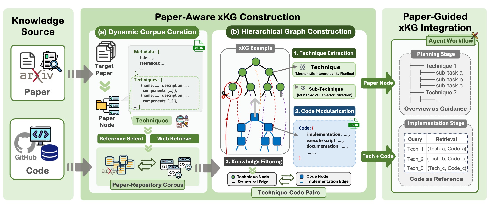

# xKG: Executable Knowledge Graphs for Replicating AI Research

<div align="center">

**What Makes AI Research Replicable?**  
Executable Knowledge Graphs as Scientific Knowledge Representations

[🌐Repository](https://github.com/zjunlp/xKG) • [📄Paper](https://arxiv.org/abs/2510.17795) • [🤗HuggingFace](https://huggingface.co/papers/2510.17795) • [📦Runtime](https://drive.google.com/drive/folders/1VUZkZs6svMynXG0PuvEpZ1symzTJNJXE?usp=drive_link)


[](https://opensource.org/licenses/MIT)

</div>

---

## 🌟 Overview

Replicating AI research is crucial yet challenging for LLM agents. Existing approaches often struggle with **insufficient background knowledge** and **fragmented information** scattered across papers, code repositories, and configuration files. Many papers omit critical implementation details, code repositories are incomplete or unavailable, and essential background knowledge is hidden across diverse sources.

**xKG (Executable Knowledge Graphs)** solves this by automatically integrating code snippets and technical insights extracted from scientific literature into a **paper-centric knowledge base**. Unlike conventional knowledge graphs, xKG captures both conceptual relations and **executable components**, enabling agents to assemble the precise artifacts needed for faithful research reproduction.



xKG addresses AI research replication through three key innovations:

1. **Code-Grounded Knowledge Representation** — Represents each paper as a hierarchical graph of technique nodes (conceptual) linked directly to code nodes (executable), ensuring all knowledge has verifiable implementations

2. **Automated Paper-Aware Pipeline** — Dynamically curates corpus of related papers (top references + technique-based web retrieval), extracts implementation-level code signals, and filters techniques to only those with proven executable code

3. **Proven Integration Strategy** — Seamlessly integrates into diverse agent frameworks (ReAct, iterative agents, specialized code generators) at both planning stages (high-level technique overview) and implementation stages (low-level code references)

xKG demonstrates **substantial and consistent improvements** across three agent frameworks and two LLM backbones on PaperBench Code-Dev:

| Agent | Model | Avg Improvement | Max Improvement |
|-------|-------|-----------------|-----------------|
| BasicAgent | o3-mini | **+6.68%** | +24.26% (MU-DPO) |
| IterativeAgent | o3-mini | **+7.31%** | +21.48% (MU-DPO) |
| PaperCoder | o3-mini | **+10.90%** | +23.33% (MU-DPO) |
| BasicAgent | DeepSeek-R1 | **+3.73%** | +7.27% (One-SBI) |
| IterativeAgent | DeepSeek-R1 | **+8.20%** | +31.20% (MU-DPO) |
| PaperCoder | DeepSeek-R1 | **+8.11%** | +21.85% (One-SBI) |

> Note: Due to some variance in the results from a single run, multiple runs are recommended for more reliable performance. We report the best@3 performance for each task. Raw runtime logs are available [here](https://drive.google.com/drive/folders/1VUZkZs6svMynXG0PuvEpZ1symzTJNJXE?usp=drive_link).

---

## 🔧 Environment Setup

### Prerequisites

1. **Python 3.10+**
   ```bash
   conda create -n xkg python=3.10
   conda activate xkg
   ```

2. **Clone Repository and Install Dependencies**
   
   ```bash
   # Clone the repository
   git clone https://github.com/zjunlp/xKG.git
   cd xKG
   
   # Install from repository root directory
   pip install -r requirements.txt
   pip install -e .
   ```
   
3. **Configure API Keys**
   
   Copy `.env.example` to `.env` and fill in your API credentials:
   ```bash
   cp .env.example .env
   ```
   
   Required environment variables:
   - `OPENAI_API_KEY` — OpenAI API key 
   - `OPENAI_BASE_URL` — API endpoint URL (supports OpenAI-compatible endpoints)
   - `GITHUB_TOKEN` — GitHub personal access token for repository access

4. **Configure Models and Hyperparameters (Optional)**
   
   Edit `xKG/config.yaml` to customize settings:

   Key configurations:
   - `active_profile` — Select model profile
   - `model` — General-purpose LLM (used for most tasks)
   - `paper_model` — Specialized for technique extraction from papers
   - `code_model` — Specialized for code rewriting and debugging
   - Embedding settings (local vs API-based)

5. **Fetch Embedding Model (Optional)**
   
   xKG supports two embedding modes (configured in `config.yaml`):
   
   **Option A: Local Embedding (GPU recommended)**
   
   To use `all-MiniLM-L6-v2`, modify `config.yaml`:
   ```yaml
   retrieve: &kg-retrieve-settings
     embedding_model: all-MiniLM-L6-v2
     embedding_client: local
   ```
   - The embedding model will be automatically downloaded on first use. If automatic download fails, manually download from [HuggingFace](https://huggingface.co/sentence-transformers/all-MiniLM-L6-v2) and set `embedding_model` to the local path.
   - For GPU acceleration execute `pip install faiss-gpu-cu12==1.12.0` to replace the default `faiss-cpu`.
   
   **Option B: API-Based Embedding (CPU/GPU compatible)**
   
   Uses `text-embedding-3-small` via OpenAI API:
   ```yaml
   retrieve: &kg-retrieve-settings
     embedding_model: text-embedding-3-small
     embedding_client: openai
   ```
   - No model download needed. 
   - Requires `OPENAI_API_KEY` in `.env`.

6. **Initialize Knowledge Graph (Optional)**
   
   For quick testing, you can initialize with example KGs:
   ```bash
   mkdir xKG/storage/kg/
   cp -r xKG/storage_example/kg/* xKG/storage/kg/
   ```
   Needed for quick testing without generating KGs from scratch.

7. **Docker Setup for Code Verifier (Optional)**
   
   Needed if you want to verify code executability when generating KGs.
   ```bash
   # Install Docker: https://docs.docker.com/engine/install/
   
   # Build verifier Docker image
   bash xKG/source/docker/build_verifier_image.sh
   ```
   This step takes time. Required if:
   - Building nodes from papers and need executable code validation.
   - Generating new KGs nodes with code verification (`--verify-code true`).
     

---

## ⏩ Usage Methods

### 1. Generate Node for a Single Paper

```bash
# Generate KG node from paper title (auto-downloads paper + optional code)
python -m xKG.scripts.generate_node \
  --title "Your Paper Title" \
  --profile basic-deepseek-v3 \
  --fetch-code true

# Output: paper default saved to xKG/storage/kg/{paper_title}.json
```

### 2. Collect Related Papers for KG

```bash
# Collect related papers for a target paper node
python -m xKG.scripts.collect_corpus \
  --title "Your Paper Title"  \
  --max-papers 10 \
  --fetch-code true

# Output: corpus default saved to xKG/storage/kg/
```
> Note: Setting high parallel jobs or frequent requests may trigger arXiv rate limit. Please retry after a short delay.

### 3. Query the Knowledge Graph

```bash
# Query by technique name for similar techniques
python -m xKG.scripts.retrieve_kg --mode techniques --query "Technique Description" --limit 5

# Complex semantic search for complex techniques
python -m xKG.scripts.retrieve_kg --mode search --query "Complex Technique Description" --limit 5

# Query by paper title (for paper in corpus)
python -m xKG.scripts.retrieve_kg --mode node --title "Paper Title"

# Query by paper for similar papers (for paper in corpus)
python -m xKG.scripts.retrieve_kg --mode papers --title "Paper Title" --limit 5
```

## 🔬 PaperBench Integration

### 1. Setup Evaluation Environment

Follow the PaperBench README for full setup:
```bash
cd experiments/paperbench/project/paperbench
conda create -n paperbench python=3.11
# See: experiments/paperbench/project/paperbench/README.md for:
# - Environment setup (Python 3.11, separate conda)
# - Docker image building
# - API key configuration
# - Agent configuration
# - Target paper split
```
> Note: You can skip the `Git-LFS` step in the original PaperBench README, with all required data already included in this repository.

You can run the following script to verify the environment setup:
```bash
conda activate paperbench && bash scripts/run_dummy_dev.sh
```

### 2. Target Paper Preprocessing

PaperBench defines target paper splits in `experiments/paperbench/project/paperbench/experiments/splits/` (e.g., `debug`, `lite`, `dev`, `all`). You can use an existing split or create your own.

**Option A: For Papers in `lite` split**

Existing papers are already parsed in `experiments/paperbench/data/papers/`. Skip to **Run Evaluation** section below.

**Option B: For New/Custom Papers**

Preprocess papers and collect corpus.

```bash
cd experiments/paperbench/project/paperbench

# Initialize target paper (generates guide.json + collects corpus)
conda activate xkg && bash scripts/initialize_target_with_corpus.sh dev
```

> Note: Setting high parallel jobs or frequent requests may trigger arXiv rate limit. Please retry after a short delay.

### 3. Run Evaluation

```bash
cd experiments/paperbench/project/paperbench

# Basic Agent (without xKG / with xKG)
conda activate paperbench && bash scripts/aisi-basic/run.sh aisi-basic-agent-my-o3
conda activate paperbench && bash scripts/aisi-basic/run_knowledge.sh aisi-basic-agent-basic-o3-knowledge

# Iterative Agent (without xKG / with xKG)
conda activate paperbench && bash scripts/aisi-iterative/run.sh aisi-basic-agent-iterative
conda activate paperbench && bash scripts/aisi-iterative/run_knowledge.sh aisi-basic-agent-iterative-knowledge

# Paper2Code Agent (without xKG / with xKG)
conda activate paperbench && bash scripts/paper2code/run.sh
conda activate paperbench && bash scripts/paper2code/run_knowledge.sh
```

Results will be saved in `experiments/paperbench/project/paperbench/runs` directory. Raw runtime logs are available [here](https://drive.google.com/drive/folders/1VUZkZs6svMynXG0PuvEpZ1symzTJNJXE?usp=drive_link).

---

## 🎉 Acknowledgments

We build upon the excellent work of:

- **PaperBench** — Evaluation framework & agent baselines from [OpenAI](https://github.com/openai/frontier-evals/tree/main/project/paperbench).
- **Paper2Code** — Agent baseline from [paper2code](https://github.com/going-doer/paper2code).
- **AutoSDT** — Code verification logic adapted from [AutoSDT](https://github.com/OSU-NLP-Group/AutoSDT).
- **DeepWiki** — Embedding and retrieval methods from [DeepWiki](https://github.com/AsyncFuncAI/deepwiki-open).

We thank all authors and contributors for their pioneering work!

---

## 📚 Citation

If you find xKG useful in your research, please cite our paper:

```bibtex
@article{luo2025executable,
  title={Executable Knowledge Graphs for Replicating AI Research},
  author={Luo, Yujie and Yu, Zhuoyun and Wang, Xuehai and Zhu, Yuqi and Zhang, Ningyu and Wei, Lanning and Du, Lun and Zheng, Da and Chen, Huajun},
  journal={arXiv preprint arXiv:2510.17795},
  year={2025}
}
```