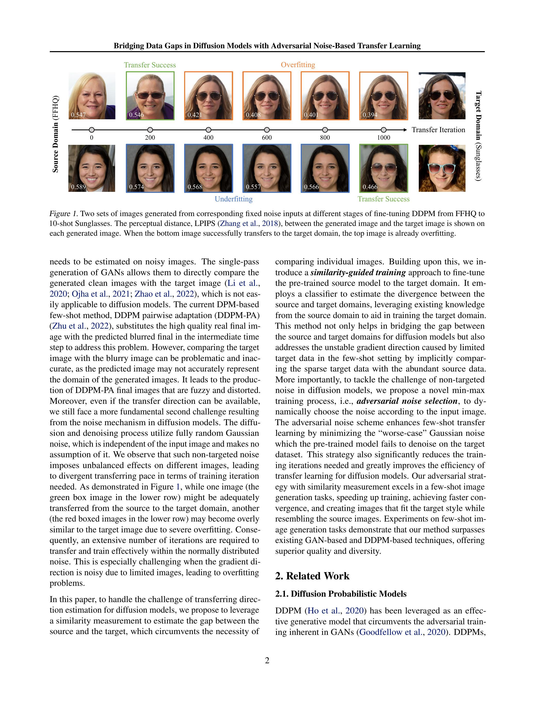
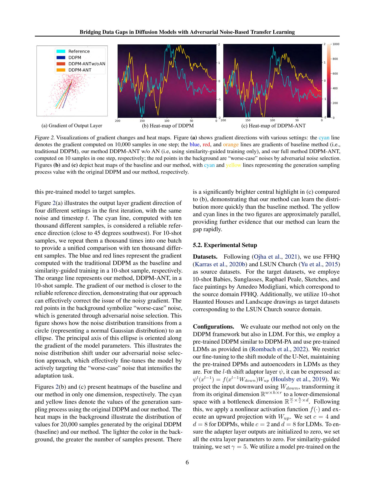
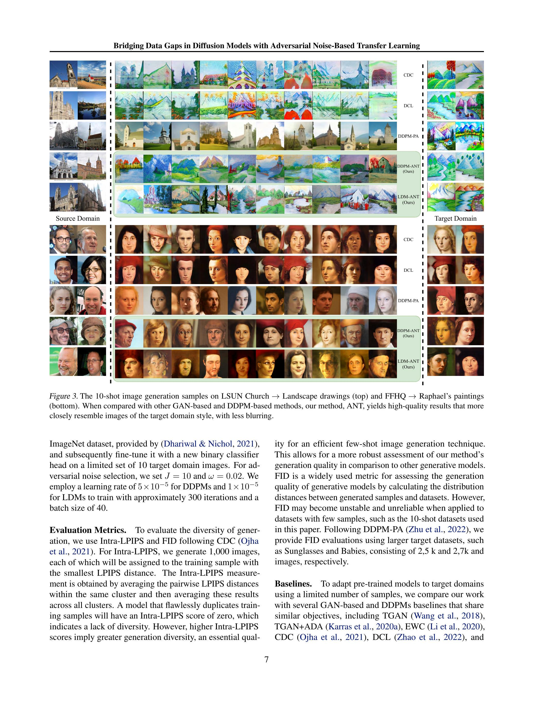
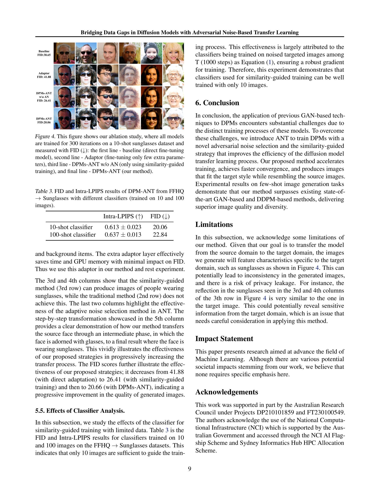
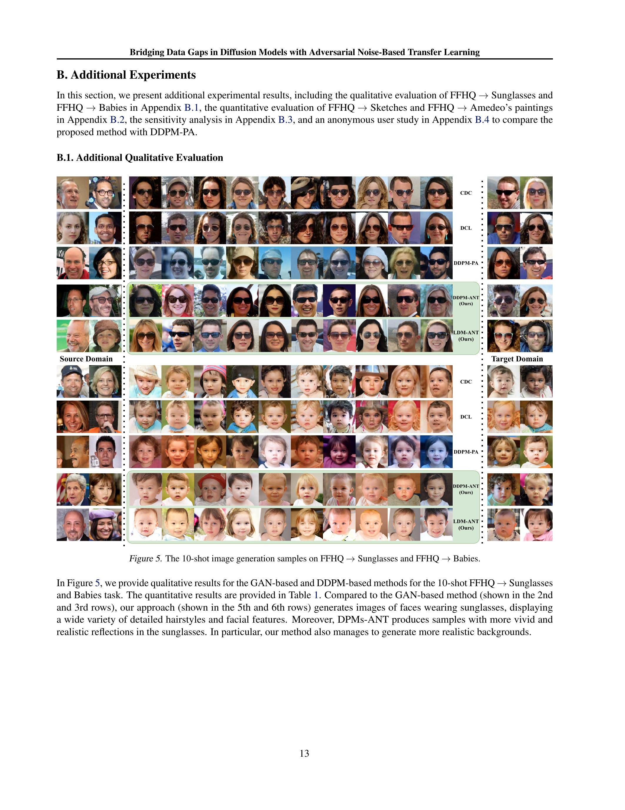
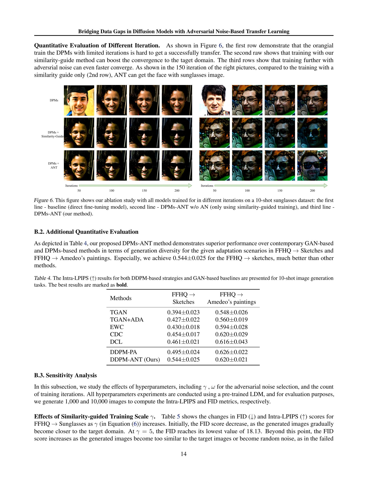

\title{
Bridging Data Gaps in Diffusion Models with Adversarial Noise-Based Transfer Learning
}

\author{
Xiyu Wang ${ }^{1}$ Baijiong Lin ${ }^{2}$ Daochang Liu ${ }^{1}$ Ying-Cong Chen ${ }^{2}$ Chang Xu ${ }^{1}$
}

\begin{abstract}
Diffusion Probabilistic Models (DPMs) show significant potential in image generation, yet their performance hinges on having access to large datasets. Previous works, like Generative Adversarial Networks (GANs), have tackled the limited data problem by transferring pretrained models learned with sufficient data. However, those methods are hard to utilize in DPMs because of the distinct differences between DPM-based and GANbased methods, which show the integral of the unique iterative denoising process and the need for many time steps with no target noise in DPMs. In this paper, we propose a novel DPM-based transfer learning method, called DPMs-ANT, to address the limited data problem. It includes two strategies: similarity-guided training, which boosts transfer with a classifier, and adversarial noise selection, which adaptively chooses targeted noise based on the input image. Extensive experiments in the context of few-shot image generation tasks demonstrate that our method is efficient and excels in terms of image quality and diversity compared to existing GAN-based and DPM-based methods.
\end{abstract}

\section*{1. Introduction}

Generative models, such as GANs (Brock et al., 2018; Guo et al., 2020; Khan et al., 2022), VAEs (Kingma \& Welling, 2013; Rezende et al., 2014), and autoregressive models (Van den Oord et al., 2016; Chen et al., 2018; Grill et al., 2020), have made remarkable successes in various fields across images (Brock et al., 2018; Razavi et al., 2019), text (Brown et al., 2020), and audio (Dhariwal et al., 2020) by

\footnotetext{
${ }^{1}$ School of Computer Science, Faculty of Engineering, The University of Sydney, Australia ${ }^{2}$ The Hong Kong University of Science and Technology (Guangzhou), China. Correspondence to: Chang Xu <c.xu@sydney.edu.au>.

Proceedings of the $41^{\text {st }}$ International Conference on Machine Learning, Vienna, Austria. PMLR 235, 2024. Copyright 2024 by the author(s).
}
utilizing vast amounts of unlabeled data for training. Diffusion probabilistic models (DPMs) (Sohl-Dickstein et al., 2015; Ho et al., 2020; Nichol \& Dhariwal, 2021), which are designed to replicate data distributions by learning to invert multistep noise procedures, have recently experienced significant advancements, enabling the generation of highdefinition images with broad diversity. Although DPMs have emerged as a potent tool for image generation with remarkable results in terms of both quality and diversity, modern DPMs heavily rely on extensive amounts of data to train the large-scale parameters of their networks (Cao et al., 2022). This dependency can lead to overfitting and a failure to generate diverse and high-quality images with limited training data. Additionally, diffusion sampling with guidance struggles to generate images with a large domain gap. Unfortunately, gathering sufficient data is not always feasible in certain situations.

Transfer learning can be an effective solution to this challenge, as it applies knowledge from a pretrained generative model trained on a large dataset to a smaller one. The fundamental idea is to begin training with a source model that has been pre-trained on a large dataset, and then adapt it to a target domain with limited data. Several techniques have been proposed in the past to adapt pre-trained GAN-based models (Wang et al., 2018; Karras et al., 2020a; Wang et al., 2020; Li et al., 2020) from large-scale source datasets to target datasets using a limited number of training samples. Typically, methods for few-shot image generation either enhance the training data artificially using data augmentation to prevent overfitting (Zhang et al., 2018; Karras et al., 2020a), or directly evaluate the distance between the processed image and the target image (Ojha et al., 2021; Zhao et al., 2022).

Nevertheless, applying prior GAN-based techniques to DPMs is challenging due to the differences in training processes between GAN-based and DPM-based methods. GANs can quickly generate a final processed image from latent space, while DPMs only predict less noisy images at each step and request a large number of timesteps to generate a high-quality final image. Such an iterative denoising process poses two challenges when transferring diffusion models. The first challenge is that the transfer direction


Figure 1. Two sets of images generated from corresponding fixed noise inputs at different stages of fine-tuning DDPM from FFHQ to 10 -shot Sunglasses. The perceptual distance, LPIPS (Zhang et al., 2018), between the generated image and the target image is shown on each generated image. When the bottom image successfully transfers to the target domain, the top image is already overfitting.
needs to be estimated on noisy images. The single-pass generation of GANs allows them to directly compare the generated clean images with the target image ( Li et al., 2020; Ojha et al., 2021; Zhao et al., 2022), which is not easily applicable to diffusion models. The current DPM-based few-shot method, DDPM pairwise adaptation (DDPM-PA) (Zhu et al., 2022), substitutes the high quality real final image with the predicted blurred final in the intermediate time step to address this problem. However, comparing the target image with the blurry image can be problematic and inaccurate, as the predicted image may not accurately represent the domain of the generated images. It leads to the production of DDPM-PA final images that are fuzzy and distorted. Moreover, even if the transfer direction can be available, we still face a more fundamental second challenge resulting from the noise mechanism in diffusion models. The diffusion and denoising process utilize fully random Gaussian noise, which is independent of the input image and makes no assumption of it. We observe that such non-targeted noise imposes unbalanced effects on different images, leading to divergent transferring pace in terms of training iteration needed. As demonstrated in Figure 1, while one image (the green box image in the lower row) might be adequately transferred from the source to the target domain, another (the red boxed images in the lower row) may become overly similar to the target image due to severe overfitting. Consequently, an extensive number of iterations are required to transfer and train effectively within the normally distributed noise. This is especially challenging when the gradient direction is noisy due to limited images, leading to overfitting problems.
In this paper, to handle the challenge of transferring direction estimation for diffusion models, we propose to leverage a similarity measurement to estimate the gap between the source and the target, which circumvents the necessity of
comparing individual images. Building upon this, we introduce a similarity-guided training approach to fine-tune the pre-trained source model to the target domain. It employs a classifier to estimate the divergence between the source and target domains, leveraging existing knowledge from the source domain to aid in training the target domain. This method not only helps in bridging the gap between the source and target domains for diffusion models but also addresses the unstable gradient direction caused by limited target data in the few-shot setting by implicitly comparing the sparse target data with the abundant source data. More importantly, to tackle the challenge of non-targeted noise in diffusion models, we propose a novel min-max training process, i.e., adversarial noise selection, to dynamically choose the noise according to the input image. The adversarial noise scheme enhances few-shot transfer learning by minimizing the "worse-case" Gaussian noise which the pre-trained model fails to denoise on the target dataset. This strategy also significantly reduces the training iterations needed and greatly improves the efficiency of transfer learning for diffusion models. Our adversarial strategy with similarity measurement excels in a few-shot image generation tasks, speeding up training, achieving faster convergence, and creating images that fit the target style while resembling the source images. Experiments on few-shot image generation tasks demonstrate that our method surpasses existing GAN-based and DDPM-based techniques, offering superior quality and diversity.

\section*{2. Related Work}

\subsection*{2.1. Diffusion Probabilistic Models}

DDPM (Ho et al., 2020) has been leveraged as an effective generative model that circumvents the adversarial training inherent in GANs (Goodfellow et al., 2020). DDPMs,
by enabling the diffusion reverse process, are capable of reconstructing images. However, DDPM suffers from a long computational time because of extensive iterative time steps. DDIM (Song et al., 2020) addresses this issue by "implicating" the model, which allows it to function with far fewer iterations and dramatically reduces the inference time compared to DDPM. Conversely, a fresh approach to the diffusion model is the score-based model via stochastic differential equation (SDE), wherein the diffusion and the denoising processes are both modeled by SDEs. Song \& Ermon (2019) initially proposed the generation of samples from latent noise via the dynamic Langevin sampling method. Variational diffusion models (VDM) (Kingma et al., 2021) introduced an innovative method that merges the capabilities of Variational Autoencoders (VAE) and diffusion models. This hybrid approach resulted in notable enhancements in the quality and diversity of generated samples. Knowledge Distillation for Diffusion Models (KDDM) (Huang et al., 2024) developed a strategy that substantially decreases the inference time required by diffusion models, without sacrificing the quality of the outputs. Additionally, Yu et al. (2022); Karras et al. (2022) use higher-order solvers to replace the original reverse process in diffusion models, enabling faster sampling. For fast high-quality and high-resolution image generation, Latent Diffusion Models (LDMs) (Rombach et al., 2022) gradually transform random noise into the target image through a diffusion process on the latent representation space.

\subsection*{2.2. Few-shot Image Generation}

Existing methods predominantly adopt an adaptation pipeline where a foundational model is pre-trained on the source domain with a large number of training data, and then adjusted to a smaller target domain. In contrast, few-shot image generation strives to envision new and diverse examples while circumventing overfitting to the limited training images of the target domain. FreezeD (Mo et al., 2020) addresses overfitting by locking parameters in the highresolution layers of the discriminator. MineGAN (Wang et al., 2020) incorporates additional networks to fine-tune the noise inputs of the generator. EWC (Li et al., 2020) uses elastic weight consolidation, making it difficult to modify essential weights that possess high Fisher information values. CDC (Ojha et al., 2021) introduces cross-domain consistency loss and patch-level discrimination to forge a connection between the source and target domains. DCL (Zhao et al., 2022) uses contrastive learning to distance the generated samples from the actual images and maximize the similarity between the corresponding pair of images in the source and target domains. Similar to CDC, DDPM-PA (Zhu et al., 2022) adapts pre-trained diffusion models on extensive source domains to target domains with cross-domain consistency loss and patch-level discrimination. GAN-based
methods, like CDC and DCL, require the final generated image during training. In contrast, DPMs' training process aims at predicting the next stage of noised images and can only yield a blurry predicted image during the training stage.

\section*{3. Preliminary}

Diffusion models approximate the data distribution $q\left(x_{0}\right)$ by $p_{\theta}\left(x_{0}\right)$, where $p_{\theta}\left(x_{0}\right)$ is modeled in the form of latent variable models. According to (Ho et al., 2020), at timestep $t$, the diffusion process adding Gaussian noise with variance $\beta_{t} \in(0,1)$ to the data can be expressed as:
\[
\begin{aligned}
q\left(x_{t} \mid x_{0}\right) & =\mathcal{N}\left(x_{t} ; \bar{\alpha}_{t} x_{0},\left(1-\bar{\alpha}_{t}\right) \mathbf{I}\right), \\
x_{t} & =\sqrt{\bar{\alpha}_{t}} x_{0}+\sqrt{1-\bar{\alpha}_{t}} \epsilon
\end{aligned}
\]
where $x_{0} \sim q\left(x_{0}\right), \alpha_{t}:=1-\beta_{t}, \bar{\alpha}_{t}:=\prod_{i=0}^{t}\left(1-\beta_{i}\right)$ and $\epsilon \sim \mathcal{N}(\mathbf{0}, \mathbf{I})$. Ho et al. (2020) train a U-Net (Ronneberger et al., 2015) model parameterized by $\theta$ to fit the data distribution $q\left(x_{0}\right)$ by maximizing the lower variation limit. The DDPM training loss with model $\epsilon_{\theta}\left(x_{t}, t\right)$ can be expressed as:
\[
\mathcal{L}_{\text {sample }}(\theta):=\mathbb{E}_{t, x_{0}, \epsilon}\left\|\epsilon-\epsilon_{\theta}\left(x_{t}, t\right)\right\|^{2} .
\]

Based on (Song et al., 2020), the reverse process of DPMs (DDPM and DDIM) at timestep $t$ can be expressed as following:
\[
\begin{aligned}
x_{t-1} & =\sqrt{\bar{\alpha}_{t-1}} \underbrace{\left(\frac{x_{t}-\sqrt{1-\bar{\alpha}_{t}} \epsilon_{\theta}\left(x_{t}, t\right)}{\bar{\alpha}_{t}}\right)}_{\text {predicted } \mathrm{x}_{0}} \\
& +\underbrace{\sqrt{1-\bar{\alpha}_{t-1}-\sigma_{t}^{2}} \cdot \epsilon_{\theta}\left(x_{t}, t\right)}_{\text {direction pointing to } \mathrm{x}_{\mathrm{t}}}+\underbrace{\sigma_{t} \epsilon_{t}}_{\text {random noise }}
\end{aligned}
\]
where $\sigma_{t}=\eta \sqrt{\left(1-\bar{\alpha}_{t-1}\right) /\left(1-\bar{\alpha}_{t}\right)} \sqrt{1-\bar{\alpha}_{t} / \bar{\alpha}_{t-1}}$ and $\eta=0$ (Song et al., 2020) or $\eta=1$ (Ho et al., 2020) or $\eta=\sqrt{\left(1-\bar{\alpha}_{t}\right) /\left(1-\bar{\alpha}_{t-1}\right)}$ (Ho et al., 2020). Furthermore, Dhariwal \& Nichol (2021) propose the conditional reverse noise process as:
\[
\begin{aligned}
& p_{\theta, \phi}\left(x_{t-1} \mid x_{t}, y\right) \\
\approx & \mathcal{N}\left(x_{t-1} ; \mu_{\theta}\left(x_{t}, t\right)+\sigma_{t}^{2} \gamma \nabla_{x_{t}} \log p_{\phi}\left(y \mid x_{t}\right), \sigma_{t}^{2} \mathbf{I}\right),
\end{aligned}
\]
where $\mu_{\theta}\left(x_{t}, t\right)=\frac{1}{\sqrt{\alpha_{t}}}\left(x_{t}-\frac{1-\alpha_{t}}{\sqrt{1-\bar{\alpha}_{t}}} \epsilon_{\theta}\left(x_{t}, t\right)\right)$ and $\gamma$ is a hyperparameter for conditional control. For the sake of clarity in distinguishing these two domains, this paper uses $\mathcal{S}$ and $\mathcal{T}$ to represent the source and target domain, respectively.

\section*{4. Transfer Learning in Diffusion Models via Adversarial Noise}

In this section, we introduce DPMs-ANT, a DPM-based transfer learning method, which contains two key strategies:
similarity-guided training (in Section 4.1) and adversarial noise selection (in Section 4.2). After that, the complete DPMs-ANT procedure included the adaptor is detailed in Algorithm 1.

\subsection*{4.1. Similarity-Guided Training}

We use similarity to measure the gap between the source and target domains. It is computed using a noised image $x_{t}$ at timestep $t$ instead of the final image. Drawing inspiration from (Dhariwal \& Nichol, 2021; Liu et al., 2023), we express the difference in domain between the source and the target in terms of the divergence in similarity measures. Initially, we assume a model that can predict noise with the source and target domains, denoted as $\theta_{(\mathcal{S}, \mathcal{T})}$. Similar to Equation (2), the reverse process for the source and target images can be written as:
\[
\begin{aligned}
& p_{\theta_{(\mathcal{S}, \mathcal{T})}, \phi}\left(x_{t-1} \mid x_{t}, y=Y\right) \\
\approx & \mathcal{N}\left(x_{t-1} ; \mu_{\theta_{(\mathcal{S}, \mathcal{T})}}+\sigma_{t}^{2} \gamma \nabla_{x_{t}} \log p_{\phi}\left(y=Y \mid x_{t}\right), \sigma_{t}^{2} \mathbf{I}\right),
\end{aligned}
\]
where $Y$ is $\mathcal{S}$ or $\mathcal{T}$ for source or target domain image generation, respectively. We can consider $\mu\left(x_{t}\right)+$ $\sigma_{t}^{2} \gamma \nabla_{x_{t}} \log p_{\phi}\left(y=\mathcal{S} \mid x_{t}\right)$ as the source model $\theta_{\mathcal{S}}$, which only synthesize image on the source domain respectively. For brevity, we denote $p_{\theta_{\mathcal{S}}, \phi}\left(x_{t-1}^{\mathcal{S}} \mid x_{t}\right)=$ $p_{\theta_{(\mathcal{S}, \mathcal{T}), \phi}}\left(x_{t-1} \mid x_{t}, y=\mathcal{S}\right)$. We define $p_{\theta_{\mathcal{T}, \phi}}\left(x_{t-1}^{\mathcal{T}} \mid x_{t}\right)$ similarly by replacing $\mathcal{S}$ with $\mathcal{T}$. Therefore, the KL-divergence between the output of source model $\theta_{\mathcal{S}}$ and the target $\theta_{\mathcal{T}}$ with the same input $x_{t}$ at timestep $t$, is defined as:
\[
\begin{gathered}
\mathrm{D}_{\mathrm{KL}}\left(p_{\theta_{\mathcal{S}}, \phi}\left(x_{t-1}^{\mathcal{S}} \mid x_{t}\right), p_{\theta \mathcal{T}, \phi}\left(x_{t-1}^{\mathcal{T}} \mid x_{t}\right)\right) \\
=\mathbb{E}_{t, x_{0}, \epsilon}\left[\| \nabla_{x_{t}} \log p_{\phi}\left(y=\mathcal{S} \mid x_{t}\right)-\right. \\
\left.\nabla_{x_{t}} \log p_{\phi}\left(y=\mathcal{T} \mid x_{t}\right) \|^{2}\right],
\end{gathered}
\]
where $p_{\phi}$ is a classifier to distinguish $x_{t}$. The detailed derivation is in the Appendix. We consider $\nabla_{x_{t}} \log p_{\phi}\left(y=\mathcal{S} \mid x_{t}\right)$ and $\nabla_{x_{t}} \log p_{\phi}\left(y=\mathcal{T} \mid x_{t}\right)$ as the similarity measures of the given $x_{t}$ in the source and target domains, respectively.

Transfer learning primarily focuses on bridging the gap between the image generated by the current fine-tuning model and the target domain image. Inspired by Equation (4) on source and target distance, we can utilize $p_{\phi}\left(y=\mathcal{T} \mid x_{t}^{\mathcal{T}}\right)$ to align the current model with the target for target domain transfer learning. Specifically, we employ a fixed pre-trained binary classifier that differentiates between source and target images at time step $t$ to enhance the training process. Similarly with the vanilla training loss in DPMs (Ho et al., 2020), i.e., Equation (1), we use the KL-divergence between the output of current model $\theta$ and target model $\theta_{\mathcal{T}}$ at time
step $t$ as:
\[
\begin{aligned}
\min _{\theta} \mathbb{E}_{t, x_{0}, \epsilon} & {\left[\| \epsilon_{t}-\epsilon_{\theta}\left(x_{t}, t\right)-\right.} \\
& \left.\hat{\sigma}_{t}^{2} \gamma \nabla_{x_{t}} \log p_{\phi}\left(y=\mathcal{T} \mid x_{t}\right) \|^{2}\right]
\end{aligned}
\]
where $\epsilon_{t} \sim \mathcal{N}(\mathbf{0}, \mathbf{I}), \epsilon_{\theta}$ is the pre-trained neural network on source domain, $\gamma$ is a hyper-parameter to control the similarity guidance, $\hat{\sigma}_{t}=\left(1-\bar{\alpha}_{t-1}\right) \sqrt{\frac{\alpha_{t}}{1-\bar{\alpha}_{t}}}$, and $p_{\phi}$ is the binary classifier differentiating between source and target images. Equation (5) is defined as similarity-guided DPMs training loss. The full derivation is provided in the Appendix. We leverage the pre-trained classifier to indirectly compare the noised image $x_{t}$ with both domain images, subtly expressing the gap between the currently generated image and the target image. By minimizing the output of the neural network with corrected noise, we bridge the gap in the diffusion model and bolster transfer learning. Furthermore, similarity guidance enhances few-shot transfer learning by avoiding misdirection towards the target image, as $\nabla_{x_{t}} \log p_{\phi}\left(y=\mathcal{T} \mid x_{t}\right)$ acts as an indirect indicator, rather than straightly relying on the original image. Compared to with or without the indirect indicator (i.e., Equation (1) vs. Equation (5)), the latter easily overfits over the few-shot target training images, while the former can mitigate this problem due to the generalization of the classifier $p_{\phi}$.

\subsection*{4.2. Adversarial Noise Selection}

Despite potentially determining the transfer direction, we still encounter a fundamental second challenge originating from the noise mechanism in diffusion models. As mentioned, the model needs to be trained to accommodate the quantity of noise $\epsilon_{t}$ over many iterations. However, increasing iterations with limited images may lead to overfitting of the training samples, thereby reducing the diversity of the generated samples. On the other hand, training with too few iterations might only successfully transform a fraction of the generated images into the target domain as Figure 1.

To counter these issues, we propose an adaptive noise selection method, Adversarial Noise (AN) selection. This approach utilizes a min-max training process to reduce the actual training iterations required and ensure the generated images closely resemble the target images. After the model has been trained on a large dataset, it exhibits a strong noise reduction capability for source datasets. This implies it only needs to minimize specific types of Gaussian noise with which the trained model struggles or fails to denoise with the target domain sample. The first step in this process is to identify the maximum approximated Gaussian noise with the current model, and then specifically minimize the model using this noise. Based on Equation (5), this can be
```
Algorithm 1 Training DPMs with ANT
Require: binary classifier $p_{\phi}$, pre-trained DPMs $\epsilon_{\theta}$, learn-
    ing rate $\eta$
    repeat
        $x_{0} \sim q\left(x_{0}\right)$;
        $t \sim \operatorname{Uniform}(\{1, \cdots, T\})$;
        $\epsilon \sim \mathcal{N}(\mathbf{0}, \mathbf{I})$;
        for $j=0, \cdots, J-1$ do
            Update $\epsilon^{j}$ via Equation (7);
        end for
        Compute $L(\psi)$ with $\epsilon^{\star}=\epsilon^{J}$ via Equataion (8);
        Update the adaptor model parameter: $\psi=\psi-$
        $\eta \nabla_{\psi} L(\psi)$;
    until converged.
```
mathematically formulated as follows:
\[
\begin{aligned}
\min _{\theta} \max _{\epsilon} \mathbb{E}_{t, x_{0}}[ & \| \epsilon-\epsilon_{\theta}\left(x_{t}, t\right)- \\
& \left.\hat{\sigma}_{t}^{2} \gamma \nabla_{x_{t}} \log p_{\phi}\left(y=\mathcal{T} \mid x_{t}\right) \|^{2}\right] .
\end{aligned}
\]

Although finding the exact maximum noise is challenging as Equation (6), the finite-step gradient ascent strategy can be used to solve the inner maximization problem approximately. Specifically, the inner maximization of Gaussian noise can be interpreted as finding the "worse-case" noise corresponding to the current neural network. Practically, the similarity-guided term is disregarded, as this term is hard to compute differential and is almost unchanged in the process. We utilize the multi-step gradient ascent as expressed below:
\[
\begin{aligned}
\epsilon^{j+1}= & \operatorname{Norm}\left(\epsilon^{j}+\right. \\
& \left.\omega \nabla_{\epsilon^{j}}\left\|\epsilon^{j}-\epsilon_{\theta}\left(\sqrt{\bar{\alpha}_{t}} x_{0}+\sqrt{1-\bar{\alpha}_{t}} \epsilon^{j}, t\right)\right\|^{2}\right),
\end{aligned}
\]
where $j \in\{0,1, \cdots, J-1\}, \omega$ is a hyperparameter that represents the "learning rate" of the negative loss function, and $\operatorname{Norm}(\cdot)$ is a normalization function that approximately ensures the mean and standard deviation of $\epsilon^{j+1}$ is $\mathbf{0}$ and $\mathbf{I}$, respectively. The initial value, $\epsilon_{0}$, is sampled from the Gaussian distribution, i.e., $\epsilon_{0} \sim \mathcal{N}(\mathbf{0}, \mathbf{I})$. Since minimizing the "worse-case" Gaussian noise is akin to minimizing all Gaussian noises that are "better" than it, we can more accurately correct the gradient computed with limited data, effectively addressing the underfitting problem during a limited number of iterations.

\subsection*{4.3. Optimization}

To save training time and memory, we implement an additional adaptor module (Noguchi \& Harada, 2019) to learn the shift gap (i.e, Equation (4)) based on $x_{t}$ in practice. During the training, we freeze the parameters $\theta$ and only update the adaptor parameters $\psi$. The overall loss function can be
expressed as follows,
\[
\begin{aligned}
& L(\psi) \equiv \mathbb{E}_{t, x_{0}}\left[\| \epsilon^{\star}-\epsilon_{\theta, \psi}\left(x_{t}^{\star}, t\right)-\right. \\
& \left.\qquad \hat{\sigma}_{t}^{2} \gamma \nabla_{x_{t}^{\star}} \log p_{\phi}\left(y=\mathcal{T} \mid x_{t}^{\star}\right) \|^{2}\right], \\
& \text { s.t. } \epsilon^{\star}=\arg \max _{\epsilon}\left\|\epsilon-\epsilon_{\theta}\left(\sqrt{\bar{\alpha}_{t}} x_{0}+\sqrt{1-\bar{\alpha}_{t}} \epsilon, t\right)\right\|^{2}, \\
& \quad \epsilon_{\text {mean }}^{\star}=\mathbf{0} \text { and } \epsilon_{\text {std }}^{\star}=\mathbf{I},
\end{aligned}
\]
where $\epsilon^{\star}$ is the "worse-case" noise, the $x_{t}^{\star}=\sqrt{\bar{\alpha}_{t}} x_{0}+$ $\sqrt{1-\bar{\alpha}_{t} \epsilon^{\star}}$ is the corresponding noised image at the timestep $t$ and $\psi$ is certain extra parameter beyond pretrained model. We link the pre-trained U-Net model with the adaptor layer (Houlsby et al., 2019) as $x_{t}^{l}=\theta^{l}\left(x_{t}^{l-1}\right)+$ $\psi^{l}\left(x_{t}^{l-1}\right)$, where $x_{t}^{l-1}$ and $x_{t}^{l}$ represents the $l$-th layer of the input and output, and $\theta^{l}$ and $\psi^{l}$ denote the $l$-th layer of the pre-trained U-Net and the additional adaptor layer, respectively.

The full training procedure of our method, named DPMsANT, is outlined in Algorithm 1. Initially, as in the traditional DDPM training process, we select samples from target datasets and randomly choose a timestep $t$ and standard Gaussian noise for each sample. We employ limited extra adaptor module parameters with the pre-train model. Subsequently, we identify the adaptive inner maximum as represented in Equation (7) with the current neural network. Based on these noises, we compute the similarity-guided DDPM loss as Equation (5), which bridges the discrepancy between the pre-trained model and the scarce target samples. Lastly, we execute backpropagation to only update the adaptor module parameters.

\section*{5. Experiments}

To demonstrate the effectiveness of our approach, we perform a series of few-shot image generation experiments using a limited set of just 10 training images with the same setting as DDPM-PA (Zhu et al., 2022). We compare our method against state-of-the-art GAN-based and DDPMbased techniques, assessing the quality and diversity of the generated images through both qualitative and quantitative evaluations. This comprehensive comparison provides strong evidence of the superiority of our proposed method in the context of few-shot image generation tasks. The code is available at https://github.com/ShinyGua/DPMs-ANT.

\subsection*{5.1. Visualization on Toy Data}

To conduct a quantitative analysis, we traine a diffusion model to generate 2-dimensional toy data with two Gaussian noise distributions. The means of the Gaussian noise distributions for the source and target are $(1,1)$ and $(-1,-1)$, and their variances are denoted by $\mathbf{I}$. We train a simple neural network with source domain samples and then transfer


Figure 2. Visualizations of gradient changes and heat maps. Figure (a) shows gradient directions with various settings: the cyan line denotes the gradient computed on 10,000 samples in one step; the blue, red, and orange lines are gradients of baseline method (i.e., traditional DDPM), our method DDPM-ANT w/o AN (i.e, using similarity-guided training only), and our full method DDPM-ANT, computed on 10 samples in one step, respectively; the red points in the background are "worse-case" noises by adversarial noise selection. Figures (b) and (c) depict heat maps of the baseline and our method, with cyan and yellow lines representing the generation sampling process value with the original DDPM and our method, respectively.
this pre-trained model to target samples.
Figure 2(a) illustrates the output layer gradient direction of four different settings in the first iteration, with the same noise and timestep $t$. The cyan line, computed with ten thousand different samples, is considered a reliable reference direction (close to 45 degrees southwest). For 10 -shot samples, we repeat them a thousand times into one batch to provide a unified comparison with ten thousand different samples. The blue and red lines represent the gradient computed with the traditional DDPM as the baseline and similarity-guided training in a 10-shot sample, respectively. The orange line represents our method, DDPM-ANT, in a 10 -shot sample. The gradient of our method is closer to the reliable reference direction, demonstrating that our approach can effectively correct the issue of the noisy gradient. The red points in the background symbolize "worse-case" noise, which is generated through adversarial noise selection. This figure shows how the noise distribution transitions from a circle (representing a normal Gaussian distribution) to an ellipse. The principal axis of this ellipse is oriented along the gradient of the model parameters. This illustrates the noise distribution shift under our adversarial noise selection approach, which effectively fine-tunes the model by actively targeting the "worse-case" noise that intensifies the adaptation task.
Figures 2(b) and (c) present heatmaps of the baseline and our method in only one dimension, respectively. The cyan and yellow lines denote the values of the generation sampling process using the original DDPM and our method. The heat maps in the background illustrate the distribution of values for 20,000 samples generated by the original DDPM (baseline) and our method. The lighter the color in the background, the greater the number of samples present. There
is a significantly brighter central highlight in (c) compared to (b), demonstrating that our method can learn the distribution more quickly than the baseline method. The yellow and cyan lines in the two figures are approximately parallel, providing further evidence that our method can learn the gap rapidly.

\subsection*{5.2. Experimental Setup}

Datasets. Following (Ojha et al., 2021), we use FFHQ (Karras et al., 2020b) and LSUN Church (Yu et al., 2015) as source datasets. For the target datasets, we employe 10-shot Babies, Sunglasses, Raphael Peale, Sketches, and face paintings by Amedeo Modigliani, which correspond to the source domain FFHQ. Additionally, we utilize 10-shot Haunted Houses and Landscape drawings as target datasets corresponding to the LSUN Church source domain.

Configurations. We evaluate our method not only on the DDPM framework but also in LDM. For this, we employ a pre-trained DDPM similar to DDPM-PA and use pre-trained LDMs as provided in (Rombach et al., 2022). We restrict our fine-tuning to the shift module of the U-Net, maintaining the pre-trained DPMs and autoencoders in LDMs as they are. For the $l$-th shift adaptor layer $\psi$, it can be expressed as: $\psi^{l}\left(x^{l-1}\right)=f\left(x^{l-1} W_{\text {down }}\right) W_{u p}$ (Houlsby et al., 2019). We project the input downward using $W_{\text {down }}$, transforming it from its original dimension $\mathbb{R}^{w \times h \times r}$ to a lower-dimensional space with a bottleneck dimension $\mathbb{R}^{\frac{w}{c} \times \frac{h}{c} \times d}$. Following this, we apply a nonlinear activation function $f(\cdot)$ and execute an upward projection with $W_{u p}$. We set $c=4$ and $d=8$ for DDPMs, while $c=2$ and $d=8$ for LDMs. To ensure the adapter layer outputs are initialized to zero, we set all the extra layer parameters to zero. For similarity-guided training, we set $\gamma=5$. We utilize a model pre-trained on the


Figure 3. The 10-shot image generation samples on LSUN Church $\rightarrow$ Landscape drawings (top) and FFHQ $\rightarrow$ Raphael's paintings (bottom). When compared with other GAN-based and DDPM-based methods, our method, ANT, yields high-quality results that more closely resemble images of the target domain style, with less blurring.

ImageNet dataset, provided by (Dhariwal \& Nichol, 2021), and subsequently fine-tune it with a new binary classifier head on a limited set of 10 target domain images. For adversarial noise selection, we set $J=10$ and $\omega=0.02$. We employ a learning rate of $5 \times 10^{-5}$ for DDPMs and $1 \times 10^{-5}$ for LDMs to train with approximately 300 iterations and a batch size of 40 .

Evaluation Metrics. To evaluate the diversity of generation, we use Intra-LPIPS and FID following CDC (Ojha et al., 2021). For Intra-LPIPS, we generate 1,000 images, each of which will be assigned to the training sample with the smallest LPIPS distance. The Intra-LPIPS measurement is obtained by averaging the pairwise LPIPS distances within the same cluster and then averaging these results across all clusters. A model that flawlessly duplicates training samples will have an Intra-LPIPS score of zero, which indicates a lack of diversity. However, higher Intra-LPIPS scores imply greater generation diversity, an essential qual-
ity for an efficient few-shot image generation technique. This allows for a more robust assessment of our method's generation quality in comparison to other generative models. FID is a widely used metric for assessing the generation quality of generative models by calculating the distribution distances between generated samples and datasets. However, FID may become unstable and unreliable when applied to datasets with few samples, such as the 10 -shot datasets used in this paper. Following DDPM-PA (Zhu et al., 2022), we provide FID evaluations using larger target datasets, such as Sunglasses and Babies, consisting of 2,5 k and 2,7k and images, respectively.

Baselines. To adapt pre-trained models to target domains using a limited number of samples, we compare our work with several GAN-based and DDPMs baselines that share similar objectives, including TGAN (Wang et al., 2018), TGAN+ADA (Karras et al., 2020a), EWC (Li et al., 2020), CDC (Ojha et al., 2021), DCL (Zhao et al., 2022), and

Table 1. Intra-LPIPS $(\uparrow)$ results for both DDPM and GAN-based baselines are presented for 10 -shot image generation tasks. These tasks involve adapting from the source domains of FFHQ and LSUN Church. "Parameter Rate" means the proportion of parameters fine-tuned compared to the pre-trained model's parameters. The best results are marked as bold.
\begin{tabular}{lcccccc}
\hline Methods & \begin{tabular}{c} 
Parameter \\
Rate
\end{tabular} & \begin{tabular}{c} 
FFHQ $\rightarrow$ \\
Babies
\end{tabular} & \begin{tabular}{c} 
FFHQ $\rightarrow$ \\
Sunglasses
\end{tabular} & \begin{tabular}{c} 
FFHQ $\rightarrow$ \\
Raphael's paintings
\end{tabular} & \begin{tabular}{c} 
LSUN Church $\rightarrow$ \\
Haunted houses
\end{tabular} & \begin{tabular}{c} 
LSUN Church $\rightarrow$ \\
Landscape drawings
\end{tabular} \\
\hline TGAN & $100 \%$ & $0.510 \pm 0.026$ & $0.550 \pm 0.021$ & $0.533 \pm 0.023$ & $0.585 \pm 0.007$ & $0.601 \pm 0.030$ \\
TGAN+ADA & $100 \%$ & $0.546 \pm 0.033$ & $0.571 \pm 0.034$ & $0.546 \pm 0.037$ & $0.615 \pm 0.018$ & $0.643 \pm 0.060$ \\
EWC & $100 \%$ & $0.560 \pm 0.019$ & $0.550 \pm 0.014$ & $0.541 \pm 0.023$ & $0.579 \pm 0.035$ & $0.596 \pm 0.052$ \\
CDC & $100 \%$ & $0.583 \pm 0.014$ & $0.581 \pm 0.011$ & $0.564 \pm 0.010$ & $0.620 \pm 0.029$ & $0.674 \pm 0.024$ \\
DCL & $100 \%$ & $0.579 \pm 0.018$ & $0.574 \pm 0.007$ & $0.558 \pm 0.033$ & $0.616 \pm 0.043$ & $0.626 \pm 0.021$ \\
\hline DDPM-PA & $100 \%$ & $0.599 \pm 0.024$ & $0.604 \pm 0.014$ & $0.581 \pm 0.041$ & $0.628 \pm 0.029$ & $0.706 \pm 0.030$ \\
DDPM-ANT (Ours) & $1.3 \%$ & $0.592 \pm 0.016$ & $0.613 \pm 0.023$ & $\mathbf{0 . 6 2 1} \pm 0.068$ & $0.648 \pm 0.010$ & $0.723 \pm 0.020$ \\
\hline LDM-ANT (Ours) & $1.6 \%$ & $\mathbf{0 . 6 0 1} \pm 0.018$ & $\mathbf{0 . 6 1 3} \pm 0.011$ & $0.592 \pm 0.048$ & $\mathbf{0 . 6 5 3} \pm 0.010$ & $\mathbf{0 . 7 3 8} \pm 0.026$ \\
\hline
\end{tabular}

Table 2. FID ( $\downarrow$ ) results of each method on 10-shot FFHQ $\rightarrow$ Babies and Sunglasses. The best results are marked in bold.
\begin{tabular}{lccccccc}
\hline Methods & TGAN & ADA & EWC & CDC & DCL & PA & ANT \\
\hline Babies & 104.79 & 102.58 & 87.41 & 74.39 & 52.56 & 48.92 & $\mathbf{4 6 . 7 0}$ \\
Sunglasses & 55.61 & 53.64 & 59.73 & 42.13 & 38.01 & 34.75 & $\mathbf{2 0 . 0 6}$ \\
\hline
\end{tabular}

DDPM-PA (Zhu et al., 2022). All baselines are implemented based on StyleGAN2 codebase (Karras et al., 2020b).

\subsection*{5.3. Overall Performance}

Qualitative Evaluation. Figure 3 presents samples from GAN-based and DDPM-based methods for 10-shot LSUN Church $\rightarrow$ Landscape drawings (top) and FFHQ $\rightarrow$ Raphael's paintings (bottom). The samples generated by GAN-based baselines contain unnatural blurs and artifacts. Our results (lines 2 and 6 ) are more nature and close to the target image style. This illustrates the effectiveness of our approach in handling complex transformations while maintaining the integrity of the original image features. Whereas the current DDPM-based method, DDPM-PA (third row), seems to underfit the target domain images, resulting in a significant difference in color and style between the generated images and the target images. Our method preserves many shapes and outlines while learning more about the target style. As demonstrated in Figure 1, our method, ANT, maintains more details such as buildings (above), human faces (below) and other intricate elements in the generated images. Moreover, ANT-generated images exhibit a color style closer to the target domain, especially compared to DDPMPA. Compared to other methods, our approach (based on both DDPMs and LDMs) produces more diverse and realistic samples that contain richer details than existing techniques.

Quantitative Evaluation. In Table 1, we show the IntraLPIPS results for DPMs-ANT under various 10-shot adapta-
tion conditions. DDPM-ANT yields a considerable improvement in Intra-LPIPS across most tasks compared to other GAN-based and DDPMs-based methods. Furthermore, LDM-ANT excels beyond state-of-the-art GAN-based approaches, demonstrating its potent capability to preserve diversity in few-shot image generation. Notably, the result for LSUN Church $\rightarrow$ Landscape drawings improved from 0.706 (DDPM-PA) to 0.723 (DDPM-ANT). The FID results are presented in Table 2, where ANT also shows remarkable advances compared to other GAN-based or DPM-based methods, especially in FFHQ $\rightarrow 10$-shot Sunglasses with 20.06 FID. We provide more results for other adaptation scenarios in the Appendix. Our method can transfer the model from the source to the target domain not only effectively but also efficiently. Compared to other methods that require around 5,000 iterations, our approach only necessitates approximately 300 iterations (about 3 k equivalent iterations due to the finite-step gradient ascent strategy) with limited parameter fine-tuning. The time cost of the baseline with adaptor and 5,000 iterations (same as DDPM-PA) is about 4.2 GPU hours, while our model (DPMs-ANT) with only 300 iterations takes just 3 GPU hours.

\subsection*{5.4. Ablation Study}

Figure 4 presents an ablation study, with all images synthesized from the same noise. Compared to directly fine-tuning the entire model (1st row), only fine-tuning the adaptor layer (2nd row) can achieve competitive FID results ( 38.65 vs. 41.88). The DPMs-ANT without adversarial noise selection (DPMs-ANT w/o AN) and all DPMs-ANT (3rd and 4th row) are trained with an extra adaptor layer to save time and GPU memory, and our analysis focuses on the last three rows. More time and GPU memory experiment can be found in Appendix B.

The first two columns demonstrate that all methods can successfully transfer the model to sunglasses, with the ANT containing richer high-frequency details about sunglasses


Figure 4. This figure shows our ablation study, where all models are trained for 300 iterations on a 10 -shot sunglasses dataset and measured with FID $(\downarrow)$ : the first line - baseline (direct fine-tuning model), second line - Adaptor (fine-tuning only few extra parameters), third line - DPMs-ANT w/o AN (only using similarity-guided training), and final line - DPMs-ANT (our method).

Table 3. FID and Intra-LPIPS results of DPM-ANT from FFHQ $\rightarrow$ Sunglasses with different classifiers (trained on 10 and 100 images).
\begin{tabular}{lcc}
\hline & Intra-LPIPS ( $\uparrow)$ & FID ( $\downarrow$ ) \\
\hline 10-shot classifier & $0.613 \pm 0.023$ & 20.06 \\
100-shot classifier & $0.637 \pm 0.013$ & 22.84 \\
\hline
\end{tabular}
and background items. The extra adaptor layer effectively saves time and GPU memory with minimal impact on FID. Thus we use this adaptor in our method and rest experiment.

The 3rd and 4th columns show that the similarity-guided method (3rd row) can produce images of people wearing sunglasses, while the traditional method (2nd row) does not achieve this. The last two columns highlight the effectiveness of the adaptive noise selection method in ANT. The step-by-step transformation showcased in the 5th column provides a clear demonstration of how our method transfers the source face through an intermediate phase, in which the face is adorned with glasses, to a final result where the face is wearing sunglasses. This vividly illustrates the effectiveness of our proposed strategies in progressively increasing the transfer process. The FID scores further illustrate the effectiveness of our proposed strategies; it decreases from 41.88 (with direct adaptation) to 26.41 (with similarity-guided training) and then to 20.66 (with DPMs-ANT), indicating a progressive improvement in the quality of generated images.

\subsection*{5.5. Effects of Classifier Analysis.}

In this subsection, we study the effects of the classifier for similarity-guided training with limited data. Table 3 is the FID and Intra-LPIPS results for classifiers trained on 10 and 100 images on the FFHQ $\rightarrow$ Sunglasses datasets. This indicates that only 10 images are sufficient to guide the train-
ing process. This effectiveness is largely attributed to the classifiers being trained on noised targeted images among T (1000 steps) as Equation (1), ensuring a robust gradient for training. Therefore, this experiment demonstrates that classifiers used for similarity-guided training can be well trained with only 10 images.

\section*{6. Conclusion}

In conclusion, the application of previous GAN-based techniques to DPMs encounters substantial challenges due to the distinct training processes of these models. To overcome these challenges, we introduce ANT to train DPMs with a novel adversarial noise selection and the similarity-guided strategy that improves the efficiency of the diffusion model transfer learning process. Our proposed method accelerates training, achieves faster convergence, and produces images that fit the target style while resembling the source images. Experimental results on few-shot image generation tasks demonstrate that our method surpasses existing state-of-the-art GAN-based and DDPM-based methods, delivering superior image quality and diversity.

\section*{Limitations}

In this subsection, we acknowledge some limitations of our method. Given that our goal is to transfer the model from the source domain to the target domain, the images we generate will feature characteristics specific to the target domain, such as sunglasses as shown in Figure 4. This can potentially lead to inconsistency in the generated images, and there is a risk of privacy leakage. For instance, the reflection in the sunglasses seen in the 3rd and 4th columns of the 3 th row in Figure 4 is very similar to the one in the target image. This could potentially reveal sensitive information from the target domain, which is an issue that needs careful consideration in applying this method.

\section*{Impact Statement}

This paper presents research aimed at advance the field of Machine Learning. Although there are various potential societal impacts stemming from our work, we believe that none requires specific emphasis here.

\section*{Acknowledgements}

This work was supported in part by the Australian Research Council under Projects DP210101859 and FT230100549. The authors acknowledge the use of the National Computational Infrastructure (NCI) which is supported by the Australian Government and accessed through the NCI AI Flagship Scheme and Sydney Informatics Hub HPC Allocation Scheme.

\section*{References}

Brock, A., Donahue, J., and Simonyan, K. Large scale GAN training for high fidelity natural image synthesis. arXiv preprint arXiv:1809.11096, 2018.

Brown, T., Mann, B., Ryder, N., Subbiah, M., Kaplan, J. D., Dhariwal, P., Neelakantan, A., Shyam, P., Sastry, G., Askell, A., et al. Language models are few-shot learners. In Neural Information Processing Systems, 2020.

Cao, H., Tan, C., Gao, Z., Chen, G., Heng, P.-A., and Li, S. Z. A survey on generative diffusion model. arXiv preprint arXiv:2209.02646, 2022.

Chen, X., Mishra, N., Rohaninejad, M., and Abbeel, P. Pixelsnail: An improved autoregressive generative model. In International Conference on Machine Learning, 2018.

Dhariwal, P. and Nichol, A. Diffusion models beat gans on image synthesis. In Neural Information Processing Systems, 2021.

Dhariwal, P., Jun, H., Payne, C., Kim, J. W., Radford, A., and Sutskever, I. Jukebox: A generative model for music. arXiv preprint arXiv:2005.00341, 2020.

Goodfellow, I., Pouget-Abadie, J., Mirza, M., Xu, B., Warde-Farley, D., Ozair, S., Courville, A., and Bengio, Y. Generative adversarial networks. Communications of the ACM, 63(11):139-144, 2020.

Grill, J.-B., Strub, F., Altché, F., Tallec, C., Richemond, P., Buchatskaya, E., Doersch, C., Avila Pires, B., Guo, Z., Gheshlaghi Azar, M., et al. Bootstrap your own latent a new approach to self-supervised learning. In Neural Information Processing Systems, 2020.

Guo, T., Xu, C., Huang, J., Wang, Y., Shi, B., Xu, C., and Tao, D. On positive-unlabeled classification in gan. In IEEE/CVF Conference on Computer Vision and Pattern Recognition, 2020.

Ho, J., Jain, A., and Abbeel, P. Denoising diffusion probabilistic models. In Neural Information Processing Systems, 2020.

Houlsby, N., Giurgiu, A., Jastrzebski, S., Morrone, B., De Laroussilhe, Q., Gesmundo, A., Attariyan, M., and Gelly, S. Parameter-efficient transfer learning for NLP. In International Conference on Machine Learning, 2019.

Huang, T., Zhang, Y., Zheng, M., You, S., Wang, F., Qian, C., and Xu, C. Knowledge diffusion for distillation. Advances in Neural Information Processing Systems, 36, 2024.

Karras, T., Aittala, M., Hellsten, J., Laine, S., Lehtinen, J., and Aila, T. Training generative adversarial networks with limited data. In Neural Information Processing Systems, 2020a.

Karras, T., Laine, S., Aittala, M., Hellsten, J., Lehtinen, J., and Aila, T. Analyzing and improving the image quality of stylegan. In IEEE/CVF Conference on Computer Vision and Pattern Recognition, 2020b.

Karras, T., Aittala, M., Aila, T., and Laine, S. Elucidating the design space of diffusion-based generative models. arXiv preprint arXiv:2206.00364, 2022.

Khan, S., Naseer, M., Hayat, M., Zamir, S. W., Khan, F. S., and Shah, M. Transformers in vision: A survey. ACM Computing Surveys, 54(10s):1-41, 2022.

Kingma, D., Salimans, T., Poole, B., and Ho, J. Variational diffusion models. Advances in neural information processing systems, 34:21696-21707, 2021.

Kingma, D. P. and Welling, M. Auto-encoding variational bayes. arXiv preprint arXiv:1312.6114, 2013.

Li, Y., Zhang, R., Lu, J., and Shechtman, E. Few-shot image generation with elastic weight consolidation. arXiv preprint arXiv:2012.02780, 2020.

Liu, X., Park, D. H., Azadi, S., Zhang, G., Chopikyan, A., Hu, Y., Shi, H., Rohrbach, A., and Darrell, T. More control for free! image synthesis with semantic diffusion guidance. In IEEE/CVF Winter Conference on Applications of Computer Vision, 2023.

Mo, S., Cho, M., and Shin, J. Freeze the discriminator: a simple baseline for fine-tuning GANs. arXiv preprint arXiv:2002.10964, 2020.

Nichol, A. Q. and Dhariwal, P. Improved denoising diffusion probabilistic models. In International Conference on Machine Learning, 2021.

Noguchi, A. and Harada, T. Image generation from small datasets via batch statistics adaptation. In IEEE/CVF International Conference on Computer Vision, 2019.

Ojha, U., Li, Y., Lu, J., Efros, A. A., Lee, Y. J., Shechtman, E., and Zhang, R. Few-shot image generation via crossdomain correspondence. In IEEE/CVF Conference on Computer Vision and Pattern Recognition, 2021.

Razavi, A., Van den Oord, A., and Vinyals, O. Generating diverse high-fidelity images with VQ-VAE-2. In Neural Information Processing Systems, 2019.

Rezende, D. J., Mohamed, S., and Wierstra, D. Stochastic backpropagation and approximate inference in deep generative models. In International Conference on Machine Learning, 2014.

Rombach, R., Blattmann, A., Lorenz, D., Esser, P., and Ommer, B. High-resolution image synthesis with latent diffusion models. In IEEE/CVF Conference on Computer Vision and Pattern Recognition, 2022.

Ronneberger, O., Fischer, P., and Brox, T. U-net: Convolutional networks for biomedical image segmentation. In Medical Image Computing and Computer-Assisted Intervention, 2015.

Sohl-Dickstein, J., Weiss, E., Maheswaranathan, N., and Ganguli, S. Deep unsupervised learning using nonequilibrium thermodynamics. In International Conference on Machine Learning, 2015.

Song, J., Meng, C., and Ermon, S. Denoising diffusion implicit models. arXiv preprint arXiv:2010.02502, 2020.

Song, Y. and Ermon, S. Generative modeling by estimating gradients of the data distribution. In Neural Information Processing Systems, 2019.

Van den Oord, A., Kalchbrenner, N., Espeholt, L., Vinyals, O., Graves, A., et al. Conditional image generation with pixelcnn decoders. In Neural Information Processing Systems, 2016.

Wang, Y., Wu, C., Herranz, L., Van de Weijer, J., GonzalezGarcia, A., and Raducanu, B. Transferring GANs: generating images from limited data. In European Conference on Computer Vision, 2018.

Wang, Y., Gonzalez-Garcia, A., Berga, D., Herranz, L., Khan, F. S., and Weijer, J. v. d. Minegan: effective knowledge transfer from gans to target domains with few images. In IEEE/CVF Conference on Computer Vision and Pattern Recognition, 2020.

Yu, F., Seff, A., Zhang, Y., Song, S., Funkhouser, T., and Xiao, J. LSUN: Construction of a large-scale image dataset using deep learning with humans in the loop. arXiv preprint arXiv:1506.03365, 2015.

Yu, Y., Kruyff, D., Jiao, J., Becker, T., and Behrisch, M. Pseudo: Interactive pattern search in multivariate time series with locality-sensitive hashing and relevance feedback. IEEE Transactions on Visualization and Computer Graphics, 29(1):33-42, 2022.

Zhang, R., Isola, P., Efros, A. A., Shechtman, E., and Wang, O. The unreasonable effectiveness of deep features as a perceptual metric. In IEEE Conference on Computer Vision and Pattern Recognition, 2018.

Zhao, Y., Ding, H., Huang, H., and Cheung, N.-M. A closer look at few-shot image generation. In IEEE/CVF Conference on Computer Vision and Pattern Recognition, 2022.

Zhu, J., Ma, H., Chen, J., and Yuan, J. Few-shot image generation with diffusion models. arXiv preprint arXiv:2211.03264, 2022.

\section*{A. Detailed Derivations}

\section*{A.1. Source and Target Model Distance}

This subsection introduces the detailed derivation of source and target model distance, Equation (4) as follows,
\[
\begin{aligned}
& \mathrm{D}_{\mathrm{KL}}\left(p_{\theta_{\mathcal{S}}, \phi}\left(x_{t-1}^{\mathcal{S}} \mid x_{t}\right), p_{\theta_{\mathcal{T}, \phi}}\left(x_{t-1}^{\mathcal{T}} \mid x_{t}\right)\right) \\
= & \mathrm{D}_{\mathrm{KL}}\left(p_{\theta_{(\mathcal{S}, \mathcal{T})}, \phi}\left(x_{t-1} \mid x_{t}, y=\mathcal{S}\right), p_{\theta_{(\mathcal{S}, \mathcal{T})}, \phi}\left(x_{t-1} \mid x_{t}, y=\mathcal{T}\right)\right) \\
\approx & \mathrm{D}_{\mathrm{KL}}\left(\mathcal{N}\left(x_{t-1} ; \mu_{\theta_{(\mathcal{S}, \mathcal{T})}}+\sigma_{t}^{2} \gamma \nabla_{x_{t}} \log p_{\phi}\left(y=\mathcal{S} \mid x_{t}\right), \sigma_{t}^{2} \mathbf{I}\right), \mathcal{N}\left(x_{t-1} ; \mu_{\theta_{(\mathcal{S}, \mathcal{T})}}+\sigma_{t}^{2} \gamma \nabla_{x_{t}} \log p_{\phi}\left(y=\mathcal{T} \mid x_{t}\right), \sigma_{t}^{2} \mathbf{I}\right)\right) \\
= & \mathbb{E}_{t, x_{0}, \epsilon}\left[\frac{1}{2 \sigma_{t}^{2}}\left\|\mu_{\theta_{(\mathcal{S}, \mathcal{T})}}+\sigma_{t}^{2} \gamma \nabla_{x_{t}} \log p_{\phi}\left(y=\mathcal{S} \mid x_{t}\right)-\mu_{\theta_{(\mathcal{S}, \mathcal{T})}}-\sigma_{t}^{2} \gamma \nabla_{x_{t}} \log p_{\phi}\left(y=\mathcal{T} \mid x_{t}\right)\right\|^{2}\right] \\
= & \mathbb{E}_{t, x_{0}, \epsilon}\left[C_{1}\left\|\nabla_{x_{t}} \log p_{\phi}\left(y=\mathcal{S} \mid x_{t}\right)-\nabla_{x_{t}} \log p_{\phi}\left(y=\mathcal{T} \mid x_{t}\right)\right\|^{2}\right],
\end{aligned}
\]
where $C_{1}=\gamma / 2$ is a constant. Since $C_{1}$ is the constant of the scale, we can ignore this constant of the scale for the transfer gap and Equation (9) is the same as Equation (4).

\section*{A.2. Similarity-Guided Loss}

In this subsection, we introduce the full proof how we obtain a similarity-guided loss, Equation (5). Inspired by (Ho et al., 2020), training is carried out by optimizing the typical variational limit on negative log-likelihood:
\[
\begin{aligned}
\mathbb{E}\left[-\log p_{\theta, \phi}\left(x_{0} \mid y=\mathcal{T}\right)\right] & \leq \mathbb{E}_{q}\left[-\log \frac{p_{\theta, \phi}\left(x_{0: T} \mid y=\mathcal{T}\right)}{q\left(x_{1: T} \mid x_{0}\right)}\right] \\
& =\mathbb{E}_{q}\left[-\log p\left(x_{T}\right)-\sum_{t \geq 1} \log \frac{p_{\theta, \phi}\left(x_{t-1} \mid x_{t}, y=\mathcal{T}\right)}{q\left(x_{t} \mid x_{t-1}\right)}\right]:=L .
\end{aligned}
\]

According to (Ho et al., 2020), $q\left(x_{t} \mid x_{0}\right)$ can be expressed as:
\[
q\left(x_{t} \mid x_{0}\right)=\mathcal{N}\left(x_{t} ; \sqrt{\bar{\alpha}_{t}} x_{0},\left(1-\bar{\alpha}_{t}\right)\right) .
\]

Training efficiency can be obtained by optimizing the random elements of $L$ in Equation (10) using the stochastic gradient descent. Further progress is made via variance reduction by rewriting $L$ in Equation (10) with Equation (11) as Ho et al. (2020):
\[
\begin{aligned}
L= & \mathbb{E}_{q}[\underbrace{\mathrm{D}_{\mathrm{KL}}\left(q\left(x_{T} \mid x_{0}, p\left(x_{T} \mid y=\mathcal{T}\right)\right)\right.}_{L_{T}}+\sum_{t>1} \underbrace{\mathrm{D}_{\mathrm{KL}}\left(q\left(x_{t-1} \mid x_{t}, x_{0}\right), p_{\theta, \phi}\left(x_{t-1} \mid x_{t}, y=\mathcal{T}\right)\right)}_{L_{t-1}} \\
& -\underbrace{\log p_{\theta, \phi}\left(x_{0} \mid x_{1}, y=\mathcal{T}\right)}_{L_{0}}] .
\end{aligned}
\]

As Dhariwal \& Nichol (2021), the conditional reverse noise process $p_{\theta, \phi}\left(x_{t-1} \mid x_{t}, y\right)$ is:
\[
p_{\theta, \phi}\left(x_{t-1} \mid x_{t}, y\right) \approx \mathcal{N}\left(x_{t-1} ; \mu_{\theta}\left(x_{t}, t\right)+\sigma_{t}^{2} \gamma \nabla_{x_{t}} \log p_{\phi}\left(y \mid x_{t}\right), \sigma_{t}^{2} \mathbf{I}\right) .
\]

The $L_{t-1}$ with Equation (13) can be rewrited as:
\[
\begin{aligned}
L_{t-1} & :=\mathrm{D}_{\text {KL }}\left(q\left(x_{t-1} \mid x_{t}, x_{0}\right), p_{\theta, \phi}\left(x_{t-1} \mid x_{t}, y=\mathcal{T}\right)\right) \\
& =\mathbb{E}_{q}\left[\frac{1}{2 \sigma_{t}^{2}}\left\|\tilde{\mu}_{t}\left(x_{t}, x_{0}\right)-\mu_{t}\left(x_{t}, x_{0}\right)-\sigma_{t}^{2} \gamma \nabla_{x_{t}} \log p_{\phi}\left(y \mid x_{t}\right)\right\|^{2}\right] \\
& =\mathbb{E}_{t, x_{0}, \epsilon}\left[C_{2}\left\|\epsilon_{t}-\epsilon_{\theta}\left(x_{t}, t\right)-\hat{\sigma}_{t}^{2} \gamma \nabla_{x_{t}} \log p_{\phi}\left(y=\mathcal{T} \mid x_{t}\right)\right\|^{2}\right],
\end{aligned}
\]
where $C_{2}=\frac{\beta_{t}^{2}}{2 \sigma_{t}^{2} \alpha_{t}\left(1-\bar{\alpha}_{t}\right)}$ is a constant, and $\hat{\sigma}_{t}=\left(1-\bar{\alpha}_{t-1}\right) \sqrt{\frac{\alpha_{t}}{1-\bar{\alpha}_{t}}}$. We define the $L_{t-1}$ as similarity-guided DPMs train loss during training as (Ho et al., 2020).

\section*{B. Additional Experiments}

In this section, we present additional experimental results, including the qualitative evaluation of FFHQ $\rightarrow$ Sunglasses and FFHQ $\rightarrow$ Babies in Appendix B.1, the quantitative evaluation of FFHQ $\rightarrow$ Sketches and FFHQ $\rightarrow$ Amedeo's paintings in Appendix B.2, the sensitivity analysis in Appendix B.3, and an anonymous user study in Appendix B. 4 to compare the proposed method with DDPM-PA.

\section*{B.1. Additional Qualitative Evaluation}


Figure 5. The 10-shot image generation samples on FFHQ $\rightarrow$ Sunglasses and FFHQ $\rightarrow$ Babies.

In Figure 5, we provide qualitative results for the GAN-based and DDPM-based methods for the 10-shot FFHQ $\rightarrow$ Sunglasses and Babies task. The quantitative results are provided in Table 1. Compared to the GAN-based method (shown in the 2nd and 3rd rows), our approach (shown in the 5th and 6th rows) generates images of faces wearing sunglasses, displaying a wide variety of detailed hairstyles and facial features. Moreover, DPMs-ANT produces samples with more vivid and realistic reflections in the sunglasses. In particular, our method also manages to generate more realistic backgrounds.

Quantitative Evaluation of Different Iteration. As shown in Figure 6, the first row demonstrate that the orangial train the DPMs with limited iterations is hard to get a successfully transfer. The second raw shows that training with our similarity-guide method can boost the convergence to the taget domain. The third rows show that training further with adversrial noise can even faster converge. As shown in the 150 iteration of the right pictures, compared to the training with a similarity guide only (2nd row), ANT can get the face with sunglasses image.


Figure 6. This figure shows our ablation study with all models trained for in different iterations on a 10 -shot sunglasses dataset: the first line - baseline (direct fine-tuning model), second line - DPMs-ANT w/o AN (only using similarity-guided training), and third line -DPMs-ANT (our method).

\section*{B.2. Additional Quantitative Evaluation}

As depicted in Table 4, our proposed DPMs-ANT method demonstrates superior performance over contemporary GAN-based and DPMs-based methods in terms of generation diversity for the given adaptation scenarios in FFHQ $\rightarrow$ Sketches and FFHQ $\rightarrow$ Amedeo's paintings. Especially, we achieve $0.544 \pm 0.025$ for the FFHQ $\rightarrow$ sketches, much better than other methods.

Table 4. The Intra-LPIPS $(\uparrow)$ results for both DDPM-based strategies and GAN-based baselines are presented for 10-shot image generation tasks. The best results are marked as bold.
\begin{tabular}{lcc}
\hline Methods & \begin{tabular}{c} 
FFHQ $\rightarrow$ \\
Sketches
\end{tabular} & \begin{tabular}{c} 
FFHQ $\rightarrow$ \\
Amedeo's paintings
\end{tabular} \\
\hline TGAN & $0.394 \pm 0.023$ & $0.548 \pm 0.026$ \\
TGAN+ADA & $0.427 \pm 0.022$ & $0.560 \pm 0.019$ \\
EWC & $0.430 \pm 0.018$ & $0.594 \pm 0.028$ \\
CDC & $0.454 \pm 0.017$ & $0.620 \pm 0.029$ \\
DCL & $0.461 \pm 0.021$ & $0.616 \pm 0.043$ \\
\hline DDPM-PA & $0.495 \pm 0.024$ & $0.626 \pm 0.022$ \\
DDPM-ANT (Ours) & $0.544 \pm 0.025$ & $0.620 \pm 0.021$ \\
\hline
\end{tabular}

\section*{B.3. Sensitivity Analysis}

In this subsection, we study the effects of hyperparameters, including $\gamma, \omega$ for the adversarial noise selection, and the count of training iterations. All hyperparameters experiments are conducted using a pre-trained LDM, and for evaluation purposes, we generate 1,000 and 10,000 images to compute the Intra-LPIPS and FID metrics, respectively.

Effects of Similarity-guided Training Scale $\gamma$. Table 5 shows the changes in FID ( $\downarrow$ ) and Intra-LPIPS ( $\uparrow$ ) scores for FFHQ $\rightarrow$ Sunglasses as $\gamma$ (in Equation (6)) increases. Initially, the FID score decrease, as the generated images gradually become closer to the target domain. At $\gamma=5$, the FID reaches its lowest value of 18.13. Beyond this point, the FID score increases as the generated images become too similar to the target images or become random noise, as in the failed

Table 5. Effects of $\gamma$ in FFHQ $\rightarrow$ Sunglasses case in terms of FID and Intra-LPIPS.
\begin{tabular}{ccc}
\hline$\gamma$ & FID $(\downarrow)$ & Intra-LPIPS $(\uparrow)$ \\
\hline 1 & 20.75 & $0.641 \pm 0.014$ \\
3 & 18.86 & $0.627 \pm 0.013$ \\
5 & 18.13 & $0.613 \pm 0.011$ \\
7 & 24.12 & $0.603 \pm 0.017$ \\
9 & 29.48 & $0.592 \pm 0.017$ \\
\hline
\end{tabular}

Table 6. Effects of $\omega$ in FFHQ $\rightarrow$ Sunglasses case in terms of FID and Intra-LPIPS.
\begin{tabular}{ccc}
\hline$\omega$ & FID $(\downarrow)$ & Intra-LPIPS $(\uparrow)$ \\
\hline 0.01 & 18.42 & $0.616 \pm 0.020$ \\
0.02 & 18.13 & $0.613 \pm 0.011$ \\
0.03 & 18.42 & $0.613 \pm 0.016$ \\
0.04 & 19.11 & $0.614 \pm 0.013$ \\
0.05 & 19.48 & $0.623 \pm 0.015$ \\
\hline
\end{tabular}

Table 7. Effects of training iteration in FFHQ $\rightarrow$ Sunglasses case in terms of FID and Intra-LPIPS.
\begin{tabular}{ccc}
\hline Iteration & FID $(\downarrow)$ & Intra-LPIPS $(\uparrow)$ \\
\hline 0 & 111.32 & $0.650 \pm 0.071$ \\
50 & 93.82 & $0.666 \pm 0.020$ \\
100 & 58.27 & $0.666 \pm 0.015$ \\
150 & 31.08 & $0.654 \pm 0.017$ \\
200 & 19.51 & $0.635 \pm 0.014$ \\
250 & 18.34 & $0.624 \pm 0.011$ \\
300 & 18.13 & $0.613 \pm 0.011$ \\
350 & 20.06 & $0.604 \pm 0.016$ \\
400 & 21.17 & $0.608 \pm 0.019$ \\
\hline
\end{tabular}
case, leading to lower diversity and fidelity. The Intra-LPIPS score consistently decreases with increasing gamma, further supporting the idea that larger values of $\gamma$ lead to overfitting with the target image. Therefore, we select $\gamma=5$ as a trade-off.

Effects of Adversarial Noise Selection Scale $\omega$. As shown in Table 6, the FID $(\downarrow)$ and Intra-LPIPS ( $\uparrow$ ) scores for the FFHQ $\rightarrow$ sunglasses vary with an increase of $\omega$ (from Equation (7)). Initially, the FID score decreases as the generated images gradually grow closer to the target image. When $\omega=0.02$, the FID reaches its lowest value of 18.13 . Beyond this point, the FID score increases because the synthesized images become too similar to the target image, which lowers diversity. The Intra-LPIPS score consistently decreases as $\omega$ increases, further supporting that larger $\omega$ values lead to overfitting with the target image. We also note that the results are relatively stable when $\omega$ is between 0.1 and 0.3 . As such, we choose $\omega=0.02$ as a balance between fidelity and diversity.

Effects of Training Iteration. As illustrated in Table 7, the FID ( $\downarrow$ ) and Intra-LPIPS ( $\uparrow$ ) for FFHQ $\rightarrow$ Sunglasses vary as training iterations increase. Initially, the FID value drops significantly as the generated image gradually resembles the target image, reaching its lowest at 18.13 with 300 training iterations. After this point, the FID score stabilizes after around 400 iterations as the synthesized images closely mirror the target image. The Intra-LPIPS score steadily decreases with an increase in iterations up to 400, further suggesting that a higher number of iterations can lead to overfitting to the target image. Therefore, we select 300 as an optimal number of training iterations, which offers a balance between image quality and diversity.

GPU Memory. Table 8 illustrates the GPU memory usage for each module in batch size 1 , comparing scenarios with and without the use of an adaptor. It reveals that our module results in only a slight increase in GPU memory consumption.

Table 8. GPU memory consumption (MB) for each module, comparing scenarios with and without the use of the adaptor.
\begin{tabular}{lcccc}
\hline & DPMs & DPMs+SG & DPMs+AN & DPMs+ANT \\
\hline w/o Adaptor & 17086 & 17130 & 17100 & 17188 \\
w/ Adaptor & 6010 & 6030 & 6022 & 6080 \\
\hline
\end{tabular}

\section*{B.4. Anonymous User Study}

We carried out an additional anonymous user study to assess the qualitative performance of our method in comparison to DDPM-PA. In this study, participants were shown three sets of images from each dataset, featuring DDPM-PA, our method (DDPM+ANT), and images from the target domain. For each set, we displayed five images from each method or the target image, as illustrated in our main paper. To maintain anonymity and neutrality, we labeled the methods as A/B instead of using the actual method names (PA and ANT). We recruited volunteers through an anonymous online platform for this study. During the study, participants were tasked with choosing the set of images (labeled as A or B, corresponding to PA or ANT) that they believed demonstrated higher quality and a closer resemblance to the target image set.
Of the 60 participants, a significant $73.35 \%$ favored our method (DDPM+ANT), indicating that it produced images of superior quality and more effectively captured the intricate types of target domains, as shown in Table 4. Although this experiment did not comprehensively account for factors such as the participants' gender, age, regional background, and others, the results nonetheless suggest that our images possess better visual quality to a notable extent.

Table 9. Anonymous user study to assess the qualitative performance of our method (ANT) in comparison to DDPM-PA.
\begin{tabular}{lccccc}
\hline & Sunglasses & Babies & Landscape & Raphael's paintings & Average \\
\hline DDPM-PA & $20.0 \%$ & $33.3 \%$ & $20.0 \%$ & $33.3 \%$ & $26.65 \%$ \\
ANT & $80.0 \%$ & $66.7 \%$ & $80.0 \%$ & $66.7 \%$ & $73.35 \%$ \\
\hline
\end{tabular}