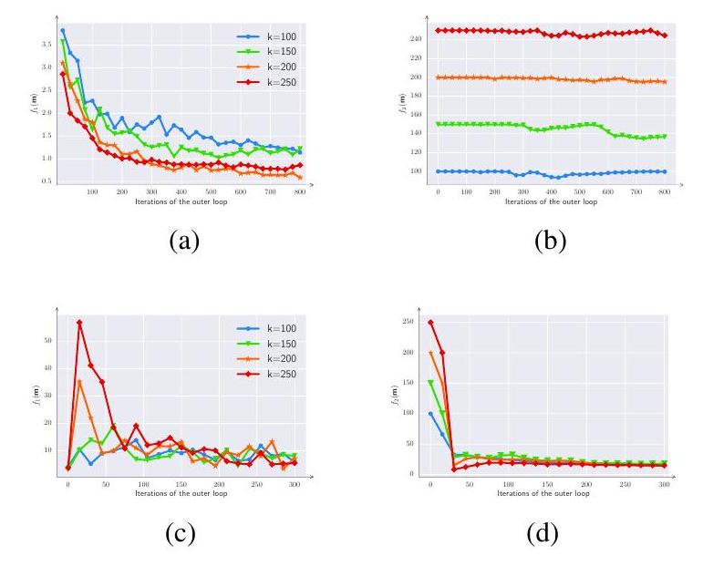
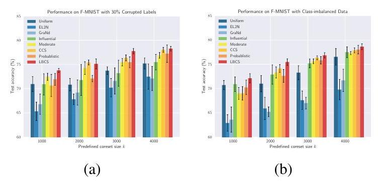
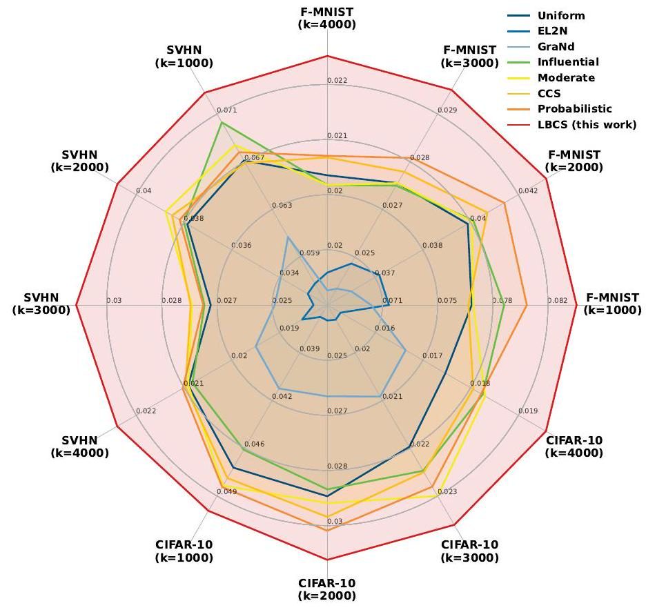
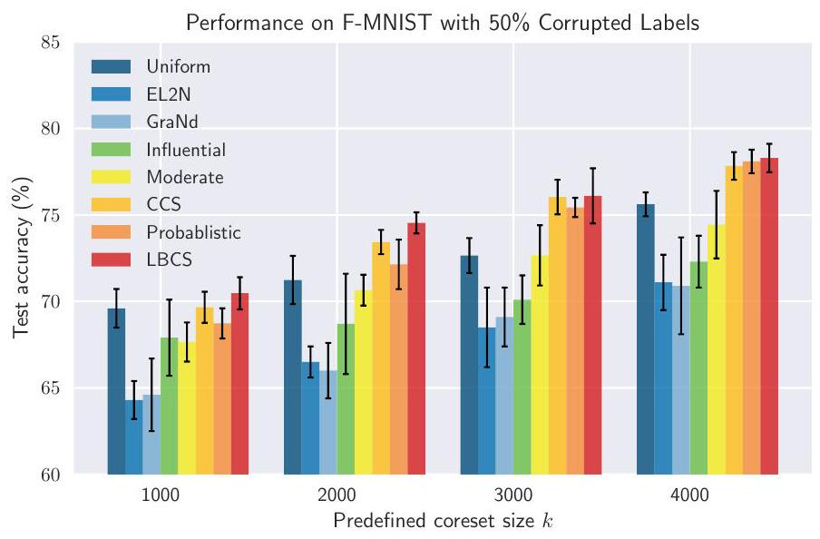

\title{
Refined Coreset Selection: Towards Minimal Coreset Size under Model Performance Constraints
}

\author{
Xiaobo Xia ${ }^{1}$ Jiale Liu ${ }^{2}$ Shaokun Zhang ${ }^{2}$ Qingyun Wu ${ }^{2}$ Hongxin Wei ${ }^{3}$ Tongliang Liu ${ }^{1}$
}

\begin{abstract}
Coreset selection is powerful in reducing computational costs and accelerating data processing for deep learning algorithms. It strives to identify a small subset from large-scale data, so that training only on the subset practically performs on par with full data. Practitioners regularly desire to identify the smallest possible coreset in realistic scenes while maintaining comparable model performance, to minimize costs and maximize acceleration. Motivated by this desideratum, for the first time, we pose the problem of refined coreset selection, in which the minimal coreset size under model performance constraints is explored. Moreover, to address this problem, we propose an innovative method, which maintains optimization priority order over the model performance and coreset size, and efficiently optimizes them in the coreset selection procedure. Theoretically, we provide the convergence guarantee of the proposed method. Empirically, extensive experiments confirm its superiority compared with previous strategies, often yielding better model performance with smaller coreset sizes. The implementation is available at https://github.com/xiaoboxia/LBCS.
\end{abstract}

\section*{1. Introduction}

Deep learning has made tremendous strides in recent decades, powered by ever-expanding datasets that comprise millions of examples (Radford et al., 2018; Brown et al., 2020; Yang et al., 2021; Huang et al., 2022; Kirillov et al., 2023; Li et al., 2022; Huang et al., 2023d;b). At such scales, both data storage and model training become burdensome,

\footnotetext{
${ }^{1}$ School of Computer Science, The University of Sydney, Australia. ${ }^{2}$ College of Information Science and Technology, Penn State University, USA. ${ }^{3}$ Department of Statistics and Data Science, Southern University of Science and Technology, China. Correspondence to: Tongliang Liu <tongliang.liu@sydney.edu.au>.

Proceedings of the $41^{\text {st }}$ International Conference on Machine Learning, Vienna, Austria. PMLR 235, 2024. Copyright 2024 by the author(s).
}
and are always unaffordable by startups or non-profit organizations (Zhao et al., 2021; Liu et al., 2022). Hence, there are intense demands for lowering the data scale and improving the data efficiency of deep learning techniques (Deng \& Russakovsky, 2022; Xie et al., 2023; Zhang et al., 2024).

Coreset selection has been confirmed as a natural and efficacious strategy to satisfy the aforenoted demands (Pooladzandi et al., 2022; Feldman \& Zhang, 2020; Mirzasoleiman et al., 2020; He et al., 2023; Lin et al., 2023; Li et al., 2023). This strategy typically involves selecting a small subset (known as a coreset) from massive data. The objective of the selection is that training on the subset can achieve comparable performance to that on the full data. In pursuit of this objective, by first predetermining and fixing the coreset size per request, previous works competed to propose more advanced coreset selection algorithms that better meet the objective (Toneva et al., 2019; Borsos et al., 2020). Clearly, these works are applicable in the scenario where practitioners have a specific requirement of the coreset size, since subsequent coreset selection is based on it.

In this paper, we go beyond the above scenario and discuss a more general problem about coreset selection, which is named refined coreset selection (RCS). Specifically, in this problem, we still hold the objective of prior coreset selection, on which the coreset should practically perform on par with full data. Distinctively, we are also concerned about the objective of the coreset size. That is, under the premise of comparable performance achieved by the coreset, its size should be as small as possible for better data efficiency.

The RCS problem shares a similar philosophy with numerous problems in other domains, which tends to go further on other objectives besides the primary objective (Bommert et al., 2017; Gonzalez et al., 2021; Abdolshah et al., 2019). Also, it is much in line with the needs of practitioners. For instance, in lots of cases, we actually do not have a clear and fixed requirement for the coreset size. Instead, if model performance with the coreset can be satisfactory, we desire to further minimize storage and training consumption and are interested in the lowest cost of hardware when utilizing the coreset. This matches the minimal coreset size under model performance constraints.

To address the RCS problem, we present a new method that
formulates RCS as cardinality-constrained bilevel optimization with priority order over multiple objectives. Specifically, we first rigorously formalize the priority order as lexicographic preferences (Fishburn, 1975; Zhang et al., 2023b). This helps specify a clear optimization target across multiple objectives, where the model performance is primary and coreset size is secondary. Afterward, with a network trained in the inner loop of bilevel optimization, coreset selection is performed in the outer loop, by using pairwise comparisons between constructed coresets. The pairwise comparisons are supported by lexicographic relations defined for RCS, which proceed toward premium coresets under the lexicographic structure over objectives.

\subsection*{1.1. Contributions}
(1). Conceptually, we surpass the traditional coreset selection paradigm and propose the problem of refined coreset selection (RCS). The problem is realistic, challenging, and under-explored. The solution for it is non-trivial (c.f., §2.1).
(2). Technically, we propose an advanced method to handle RCS, in which lexicographic bilevel coreset selection is framed. We also discuss implementation tricks to speed up the coreset selection in our method. Moreover, theoretical analysis is provided to guarantee the convergence of the proposed method.
(3). Empirically, extensive evaluations are presented on F MNIST, SVHN, CIFAR-10, and ImageNet-1k. We demonstrate the utility of the proposed method in tackling RCS. Besides, compared with previous efforts in coreset selection, we illustrate that in many situations, our method can reach competitive model performance with a smaller coreset size, or better model performance with the same coreset size.

\subsection*{1.2. Related Literature}

Coreset selection has gained much interest from the research community (Huggins et al., 2016; Huang et al., 2018; Braverman et al., 2022; Qin et al., 2023; Park et al., 2022; Zheng et al., 2023; Zhang et al., 2024; Yang et al., 2024). The algorithms of coreset selection are generally divided into two groups. In the first group, the methods design a series of score criteria and sort data points based on the criteria. Afterwards, the data points with smaller or larger scores are selected into the coreset. The score criteria include margin separation (Har-Peled et al., 2007), gradient norms (Paul et al., 2021), distances to class centers (Sorscher et al., 2022; Xia et al., 2023b), influence function scores (Pooladzandi et al., 2022; Yang et al., 2023), etc. As a comparison, in the second group, the methods do not design any specific score criteria (Feldman \& Langberg, 2011; Lucic et al., 2017; Huang et al., 2023a). The coreset is commonly constructed in an optimization manner to satisfy an approximation error (Huang et al., 2018). Compared with the methods
in the first group, the methods in the second group often enjoy more promising theoretical properties and guarantees (Huang et al., 2018; 2023a).
Recently, due to the power to handle hierarchical decisionmaking problems, bilevel optimization (Bard, 2013; Eichfelder, 2010; Sinha et al., 2017) is introduced to improve the methods in the second group (Borsos et al., 2020). Specifically, the motivation for bilevel coreset selection is that the only thing we really care about is the performance of the model trained on the coreset, instead of a small approximation error for the loss function in the whole parameter space (Zhou et al., 2022). Therefore, the approximation error is discarded in optimization. We choose to evaluate the performance (e.g., the loss) of parameters achieved by training with the selected coreset, on full data. The evaluations are used to guide subsequent coreset selection. The proposed method in this paper is inspired by bilevel coreset selection. Nevertheless, there are prioritized multiple objectives when evaluating performance, which is more challenging both intuitively and technically.
Bilevel multi-objective optimization (Deb \& Sinha, 2010; Sinha et al., 2015; Gu et al., 2023) imposes multiple objectives in each loop of a bilevel optimization problem. Our algorithm design is related to bilevel multi-objective optimization (Deb \& Sinha, 2010), in the sense that there are two evaluation objectives in the outer loop of bilevel optimization. However, to the best of our knowledge, there is no study exploring coreset selection with bilevel multiobjective optimization. Therefore, from this perspective, this paper benefits the community in two folds: (1). we investigate coreset selection with bilevel multi-objective optimization and discuss the issues of this paradigm; (2). we present the algorithm of bilevel coreset selection with priority structures to address the issues, which can inspire follow-up research.

\section*{2. Preliminaries}

Notations. In the sequel, vectors, matrices, and tuples are denoted by bold-faced letters. We use $\|\cdot\|_{p}$ to denote the $L_{p}$ norm of vectors or matrices and $\ell(\cdot)$ to denote the crossentropy loss if there is no confusion. Let $[n]=\{1, \ldots, n\}$.

Problem definition. We define the problem of RCS as follows. Formally, given a large-scale dataset $\mathcal{D}=$ $\left\{\left(\mathbf{x}_{i}, y_{i}\right)\right\}_{i=1}^{n}$ with a sample size $n$, where $\mathbf{x}_{i}$ denotes the instance and $y_{i}$ denotes the label. The problem of RCS is to find a subset of $\mathcal{D}$ for follow-up tasks, which reduces both storage and training consumption while maintaining the utility. The subset is called the coreset that is expected to satisfy two objectives by priority: (O1) the coreset should practically perform on par with full data $\mathcal{D}$; (O2) the sample size of the coreset should be as small as possible. Note
that objective (O1) has a higher priority than (O2), since a smaller coreset size is pointless if the network with this small coreset does not perform satisfactorily.

Objective formulations. We formulate the two optimization objectives that we are concerned with. Without loss of generality, we consider the minimization mode across the paper. The formulation is based on a bilevel optimization framework (Borsos et al., 2020; Zhou et al., 2022). Specifically, the $0-1$ masks $\boldsymbol{m} \in\{0,1\}^{n}$ are introduced with $m_{i}=1$ indicating the data point $\left(\mathbf{x}_{i}, y_{i}\right)$ is selected into the coreset and otherwise excluded. We use $h(\mathbf{x} ; \boldsymbol{\theta})$ to denote the deep network with the learnable parameters $\boldsymbol{\theta}$. The objective (O1) can be formulated as
\[
\begin{aligned}
& f_{1}(\boldsymbol{m}):=\frac{1}{n} \sum_{i=1}^{n} \ell\left(h\left(\mathbf{x}_{i} ; \boldsymbol{\theta}(\boldsymbol{m})\right), y_{i}\right) \\
& \text { s.t. } \boldsymbol{\theta}(\boldsymbol{m}) \in \arg \min _{\boldsymbol{\theta}} \mathcal{L}(\boldsymbol{m}, \boldsymbol{\theta})
\end{aligned}
\]
where $\boldsymbol{\theta}(\boldsymbol{m})$ denotes the network parameters obtained by training the network to converge on the selected coreset with mask $\boldsymbol{m}$. That $\mathcal{L}(\boldsymbol{m}, \boldsymbol{\theta})$ represents the loss on the selected coreset with $\mathcal{L}(\boldsymbol{m}, \boldsymbol{\theta})=\frac{1}{\|\boldsymbol{m}\|_{0}} \sum_{i=1}^{n} m_{i} \ell\left(h\left(\mathbf{x}_{i} ; \boldsymbol{\theta}\right), y_{i}\right)$. The intuition of (O1) is that a good coreset ensures optimizing on $\mathcal{L}(\boldsymbol{m}, \boldsymbol{\theta})$ over $\boldsymbol{\theta}$ yields good solutions when evaluated on $f_{1}(\boldsymbol{m})$ (Borsos et al., 2020). Also, we define the objective (O2) as
\[
f_{2}(\boldsymbol{m}):=\|\boldsymbol{m}\|_{0}
\]
which explicitly controls the coreset size using $L_{0}$ norm. In this work, we aim to minimize $f_{1}(\boldsymbol{m})$ and $f_{2}(\boldsymbol{m})$ in order of priority, where $f_{1}(\boldsymbol{m})$ is primary and $f_{2}(\boldsymbol{m})$ is secondary. That $f_{2}(\boldsymbol{m})$ should be optimized under the premise of $f_{1}(\boldsymbol{m})$.

\subsection*{2.1. RCS Solutions are Non-trivial}

Solving RCS is non-trivial since previous methods on coreset selection can not be applied directly. Moreover, simple modifications to these methods may not be sufficient to achieve good solutions. For the attempt of direct applications, it is somewhat easy to know this is infeasible. Most works fix the coreset size for coreset selection (Paul et al., 2021; Xia et al., 2023b; Sorscher et al., 2022; Toneva et al., 2019). Also, the methods (Borsos et al., 2020; Zhou et al., 2022) in bilevel optimization specify a predefined upper bound of the coreset size, and only consider the objective (O1) in optimization:
\[
\min _{\boldsymbol{m}} f_{1}(\boldsymbol{m}), \text { s.t. } \boldsymbol{\theta}(\boldsymbol{m}) \in \arg \min _{\boldsymbol{\theta}} \mathcal{L}(\boldsymbol{m}, \boldsymbol{\theta})
\]

In (3), the minimization of $f_{1}(\boldsymbol{m})$ is in the outer loop, while the minimization of $\mathcal{L}(\boldsymbol{m}, \boldsymbol{\theta})$ lies in the inner loop. Without


Figure 1: Illustrations of phenomena of several trivial solutions discussed in §2.1. The experiment is based on (Zhou et al., 2022). The setup is provided in Appendix C.3. Here, $k$ denotes the predefined coreset size before optimization. (a) $f_{1}(\boldsymbol{m})$ vs. outer iterations with (3); (b) $f_{2}(\boldsymbol{m})$ vs. outer iterations with (3); (c) $f_{1}(\boldsymbol{m})$ vs. outer iterations with (4); (d) $f_{2}(\boldsymbol{m})$ vs. outer iterations with (4).
optimizations about the coreset size, $f_{1}(\boldsymbol{m})$ can be minimized effectively (see Figure 1(a)). As a comparison, the coreset size remains close to the predefined one (see Figure 1 (b)), which is not our desideratum in RCS.

In an attempt to modify previous methods to tackle RCS, we discuss two simple-to-conceive cases. To begin with, for the methods that fix the coreset size for subsequent coreset selection, we can borrow them to run many experiment attempts under different coreset sizes. The attempts with comparable $f_{1}(\boldsymbol{m})$ and small $f_{2}(\boldsymbol{m})$ can be employed as a solution. However, this way needs expert assistance for lower attempt budgets (Yao et al., 2018). Also, its performance is not very competitive (see evaluations in §5).

In addition, for the methods in bilevel coreset selection, by introducing the objective (O2) to (3), we can minimize two objectives in the form of a weighted combination:
\[
\min _{\boldsymbol{m}}(1-\lambda) f_{1}(\boldsymbol{m})+\lambda f_{2}(\boldsymbol{m}), \text { s.t. } \boldsymbol{\theta}(\boldsymbol{m}) \in \arg \min _{\boldsymbol{\theta}} \mathcal{L}(\boldsymbol{m}, \boldsymbol{\theta}),
\]
where $\lambda \in(0,1)$ is a hyper-parameter to balance the two objectives in (4). First, intuitively, as $f_{2}(\boldsymbol{m})$ has lower priority than $f_{1}(\boldsymbol{m})$ in RCS, we can tune a smaller weight for $f_{2}(\boldsymbol{m})$, i.e., $\lambda<1 / 2$. Unfortunately, it is intractable, since the two objectives have different magnitudes that are related to data, networks, optimization algorithms, and specific tasks simultaneously (Gong et al., 2021). Second, if $f_{1}(\boldsymbol{m})$ and $f_{2}(\boldsymbol{m})$ share the same weights, i.e., $\lambda=1 / 2$, optimization does not implicitly favor $f_{1}(\boldsymbol{m})$. Instead, the minimization of $f_{2}(\boldsymbol{m})$ is salient, where after all iterations
$f_{2}(\boldsymbol{m})$ is too small and $f_{1}(\boldsymbol{m})$ is still large (see Figures 1(c) and 1(d)). This contradicts our aim in RCS, since satisfactory network performance achieved by the coreset has a higher priority order. With the work (Zhou et al., 2022), to explain the experimental phenomenon, we provide the analysis with gradient norms of objectives. The gradient derivations are presented mathematically in Appendix C.

Therefore, based on the above discussions, we can know that RCS solutions are non-trivial. This demonstrates the urgency of developing more advanced algorithms.

\section*{3. Methodology}

\subsection*{3.1. Lexicographic Bilevel Coreset Selection}

Although both (O1) and (O2) are optimization objectives we care about, in optimization, there is a priority order between them. As analyzed above, (O1) has a higher priority than (O2), since a smaller coreset size is meaningless if the network with such a small coreset does not perform satisfactorily. We formalize a general notion of priority order rigorously as a lexicographic preference (Fishburn, 1975) over two objectives. The general notion helps specify a clear optimization target across multiple objectives before optimization and avoids manual post hoc selection.

Specifically, we use the order list $F(\boldsymbol{m})=\left[f_{1}(\boldsymbol{m}), f_{2}(\boldsymbol{m})\right]$ to represent the objectives with a lexicographic structure, in which $f_{1}$ is the objective with higher priority and $f_{2}$ is the one with lower priority. The optimization of $f_{2}$ only matters on the condition that the more important objective $f_{1}$ is well-optimized. Afterward, our lexicographic bilevel coreset selection can be formulated as
\[
\overrightarrow{\min }_{\boldsymbol{m} \in \mathcal{M}} F(\boldsymbol{m}), \text { s.t. } \boldsymbol{\theta}(\boldsymbol{m}) \in \arg \min _{\boldsymbol{\theta}} \mathcal{L}(\boldsymbol{m}, \boldsymbol{\theta})
\]
where $\min$ represents the lexicographic optimization procedure over the ordered list $F(\boldsymbol{m})$ (Zhang et al., 2023b) and $\mathcal{M}$ denotes the search space of the mask $\boldsymbol{m}$. It is worth mentioning that the outer loop is not reflected by a single utility function enclosing both $f_{1}$ and $f_{2}$. The reason is that, mathematically, it is impossible to construct a single utility function that represents lexicographic preferences as weighted objectives (c.f., (Shi et al., 2020)).

Remark 1. Compared with the trivial solution, i.e., the form of weighted combination in (4), our lexicographic bilevel coreset selection enjoys several advantages. (i). Our method does not need to determine the combination weight, which is helpful for optimization when the two objectives are of different scales. (ii). Our method can reach Pareto optimality, where the weighted combination falls short (Zhang et al., 2023b). (iii). When a research problem has a clear hierarchy of objectives where some objectives are definitively more important than others, lexicographic preference aligns
```
Algorithm 1 Lexicographic bilevel coreset selec-
tion (LBCS) for RCS.
1: Require: a network \boldsymbol{0}\mathrm{ , a dataset }\mathcal{D}\mathrm{ , a predefined size k,}
and voluntary performance compromise }\epsilon\mathrm{ ;
2: Initialize masks }\boldsymbol{m}\mathrm{ randomly with |m}\mp@subsup{|}{0}{}=k\mathrm{ ;
for training iteration }t=1,2,\ldots,T\mathrm{ do
    3: Train the inner loop with }\mathcal{D}\mathrm{ to converge satisfies:
    0(\boldsymbol{m})\leftarrow\operatorname{arg}\mp@subsup{\operatorname{min}}{\boldsymbol{0}}{}\mathcal{L}(\boldsymbol{m},\boldsymbol{0});
    4: Update masks }\boldsymbol{m}\mathrm{ with }\boldsymbol{0}(\boldsymbol{m})\mathrm{ by lexicographic opti-
    mization as discussed in §3.2;
    Output: masks m}\mathrm{ after all training iterations.
```
with the decision-making process more naturally than the weighted combination. These advantages explain why the proposed way is better than the trivial method in solving the trade-off between $f_{1}$ and $f_{2}$.

\subsection*{3.2. Optimization Algorithm}

Challenges. We discuss the optimization details of lexicographic bilevel coreset selection that is formulated in (5). The optimization of the inner loop is simple by directly minimizing $\mathcal{L}(\boldsymbol{m}, \boldsymbol{\theta})$. It is challenging to optimize the outer loop that has a priority structure. As under lexicographic optimization, it is inaccessible to the gradients of $f_{1}(\boldsymbol{m})$ and $f_{2}(\boldsymbol{m})$ with respect to $\boldsymbol{m}$, the methods that require analytic forms of gradients (Gong et al., 2021) are inapplicable. Also, it is inefficient to borrow multi-objective optimization methods (Gunantara, 2018) to find Pareto frontiers (Lotov \& Miettinen, 2008), since the found Pareto frontiers are widespread. Actually, we are only interested in a subset of them in a specific region.

Black-box optimization. Given these considerations, we propose to treat the optimization of the outer loop as a blackbox optimization problem and leverage a randomized direct search algorithm to solve it. The optimization algorithm only needs a set of binary relations used to compare any two masks with their evaluation values for the two objectives $f_{1}$ and $f_{2}$. The evaluation results of different masks are iteratively queried, leading to the best mask to solve the RCS problem. The core of the optimization is lexicographic relations (Zhang et al., 2023b) that are used to compare the performance of different masks with respect to $F(\boldsymbol{m})$. We define the lexicographic relations for RCS below.
Definition 1 (Lexicographic relations in RCS). With two masks for coreset selection, denoted by $\boldsymbol{m}$ and $\boldsymbol{m}^{\prime}$ respectively, the lexicographic relations for RCS are defined as
$F(\boldsymbol{m}) \nRightarrow F\left(\boldsymbol{m}^{\prime}\right) \Leftrightarrow f_{i}(\boldsymbol{m})=f_{i}\left(\boldsymbol{m}^{\prime}\right) \forall i \in[2]$,
$F(\boldsymbol{m})$ 々 $F\left(\boldsymbol{m}^{\prime}\right) \Leftrightarrow$
$\exists i \in[2]: f_{i}(\boldsymbol{m})<f_{i}\left(\boldsymbol{m}^{\prime}\right) \wedge\left(\forall i^{\prime}<i, f_{i^{\prime}}(\boldsymbol{m})=f_{i^{\prime}}\left(\boldsymbol{m}^{\prime}\right)\right)$,
$F(\boldsymbol{m}) \preceq F\left(\boldsymbol{m}^{\prime}\right) \Leftrightarrow F(\boldsymbol{m}) \nRightarrow F\left(\boldsymbol{m}^{\prime}\right) \vee F(\boldsymbol{m}) \prec F\left(\boldsymbol{m}^{\prime}\right)$.

It should be noted that the lexicographic relation "々" has been verified to be both reflexive and transitive (Zhang et al., 2023b). Therefore, leveraging the defined lexicographic relations, the comparisons between any two feasible masks are always conclusive. The optimal point of the outer loop under lexicographic optimization is any one element in the optimum set $\mathcal{M}^{*}=\left\{\boldsymbol{m} \in \mathcal{M}_{2}^{*} \mid \forall \boldsymbol{m} \neq \boldsymbol{m}^{\prime}, F(\boldsymbol{m}) \preceq F\left(\boldsymbol{m}^{\prime}\right)\right\}$. Here $\mathcal{M}_{2}^{*}$ is defined recursively as
$\mathcal{M}_{1}^{*}:=\left\{\boldsymbol{m} \in \mathcal{M} \mid f_{1}(\boldsymbol{m}) \leq f_{1}^{*} *(1+\epsilon)\right\}, f_{1}^{*}:=\inf _{\boldsymbol{m} \in \mathcal{M}} f_{1}(\boldsymbol{m})$,
$\mathcal{M}_{2}^{*}:=\left\{\boldsymbol{m} \in \mathcal{M}_{1}^{*} \mid f_{2}(\boldsymbol{m}) \leq f_{2}^{*}\right\}$, and $f_{2}^{*}:=\inf _{m \in \mathcal{M}_{1}^{*}} f_{2}(\boldsymbol{m})$,
where $\epsilon$ represents the percentage of voluntary performance compromise of $f_{1}(\boldsymbol{m})$ to find choices with better performance on $f_{2}(\boldsymbol{m})$. In RCS, it is a non-negative number.

Remark 2 (On the compromise of $f_{1}(\boldsymbol{m})$ ). A relatively small compromise of $f_{1}(\boldsymbol{m})$ does not necessarily degrade the model performance by the coreset when generalizing to test data. Instead, the compromise saves $f_{1}(\boldsymbol{m})$ from having to be optimized to the minimum, which reduces the model overfitting in coreset selection. This can help the model generalization, especially when training data for coreset selection are polluted, e.g., corrupted by mislabeled data. The previous method such as Zhou et al. (2022) did not take the issue of overfitting into consideration, but moved towards the minimum in optimization. Its performance would be degraded in a series of cases. More details and evidence can be found in $\S 5.2$ and $\S 5.3$.

Algorithm flow and tricks for acceleration. The lexicographic optimization flow of the outer loop of (5) is provided in Appendix A. Besides, the overall algorithm flow of the proposed lexicographic bilevel coreset selection (LBCS) for RCS is shown in Algorithm 1. The computational consumption of Algorithm 1 originates from the model training in the inner loop (Step 3) and mask updates in the outer loop (Step 4). To speed up the inner loop, we can first train a model with random masks and then finetune it with other different masks in Step 3. Also, we can employ model sparsity and make the trained model smaller for faster training. To accelerate the outer loop, the mask search space can be narrowed by treating several examples as a group. The examples in the same group share the same mask in coreset selection. These tricks make our method applicable to large-scale datasets.

\section*{4. Theoretical Analysis}

We begin by introducing notations and notions. Specifically, for an objective function $f$, its infimum value in the search space $\mathcal{M}$ is denoted by $f^{*}$. We employ $\boldsymbol{m}^{t}$ to represent the mask at the $t$-th iteration generated by our algorithm. That $\left\{\boldsymbol{m}^{t}\right\}_{t=0}^{T}$ denotes the sequence of masks generated
by the proposed algorithm upon the step $T$ from the start time $(t=0)$. Also, $\psi_{t}$ represents the probability measure in the step $t$, which is defined on the search space $\mathcal{M}$. In the following, we present progressable and stable moving conditions to facilitate theoretical analysis of our LBCS.
Condition 1 (Progressable condition). LBCS can optimize objectives $f_{1}$ and $f_{2}$ lexicographically. Namely, at any step $t \geq 0$, the masks $\boldsymbol{m}^{t}$ and $\boldsymbol{m}^{t+1}$ satisfy:
$\left\{\begin{array}{l}f_{1}\left(\boldsymbol{m}^{t+1}\right)<f_{1}\left(\boldsymbol{m}^{t}\right) \quad \text { if } \boldsymbol{m}^{t} \notin \mathcal{M}_{1}^{*} ; \\ \left(f_{2}\left(\boldsymbol{m}^{t+1}\right)<f_{2}\left(\boldsymbol{m}^{t}\right)\right) \wedge\left(\boldsymbol{m}^{t+1} \in \mathcal{M}_{1}^{*}\right) \quad \text { if } \boldsymbol{m}^{t} \in \mathcal{M}_{1}^{*} .\end{array}\right.$

Remark 3. According to lexicographic relations used for mask updates (c.f., Line 10 of Algorithm 2 in Appendix A), Condition 1 holds at all time steps in LBCS. Specifically, when $f_{1}$ is not well-optimized, LBCS updates the incumbent mask only if the current evaluating mask has a better value on $f_{1}$. On the other hand, when $f_{1}$ reaches the optimal region $\mathcal{M}_{1}^{*}$, LBCS will update the incumbent mask only if the current evaluating mask has a better value on the second objective $f_{2}$, while $f_{1}$ remains in $\mathcal{M}_{1}^{*}$.
Condition 2 (Stable moving condition). At any step $t \geq 0$, (i) if $\boldsymbol{m}^{t} \notin \mathcal{M}_{1}^{*}$, for all possible $\boldsymbol{m}^{t}$ in the set $\mathcal{S}_{1}:=\left\{\boldsymbol{m}^{t} \in\right.$ $\left.\mathcal{M} \mid f\left(\boldsymbol{m}^{t}\right) \leq f\left(\boldsymbol{m}^{0}\right)\right\}$, there exists $\gamma_{1}>0$ and $0<\eta_{1} \leq 1$ so that the algorithm satisfies:
\[
\psi_{t+1}\left[f_{1}\left(\boldsymbol{m}^{t}\right)-f_{1}\left(\boldsymbol{m}^{t+1}\right)>\gamma_{1} \text { or } \boldsymbol{m}^{t} \in \mathcal{M}_{1}^{*}\right] \geq \eta_{1}
\]
and (ii) if $\boldsymbol{m}^{t} \in \mathcal{M}_{1}^{*}$, for all possible $\boldsymbol{m}^{t}$ in the set $\mathcal{S}_{2}:=$ $\left\{\boldsymbol{m}^{t} \in \mathcal{M} \mid f\left(\boldsymbol{m}^{t}\right) \leq f\left(\boldsymbol{m}^{\hat{t}}\right)\right\}$, there exists $\gamma_{2}>0$ and $0<\eta_{2} \leq 1$ so that the algorithm satisfies:
\[
\psi_{t+1}\left[f_{2}\left(\boldsymbol{m}^{t}\right)-f_{2}\left(\boldsymbol{m}^{t+1}\right)>\gamma_{2} \text { or } \boldsymbol{m}^{t} \in \mathcal{M}_{2}^{*}\right] \geq \eta_{2}
\]
where $\hat{t}$ represents the earliest time step that the incumbent mask reaches the optimal region in the objective $f_{1}$, i.e., $\hat{t}:=\min \left\{t \in\left\{\boldsymbol{m}^{t}\right\}_{t=0}^{T} \mid \boldsymbol{m}^{t} \in \mathcal{M}_{1}^{*}\right\}$.

Remark 4. Condition 2 is an assumption that applies to both optimization objectives $f_{1}$ and $f_{2}$, the search space $\mathcal{M}$, and the search algorithm. This condition is commonly used in the convergence analysis of local randomized search algorithms (Dolan et al., 2003; Solis \& Wets, 1981). In essence, Condition 2 imposes an improvement lower bound on each step of the local randomized search algorithm. This ensures that progress is made stably in each step of the algorithm, and is essential for proving convergence to a globally optimal solution.
With these notations, notions, and conditions, we are ready to exhibit the convergence analysis of our LBCS. Notice that the algorithm convergence in the RCS problem differs from the convergence in traditional multiple objective optimization problems (Morales-Hernández et al., 2022; Karl et al.,
2022). In RCS, with two optimization objectives $f_{1}$ and $f_{2}$, we say an algorithm is converged if (i) the primary objective $f_{1}$ reaches the optimum considering the user-provided compromise $\epsilon$; (ii) the secondary objective $f_{2}$ reaches the optimum under that (i) is satisfied. The theoretical result is formally presented below.
Theorem 2 ( $\epsilon$-convergence). Under Condition 1 and Condition 2 (sufficient conditions), the algorithm is $\epsilon$-convergence in the RCS problem:
\[
\begin{aligned}
& \mathbb{P}_{t \rightarrow \infty}\left[f_{2}\left(\boldsymbol{m}^{t}\right) \leq f_{2}^{*}\right]=1 \\
& \text { s.t. } \quad f_{2}^{*}=\min _{\boldsymbol{m} \in \mathcal{M}}\left\{f_{2}(\boldsymbol{m}) \mid f_{1}(\boldsymbol{m}) \leq f_{1}^{*} *(1+\epsilon)\right\}
\end{aligned}
\]
where $\mathbb{P}\left[f_{2}\left(\boldsymbol{m}^{t}\right) \leq f_{2}^{*}\right]$ represents the probability that the mask $\boldsymbol{m}^{t}$ generated at time $t$ is the converged solution as described above.
The proof of Theorem 2 can be checked in Appendix B.

\section*{5. Experiments}

\subsection*{5.1. Preliminary Presentation of Algorithm's Superiority}
\begin{tabular}{c|c|c|ccc}
\hline$k$ & Objectives & Initial & $\epsilon=0.2$ & $\epsilon=0.3$ & $\epsilon=0.4$ \\
\hline \multirow{2}{*}{200} & $f_{1}(\boldsymbol{m})$ & 3.21 & $1.92 \pm 0.33$ & $2.26 \pm 0.35$ & $2.48 \pm 0.30$ \\
& $f_{2}(\boldsymbol{m})$ & 200 & $190.7 \pm 3.9$ & $185.0 \pm 4.6$ & $175.5 \pm 7.7$ \\
\hline \multirow{2}{*}{400} & $f_{1}(\boldsymbol{m})$ & 2.16 & $1.05 \pm 0.26$ & $1.29 \pm 0.33$ & $1.82 \pm 0.41$ \\
& $f_{2}(\boldsymbol{m})$ & 400 & $384.1 \pm 4.4$ & $373.0 \pm 6.0$ & $366.2 \pm 8.1$ \\
\hline
\end{tabular}

Table 1: Results (mean $\pm$ std.) to illustrate the utility of our method in optimizing the objectives $f_{1}(\boldsymbol{m})$ and $f_{2}(\boldsymbol{m})$.

As discussed, there is no previous study specializing in RCS. We therefore only discuss the results achieved by our method. We show that the proposed method can effectively optimize two objectives $f_{1}(\boldsymbol{m})$ (the network performance achieved by the coreset) and $f_{2}(\boldsymbol{m})$ (the coreset size). We conduct experiments on MNIST-S which is constructed by random sampling 1,000 examples from original MNIST (LeCun et al., 1998). Staying with previous work (Borsos et al., 2020), we use a convolutional neural network stacked with two blocks of convolution, dropout, max-pooling, and ReLU activation. The predefined coreset size $k$ is set to 200 and 400 respectively. The voluntary performance compromise of $f_{1}(\boldsymbol{m})$ denoted by $\epsilon$ varies in $0.2,0.3$, and 0.4 . All experiments are repeated 20 times on NVIDIA GTX3090 GPUs with PyTorch. The mean and standard deviation (std.) of results are reported.
We provide results in Table 1. First, as can be seen, compared with initialized $f_{1}(\boldsymbol{m})$ and $f_{2}(\boldsymbol{m})$, both achieved $f_{1}(\boldsymbol{m})$ and $f_{2}(\boldsymbol{m})$ after lexicographic bilevel coreset selection are lower. This demonstrates that our method can construct a high-quality coreset with a size that is smaller than the predefined one. Second, we observe that a larger $\epsilon$ will
lead to a smaller $f_{2}(\boldsymbol{m})$ under multiple experiments. The phenomenon justifies our previous statements well. Note that here we stress, in one experiment, that a larger $\epsilon$ does not necessarily produce a larger $f_{1}(\boldsymbol{m})$. It is because we only restrict the upper bound of $f_{1}(\boldsymbol{m})$ by $\epsilon$, but not its exact value (see (7)). Nevertheless, when the number of experiments becomes relatively large, on average, achieved $f_{1}(\boldsymbol{m})$ increases accordingly if we increase $\epsilon$.

\subsection*{5.2. Comparison with the Competitors}

Competitors. Multiple coreset selection methods act as baselines for comparison. To our best knowledge, before that, there was no study working on the RCS problem. Therefore, the baselines are the methods that construct the coreset with a predetermined coreset size, where the size is not further minimized by optimization. Specifically, we employ (i). Uniform sampling (abbreviated as Uniform); (ii). EL2N (Paul et al., 2021); (iii). GraNd (Paul et al., 2021); (iv). Influential coreset (Yang et al., 2023) (abbreviated as Influential); (v). Moderate coreset (Xia et al., 2023b) (abbreviated as Moderate). (vi). CCS (Zheng et al., 2023). (vii). Probabilistic coreset (Zhou et al., 2022) (abbreviated as Probabilistic). Note that we do not compare our LBCS with the method (Borsos et al., 2020) that also works in bilevel coreset selection, since it suffers from huge time consumption (Zhou et al., 2022). For every newly added example, the consumption increases rapidly with the coreset size. Also, as reported in (Zhou et al., 2022), its performance is not very competitive compared with "Probabilistic coreset". Technical details of employed baselines are provided in Appendix D.1. For fair comparisons, we reproduce the baselines based on their code repositories. All experiments are repeated ten times on NVIDIA GTX3090 GPUs with PyTorch.

Datasets and implementation. We employ FashionMNIST (abbreviated as F-MNIST) (Xiao et al., 2017), SVHN (Netzer et al., 2011), and CIFAR-10 (Krizhevsky et al., 2009) to evaluate our method. The three benchmarks are popularly used (Killamsetty et al., 2021; Yang et al., 2023). In the procedure of coreset selection, we employ a LeNet for F-MNIST and simple convolutional neural networks (CNNs) for SVHN and CIFAR-10. An Adam optimizer (Kingma \& Ba, 2015) is used with a learning rate of 0.001 for the inner loop. The parameters $\epsilon$ and $T$ are set to 0.2 and 500. After coreset selection, for training on the constructed coreset, we utilize a LeNet (LeCun et al., 1998) for F-MNIST, a CNN for SVHN, and a ResNet-18 network for CIFAR-10 respectively. In addition, for F-MNIST and SVHN, an Adam optimizer (Kingma \& Ba, 2015) is used with a learning rate of 0.001 and 100 epochs. For CIFAR-10, an SGD optimizer is exploited with an initial learning rate of 0.1 and a cosine rate scheduler. 200 epochs are set totally.
\begin{tabular}{|c|c|c|c|c|c|c|c|c|c|c|}
\hline & $k$ & Uniform & EL2N & GraNd & Influential & Moderate & CCS & Probabilistic & LBCS (ours) & Coreset size (ours) \\
\hline \multirow[t]{4}{*}{\[
\sum_{i=1}^{5}
\]} & 1000 & $76.9 \pm 2.5$ & $71.8 \pm 2.9$ & $70.7 \pm 4.0$ & $78.9 \pm 2.0$ & $77.0 \pm 0.6$ & $76.7 \pm 3.5$ & $\mathbf{8 0 . 3} \pm \mathbf{0 . 6}$ & $79.7 \pm 0.7$ & $956.7 \pm 3.5$ \\
\hline & 2000 & $80.0 \pm 2.4$ & $73.7 \pm 1.6$ & $71.7 \pm 2.3$ & $80.4 \pm 0.8$ & $80.3 \pm 0.4$ & $81.4 \pm 0.6$ & $82.6 \pm 0.2$ & $\mathbf{8 2 . 8} \pm \mathbf{0 . 6}$ & $1915.3 \pm 6.6$ \\
\hline & 3000 & $81.7 \pm 1.7$ & $75.3 \pm 2.3$ & $73.3 \pm 1.8$ & $81.5 \pm 1.2$ & $81.7 \pm 0.5$ & $82.6 \pm 1.2$ & $83.7 \pm 0.9$ & $84.0 \pm 0.6$ & $2831.6 \pm 10.9$ \\
\hline & 4000 & $83.0 \pm 1.7$ & $77.0 \pm 1.0$ & $75.9 \pm 2.1$ & $82.4 \pm 1.3$ & $82.4 \pm 0.3$ & $84.1 \pm 0.6$ & $84.2 \pm 0.7$ & $\mathbf{8 4 . 5} \pm \mathbf{0 . 4}$ & $\mathbf{3 7 4 5 . 4} \pm \mathbf{1 5 . 6}$ \\
\hline \multirow{4}{*}{否} & 1000 & $67.1 \pm 3.3$ & $56.8 \pm 1.3$ & $60.7 \pm 1.1$ & $70.3 \pm 0.8$ & $68.4 \pm 2.0$ & $66.9 \pm 1.9$ & $67.8 \pm 0.4$ & $70.6 \pm 0.3$ & $970.0 \pm 4.8$ \\
\hline & 2000 & $75.9 \pm 1.0$ & $64.8 \pm 0.6$ & $67.3 \pm 2.0$ & $76.2 \pm 1.3$ & $77.9 \pm 0.7$ & $77.3 \pm 0.8$ & $76.6 \pm 1.3$ & $78.3 \pm 0.7$ & $1902.3 \pm 10.3$ \\
\hline & 3000 & $80.3 \pm 1.2$ & $72.1 \pm 2.8$ & $75.2 \pm 1.6$ & $80.8 \pm 1.5$ & $81.8 \pm 0.7$ & $81.9 \pm 0.6$ & $80.9 \pm 1.1$ & $\mathbf{8 2 . 3} \pm \mathbf{0 . 7}$ & $2712.6 \pm 15.0$ \\
\hline & 4000 & $83.9 \pm 0.8$ & $75.8 \pm 1.9$ & $79.1 \pm 2.4$ & $83.6 \pm 1.8$ & $83.9 \pm 0.6$ & $84.1 \pm 0.3$ & $84.3 \pm 1.4$ & $84.6 \pm$. 6 & $3804.2 \pm 16.4$ \\
\hline \multirow[t]{4}{*}{-} & 1000 & $46.9 \pm 1.8$ & $36.8 \pm 1.2$ & $41.6 \pm 2.0$ & $45.7 \pm 1.1$ & $48.1 \pm 2.2$ & $47.6 \pm 1.6$ & $48.2 \pm 0.9$ & $48.3 \pm 1.2$ & $970.4 \pm 2.9$ \\
\hline & 2000 & $58.1 \pm 2.0$ & $47.9 \pm 0.7$ & $52.3 \pm 2.4$ & $57.7 \pm 1.3$ & $58.5 \pm 1.3$ & $59.3 \pm 1.4$ & $60.1 \pm 0.8$ & $60.4 \pm 1.0$ & $1955.2 \pm 5.3$ \\
\hline & 3000 & $65.7 \pm 2.3$ & $56.1 \pm 1.9$ & $61.9 \pm 1.7$ & $67.5 \pm 1.6$ & $69.2 \pm 2.6$ & $67.6 \pm 1.6$ & $68.7 \pm 1.1$ & $69.5 \pm 0.9$ & $2913.8 \pm 9.6$ \\
\hline & 4000 & $70.9 \pm 2.5$ & $63.0 \pm 2.0$ & $67.9 \pm 1.3$ & $71.7 \pm 2.4$ & $73.9 \pm 0.4$ & $73.0 \pm 0.9$ & $73.6 \pm 0.2$ & $73.4 \pm 0.5$ & $\mathbf{3 7 3 6 . 0} \pm \mathbf{1 4 . 2}$ \\
\hline
\end{tabular}

Table 2: Mean and standard deviation of test accuracy (\%) on different benchmarks with various predefined coreset sizes. The best mean test accuracy and optimized coreset size by our method in each case are in bold.
\begin{tabular}{|c|c|c|c|c|c|c|c|c|c|}
\hline & $k$ & Uniform & EL2N & GraNd & Influential & Moderate & CCS & Probabilistic & LBCS (ours) \\
\hline \multirow{4}{*}{\[
\frac{5}{5}
\]} & 956 & $76.5 \pm 1.8$ & $71.3 \pm 3.1$ & $70.8 \pm 1.1$ & $78.2 \pm 0.9$ & $76.3 \pm 0.5$ & $75.4 \pm 1.1$ & $79.2 \pm 0.9$ & $79.7 \pm 0.5$ \\
\hline & 1935 & $79.8 \pm 2.1$ & $73.2 \pm 1.3$ & $71.2 \pm 1.5$ & $80.0 \pm 1.9$ & $79.7 \pm 0.5$ & $80.3 \pm 0.6$ & $81.7 \pm 0.7$ & $82.8 \pm 0.4$ \\
\hline & 2832 & $81.2 \pm 1.3$ & $75.0 \pm 1.6$ & $73.2 \pm 1.1$ & $81.0 \pm 0.7$ & $81.4 \pm 0.3$ & $82.5 \pm 0.7$ & $83.4 \pm 0.6$ & $84.0 \pm 0.4$ \\
\hline & 3746 & $82.8 \pm 1.5$ & $77.0 \pm 2.2$ & $75.1 \pm 1.6$ & $82.1 \pm 1.0$ & $82.2 \pm 0.4$ & $83.6 \pm 1.0$ & $83.8 \pm 0.5$ & $84.5 \pm 0.3$ \\
\hline \multirow{4}{*}{\[
\frac{2}{2}
\]} & 970 & $66.7 \pm 2.6$ & $57.2 \pm 0.5$ & $60.6 \pm 1.7$ & $70.3 \pm 1.2$ & $68.4 \pm 1.8$ & $65.1 \pm 1.1$ & $67.6 \pm 1.3$ & $70.6 \pm 0.3$ \\
\hline & 1902 & $75.7 \pm 1.8$ & $65.0 \pm 0.7$ & $67.0 \pm 1.2$ & $75.5 \pm 0.9$ & $77.7 \pm 1.2$ & $75.9 \pm 1.4$ & $76.1 \pm 0.7$ & $78.3 \pm 0.7$ \\
\hline & 2713 & $79.5 \pm 2.6$ & $72.3 \pm 0.5$ & $74.8 \pm 1.1$ & $80.0 \pm 1.9$ & $81.4 \pm 1.1$ & $81.1 \pm 1.0$ & $80.5 \pm 0.4$ & $\mathbf{8 2 . 3} \pm \mathbf{0 . 8}$ \\
\hline & 3805 & $83.6 \pm 1.2$ & $75.5 \pm 1.8$ & $78.2 \pm 1.3$ & $82.8 \pm 1.6$ & $83.6 \pm 0.6$ & $84.2 \pm 0.3$ & $83.5 \pm 1.2$ & $\mathbf{8 4 . 6} \pm \mathbf{0 . 6}$ \\
\hline \multirow{4}{*}{\[
\begin{aligned}
& \stackrel{\circ}{\dot{x}} \\
& \text { 范 }
\end{aligned}
\]} & 970 & $46.8 \pm 1.2$ & $36.7 \pm 1.1$ & $41.4 \pm 1.9$ & $44.8 \pm 1.5$ & $46.2 \pm 1.9$ & $45.4 \pm 1.0$ & $47.8 \pm 1.1$ & $48.3 \pm 1.2$ \\
\hline & 1955 & $58.0 \pm 1.3$ & $48.3 \pm 1.9$ & $52.5 \pm 1.2$ & $57.6 \pm 1.9$ & $57.4 \pm 0.8$ & $58.6 \pm 1.4$ & $59.4 \pm 1.2$ & $60.4 \pm 1.0$ \\
\hline & 2914 & $65.5 \pm 1.9$ & $55.0 \pm 3.2$ & $67.7 \pm 1.8$ & $67.2 \pm 1.0$ & $68.2 \pm 2.1$ & $66.5 \pm 1.0$ & $68.0 \pm 0.8$ & $69.5 \pm 0.9$ \\
\hline & 3736 & $70.6 \pm 2.4$ & $58.8 \pm 1.9$ & $72.8 \pm 1.1$ & $70.2 \pm 3.5$ & $73.0 \pm 1.2$ & $72.8 \pm 0.9$ & $\mathbf{7 3 . 4} \pm \mathbf{0 . 5}$ & $73.4 \pm 0.5$ \\
\hline
\end{tabular}

Table 3: Mean and standard deviation of test accuracy (\%) on different benchmarks with coreset sizes achieved by the proposed LBCS.

Details of network architectures are given in Appendix D.2.
Measurements. We consider two kinds of comparisons with the above baselines. (i). The same predefined coreset size is applied in the beginning. After coreset selection and model training on the constructed coreset, measurements are both the model accuracy on test data and coreset size. A higher accuracy and smaller coreset size indicate better coreset selection. Comparing different methods of coreset selection, the average accuracy brought by per data point within the coreset is also provided. (ii). We apply the coreset size obtained by our method to the baselines. Their coreset selection and model training are then based on this coreset size. Measurements are the model accuracy on test data under the same coreset size. Here a higher accuracy means superior coreset selection.

Discussions on experimental results. Results about the first kind of comparison are provided in Table 2. As can be seen, for SVHN, our method always achieves the best test accuracy meanwhile with smaller coreset sizes compared with predefined ones. For F-MNIST and CIFAR-10, our LBCS obtains the best accuracy with the smaller coreset
sizes most of the time. When $k=1000$ on F-MNIST and $k=4000$ on CIFAR-10, our performance is competitive ( $80.3 \pm 0.6$ vs. $79.7 \pm 0.5$ and $73.9 \pm 0.4$ vs. $73.4 \pm 0.5$ ). Also, based on the results of the first kind of comparison, we provide the average accuracy brought by per data point within the coreset in Appendix E.1, which shows that our LBCS always enjoys higher average accuracy. In addition, results of the second kind of comparison are provided in Table 3. Clearly, our LBCS consistently outperforms all competitors. Based on these observations, we can safely conclude that our method can reach competitive model performance with smaller coreset sizes, or better model performance with the same coreset sizes.

\subsection*{5.3. Robustness against Imperfect Supervision}

Coreset selection with corrupted labels. We employ FMNIST here. We inject $30 \%$ symmetric label noise (Ma et al., 2020; Kim et al., 2021; Park et al., 2023; Xia et al., 2023a; Yong et al., 2023) into the original clean F-MNIST to generate the noisy version of F-MNIST. Namely, the labels of $30 \%$ training data are flipped. The predefined coreset size $k$ is set to $1000,2000,3000$, and 4000 respectively. Ex-


Figure 2: Illustrations of coreset selection under imperfect supervision. (a) Test accuracy (\%) in coreset selection with $30 \%$ corrupted labels; (b) Test accuracy (\%) in coreset selection with class-imbalanced data. The optimized coreset sizes by LBCS in these cases are provided in Appendix E.3.
perimental results are provided in Figures 2(a). The results support our claims made in Remark 2, which demonstrate that LBCS can reduce the model overfitting in coreset selection and help model generalization. We also evaluate LBCS when the noise level is higher, i.e., $50 \%$. Results can be found in Appendix E.2.

Coreset selection with class-imbalanced data. For the class-imbalanced experiment, we adopt a similar setting as in (Xu et al., 2021). The exponential type of class imbalance (Cao et al., 2019) is used. The imbalanced ratio is set to 0.01. Experimental results are provided in Figure 2(b), which confirms the validity of our method in coreset selection with class-imbalanced cases.

\subsection*{5.4. Evaluations on ImageNet-1k}

We evaluate the performance of LBCS on ImageNet1 k (Deng et al., 2009). The network structures for the inner loop and training on the coreset after coreset selection are ResNet-50. As the size of ImageNet-1k is huge, to accelerate coreset selection, the tricks discussed previously are employed. We regard 100 examples as a group, where they share the same mask. The same tricks are applied to the baseline Probabilistic. Staying with precedent (Sorscher et al., 2022), the VISSL library (Goyal et al., 2021) is used. Besides, for model training after coreset selection, we adopt a base learning rate of 0.01 , a batch size of 256 , an SGD optimizer with a momentum of 0.9 , and a weight decay of 0.001. 100 epochs are set in total. The experiment in each case is performed once, considering calculation costs. We set the predefined ratio of coreset selection, i.e., $k / n$, to $70 \%$ and $80 \%$ respectively. Experimental results are provided in Table 4, which confirm the validity of our LBCS.

\section*{6. More Justifications and Analyses}

The influence of the number of search times. Here we investigate the number of search times during coreset se-
\begin{tabular}{l|cc}
\hline$k / n$ & $70 \%$ & $80 \%$ \\
\hline Uniform & 88.63 & 89.52 \\
EL2N & 89.82 & 90.34 \\
GraNd & 89.30 & 89.94 \\
Influential & - & - \\
Moderate & 89.94 & 90.65 \\
CCS & 89.45 & 90.51 \\
Probabilistic & 88.20 & 89.35 \\
\hline LBCS (ours) & $\mathbf{8 9 . 9 8}(\mathbf{6 8 . 5 3 \%})$ & $\mathbf{9 0 . 8 4}(\mathbf{7 7 . 8 2 \%})$ \\
\hline
\end{tabular}

Table 4: Top-5 test accuracy (\%) on ImageNet-1k. Partial results are from previous work (Xia et al., 2023b). The best test accuracy in each case is in bold. For LBCS, we additionally report the optimized ratio of coreset selection.
\begin{tabular}{c|c|c}
\hline$k$ & LBCS & LBCS+Moderate \\
\hline 1000 & $79.7 \pm 0.7$ & $\mathbf{7 9 . 8} \pm \mathbf{0 . 5}$ \\
2000 & $82.8 \pm 0.6$ & $\mathbf{8 3 . 6} \pm \mathbf{0 . 7}$ \\
3000 & $84.0 \pm 0.6$ & $\mathbf{8 4 . 3} \pm \mathbf{0 . 4}$ \\
4000 & $84.5 \pm 0.4$ & $\mathbf{8 5 . 1} \pm \mathbf{0 . 3}$ \\
\hline
\end{tabular}

Table 5: Mean and standard deviation of test accuracy (\%) on F-MNIST with various predefined coreset sizes. "LBCS+Moderate" means the mask is initialized by "Moderate" and then is refined by our LBCS. The best test accuracy in each case is in bold.
lection, i.e., the value of $T$. We conduct experiments on F MNIST. Experimental results are provided in Appendix E.4. The main observation is that, at the beginning, with the increased search times, the test accuracy increases, and the coreset size decreases. As the search proceeds, the test accuracy gradually stabilizes. The coreset size continues to be smaller. Afterward, when the number of searches is large, the search results are not changed obviously, as the search approaches convergence empirically. In practice, we can pick a suitable $T$ based on the need for coresets and the budget of search in coreset selection.

Time complexity analysis. We compare the time complexity between Probabilistic (Zhou et al., 2022) and our LBCS because both the two methods are based on the bilevel framework for coreset selection. Specifically, suppose that the number of training epochs of one inner loop is denoted as $K$. The time complexity of our LBCS is $\mathcal{O}(T K)$. As a comparison, the time complexity of Probabilistic (Zhou et al., 2022) is $\mathcal{O}(T K C)$, where $C$ is the number of sampling times required by its policy gradient estimator. As the value of $C$ is generally greater than 1 (Zhou et al., 2022), our LBCS enjoys less time complexity than Probabilistic. Note that due to the bilevel strategy, at the current stage, LBCS still takes a relatively long time for coreset selection. However, the coreset selection only needs to be performed once. The selected coreset can be used for subsequent unlimited rounds
\begin{tabular}{c|c|ccccccc|c}
\hline & $k$ & Uniform & EL2N & GraNd & Influential & Moderate & CCS & Probablistic & LBCS (ours) \\
\hline \multirow{4}{*}{5} & 1000 & $28.5 \pm 3.1$ & $22.7 \pm 3.5$ & $24.0 \pm 2.2$ & $31.5 \pm 1.8$ & $32.8 \pm 1.5$ & $31.7 \pm 1.6$ & $29.6 \pm 0.3$ & $\mathbf{3 3 . 9} \pm \mathbf{0 . 8}$ \\
& 2000 & $46.6 \pm 2.7$ & $40.9 \pm 2.6$ & $38.8 \pm 0.6$ & $42.2 \pm 1.7$ & $45.5 \pm 2.3$ & $46.1 \pm 1.8$ & $46.6 \pm 2.0$ & $\mathbf{4 7 . 5} \pm \mathbf{2 . 2}$ \\
& 3000 & $50.0 \pm 2.2$ & $46.7 \pm 3.0$ & $47.9 \pm 2.4$ & $50.8 \pm 0.7$ & $51.0 \pm 2.9$ & $50.4 \pm 1.6$ & $50.5 \pm 1.9$ & $\mathbf{5 1 . 3} \pm \mathbf{0 . 6}$ \\
& 4000 & $54.0 \pm 3.3$ & $49.9 \pm 2.8$ & $50.8 \pm 0.9$ & $53.3 \pm 0.9$ & $54.9 \pm 1.9$ & $56.2 \pm 2.1$ & $55.3 \pm 1.5$ & $\mathbf{5 7 . 7} \pm \mathbf{0 . 4}$ \\
\hline \multirow{3}{*}{} & 1000 & $78.8 \pm 1.5$ & $67.9 \pm 2.7$ & $70.5 \pm 3.0$ & $79.3 \pm 2.8$ & $80.0 \pm 0.4$ & $79.8 \pm 0.9$ & $80.1 \pm 1.3$ & $\mathbf{8 0 . 3} \pm \mathbf{1 . 2}$ \\
受 & 2000 & $87.2 \pm 1.2$ & $69.5 \pm 3.3$ & $73.4 \pm 2.6$ & $87.1 \pm 0.8$ & $88.0 \pm 0.3$ & $\mathbf{8 8 . 7} \pm \mathbf{0 . 6}$ & $87.0 \pm 1.0$ & $87.8 \pm 1.1$ \\
$\boldsymbol{3}$ & 3000 & $89.1 \pm 0.9$ & $76.6 \pm 1.2$ & $78.8 \pm 3.2$ & $90.3 \pm 0.7$ & $90.3 \pm 0.4$ & $90.2 \pm 0.4$ & $89.3 \pm 0.6$ & $\mathbf{9 0 . 7} \pm \mathbf{0 . 5}$ \\
& 4000 & $90.2 \pm 1.9$ & $80.3 \pm 1.9$ & $83.4 \pm 1.7$ & $90.9 \pm 1.1$ & $90.8 \pm 0.5$ & $91.1 \pm 1.0$ & $90.6 \pm 0.5$ & $\mathbf{9 1 . 4} \pm \mathbf{0 . 9}$ \\
\hline
\end{tabular}

Table 6: Mean and standard deviation (std.) of test accuracy (\%) on SVHN with various predefined coreset sizes and networks. The best mean test accuracy in each case is in bold.
of model training, parameter tuning, and model architecture search, to reduce computational and storage consumption.

The influence of mask initialization. If the search space is large and the search time is limited, a suitable mask initialization will be beneficial to the final performance. Prior to this, we use random mask initialization for fair comparison. Here we show that with mask initialization by other methods, the final performance will be enhanced. Experimental results are shown in Table 5.

Cross network architecture evaluation. Here we demonstrate that the proposed method is not limited to specific network architectures. We employ SVHN and use ViTsmall (Dosovitskiy et al., 2021) and WideResNet (abbreviated as W-NET) (Zagoruyko \& Komodakis, 2016) for training on the constructed coreset. The other experimental settings are not changed. Results are provided in Table 6. As can be seen, with ViT, our method is still superior to the competitors with respect to test accuracy and coreset sizes (the exact coreset sizes of our method can be checked in Table 2). With W-NET, our LBCS gets the best test accuracy when $k=1000, k=3000$, and $k=4000$ with smaller coreset sizes. In other cases, i.e., $k=2000$, LBCS can achieve competitive test accuracy compared with baselines but with a smaller coreset size.

In addition to the above analysis, the evaluations about two applications of coreset selection, i.e., continual learning (Kim et al., 2022) and streaming (Hayes et al., 2019), can be found in Appendix E. 5 and Appendix E.6.

\section*{7. Conclusion}

In this paper, we propose and delve into the problem of refined coreset selection. An advanced method named lexicographic bilevel coreset selection is presented. We theoretically prove its convergence and conduct comprehensive experiments to demonstrate its superiority. For future work, we are interested in adapting the proposed method to other fields such as image and motion generation (Song et al., 2023; Chen et al., 2023), and in accelerating the pre-training of large vision and language models (Touvron et al., 2023;

Liu et al., 2023; Wang et al., 2024; Zhou et al., 2024; Huang et al., 2023c; Luo et al., 2024) with our method.

Limitations. The proposed method is based on bilevel optimization coreset selection. At present, some advanced methods do not need bilevel optimization. This work does not discuss an effective way to involve the minimization of the coreset size in those methods. Also, although theoretical analysis provides convergence guarantees, the optimal convergence rate remains mysterious. We regard addressing the limitations as future research directions.

\section*{Impact Statement}

This paper presents work on the problem of refined coreset selection (RCS), which is significant in this big data era. A framework of lexicographic bilevel coreset selection is proposed for the problem, with both theoretical guarantees and superior performance. The outcome of this paper has several broader impacts as follows. For example, due to data privacy and security, data sharing is often challenging. With the outcome of the coreset selection by this paper, data sharing can be promoted by only sharing representative data in the constructed coreset, but not full data. Besides, the outcome of this paper helps sustainable development, since it can lower the energy and physical resource requirements of machine learning algorithms, which reduces their impact on the environment. The RCS problem is realistic and important. The solution for it is non-trivial. Therefore, the development and realization of the algorithm for RCS require advanced technology and expertise, which may result in the emergence of technical barriers.

\section*{Acknowledgements}

Xiaobo Xia was supported by the Australian Research Council project: DE190101473 and Google PhD Fellowship. Hongxin Wei is supported by the Shenzhen Fundamental Research Program JCYJ20230807091809020. Tongliang Liu is partially supported by the following Australian Research Council projects: FT220100318, DP220102121, LP220100527, LP220200949, and IC190100031.

\section*{References}

Abdolshah, M., Shilton, A., Rana, S., Gupta, S., and Venkatesh, S. Multi-objective bayesian optimisation with preferences over objectives. In NeurIPS, 2019.

Aljundi, R., Lin, M., Goujaud, B., and Bengio, Y. Gradient based sample selection for online continual learning. In NeurIPS, 2019.

Bard, J. F. Practical bilevel optimization: algorithms and applications, volume 30. Springer Science \& Business Media, 2013.

Bommert, A., Rahnenführer, J., and Lang, M. A multicriteria approach to find predictive and sparse models with stable feature selection for high-dimensional data. Computational and Mathematical Methods in Medicine, 2017.

Borsos, Z., Mutny, M., and Krause, A. Coresets via bilevel optimization for continual learning and streaming. In NeurIPS, pp. 14879-14890, 2020.

Braverman, V., Cohen-Addad, V., Jiang, H.-C. S., Krauthgamer, R., Schwiegelshohn, C., Toftrup, M. B., and $\mathrm{Wu}, \mathrm{X}$. The power of uniform sampling for coresets. In FOCS, pp. 462-473, 2022.

Brown, T., Mann, B., Ryder, N., Subbiah, M., Kaplan, J. D., Dhariwal, P., Neelakantan, A., Shyam, P., Sastry, G., Askell, A., et al. Language models are few-shot learners. In NeurIPS, pp. 1877-1901, 2020.

Cao, K., Wei, C., Gaidon, A., Arechiga, N., and Ma, T. Learning imbalanced datasets with label-distributionaware margin loss. In NeurIPS, 2019.

Chen, X., Jiang, B., Liu, W., Huang, Z., Fu, B., Chen, T., Yu, J., and Yu, G. Executing your commands via motion diffusion in latent space. In CVPR, 2023.

Chrysakis, A. and Moens, M.-F. Online continual learning from imbalanced data. In ICML, pp. 1952-1961, 2020.

Deb, K. and Sinha, A. An efficient and accurate solution methodology for bilevel multi-objective programming problems using a hybrid evolutionary-local-search algorithm. Evolutionary Computation, 18(3):403-449, 2010.

Deng, J., Dong, W., Socher, R., Li, L.-J., Li, K., and Fei-Fei, L. Imagenet: A large-scale hierarchical image database. In $C V P R$, pp. 248-255, 2009.

Deng, Z. and Russakovsky, O. Remember the past: Distilling datasets into addressable memories for neural networks. In NeurIPS, 2022.

Dolan, E. D., Lewis, R. M., and Torczon, V. On the local convergence of pattern search. SIAM Journal on Optimization, 14(2):567-583, 2003.

Dosovitskiy, A., Beyer, L., Kolesnikov, A., Weissenborn, D., Zhai, X., Unterthiner, T., Dehghani, M., Minderer, M., Heigold, G., Gelly, S., et al. An image is worth $16 \times 16$ words: Transformers for image recognition at scale. In ICLR, 2021.

Eichfelder, G. Multiobjective bilevel optimization. Mathematical Programming, 123:419-449, 2010.

Feldman, D. and Langberg, M. A unified framework for approximating and clustering data. In STOC, pp. 569578, 2011.

Feldman, V. and Zhang, C. What neural networks memorize and why: Discovering the long tail via influence estimation. In NeurIPS, pp. 2881-2891, 2020.

Fishburn, P. C. Axioms for lexicographic preferences. The Review of Economic Studies, 42(3):415-419, 1975.

Gong, C., Liu, X., and Liu, Q. Automatic and harmless regularization with constrained and lexicographic optimization: A dynamic barrier approach. In NeurIPS, pp. 29630-29642, 2021.

Gonzalez, J., Ortega, J., Escobar, J. J., and Damas, M. A lexicographic cooperative co-evolutionary approach for feature selection. Neurocomputing, 463:59-76, 2021.

Goodfellow, I. J., Mirza, M., Xiao, D., Courville, A., and Bengio, Y. An empirical investigation of catastrophic forgetting in gradient-based neural networks. arXiv preprint arXiv:1312.6211, 2013.

Goyal, P., Duval, Q., Reizenstein, J., Leavitt, M., Xu, M., Lefaudeux, B., Singh, M., Reis, V., Caron, M., Bojanowski, P., Joulin, A., and Misra, I. Vissl. https:// github.com/facebookresearch/vissl, 2021.

Gu, A., Lu, S., Ram, P., and Weng, T.-W. Min-max multiobjective bilevel optimization with applications in robust machine learning. In $I C L R, 2023$.

Gunantara, N. A review of multi-objective optimization: Methods and its applications. Cogent Engineering, 5(1): 1502242, 2018.

Hampel, F. R. The influence curve and its role in robust estimation. Journal of the American Statistical Association, 69(346):383-393, 1974.

Har-Peled, S., Roth, D., and Zimak, D. Maximum margin coresets for active and noise tolerant learning. In IJCAI, pp. 836-841, 2007.

Hayes, T. L., Cahill, N. D., and Kanan, C. Memory efficient experience replay for streaming learning. In ICRA, pp. 9769-9776, 2019.

He, M., Yang, S., Huang, T., and Zhao, B. Large-scale dataset pruning with dynamic uncertainty. arXiv preprint arXiv:2306.05175, 2023.

Huang, L., Jiang, S. H.-C., Li, J., and Wu, X. Epsiloncoresets for clustering (with outliers) in doubling metrics. In FOCS, pp. 814-825, 2018.

Huang, L., Jiang, S. H.-C., Lou, J., and Wu, X. Near-optimal coresets for robust clustering. In ICLR, 2023a.

Huang, Z., Xia, X., Shen, L., Han, B., Gong, M., Gong, C., and Liu, T. Harnessing out-of-distribution examples via augmenting content and style. arXiv preprint arXiv:2207.03162, 2022.

Huang, Z., Li, M., Shen, L., Yu, J., Gong, C., Han, B., and Liu, T. Winning prize comes from losing tickets: Improve invariant learning by exploring variant parameters for out-of-distribution generalization. arXiv preprint arXiv:2310.16391, 2023b.

Huang, Z., Liu, C., Dong, Y., Su, H., Zheng, S., and Liu, T. Machine vision therapy: Multimodal large language models can enhance visual robustness via denoising in-context learning. arXiv preprint arXiv:2312.02546, 2023c.

Huang, Z., Shen, L., Yu, J., Han, B., and Liu, T. Flatmatch: Bridging labeled data and unlabeled data with cross-sharpness for semi-supervised learning. In NeurIPS, pp. 18474-18494, 2023d.

Huggins, J., Campbell, T., and Broderick, T. Coresets for scalable bayesian logistic regression. In NeurIPS, 2016.

Karl, F., Pielok, T., Moosbauer, J., Pfisterer, F., Coors, S., Binder, M., Schneider, L., Thomas, J., Richter, J., Lang, M., et al. Multi-objective hyperparameter optimizationan overview. arXiv preprint arXiv:2206.07438, 2022.

Killamsetty, K., Zhao, X., Chen, F., and Iyer, R. Retrieve: Coreset selection for efficient and robust semi-supervised learning. In NeurIPS, pp. 14488-14501, 2021.

Kim, G., Xiao, C., Konishi, T., Ke, Z., and Liu, B. A theoretical study on solving continual learning. In NeurIPS, 2022.

Kim, T., Ko, J., Choi, J., Yun, S.-Y., et al. Fine samples for learning with noisy labels. In NeurIPS, pp. 24137-24149, 2021.

Kingma, D. P. and Ba, J. Adam: A method for stochastic optimization. In ICLR, 2015.

Kirillov, A., Mintun, E., Ravi, N., Mao, H., Rolland, C., Gustafson, L., Xiao, T., Whitehead, S., Berg, A. C., Lo, W.-Y., Dollár, P., and Girshick, R. Segment anything. arXiv:2304.02643, 2023.

Krizhevsky, A., Hinton, G., et al. Learning multiple layers of features from tiny images. 2009.

LeCun, Y., Bottou, L., Bengio, Y., and Haffner, P. Gradientbased learning applied to document recognition. Proceedings of the IEEE, 86(11):2278-2324, 1998.

Lee, S., Chun, S., Jung, S., Yun, S., and Yoon, S. Dataset condensation with contrastive signals. In ICML, pp. 12352-12364, 2022.

Li, S., Xia, X., Ge, S., and Liu, T. Selective-supervised contrastive learning with noisy labels. In $C V P R$, pp. 316325, 2022.

Li, Y., Hui, B., Xia, X., Yang, J., Yang, M., Zhang, L., Si, S., Liu, J., Liu, T., Huang, F., et al. One shot learning as instruction data prospector for large language models. arXiv preprint arXiv:2312.10302, 2023.

Lin, Y., Liu, C., Ye, C., Lian, Q., Yao, Y., and Zhang, T. Optimal sample selection through uncertainty estimation and its application in deep learning. arXiv preprint arXiv:2309.02476, 2023.

Liu, H., Li, C., Wu, Q., and Lee, Y. J. Visual instruction tuning. arXiv preprint arXiv:2304.08485, 2023.

Liu, S., Wang, K., Yang, X., Ye, J., and Wang, X. Dataset distillation via factorization. In NeurIPS, 2022.

Loo, N., Hasani, R., Amini, A., and Rus, D. Efficient dataset distillation using random feature approximation. In NeurIPS, 2022.

Lotov, A. V. and Miettinen, K. Visualizing the pareto frontier. Multiobjective Optimization, 5252:213-243, 2008.

Lucic, M., Faulkner, M., Krause, A., and Feldman, D. Training gaussian mixture models at scale via coresets. The Journal of Machine Learning Research, 18(1):5885-5909, 2017.

Luo, R., Li, Y., Chen, L., He, W., Lin, T.-E., Li, Z., Zhang, L., Song, Z., Xia, X., Liu, T., Yang, M., and Hui, B. Deem: Diffusion models serve as the eyes of large language models for image perception. arXiv preprint arXiv:2405.15232, 2024.

Ma, X., Huang, H., Wang, Y., Romano, S., Erfani, S., and Bailey, J. Normalized loss functions for deep learning with noisy labels. In ICML, pp. 6543-6553, 2020.

Mirzasoleiman, B., Cao, K., and Leskovec, J. Coresets for robust training of deep neural networks against noisy labels. pp. 11465-11477, 2020.

Morales-Hernández, A., Van Nieuwenhuyse, I., and Rojas Gonzalez, S. A survey on multi-objective hyperparameter optimization algorithms for machine learning. Artificial Intelligence Review, pp. 1-51, 2022.

Netzer, Y., Wang, T., Coates, A., Bissacco, A., Wu, B., and $\mathrm{Ng}, \mathrm{A}$. Y. Reading digits in natural images with unsupervised feature learning. 2011.

Park, D., Papailiopoulos, D., and Lee, K. Active learning is a strong baseline for data subset selection. In Has it Trained Yet? NeurIPS 2022 Workshop, 2022.

Park, D., Choi, S., Kim, D., Song, H., and Lee, J.-G. Robust data pruning under label noise via maximizing re-labeling accuracy. In NeurIPS, 2023.

Paul, M., Ganguli, S., and Dziugaite, G. K. Deep learning on a data diet: Finding important examples early in training. In NeurIPS, pp. 20596-20607, 2021.

Peng, B. and Risteski, A. Continual learning: a feature extraction formalization, an efficient algorithm, and fundamental obstructions. In NeurIPS, 2022.

Pooladzandi, O., Davini, D., and Mirzasoleiman, B. Adaptive second order coresets for data-efficient machine learning. In ICML, pp. 17848-17869, 2022.

Qin, Z., Wang, K., Zheng, Z., Gu, J., Peng, X., Zhou, D., and You, Y. Infobatch: Lossless training speed up by unbiased dynamic data pruning. arXiv preprint arXiv:2303.04947, 2023.

Radford, A., Narasimhan, K., Salimans, T., Sutskever, I., et al. Improving language understanding by generative pre-training. 2018.

Shi, B., Wang, G., and Zhang, Z. On the utility function representability of lexicographic preferences. 2020.

Sinha, A., Malo, P., and Deb, K. Towards understanding bilevel multi-objective optimization with deterministic lower level decisions. In EMO (1), pp. 426-443, 2015.

Sinha, A., Malo, P., and Deb, K. A review on bilevel optimization: From classical to evolutionary approaches and applications. IEEE Transactions on Evolutionary Computation, 22(2):276-295, 2017.

Solis, F. J. and Wets, R. J.-B. Minimization by random search techniques. Mathematics of operations research, 6(1):19-30, 1981.

Song, Y., Dhariwal, P., Chen, M., and Sutskever, I. Consistency models. In ICML, 2023.

Sorscher, B., Geirhos, R., Shekhar, S., Ganguli, S., and Morcos, A. Beyond neural scaling laws: beating power law scaling via data pruning. In NeurIPS, pp. 1952319536, 2022.

Toneva, M., Sordoni, A., Combes, R. T. d., Trischler, A., Bengio, Y., and Gordon, G. J. An empirical study of example forgetting during deep neural network learning. In $I C L R, 2019$.

Touvron, H., Lavril, T., Izacard, G., Martinet, X., Lachaux, M.-A., Lacroix, T., Rozière, B., Goyal, N., Hambro, E., Azhar, F., et al. Llama: Open and efficient foundation language models. arXiv preprint arXiv:2302.13971, 2023.

Wang, K., Zhao, B., Peng, X., Zhu, Z., Yang, S., Wang, S., Huang, G., Bilen, H., Wang, X., and You, Y. Cafe: Learning to condense dataset by aligning features. In CVPR, pp. 12196-12205, 2022.

Wang, L., Zhang, X., Su, H., and Zhu, J. A comprehensive survey of continual learning: Theory, method and application. arXiv preprint arXiv:2302.00487, 2023.

Wang, T., Zhu, J.-Y., Torralba, A., and Efros, A. A. Dataset distillation. arXiv preprint arXiv:1811.10959, 2018.

Wang, Z., Xia, X., Chen, Z., He, X., Guo, Y., Gong, M., and Liu, T. Open-vocabulary segmentation with unpaired mask-text supervision. arXiv preprint arXiv:2402.08960, 2024.

Wu, Q., Wang, C., and Huang, S. Frugal optimization for cost-related hyperparameters. In AAAI, pp. 10347-10354, 2021.

Xia, X., Han, B., Zhan, Y., Yu, J., Gong, M., Gong, C., and Liu, T. Combating noisy labels with sample selection by mining high-discrepancy examples. In ICCV, pp. 18331843, 2023a.

Xia, X., Liu, J., Yu, J., Shen, X., Han, B., and Liu, T. Moderate coreset: A universal method of data selection for real-world data-efficient deep learning. In ICLR, 2023 b.

Xiao, H., Rasul, K., and Vollgraf, R. Fashion-mnist: a novel image dataset for benchmarking machine learning algorithms. arXiv preprint arXiv:1708.07747, 2017.

Xie, S. M., Santurkar, S., Ma, T., and Liang, P. Data selection for language models via importance resampling. In NeurIPS, 2023.

Xu, Z., Chai, Z., and Yuan, C. Towards calibrated model for long-tailed visual recognition from prior perspective. In NeurIPS, pp. 7139-7152, 2021.

Yang, S., Sun, P., Jiang, Y., Xia, X., Zhang, R., Yuan, Z., Wang, C., Luo, P., and Xu, M. Objects in semantic topology. arXiv preprint arXiv:2110.02687, 2021.

Yang, S., Xie, Z., Peng, H., Xu, M., Sun, M., and Li, P. Dataset pruning: Reducing training data by examining generalization influence. In $I C L R, 2023$.

Yang, S., Cao, Z., Guo, S., Zhang, R., Luo, P., Zhang, S., and Nie, L. Mind the boundary: Coreset selection via reconstructing the decision boundary. In ICML, 2024.

Yao, Q., Wang, M., Chen, Y., Dai, W., Li, Y.-F., Tu, W.W., Yang, Q., and Yu, Y. Taking human out of learning applications: A survey on automated machine learning. arXiv preprint arXiv:1810.13306, 2018.

Yong, L., Pi, R., Zhang, W., Xia, X., Gao, J., Zhou, X., Liu, T., and Han, B. A holistic view of label noise transition matrix in deep learning and beyond. In ICLR, 2023.

Zagoruyko, S. and Komodakis, N. Wide residual networks. arXiv preprint arXiv:1605.07146, 2016.

Zhang, L., Zhang, J., Lei, B., Mukherjee, S., Pan, X., Zhao, B., Ding, C., Li, Y., and Xu, D. Accelerating dataset distillation via model augmentation. In CVPR, 2023a.

Zhang, S., Jia, F., Wang, C., and Wu, Q. Targeted hyperparameter optimization with lexicographic preferences over multiple objectives. In ICLR, 2023b.

Zhang, S., Wu, Y., Zheng, Z., Wu, Q., and Wang, C. Hypertime: Hyperparameter optimization for combating temporal distribution shifts. arXiv preprint arXiv:2305.18421, 2023c.

Zhang, S., Xia, X., Wang, Z., Chen, L.-H., Liu, J., Wu, Q., and Liu, T. Ideal: Influence-driven selective annotations empower in-context learners in large language models. ICLR, 2024.

Zhao, B., Mopuri, K. R., and Bilen, H. Dataset condensation with gradient matching. In ICLR, 2021.

Zheng, H., Liu, R., Lai, F., and Prakash, A. Coveragecentric coreset selection for high pruning rates. In ICLR, 2023.

Zhou, X., Pi, R., Zhang, W., Lin, Y., Chen, Z., and Zhang, T. Probabilistic bilevel coreset selection. In ICML, pp. 27287-27302, 2022.

Zhou, Y., Xia, X., Lin, Z., Han, B., and Liu, T. Few-shot adversarial prompt learning on vision-language models. arXiv preprint arXiv:2403.14774, 2024.

\section*{Appendix}
A Details of the Black-box Optimization Algorithm ..... 15
B Proofs of Theoretical Results ..... 16
C Supplementary Notes of Probabilistic Bilevel Coreset Selection ..... 17
C. 1 Method Description ..... 17
C. 2 Gradient Analysis ..... 18
C. 3 Settings for Experiments in Figure 1 ..... 18
D Supplementary Descriptions of Baselines and Network Structures ..... 18
D. 1 Details of Baselines ..... 18
D. 2 Details of Network Structures ..... 19
E Supplementary Experimental Results ..... 19
E. 1 The Average Accuracy Brought by Per Data Point ..... 19
E. 2 Results with 50\% Label Noise ..... 20
E. 3 Optimized Coreset Sizes with Imperfect Supervision ..... 20
E. 4 Ablation on Search Times ..... 21
E. 5 Setups and Results of Continual Learning with Constructed Coresets ..... 21
E. 6 Setups and Results of Streaming with Constructed Coresets ..... 22
F More Related Work ..... 22
F. 1 Data Distillation ..... 22

\section*{A. Details of the Black-box Optimization Algorithm}

Technical details. For the black-box optimization of $f_{1}$ and $f_{2}$ in order of priority, we make use of a randomized direct search algorithm named LexiFlow (Zhang et al., 2023b;c) and make necessary modifications to it ${ }^{1}$. In RCS, LexiFlow is designed to iteratively direct the search to the optimal solution based on lexicographic comparisons over pairs of masks. Technically, at the $i$-th iteration, LexiFlow maintains an incumbent point that represents the optimal mask up to the $i$-th iteration. The algorithm will sample two new masks near the incumbent point and update the incumbent point by making lexicographic comparisons between the incumbent point and sampled masks. During the iterative optimization process, LexiFlow will gradually move toward the optimal solution. To free the algorithm from local optima and manual configuration of the step size, LexiFlow includes restart and dynamic step size techniques. These techniques are similar to those used in an existing randomized direct search-based method (Wu et al., 2021). The details are provided in Algorithm 2.

Note that in experiments, when updating as did in Algorithm 2, the value of $\boldsymbol{m}$ less than -1 becomes -1 and the value greater than 1 becomes 1 . Then during discretization, $\boldsymbol{m}$ in $[-1,0)$ will be projected to 0 , and $\boldsymbol{m}$ in $[0,1]$ will be projected to 1 .
```
Algorithm 2 Lexicographic Optimization for $f_{1}$ and $f_{2}$.
Input: Objectives $F(\cdot)$, compromise $\epsilon$.
Initialization: Initial mask $\boldsymbol{m}_{0}, t^{\prime}=r=e=0$, and $\delta=\delta_{\text {init }}$;
    $\boldsymbol{m}^{*} \leftarrow \boldsymbol{m}_{0}, \mathcal{H} \leftarrow\left\{\boldsymbol{m}_{0}\right\}$, and $F_{\mathcal{H}} \leftarrow F\left(\boldsymbol{m}_{0}\right)$.
    while $t=0,1, \ldots$ do
        Sample $\boldsymbol{u}$ uniformly from unit sphere $\mathbb{S}$;
        if update $\left(F\left(\boldsymbol{m}_{t}+\delta \boldsymbol{u}\right), F\left(\boldsymbol{m}_{t}\right), F_{\mathcal{H}}\right)$ then $\boldsymbol{m}_{t+1} \leftarrow \boldsymbol{m}_{t}+\delta \boldsymbol{u}, t^{\prime} \leftarrow t$;
        else if update $\left(F\left(\boldsymbol{m}_{t}-\delta \boldsymbol{u}\right), F\left(\boldsymbol{m}_{t}\right), F_{\mathcal{H}}\right)$ then $\boldsymbol{m}_{t+1} \leftarrow \boldsymbol{m}_{t}-\delta \boldsymbol{u}, t^{\prime} \leftarrow t$;
        else $\boldsymbol{m}_{t+1} \leftarrow \boldsymbol{m}_{t}, e \leftarrow e+1$;
        $\mathcal{H} \leftarrow \mathcal{H} \cup\left\{\boldsymbol{m}_{t+1}\right\}$, and update $F_{\mathcal{H}}$ according to (14) if $e=2^{n-1}$ then $e \leftarrow 0, \delta \leftarrow \delta \sqrt{\left(t^{\prime}+1\right) /(t+1)}$;
        if $\delta<\delta_{\text {lower }}$ then
            // Random restart;
            $r \leftarrow r+1, \boldsymbol{m}_{t+1} \leftarrow \mathcal{N}\left(\boldsymbol{m}_{0}, \boldsymbol{I}\right), \delta \leftarrow \delta_{\text {init }}+r ;$
    Procedure update $\left(F\left(\boldsymbol{m}^{\prime}\right), F(\boldsymbol{m}), F_{\mathcal{H}}\right)$ :
    if $F\left(\boldsymbol{m}^{\prime}\right) \imath_{\left(F_{\mathcal{H}}\right)} F(\boldsymbol{m})$ or $\left(F\left(\boldsymbol{m}^{\prime}\right) \vec{亏}_{\left(F_{\mathcal{H}}\right)} F(\boldsymbol{m})\right.$ and $\left.F\left(\boldsymbol{m}^{\prime}\right) \prec F(\boldsymbol{m})\right)$ then
            if $F\left(\boldsymbol{m}^{\prime}\right) \vec{\prec}_{\left(F_{\mathcal{H}}\right)} F\left(\boldsymbol{m}^{*}\right)$ or $\left(F\left(\boldsymbol{m}^{\prime}\right) \overrightarrow{ŋ ㇒ ~}_{\left(F_{\mathcal{H}}\right)} F\left(\boldsymbol{m}^{*}\right)\right.$ and $\left.F\left(\boldsymbol{m}^{\prime}\right) \vec{\imath}_{l} F\left(\boldsymbol{m}^{*}\right)\right)$ then
                $\boldsymbol{m}^{*} \leftarrow \boldsymbol{m}^{\prime} ;$
            Return True
    else
        Return False
Output: The optimal mask $\boldsymbol{m}^{*}$.
```

Practical lexicographic relations. We highlight that the notations of lexicographic relations in Algorithm 2 (i.e., $\xlongequal[\left(F_{\mathcal{H}}\right)]{ }$, $\vec{\prec}_{\left(F_{\mathcal{H}}\right)}$, and $\preceq_{\left(F_{\mathcal{H}}\right)}$ ) are a bit different from those in the main paper. It is because the optimization with the lexicographic relations in Definition 1 relies on the infimums of $f_{1}(\boldsymbol{m})$ and $f_{2}(\boldsymbol{m})$. They are theoretically achievable but may be inaccessible in practice. Therefore, in experiments, we use practical lexicographic relations that are defined with the available minimum values of objectives.

Specifically, given any two masks $\boldsymbol{m}^{\prime}$ and $\boldsymbol{m}$, the practical lexicographic relations $\overrightarrow{=}_{\left(F_{\mathcal{H}}\right)}, \vec{\prec}_{\left(F_{\mathcal{H}}\right)}$, and $\underline{\preceq}_{\left(F_{\mathcal{H}}\right)}$ in Algorithm 2 are defined as:
\[
\begin{aligned}
& F(\boldsymbol{m}) \overrightarrow{=}_{\left(F_{\mathcal{H}}\right)} F\left(\boldsymbol{m}^{\prime}\right) \Leftrightarrow \forall i \in[2]: f_{i}(\boldsymbol{m})=f_{i}\left(\boldsymbol{m}^{\prime}\right) \vee\left(f_{i}(\boldsymbol{m}) \leq \tilde{f}_{i}^{*} \wedge f_{i}\left(\boldsymbol{m}^{\prime}\right) \leq \tilde{f}_{i}^{*}\right), \\
& F(\boldsymbol{m}) \gtrless_{\left(F_{\mathcal{H}}\right)} F\left(\boldsymbol{m}^{\prime}\right) \Leftrightarrow \exists i \in[2]: f_{i}(\boldsymbol{m})<f_{i}\left(\boldsymbol{m}^{\prime}\right) \wedge f_{i}\left(\boldsymbol{m}^{\prime}\right)>\tilde{f}_{i}^{*} \wedge F_{i-1}(\boldsymbol{m}) \ni_{\left(F_{\mathcal{H}}\right)} F_{i-1}\left(\boldsymbol{m}^{\prime}\right), \\
& F(\boldsymbol{m}) \varliminf_{\left(F_{\mathcal{H}}\right)} F\left(\boldsymbol{m}^{\prime}\right) \Leftrightarrow F(\boldsymbol{m}) \vec{\imath}_{\left(F_{\mathcal{H}}\right)} F\left(\boldsymbol{m}^{\prime}\right) \vee F(\boldsymbol{m}) \overrightarrow{ŋ ㇒}_{\left(F_{\mathcal{H}}\right)} F\left(\boldsymbol{m}^{\prime}\right),
\end{aligned}
\]
where $F_{i-1}(\boldsymbol{m})$ denotes the a vector with the first $i-1$ dimensions of $F(\boldsymbol{m})$, i.e., $F_{i-1}(\boldsymbol{m})=\left[f_{1}(\boldsymbol{m}), \ldots, f_{i-1}(\boldsymbol{m})\right]$. The optimizing thresholds for each objective are represented by $F_{\mathcal{H}}=\left[\tilde{f}_{1}^{*}, \tilde{f}_{2}^{*}\right]$, signifying that any masks achieving these thresholds can be considered equivalent with respect to the given objective. That $\tilde{f}_{i}^{*}$ is computed based on historically

\footnotetext{
${ }^{1}$ We remove optional input targets and adjust compromise from an absolute value to a relative value.
}
evaluated points $\mathcal{H}$. Given $\mathcal{M}_{\mathcal{H}}^{0}=\mathcal{H}$, we further have:
\[
\begin{aligned}
& \mathcal{M}_{\mathcal{H}}^{1}:=\left\{\boldsymbol{m} \in \mathcal{M}_{\mathcal{H}}^{0} \mid f_{1}(\boldsymbol{m}) \leq \tilde{f}_{1}^{*}\right\}, \quad \hat{f}_{1}^{*}:=\inf _{\boldsymbol{m} \in \mathcal{M}_{\mathcal{H}}^{0}} f_{1}(\boldsymbol{m}), \quad \tilde{f}_{1}^{*}=\hat{f}_{1}^{*} *(1+\epsilon), \\
& \mathcal{M}_{\mathcal{H}}^{2}:=\left\{\boldsymbol{m} \in \mathcal{M}_{\mathcal{H}}^{1} \mid f_{2}(\boldsymbol{m}) \leq \tilde{f}_{2}^{*}\right\}, \quad \hat{f}_{2}^{*}:=\inf _{\boldsymbol{m} \in \mathcal{M}_{\mathcal{H}}^{1}} f_{2}(\boldsymbol{m}), \text { and } \tilde{f}_{2}^{*}=\hat{f}_{2}^{*}
\end{aligned}
\]

\section*{B. Proofs of Theoretical Results}

The proof of Theorem 1 is detailed as follows.
Proof. We use $\boldsymbol{m}^{0}$ to denote the mask generated at the step 0 , where the mask $\boldsymbol{m}^{0} \notin \mathcal{M}_{1}^{*}$ and $\boldsymbol{m}^{0} \notin \mathcal{M}_{2}^{*}$. We use $d_{f_{i}}(\boldsymbol{a}, \boldsymbol{b})$ to denote the difference between the mask $\boldsymbol{a}$ and the mask $\boldsymbol{b}$ on the optimization objective $f_{i}$, i.e.,
\[
d_{f_{i}}(\boldsymbol{a}, \boldsymbol{b})=\left|f_{i}(\boldsymbol{a})-f_{i}(\boldsymbol{b})\right| \quad \forall \boldsymbol{a}, \boldsymbol{b} \in \mathcal{M}
\]

Given Condition 2, there exists $n_{1} \in \mathbb{R}^{+}, n_{2} \in \mathbb{R}^{+}$for $f_{1}$ and $f_{2}$ such that:
\[
\begin{array}{ll}
d_{f_{1}}(\boldsymbol{a}, \boldsymbol{b})<n_{1} \gamma_{1} & \forall \boldsymbol{a}, \boldsymbol{b} \in \mathcal{S}_{1}, \\
d_{f_{2}}(\boldsymbol{a}, \boldsymbol{b})<n_{2} \gamma_{2} & \forall \boldsymbol{a}, \boldsymbol{b} \in \mathcal{S}_{2}
\end{array}
\]
in which $\mathcal{S}_{1}=\left\{\boldsymbol{m}^{t} \in \mathcal{M} \mid f\left(\boldsymbol{m}^{t}\right) \leq f\left(\boldsymbol{m}^{0}\right)\right\}$ and $\mathcal{S}_{2}=\left\{\boldsymbol{m}^{t} \in \mathcal{M} \mid f\left(\boldsymbol{m}^{t}\right) \leq f\left(\boldsymbol{m}^{\hat{t}}\right)\right\}$ as stated in Condition 2. Intuitively speaking, (16) and (17) imply that it needs at most $n_{1}$ and $n_{2}$ time steps for the mask $\boldsymbol{a}$ to surpass the mask $\boldsymbol{b}$ in optimization objectives $f_{1}$ and $f_{2}$, respectively.

LBCS consists of two types of optimization stages, including a stage where the first objective $f_{1}$ is optimized, and a stage where the second objective $f_{2}$ is optimized while ensuring that $f_{1}$ remains within the optimal region with the compromise $\epsilon$. We thus analyze the convergence behavior of LBCS according to these two stages.

\section*{$f_{1}$ optimization stage:}

We define $\boldsymbol{m}_{1}^{*}:=\underset{\boldsymbol{m} \in \mathcal{M}_{1}^{*}}{\arg \max }\left\{f_{1}(\boldsymbol{m})\right\}$. By substituting $\boldsymbol{m}^{0}$ and $\boldsymbol{m}_{1}^{*}$ into $\boldsymbol{a}$ and $\boldsymbol{b}$ in Eq. (16), we have:
\[
d_{f_{1}}\left(\boldsymbol{m}^{0}, \boldsymbol{m}_{1}^{*}\right)<n_{1} \gamma_{1}
\]

According to Condition 2, we have $n_{1} \in \mathbb{R}^{+}$and $0<\eta_{1} \leq 1$ such that,
\[
\begin{aligned}
\mathbb{P}\left(f_{1}\left(\boldsymbol{m}^{n_{1}}\right) \leq f_{1}\left(\boldsymbol{m}_{1}^{*}\right)\right) & =\mathbb{P}\left(f_{1}\left(\boldsymbol{m}^{n_{1}}\right) \leq f_{1}^{*} *(1+\epsilon)\right) \\
& =\mathbb{P}\left(\boldsymbol{m}^{n_{1}} \in \mathcal{M}_{1}^{*}\right) \\
& \geq \eta_{1}^{n_{1}}
\end{aligned}
\]

For $j=1,2, \ldots$, we have:
\[
\begin{aligned}
\mathbb{P}\left(f_{1}\left(\boldsymbol{m}^{j n_{1}}\right) \leq f_{1}\left(\boldsymbol{m}_{1}^{*}\right)\right) & =\mathbb{P}\left(\boldsymbol{m}^{j n_{1}} \in \mathcal{M}_{1}^{*}\right) \\
& =1-\mathbb{P}\left(\boldsymbol{m}^{j n_{1}} \notin \mathcal{M}_{1}^{*}\right) \\
& \geq 1-\left(1-\eta_{1}^{n_{1}}\right)^{j}
\end{aligned}
\]

According to Condition $1, \boldsymbol{m}^{1}, \ldots, \boldsymbol{m}^{n_{1}-1}$ all belong to $\mathcal{S}_{1}, \forall i \in\left[n_{1}-1\right]$,
\[
\begin{aligned}
\mathbb{P}\left(f_{1}\left(\boldsymbol{m}^{j n_{1}+i}\right) \leq f_{1}\left(\boldsymbol{m}_{1}^{*}\right)\right) & =\mathbb{P}\left(\boldsymbol{m}^{j n_{1}+i} \in \mathcal{M}_{1}^{*}\right) \\
& =1-\mathbb{P}\left(\boldsymbol{m}^{j n_{1}+i} \notin \mathcal{M}_{1}^{*}\right) \\
& \geq 1-\left(1-\eta_{1}^{n_{1}}\right)^{j}
\end{aligned}
\]

When $j$ tends to $+\infty, 1-\left(1-\eta_{1}^{n_{1}}\right)^{j}$ tends to 1 . Then, combining (20) and (21), the algorithm will reach $\mathcal{M}_{1}^{*}$.
The optimization of $f_{2}$ in the set $\mathcal{M}_{1}^{*}$ :

We use $\hat{t}$ to denote the time step that the algorithm reaches $\mathcal{M}_{1}^{*}$. Also, we define $\boldsymbol{m}_{2}^{*}:=\arg \max _{\boldsymbol{m} \in \mathcal{M}_{2}^{*}}\left\{f_{2}(\boldsymbol{m})\right\}$. By substituting $\boldsymbol{m}^{\hat{t}}$ and $\boldsymbol{m}_{2}^{*}$ into $\boldsymbol{a}$ and $\boldsymbol{b}$ in (17), we have:
\[
d_{f_{2}}\left(\boldsymbol{m}^{\hat{t}}, \boldsymbol{m}_{2}^{*}\right)<n_{2} \gamma_{2}
\]

According to Condition 2, we have $n_{2} \in \mathbb{R}^{+}$, and $0<\eta_{2} \leq 1$ such that:
\[
\mathbb{P}\left(\boldsymbol{m}^{\hat{t}+n_{2}} \in \mathcal{M}_{2}^{*}\right) \geq \eta_{2}^{n_{2}}
\]
while the mask sequence $\left\{\boldsymbol{m}^{t}\right\}_{t=\hat{t}+1}^{t=\hat{t}+n_{2}}$ satisfies:
\[
\forall \boldsymbol{m} \in\left\{\boldsymbol{m}^{t}\right\}_{t=\hat{t}+1}^{t=\hat{t}+n_{2}}: f_{1}(\boldsymbol{m}) \in \mathcal{M}_{1}^{*}
\]

For $j=1,2, \ldots$, we have:
\[
\begin{aligned}
\mathbb{P}\left(f_{2}\left(\boldsymbol{m}^{j\left(\hat{t}+n_{2}\right)}\right) \leq f_{2}\left(\boldsymbol{m}_{2}^{*}\right)\right) & =\mathbb{P}\left(f_{2}\left(\boldsymbol{m}^{j\left(\hat{t}+n_{2}\right)}\right) \leq f_{2}^{*}\right) \\
& =\mathbb{P}\left(\boldsymbol{m}^{j\left(\hat{t}+n_{2}\right)} \in \mathcal{M}_{2}^{*}\right) \\
& =1-\mathbb{P}\left(\boldsymbol{m}^{j\left(\hat{t}+n_{2}\right)} \notin \mathcal{M}_{2}^{*}\right) \\
& \geq 1-\left(1-\eta_{2}^{n_{2}}\right)^{j} .
\end{aligned}
\]

According to Condition $1, \boldsymbol{m}^{\hat{t}+1}, \ldots, \boldsymbol{m}^{\hat{t}+n_{2}-1}$ all belongs to $\mathcal{S}_{2}, \forall i \in\left[n_{2}-1\right]$,
\[
\begin{aligned}
\mathbb{P}\left(f_{2}\left(\boldsymbol{m}^{j\left(\hat{t}+n_{2}\right)+i}\right) \leq f_{2}\left(\boldsymbol{m}_{2}^{*}\right)\right) & =\mathbb{P}\left(f_{2}\left(\boldsymbol{m}^{j\left(\hat{t}+n_{2}\right)+i}\right) \leq f_{2}^{*}\right) \\
& =\mathbb{P}\left(\boldsymbol{m}^{j\left(\hat{t}+n_{2}\right)+i} \in \mathcal{M}_{2}^{*}\right) \\
& =1-\mathbb{P}\left(\boldsymbol{m}^{j\left(\hat{t}+n_{2}\right)+i} \notin \mathcal{M}_{2}^{*}\right) \\
& \geq 1-\left(1-\eta_{2}^{n_{2}}\right)^{j}
\end{aligned}
\]

When $j$ tends to $+\infty, 1-\left(1-\eta_{2}^{n_{2}}\right)^{j}$ tends to 1 . Afterward, combining (25) and (26), the algorithm will reach $\mathcal{M}_{2}^{*}$. Proof complete.

\section*{C. Supplementary Notes of Probabilistic Bilevel Coreset Selection}

\section*{C.1. Method Description}

Previous work (Zhou et al., 2022) proposes probabilistic bilevel coreset selection, which continualizes weights by probabilistic reparameterization for ease of optimization. Specifically, the mask $m_{i}$ is reparameterized as a Bernoulli random variable with probability $s_{i}$ to be 1 and $1-s_{i}$ to be 0 . Namely, $m_{i} \sim \operatorname{Bern}\left(s_{i}\right)$, where $s_{i} \in[0,1]$. If we assume that the variables $m_{i}$ are independent, the distribution function of $\boldsymbol{m}$ can be denoted as $p(\boldsymbol{m} \mid \boldsymbol{s})=\prod_{i=1}^{n}\left(s_{i}\right)^{m_{i}}\left(1-s_{i}\right)^{\left(1-m_{i}\right)}$. Besides, the coreset size can be controlled by the sum of the probabilities $s_{i}$, as $\mathbb{E}_{\boldsymbol{m} \sim p(\boldsymbol{m} \mid \boldsymbol{s})}\|\boldsymbol{m}\|_{0}=\sum_{i=1}^{n} s_{i}=\mathbf{1}^{\top} \boldsymbol{s}$. Afterward, combining the definition of $f_{1}(\boldsymbol{m})$, the original probabilistic bilevel coreset selection (Zhou et al., 2022) can be formulated as
\[
\min _{\boldsymbol{s}} \mathbb{E}_{p(\boldsymbol{m} \mid s)} f_{1}(\boldsymbol{m}), \text { s.t. } \boldsymbol{\theta}(\boldsymbol{m}) \in \arg \min _{\boldsymbol{\theta}} \mathcal{L}(\boldsymbol{m}, \boldsymbol{\theta})
\]

By introducing $f_{2}(\boldsymbol{m})$, the probabilistic bilevel coreset selection is modified to
\[
\min _{\boldsymbol{s}} \mathbb{E}_{p(\boldsymbol{m} \mid \boldsymbol{s})} f_{1}(\boldsymbol{m})+\mathbb{E}_{p(\boldsymbol{m} \mid \boldsymbol{s})} f_{2}(\boldsymbol{m}), \text { s.t. } \boldsymbol{\theta}(\boldsymbol{m}) \in \arg \min _{\boldsymbol{\theta}} \mathcal{L}(\boldsymbol{m}, \boldsymbol{\theta})
\]

\section*{C.2. Gradient Analysis}

We derive the gradients of the outer loop of (4) as
\[
\begin{aligned}
\nabla_{\boldsymbol{s}}\left[\mathbb{E}_{p(\boldsymbol{m} \mid \boldsymbol{s})} f_{1}(\boldsymbol{m})+\mathbb{E}_{p(\boldsymbol{m} \mid \boldsymbol{s})} f_{2}(\boldsymbol{m})\right] & =\nabla_{\boldsymbol{s}} \int f_{1}(\boldsymbol{m}) p(\boldsymbol{m} \mid \boldsymbol{s}) \mathrm{d} \boldsymbol{m}+\nabla_{\boldsymbol{s}} \mathbb{E}_{p(\boldsymbol{m} \mid \boldsymbol{s})}\|\boldsymbol{m}\|_{0} \\
& =\int f_{1}(\boldsymbol{m}) \frac{\nabla_{\boldsymbol{s}} p(\boldsymbol{m} \mid \boldsymbol{s})}{p(\boldsymbol{m} \mid \boldsymbol{s})} p(\boldsymbol{m} \mid \boldsymbol{s}) \mathrm{d} \boldsymbol{m}+\nabla_{\boldsymbol{s}} \mathbf{1}^{\top} \boldsymbol{s} \\
& =\int f_{1}(\boldsymbol{m}) \nabla_{\boldsymbol{s}} \ln p(\boldsymbol{m} \mid \boldsymbol{s}) p(\boldsymbol{m} \mid \boldsymbol{s}) \mathrm{d} \boldsymbol{m}+\nabla_{\boldsymbol{s}} \mathbf{1}^{\top} \boldsymbol{s} \\
& =\mathbb{E}_{p(\boldsymbol{m} \mid \boldsymbol{s})} f_{1}(\boldsymbol{m}) \nabla_{\boldsymbol{s}} \ln p(\boldsymbol{m} \mid \boldsymbol{s})+\mathbf{1}
\end{aligned}
\]

In the last line of (29), the first term denotes the gradient of $\mathbb{E}_{p(\boldsymbol{m} \mid \boldsymbol{s})} f_{1}(\boldsymbol{m})$ and the second term denotes the gradient of $\mathbb{E}_{p(\boldsymbol{m} \mid \boldsymbol{s})} f_{2}(\boldsymbol{m})$. In optimization, we directly employ $f_{1}(\boldsymbol{m}) \nabla_{\boldsymbol{s}} \ln p(\boldsymbol{m} \mid \boldsymbol{s})$, since it is an unbiased stochastic gradient of $\nabla_{\boldsymbol{s}} \mathbb{E}_{p(\boldsymbol{m} \mid \boldsymbol{s})} f_{1}(\boldsymbol{m})$ (Zhou et al., 2022). We further derive that
\[
\begin{aligned}
f_{1}(\boldsymbol{m}) \nabla_{s} \ln p(\boldsymbol{m} \mid \boldsymbol{s}) & =f_{1}(\boldsymbol{m}) \cdot\left(\frac{\boldsymbol{m}}{\boldsymbol{s}}-\frac{1-\boldsymbol{m}}{1-\boldsymbol{s}}\right) \\
& =f_{1}(\boldsymbol{m}) \cdot \frac{\boldsymbol{m}(1-\boldsymbol{s})-\boldsymbol{s}(1-\boldsymbol{m})}{\boldsymbol{s}(1-\boldsymbol{s})} \\
& =f_{1}(\boldsymbol{m}) \cdot \frac{\boldsymbol{m}-\boldsymbol{s}}{\boldsymbol{s}(1-\boldsymbol{s})}
\end{aligned}
\]

The gradient norms of two terms hence are $\left\|f_{1}(\boldsymbol{m}) \cdot \frac{\boldsymbol{m}-\boldsymbol{s}}{\boldsymbol{s}(1-\boldsymbol{s})}\right\|_{2}$ and $\|\mathbf{1}\|_{2}=\sqrt{n}$ respectively. Therefore, the gradient forms of $(1-\lambda) \mathbb{E}_{p(\boldsymbol{m} \mid \boldsymbol{s})} f_{1}(\boldsymbol{m})$ and $\lambda \mathbb{E}_{p(\boldsymbol{m} \mid \boldsymbol{s})} f_{2}(\boldsymbol{m})$ are $(1-\lambda)\left\|f_{1}(\boldsymbol{m}) \cdot \frac{\boldsymbol{m}-\boldsymbol{s}}{\boldsymbol{s}(1-\boldsymbol{s})}\right\|_{2}$ and $\lambda\|\mathbf{1}\|_{2}=\lambda \sqrt{n}$ respectively. In the following, for simplicity, we denote
\[
\zeta_{1}(\lambda):=(1-\lambda)\left\|f_{1}(\boldsymbol{m}) \cdot \frac{\boldsymbol{m}-\boldsymbol{s}}{\boldsymbol{s}(1-\boldsymbol{s})}\right\|_{2} \text { and } \zeta_{2}(\lambda):=\lambda \sqrt{n} .
\]

Clearly, the value of $\zeta_{1}(\lambda)$ depends on $f_{1}(\boldsymbol{m}), \boldsymbol{m}$, and $\boldsymbol{s}$, which is related to data, networks, optimization algorithms, and specific tasks simultaneously. The value of $\zeta_{2}(\lambda)$ is also related to data. This causes it to be hard to tune a suitable weight in practice. When $\lambda$ is set to $\frac{1}{2}, \zeta_{2}\left(\frac{1}{2}\right)$ is large for the full optimization of $f_{2}$, since $\zeta_{2}\left(\frac{1}{2}\right)=\frac{\sqrt{n}}{2}$ and $n$ is usually large in the task of coreset selection. Therefore, the coreset size will be minimized too much.

\section*{C.3. Settings for Experiments in Figure 1}

For the experiments in Figure 1, we employ a subset of MNIST. A convolutional neural network stacked with two blocks of convolution, dropout, max-pooling, and ReLU activation is used. Following (Zhou et al., 2022), for the inner loop, the model is trained for 100 epochs using SGD with a learning rate of 0.1 and momentum of 0.9 . For the outer loop, the probabilities are optimized by Adam with a learning rate of 2.5 and a cosine scheduler.

\section*{D. Supplementary Descriptions of Baselines and Network Structures}

\section*{D.1. Details of Baselines}

Below, we detail the used baselines in this paper.
- Uniform sampling. For this baseline, we randomly select partial data from full data to construct a coreset.
- EL2N (NeurIPS 2021) (Paul et al., 2021) ${ }^{2}$. The method involves the data points with larger norms of the error vector that is the predicted class probabilities minus one-hot label encoding.

\footnotetext{
${ }^{2}$ https://github.com/mansheej/data_diet
}
\begin{tabular}{c|c|c}
\hline CNN for SVHN (inner loop) & CNN for SVHN (trained on coresets) & CNN for CIFAR-10 (inner loop) \\
\hline $32 \times 32$ RGB Images & $32 \times 32$ RGB Images & $32 \times 32$ RGB Images \\
\hline $3 \times 3$ Conv2d, ReLU & $3 \times 3$ Conv2d, ReLU & $5 \times 5$ Conv2d, ReLU \\
$3 \times 3$ Conv2d, ReLU & $3 \times 3$ Conv2d, ReLU & $2 \times 2$ Max-pool \\
$2 \times 2$ Max-pool & $2 \times 2$ Max-pool & \\
\hline $3 \times 3$ Conv2d, ReLU & $3 \times 3$ Conv2d, ReLU & $3 \times 3$ Conv2d, ReLU \\
$2 \times 2$ Max-pool & $3 \times 3$ Conv2d, ReLU & $2 \times 2$ Max-pool \\
& $2 \times 2$ Max-pool & \\
\hline Dense $8192 \rightarrow 1024$, ReLU & $3 \times 3$ Conv2d, ReLU & $3 \times 3$ Conv2d, ReLU \\
Dense $1024 \rightarrow 256$, ReLU & $3 \times 3$ Conv2d, ReLU & $2 \times 2$ Max-pool \\
& $2 \times 2$ Max-pool & \\
\hline & Dense $2048 \rightarrow 1024$, ReLU & Dense $512 \rightarrow 64$ \\
Dense $256 \rightarrow 10$ & Dense $1024 \rightarrow 512$, ReLU & Dense $64 \rightarrow 10$ \\
& Dense $512 \rightarrow 10$ & \\
\hline
\end{tabular}

Table 7: The network structures of the models used in our experiments.
\begin{tabular}{l|cccc}
\hline Imperfect supervision & $k=1000$ & $k=2000$ & $k=3000$ & $k=4000$ \\
\hline With 30\% corrupted labels & $951.2 \pm 4.9$ & $1866.1 \pm 8.3$ & $2713.7 \pm 10.8$ & $3675.6 \pm 17.0$ \\
\hline With 50\% corrupted labels & $934.5 \pm 5.6$ & $1856.5 \pm 9.1$ & $2708.8 \pm 11.2$ & $3668.4 \pm 14.6$ \\
\hline With class-imbalanced data & $988.4 \pm 6.7$ & $1893.8 \pm 10.0$ & $2762.7 \pm 14.2$ & $3757.4 \pm 17.8$ \\
\hline
\end{tabular}

Table 8: Mean and standard deviation of optimized coreset sizes by our method under imperfect supervision.
- GraNd (NeurIPS 2021) (Paul et al., 2021) ${ }^{3}$. The method builds a coreset by involving the data points with larger loss gradient norms during training.
- Influential coreset (ICLR 2023) (Yang et al., 2023) ${ }^{4}$. This algorithm utilizes the influence function (Hampel, 1974). The examples that yield strictly constrained generalization gaps are included in the coreset.
- Moderate coreset (ICLR 2023) (Xia et al., 2023b) ${ }^{5}$. This method chooses the examples with the scores close to the score median in coreset selection. The score is about the distance of an example to its class center.
- CCS (ICLR 2023) (Zheng et al., 2023) ${ }^{6}$. The method proposes a novel one-shot coreset selection method that jointly considers overall data coverage upon a distribution as well as the importance of each example.
- Probabilistic coreset (ICML 2022) (Zhou et al., 2022) ${ }^{7}$. The method proposes continuous probabilistic bilevel optimization for coreset selection. A solver is developed for the bilevel optimization problem via unbiased policy gradient without the trouble of implicit differentiation.

\section*{D.2. Details of Network Structures}

We provide the detailed network structures of the used models in our main paper, which can be checked in Table 7.

\section*{E. Supplementary Experimental Results}

\section*{E.1. The Average Accuracy Brought by Per Data Point}

In Figure 3, we report the average accuracy brought by per data point within the selected coreset. As can be seen, the proposed LBCS always enjoys higher average accuracy.

\footnotetext{
${ }^{3}$ https://github.com/mansheej/data_diet
${ }^{4}$ https://shuoyang-1998.github.io/assets/code/code_datasetptuning.zip
${ }^{5}$ https://github.com/tmllab/Moderate-DS
${ }^{6} \mathrm{https}: / /$ github.com/haizhongzheng/Coverage-centric-coreset-selection
${ }^{7}$ https://github.com/x-zho14/Probabilistic-Bilevel-Coreset-Selection
}


Figure 3: The illustration of the average accuracy (\%) brought by per data point within the selected coreset.


Figure 4: Illustrations of coreset selection with with $50 \%$ corrupted labels. The optimized coreset size by LBCS is provided in Appendix E.3.

\section*{E.2. Results with $\mathbf{5 0 \%}$ Label Noise}

In the main paper, we evaluate the effectiveness of the proposed method when the noise rate is $30 \%$. Here, we consider a more challenging case, where the noise rate is increased to $50 \%$. Experimental results are provided in Figure 4. As can be seen, even though the noise level is high, the proposed method still achieves the best performance.

\section*{E.3. Optimized Coreset Sizes with Imperfect Supervision}

In the main paper (§5.3), we have shown the strength of the proposed method in coreset selection under imperfect supervision. Here we supplement the optimized coreset sizes by our method in these cases, which are provided in Table 8.
\begin{tabular}{c|c|c||c|c}
\hline \multirow{2}{*}{$T$} & \multicolumn{2}{|c}{$k=1000$} & \multicolumn{2}{c}{$k=2000$} \\
\cline { 2 - 5 } & Test acc. & Coreset size (ours) & Test acc. & Coreset size (ours) \\
\hline 100 & $77.0 \pm 1.8$ & $998.0 \pm 1.9$ & $80.2 \pm 1.9$ & $1995.6 \pm 2.5$ \\
200 & $77.7 \pm 1.5$ & $990.3 \pm 2.3$ & $80.9 \pm 1.0$ & $1976.3 \pm 4.7$ \\
300 & $78.5 \pm 1.2$ & $975.6 \pm 2.7$ & $81.7 \pm 0.7$ & $1945.5 \pm 3.9$ \\
500 & $79.7 \pm 0.7$ & $956.7 \pm 3.5$ & $82.8 \pm 0.6$ & $1915.3 \pm 6.6$ \\
800 & $79.2 \pm 0.8$ & $940.7 \pm 4.7$ & $82.5 \pm 0.5$ & $1905.7 \pm 5.4$ \\
1500 & $79.5 \pm 0.5$ & $935.4 \pm 4.9$ & $82.7 \pm 0.6$ & $1894.1 \pm 4.1$ \\
2000 & $79.8 \pm 0.6$ & $935.8 \pm 3.8$ & $82.8 \pm 0.8$ & $1893.9 \pm 4.3$ \\
\hline
\end{tabular}

Table 9: Ablation study of the number of search times.
\begin{tabular}{l|ccccccc|c}
\hline Method & Uniform & EL2N & GraNd & Influential & Moderate & CCS & Probabilistic & LBCS \\
\hline PermMNIST & 78.1 & 75.9 & 77.3 & 78.8 & 78.4 & 79.4 & 79.3 & $\mathbf{7 9 . 9}$ \\
\hline Noisy PermMNIST & 65.0 & 52.8 & 61.8 & 64.0 & 63.9 & 64.6 & 65.5 & $\mathbf{6 5 . 9}$ \\
\hline
\end{tabular}

Table 10: Experimental results of continual learning with constructed coresets. "Noisy PermMNIST" indicates the labelnoise version of PermMNIST. The best result in each case is in bold.
\begin{tabular}{l|ccccccc|c}
\hline Method & Uniform & EL2N & GraNd & Influential & Moderate & CCS & Probabilistic & LBCS \\
\hline PermMNIST & 69.0 & 70.2 & 71.7 & 70.9 & 68.0 & 71.7 & 72.1 & $\mathbf{7 3 . 2}$ \\
\hline Noisy PermMNIST & 59.4 & 58.4 & 63.3 & 62.4 & 60.0 & 65.3 & 64.6 & $\mathbf{6 6 . 1}$ \\
\hline
\end{tabular}

Table 11: Experimental results of streaming with constructed coresets. "Noisy PermMNIST" indicates the label-noise version of PermMNIST. The best result in each case is in bold.

\section*{E.4. Ablation on Search Times}

We provide the ablation study on the search time $T$ in Table 9. Initially, as the search times increase, there is a noticeable upward trend in test accuracy accompanied by a decrease in coreset size. As the search progresses, the test accuracy gradually stabilizes, and the coreset size maintains a consistently smaller value. Subsequently, with a large number of searches, the search results exhibit limited changes, indicating empirical convergence in the search process. In practical terms, selecting an appropriate value for $T$ can be tailored to specific requirements for coresets and the allocated budget for coreset selection.

\section*{E.5. Setups and Results of Continual Learning with Constructed Coresets}

Continual learning targets non-stationary or changing environments, where a set of tasks needs to be completed sequentially (Wang et al., 2023; Kim et al., 2022; Peng \& Risteski, 2022). The constructed coresets can be used to keep a subset of data related to previous tasks, which alleviates the catastrophic forgetting of early knowledge.

For experimental setups, as did in (Borsos et al., 2020), we exploit PermMNIST (Goodfellow et al., 2013), which consists of 10 tasks, where in each task the pixels of all images undergo the same fixed random permutation. The memory size is set to 100. As previous work (Zhou et al., 2022) did not provide the code about this part, we employ the implementation of (Borsos et al., 2020) for continual learning with coresets ${ }^{8}$. The weight for previous memory is set to 0.01 . In addition, we inject $10 \%$ symmetric label noise into training data to evaluate the robustness of our method in this case. We provide the experimental results in Table 10. As can be seen, our LBCS consistently works better than all baselines.

\footnotetext{
${ }^{8}$ https://github.com/zalanborsos/bilevel_coresets
}

\section*{E.6. Setups and Results of Streaming with Constructed Coresets}

Streaming is similar to continual learning but is more challenging (Aljundi et al., 2019; Hayes et al., 2019; Chrysakis \& Moens, 2020). In streaming, there is no explicit concept of tasks. Data is sequentially provided to the model. In these circumstances, coresets can be employed to build the replay memory, where selected data points represent each task.
For experimental setups about streaming with constructed coresets, we follow the implementation in (Borsos et al., 2020). For this experiment, we modify PermMNIST by first concatenating all tasks for the dataset and then streaming them in batches of size 125 . The replay memory size and the number of slots are set to 100 and 0.0005 respectively. Networks are trained for 40 gradient descent steps using Adam with step size 0.0005 after each batch. We provide the experimental results in Table 11, which demonstrates the effectiveness of our method in streaming with built coresets. Note that the results are somewhat different from the report in (Zhou et al., 2022). It is because (Zhou et al., 2022) did not provide the code of streaming with constructed coresets in the GitHub repository. We hence use the implementation of (Borsos et al., 2020).

\section*{F. More Related Work}

\section*{F.1. Data Distillation}

Data distillation (Wang et al., 2018; Lee et al., 2022; Wang et al., 2022; Deng \& Russakovsky, 2022; Loo et al., 2022; Zhang et al., 2023a) is an alternative approach for dataset compression, which is inspired by knowledge distillation. Different from coreset selection, this series of works focuses on synthesizing a small but informative dataset as an alternative to the original dataset. However, data distillation is criticized for only synthesizing a small number of data points (e.g., 1/10 images per class) due to computational source limitations (Yang et al., 2023). Its performance is far from satisfactory. In addition, from the perspective of human perception, the distillation often destroys the semantic information of original data. Therefore, this paper is consistent with previous works (Zhou et al., 2022; Sorscher et al., 2022; Yang et al., 2023; Xia et al., 2023b). The performances of data distillation and coreset selection are not compared directly.