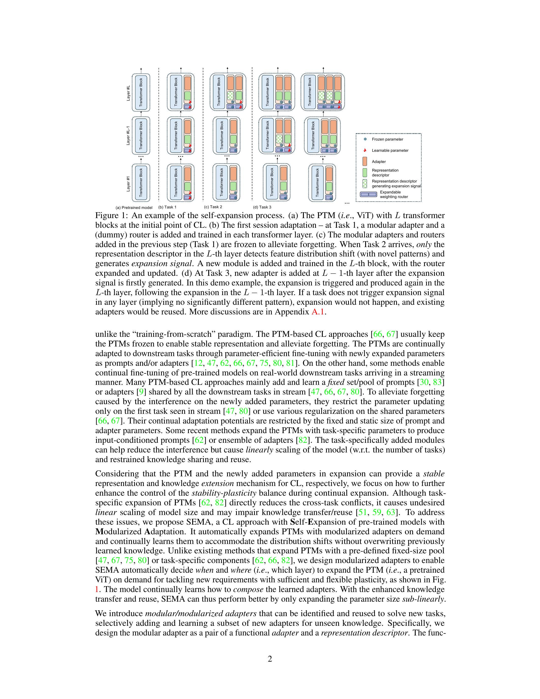
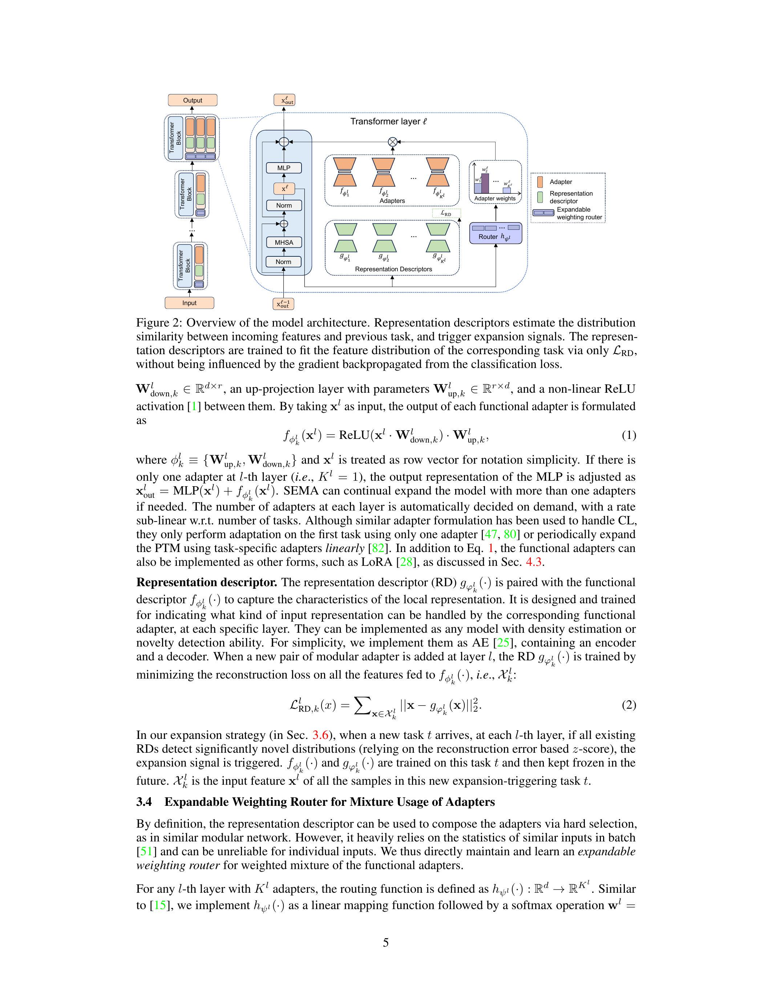
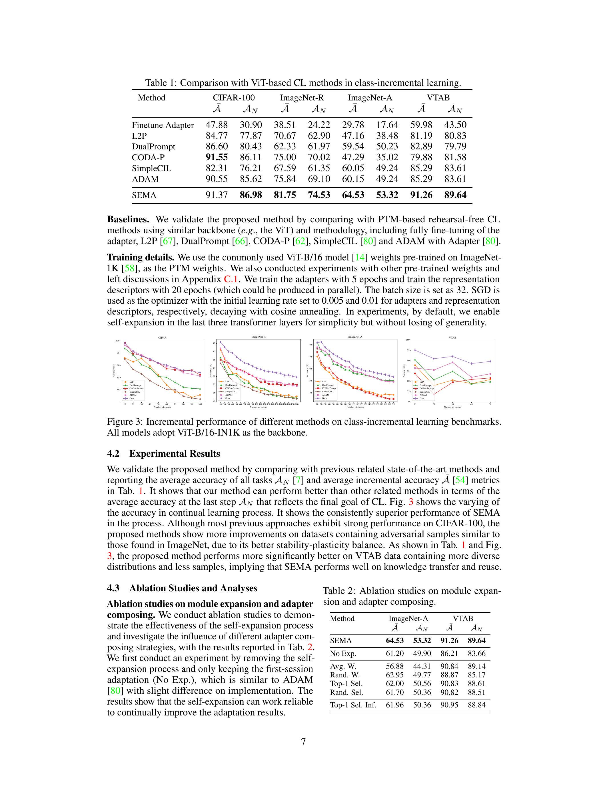
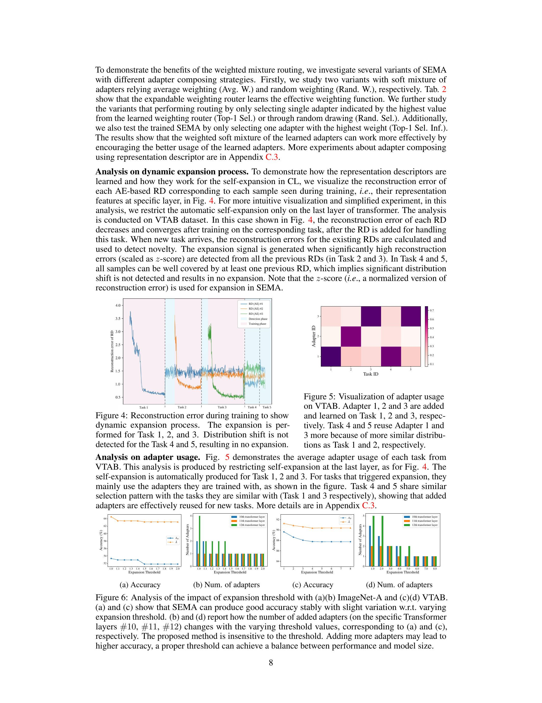
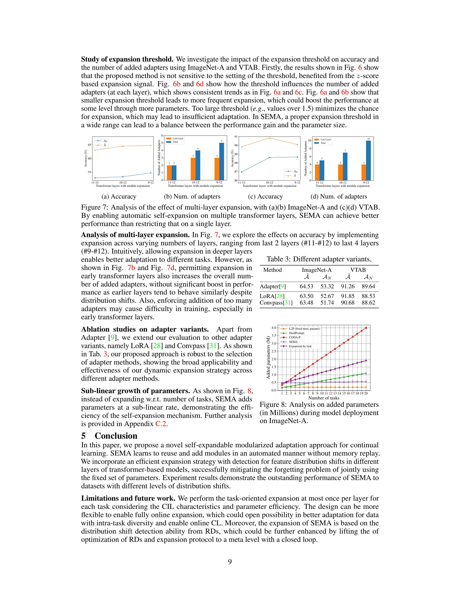
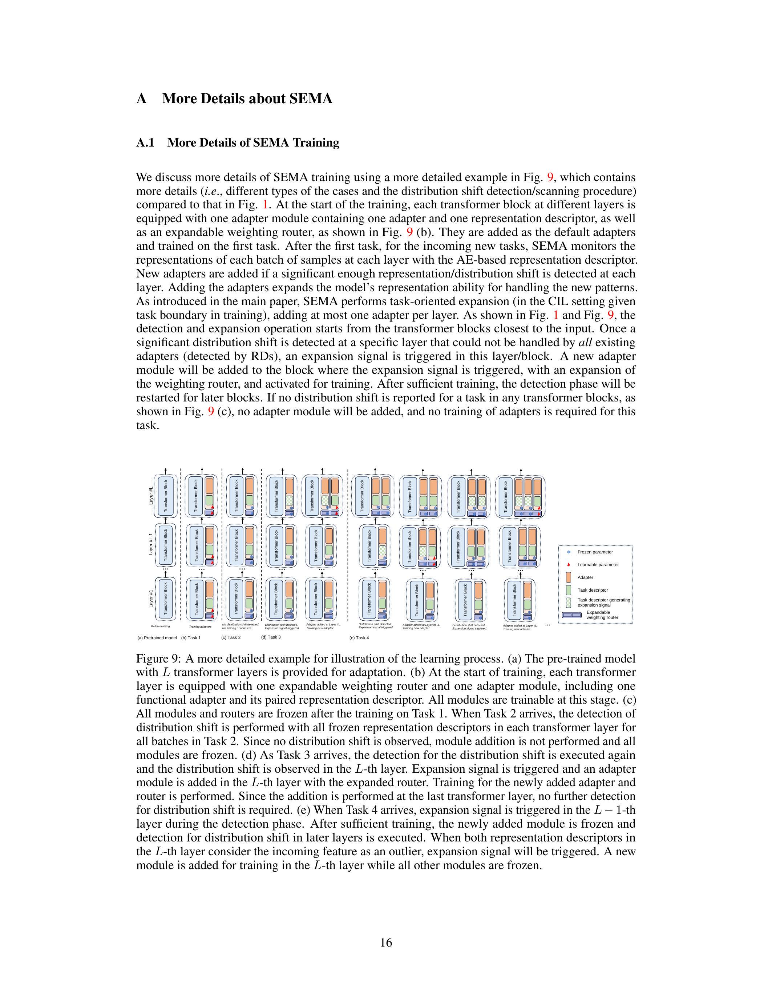
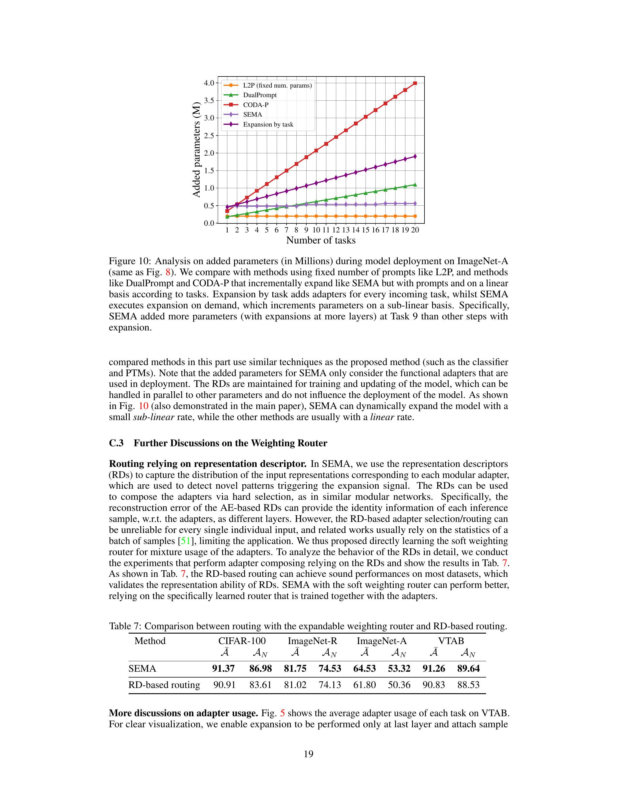
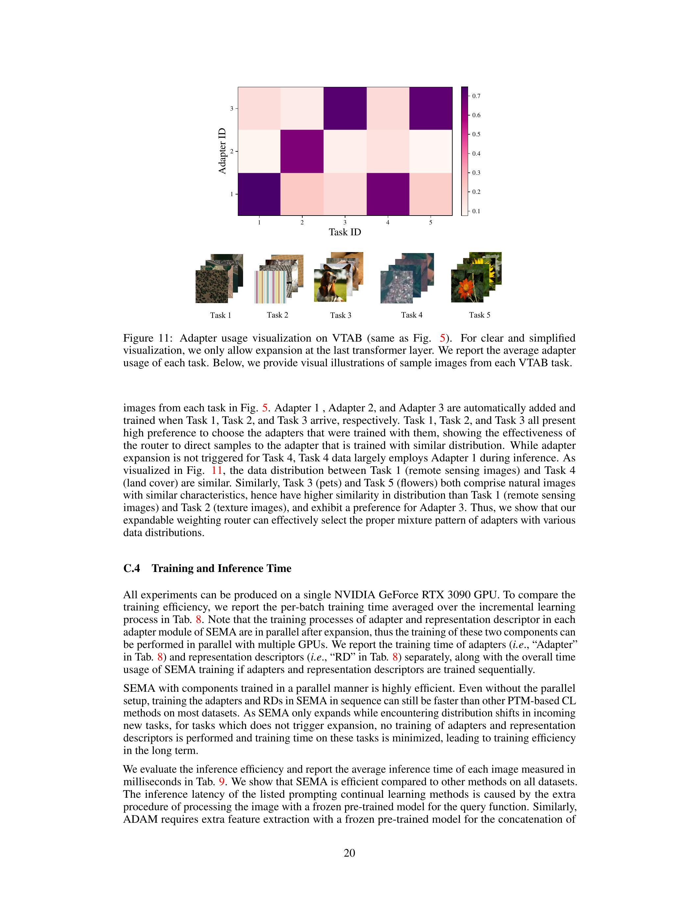
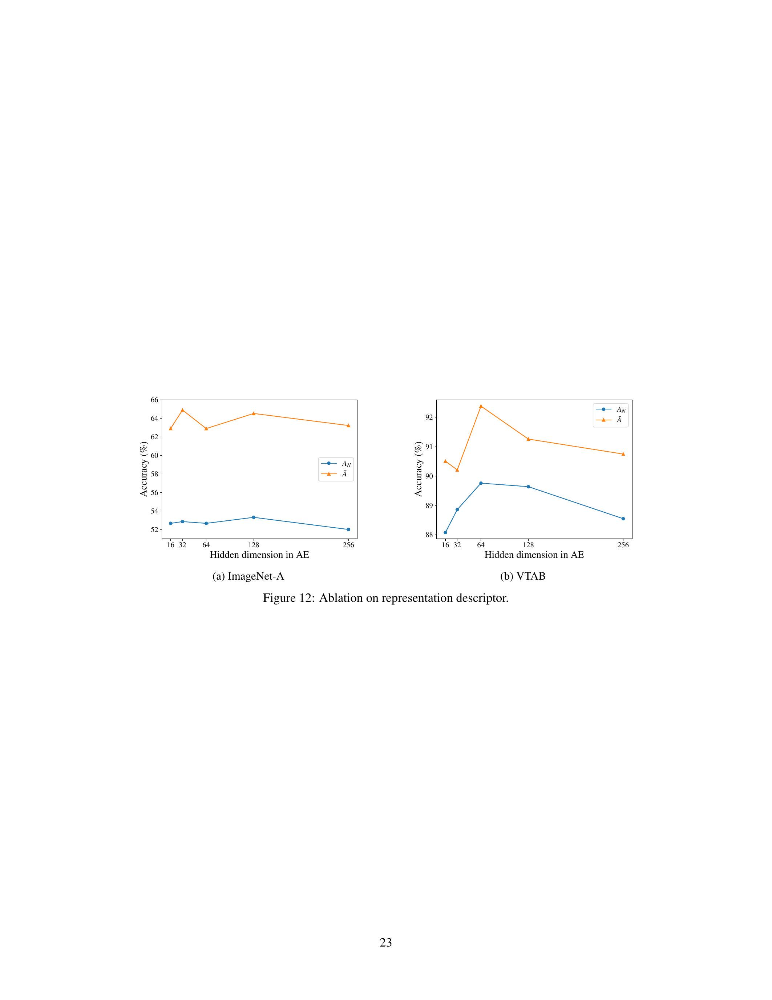

\title{
Self-Expansion of Pre-trained Models with Mixture of Adapters for Continual Learning
}

\author{
Huiyi Wang ${ }^{1}$, Haodong Lu ${ }^{1}$, Lina Yao ${ }^{2}$, Dong Gong ${ }^{1 *}$ \\ ${ }^{1}$ University of New South Wales, ${ }^{2}$ CSIRO's Data61 \\ \{huiyi.wang, haodong.lu, dong.gong\}@unsw.edu.au; lina.yao@data61.csiro.au
}

\begin{abstract}
Continual learning (CL) aims to continually accumulate knowledge from a nonstationary data stream without catastrophic forgetting of learned knowledge, requiring a balance between stability and adaptability. Relying on the generalizable representation in pre-trained models (PTMs), PTM-based CL methods perform effective continual adaptation on downstream tasks by adding learnable adapters or prompts upon the frozen PTMs. However, many existing PTM-based CL methods use restricted adaptation on a fixed set of these modules to avoid forgetting, suffering from limited CL ability. Periodically adding task-specific modules results in linear model growth rate and impaired knowledge reuse. We propose Self-Expansion of pre-trained models with Modularized Adaptation (SEMA), a novel approach to enhance the control of stability-plasticity balance in PTM-based CL. SEMA automatically decides to reuse or add adapter modules on demand in CL, depending on whether significant distribution shift that cannot be handled is detected at different representation levels. We design modular adapter consisting of a functional adapter and a representation descriptor. The representation descriptors are trained as a distribution shift indicator and used to trigger self-expansion signals. For better composing the adapters, an expandable weighting router is learned jointly for mixture of adapter outputs. SEMA enables better knowledge reuse and sub-linear expansion rate. Extensive experiments demonstrate the effectiveness of the proposed self-expansion method, achieving state-of-the-art performance compared to PTM-based CL methods without memory rehearsal.
\end{abstract}

\section*{1 Introduction}

With the development of deep neural networks, deep learning models have achieved significant success in various fields, such as computer vision [14, 22]. However, real-world scenarios often present learning tasks in dynamic data stream with non-stationary distributions [46]. Considering the need for efficient model updating and restricted budget on storage and computation [32], it is not guaranteed to store all the historical data and repeatedly re-train the model. Continual learning (CL) is investigated to learn incrementally and accumulate knowledge efficiently from the non-stationary data stream without catastrophic forgetting [43, 50] of previously learned knowledge [13, 54, 59, 64]. It requires CL approaches to achieve a balance between knowledge expansion (i.e., plasticity) and knowledge retention (i.e., stability) [20, 51, 64]. Many CL approaches have been studied to tackle the challenge relying on different strategies, such as experience replay (ER) $[7,8,70]$, regularization on parameters or representations [6,36,70], and architectures with modularization or isolation [51, 60, 63, 68, 71].
Given the progress in the pre-trained models (PTMs) with reliable representation, recent works explore the potential of using PTMs, such as Vision Transformer (ViT) [14], as the initial point of CL,

\footnotetext{
${ }^{*}$ D. Gong is the corresponding author.
}

Figure 1: An example of the self-expansion process. (a) The PTM (i.e., ViT) with $L$ transformer blocks at the initial point of CL. (b) The first session adaptation - at Task 1, a modular adapter and a (dummy) router is added and trained in each transformer layer. (c) The modular adapters and routers added in the previous step (Task 1) are frozen to alleviate forgetting. When Task 2 arrives, only the representation descriptor in the $L$-th layer detects feature distribution shift (with novel patterns) and generates expansion signal. A new module is added and trained in the $L$-th block, with the router expanded and updated. (d) At Task 3, new adapter is added at $L-1$-th layer after the expansion signal is firstly generated. In this demo example, the expansion is triggered and produced again in the $L$-th layer, following the expansion in the $L-1$-th layer. If a task does not trigger expansion signal in any layer (implying no significantly different pattern), expansion would not happen, and existing adapters would be reused. More discussions are in Appendix A.1.
unlike the "training-from-scratch" paradigm. The PTM-based CL approaches [66, 67] usually keep the PTMs frozen to enable stable representation and alleviate forgetting. The PTMs are continually adapted to downstream tasks through parameter-efficient fine-tuning with newly expanded parameters as prompts and/or adapters [12, 47, 62, 66, 67, 75, 80, 81]. On the other hand, some methods enable continual fine-tuning of pre-trained models on real-world downstream tasks arriving in a streaming manner. Many PTM-based CL approaches mainly add and learn a fixed set/pool of prompts [30, 83] or adapters [9] shared by all the downstream tasks in stream [47, 66, 67, 80]. To alleviate forgetting caused by the interference on the newly added parameters, they restrict the parameter updating only on the first task seen in stream [47, 80] or use various regularization on the shared parameters $[66,67]$. Their continual adaptation potentials are restricted by the fixed and static size of prompt and adapter parameters. Some recent methods expand the PTMs with task-specific parameters to produce input-conditioned prompts [62] or ensemble of adapters [82]. The task-specifically added modules can help reduce the interference but cause linearly scaling of the model (w.r.t. the number of tasks) and restrained knowledge sharing and reuse.

Considering that the PTM and the newly added parameters in expansion can provide a stable representation and knowledge extension mechanism for CL, respectively, we focus on how to further enhance the control of the stability-plasticity balance during continual expansion. Although taskspecific expansion of PTMs [62, 82] directly reduces the cross-task conflicts, it causes undesired linear scaling of model size and may impair knowledge transfer/reuse [51, 59, 63]. To address these issues, we propose SEMA, a CL approach with Self-Expansion of pre-trained models with Modularized Adaptation. It automatically expands PTMs with modularized adapters on demand and continually learns them to accommodate the distribution shifts without overwriting previously learned knowledge. Unlike existing methods that expand PTMs with a pre-defined fixed-size pool [47, 67, 75, 80] or task-specific components [62, 66, 82], we design modularized adapters to enable SEMA automatically decide when and where (i.e., which layer) to expand the PTM (i.e., a pretrained ViT) on demand for tackling new requirements with sufficient and flexible plasticity, as shown in Fig. 1. The model continually learns how to compose the learned adapters. With the enhanced knowledge transfer and reuse, SEMA can thus perform better by only expanding the parameter size sub-linearly.
We introduce modular/modularized adapters that can be identified and reused to solve new tasks, selectively adding and learning a subset of new adapters for unseen knowledge. Specifically, we design the modular adapter as a pair of a functional adapter and a representation descriptor. The func-
tional adapters produce specific feature representations for adapting the different requirements from different tasks. The representation descriptors are jointly trained to capture the feature distribution relevant to the coupled adapter at the corresponding layers, serving as indicators of distribution shift at the representation level of intermediate layers. SEMA can use the representation descriptors for self-expansion - a new modular adapter is added at a specific layer if and only if all the representation descriptors indicate the input feature as unseen patterns; otherwise, the existing frozen adapters are reused, resulting in sub-linear expansion. They can be implemented as a model with density estimation or novelty detection ability, such as autoencoder (AE) [25] or variational autoencoder (VAE) [35]. The module expansion at each layer can happen flexibly to supplement existing representation space, leading to sufficient plasticity. The on-demand expansion strategy strengthens the knowledge transfer and reuse, compared to the task-specific expansion [62, 82]. For example, cat images and dog images have more shared features than car images; the SEMA model only trained on cat images tends to expand more new adapters when training on car images than dog images. To effectively compose the adapters, we design an expandable weighting router to produce layer-wise weighted mixture of the adapters, which are expanded and learned in the self-expansion process. Despite the representation descriptors may be used for adapter assignment by hard selection, we found the directly learned soft mixture router can perform more reliably, as discussed in Appendix C.3.
We summarize our contribution as follows:
- We propose a novel continual learning approach via self-expansion of PTMs with modularized adapters, i.e. SEMA. In CL, it automatically determines the expansion necessity and the location for new adapters, where the new adapters are added at specific layers to accommodate the new patterns in samples. The model enhances the control of stability-plasticity trade-off through adapter reuse and flexible expansion performed only on demand. SEMA enables sub-linear expansion and operates without the need for rehearsal.
- To achieve SEMA, we introduce modular adapters comprising a functional adapter and a representation descriptor. The representation descriptor maintains the distribution of pertinent input features, serving as a local novel pattern detector for expansion during training. The expandable weighting router is maintained simultaneously for composing the adapters via weighted mixture.
- Extensive experiments are conducted to validate the effectiveness and analyze the behaviour of the proposed method, which demonstrates the model's ability on alleviating forgetting and knowledge transfer as well as the plausibility of the automated process.

\section*{2 Related Work}

Continual Learning (CL). The mainstream taxonomy classifies continual learning methods into three categories: replay-based methods, regularization-based methods and architecture-based methods [13, 64]. Replay-based methods aim to alleviate catastrophic forgetting by retaining a memory buffer to store the information from old tasks for future replay [6, 8, 44, 54]. With simple intuition and effectiveness in preventing forgetting, these methods are limited by the size of the memory buffer and may also raise privacy concerns. An alternative approach is to implicitly maintaining a generative model for producing pseudo-samples with similar distribution to old classes $[10,34,55$, 56, 61]. Regularization-based methods penalize significant changes to important parameters for seen tasks [2, 4, 36, 49, 76, 77], or consolidate the knowledge learnt from previous tasks with knowledge distillation [26, 38, 43, 79]. Instead of using all available parameters for all tasks, architecture-based methods allocate a subset of parameters dedicated to each task, which can be performed with task masking [33, 45, 60, 68] or dynamic architecture [3, 29, 40, 41, 51, 63, 71, 72, 73, 74]. These methods tend to achieve optimal performance with less forgetting as isolating parameters and growing capacity for novel tasks reduce task interference during training, however, they are mostly restricted to simple applications due to the complex model designing.

Parameter-Efficient Fine-Tuning (PEFT). Parameter-efficient fine-tuning methods train a small set of additional parameters rather than the entire pre-trained model, which reduce the demands placed upon computational resources. Prompting applies learnable prompts that modifies the inputs to provide the model with more instructions [30, 42]. LoRA [28] injects low-rank matrices to approximate weight updates and avoids additional inference latency via re-parameterization, which has been further utilized as experts with mixture modeling in recent works [15, 19, 65, 69]. Adapters introduced by [27], along with its variants [9, 31], insert lightweight learnable modules into the transformer. To enhance the efficacy of adapter learning, [21] investigates different insertion forms, and $[11,53,57]$ explores the potential of adapter compositions.

PTM-based CL. Recent works adopt ViT as the backbone in the continual learning system to exploit its robust representational ability. Without any tuning, ViT can serve as a feature extractor for prototypes, which can be used for classification with distance measurement [48, 52, 80]. PEFT techniques are also widely used to adapt ViT to CL tasks, including adaptation and prompting. L2P [67], which first applies visual prompt tuning [30] in CL, and DualPrompt [66] uses a pool of prompts and learn the distribution of new tasks with incremental tuning. The prompt learning process is further improved by [62] with an attention mechanism and input-conditioned weights. Similar to prompting in CL, some works also explore the use of a fixed set of adapters [12, 16] or task-oriented expansion [82] for better transfer of ViT to downstream CL tasks. Furthermore, [18] builds a unified framework which allows incorporation of both prompting and adapter-based methods.

\section*{3 Methodology}

\subsection*{3.1 Problem Definition}

Continual learning constructs a scenario where the model is required to learn from sequentially arriving tasks [13]. Consider a sequence of $T$ tasks $\left(\mathcal{D}^{1}, \mathcal{D}^{2}, \ldots, \mathcal{D}^{T}\right)$ with distribution shift, where $\mathcal{D}^{t}=\left\{\left(x_{i}^{t}, y_{i}^{t}\right)\right\}_{i=1}^{n_{t}}$ is the dataset containing $n_{t}$ data samples for $t$-th task. Only the training samples from $\mathcal{D}^{t}$ are accessible while seeing the $t$-th task [67], if without additional ER process [8]. In a typical class-incremental learning (CIL) scenario [13], the classes in different tasks are non-overlapping, specifically, with the label space of $t$-th task denoted by $Y_{t}, Y_{t} \cap Y_{t^{\prime}}=\emptyset$ for $t \neq t^{\prime}$. Let $F_{\theta}: X \rightarrow Y$ (with $X$ and $Y$ denoting the domain of input and label) be a model parameterized with $\theta$. The goal of CL is to learn one model $F_{\theta}$ that can minimize the objective on each task $t$ in the stream: $\mathbb{E}_{(x, y) \in D^{t}} \mathcal{L}_{\mathrm{CE}}\left(F_{\theta}(x), y\right)$, where $\mathcal{L}_{\mathrm{CE}}(\cdot, \cdot)$ denotes the cross entropy loss in CIL.

\subsection*{3.2 Overview}

We propose a PTM-based CL approach (i.e., SEMA) with a self-expansion mechanism to automatically add modularized adapters at arbitrary layers of the PTM (i.e., a pretrained ViT with frozen parameters) on demand for handling automatically detected novel patterns in CL task stream, as shown in Fig. 1 and 2. The proposed method simultaneously learn a weighted mixture router for composing the adapters for different inputs. The design enhances the balance of knowledge transfer/reuse and plasticity for handling novelty, through only sub-linear expansion rate [5, 51].
To achieve the modularized design of SEMA, we introduce the modular adapters containing a pair of functional adapter $f_{\phi}(\cdot)$ and representation descriptor $g_{\varphi}(\cdot)$, as defined in Sec. 3.3. Each added functional adapter works as a branch of a specific layer of the pretrained transformer; and the representation descriptor indicates the feature distribution that can be handled by the paired $f_{\phi}(\cdot)$. In CL, when new tasks arriving, $g_{\varphi}(\cdot)$ 's of the already-added adapters are used to detect novel feature patterns layer-by-layer. Only when the novel pattern (i.e., representation-level distribution shift) are detected, new adapters, i.e., pairs of $\left(f_{\phi}(\cdot), g_{\varphi}(\cdot)\right)$, are added and trained. After trained sufficiently, the adapters are kept frozen for alleviating forgetting, which can be reused in future tasks. The details of the self-expansion strategy are in Sec. 3.6. At each layer of the PTM, an expandable weighting router is continually maintained and updated for composing the adapters via weighted mixture, as introduced in Sec. 3.4. When no adapters added, the existing frozen adapters are retrieved and reused.

\subsection*{3.3 Modular Adapter with Representation Awareness}

The modular adapter $\left(f_{\phi}(\cdot), g_{\varphi}(\cdot)\right)$ is designed as a pair of functional adapter $f_{\phi}(\cdot)$ and a representation descriptor $g_{\varphi}(\cdot)$, which enables the module to be aware of the distribution of the local representation. One or multiple adapters can be added at arbitrary blocks/layers of the transformer.
Functional adapter. In a (pre-trained) vision transformer (ViT), there are $L$ layers of transformer blocks, where each of them mainly contains a multi-head self-attention (MHSA) module and a multi-layer perceptron (MLP) module [14], as shown in Fig. 2. We keep all the parameters in the ViT frozen and perform adaptation through the learnable parameters in the continually added adapters. As a commonly used solution [9, 80], the functional adapter with learnable parameters are added as a side branch of the MLP in any layer of ViT.
Let $x^{l} \in \mathbb{R}^{d}$ denote the feature input of the MLP at $l$-th layer/block of ViT. In the proposed method, there can be different number (i.e., $K^{l}$ ) of adapters added at each layer through the self-expansion process. The $k$-th functional adapter at $l$-th layer is denoted as $f_{\phi_{k}^{l}}(\cdot)$. Each $f_{\phi_{k}^{l}}(\cdot)$ takes $\mathbf{x}^{l}$ as input to close the representation gap between the pre-trained model and the downstream tasks. By default, we implement $f_{\phi_{k}^{l}}(\cdot)$ as a lightweight adapter [9] containing a down-projection layer with parameters

Figure 2: Overview of the model architecture. Representation descriptors estimate the distribution similarity between incoming features and previous task, and trigger expansion signals. The representation descriptors are trained to fit the feature distribution of the corresponding task via only $\mathcal{L}_{\mathrm{RD}}$, without being influenced by the gradient backpropagated from the classification loss.
$\mathbf{W}_{\text {down }, k}^{l} \in \mathbb{R}^{d \times r}$, an up-projection layer with parameters $\mathbf{W}_{\mathrm{up}, k}^{l} \in \mathbb{R}^{r \times d}$, and a non-linear ReLU activation [1] between them. By taking $\mathrm{x}^{l}$ as input, the output of each functional adapter is formulated as
\[
f_{\phi_{k}^{l}}\left(\mathbf{x}^{l}\right)=\operatorname{ReLU}\left(\mathbf{x}^{l} \cdot \mathbf{W}_{\mathrm{down}, k}^{l}\right) \cdot \mathbf{W}_{\mathrm{up}, k}^{l},
\]
where $\phi_{k}^{l} \equiv\left\{\mathbf{W}_{\text {up }, k}^{l}, \mathbf{W}_{\text {down }, k}^{l}\right\}$ and $\mathbf{x}^{l}$ is treated as row vector for notation simplicity. If there is only one adapter at $l$-th layer (i.e., $K^{l}=1$ ), the output representation of the MLP is adjusted as $\mathbf{x}_{\mathrm{out}}^{l}=\operatorname{MLP}\left(\mathbf{x}^{l}\right)+f_{\phi_{k}^{l}}\left(\mathbf{x}^{l}\right)$. SEMA can continual expand the model with more than one adapters if needed. The number of adapters at each layer is automatically decided on demand, with a rate sub-linear w.r.t. number of tasks. Although similar adapter formulation has been used to handle CL, they only perform adaptation on the first task using only one adapter [47, 80] or periodically expand the PTM using task-specific adapters linearly [82]. In addition to Eq. 1, the functional adapters can also be implemented as other forms, such as LoRA [28], as discussed in Sec. 4.3.
Representation descriptor. The representation descriptor $(\mathrm{RD}) g_{\varphi_{k}^{l}}(\cdot)$ is paired with the functional descriptor $f_{\phi_{k}^{l}}(\cdot)$ to capture the characteristics of the local representation. It is designed and trained for indicating what kind of input representation can be handled by the corresponding functional adapter, at each specific layer. They can be implemented as any model with density estimation or novelty detection ability. For simplicity, we implement them as AE [25], containing an encoder and a decoder. When a new pair of modular adapter is added at layer $l$, the $\mathrm{RD} g_{\varphi_{l}^{l}}(\cdot)$ is trained by minimizing the reconstruction loss on all the features fed to $f_{\phi_{k}^{l}}(\cdot)$, i.e., $\mathcal{X}_{k}^{l}$ :
\[
\mathcal{L}_{\mathrm{RD}, k}^{l}(x)=\sum_{\mathbf{x} \in \mathcal{X}_{k}^{l}}\left\|\mathbf{x}-g_{\varphi_{k}^{l}}(\mathbf{x})\right\|_{2}^{2}
\]

In our expansion strategy (in Sec. 3.6), when a new task $t$ arrives, at each $l$-th layer, if all existing RDs detect significantly novel distributions (relying on the reconstruction error based $z$-score), the expansion signal is triggered. $f_{\phi_{k}^{l}}(\cdot)$ and $g_{\varphi_{k}^{l}}(\cdot)$ are trained on this task $t$ and then kept frozen in the future. $\mathcal{X}_{k}^{l}$ is the input feature $\mathbf{x}^{l}$ of all the samples in this new expansion-triggering task $t$.

\subsection*{3.4 Expandable Weighting Router for Mixture Usage of Adapters}

By definition, the representation descriptor can be used to compose the adapters via hard selection, as in similar modular network. However, it heavily relies on the statistics of similar inputs in batch [51] and can be unreliable for individual inputs. We thus directly maintain and learn an expandable weighting router for weighted mixture of the functional adapters.
For any $l$-th layer with $K^{l}$ adapters, the routing function is defined as $h_{\psi^{l}}(\cdot): \mathbb{R}^{d} \rightarrow \mathbb{R}^{K^{l}}$. Similar to [15], we implement $h_{\psi^{l}}(\cdot)$ as a linear mapping function followed by a softmax operation $\mathbf{w}^{l}=$
$h_{\psi^{l}}\left(\mathbf{x}^{l}\right) \equiv \operatorname{softmax}\left(\mathbf{x}^{l} \cdot \mathbf{W}_{\text {mix }}^{l}\right)$, where $\mathbf{W}_{\text {mix }}^{l} \in \mathbb{R}^{d \times K^{l}}$ is the parameter $\psi^{l}$. As shown in Fig. 2, the weights $\mathbf{w}^{l} \in \mathbb{R}^{K^{l}}$ can produce the mixture of the added functional adapters to produce the output representation of the MLP in transformer:
\[
\mathbf{x}_{\mathrm{out}}^{l}=\operatorname{MLP}\left(\mathbf{x}^{l}\right)+\sum_{k=1}^{K^{l}} w_{k}^{l} \cdot f_{\phi_{k}^{l}}\left(\mathbf{x}^{l}\right)
\]

When new adapter is added at any layer $l$, the router $h_{\psi^{l}}(\cdot)$, i.e., $\mathbf{W}_{\text {mix }}^{l}$, is expanded for producing weights with one more dimension. The expanded router is trained together with the added adapters. To prevent forgetting on routing, we freeze the parameters corresponding to the previous adapters and only train the newly added parameters (i.e., newly added column in $\mathbf{W}_{\text {mix }}^{l}$ ).

\subsection*{3.5 Continual Learning Objective of SEMA}

In SEMA, the model $F_{\theta}(\cdot)$ for solving the tasks consists of learnable parameters from the functional adapters and router with learnable parameters, i.e., $\left\{\phi_{k}^{l}\right\}$ and $\left\{\psi^{l}\right\}$. The learnable parameters are dynamically added and learned. The representation descriptors are learned jointly for maintaining a state of the local representation. The overall objective in SEMA optimizes all these parameters:
\[
\min _{\left\{\phi_{k}^{l}\right\},\left\{\psi^{l}\right\},\left\{\varphi_{k}^{l}\right\}} \sum_{t=1}^{T} \mathbb{E}_{(x, y) \in D^{t}}\left[\mathcal{L}_{\mathrm{CE}}\left(F_{\left\{\phi_{k}^{l}\right\},\left\{\psi^{l}\right\}}(x), y\right)+\sum_{l=1}^{L} \sum_{k=1}^{K^{l}} \mathcal{L}_{\mathrm{RD}, k}^{l}\left(x ; \varphi_{k}^{l}\right)\right] .
\]

Learning of modular adapter is executed only when new modules are added. The learned modules are kept frozen to prevent forgetting. Optimization of RDs can be parallel to other parameters. If no module added in a specific task due to no significant pattern identified by RDs, the existing modules can be reused without training.

\subsection*{3.6 Self-Expansion Strategy}

The representation descriptors provide the capacity to decide when and where to expand the model. We designed more specific strategy to achieve the reliable self-expansion in the CL task stream.
Task-oriented expansion. The expansion may happen at any time when any new sample is seen during training. To incoorperate the task identification prior knowledge in CL, especially CIL, we improve parameter efficiency and expansion stability with task-oriented expansion. We restrict that at most one adapter per layer can be added for each task. When a new task $t$ arrives, the method scans all samples in the first epoch to decide whether expanding model. If expansion signal is triggered, only one adapter is added and then trained for the whole task; otherwise, task $t$ data can reuse learned modules and the learning process moves to the next task.
$z$-score based expansion signal. When scanning through the new task data, expansion signal at a layer $l$ is triggered when significantly new patterns are identified. It is reflected that a $x^{l}$ is out of scope of all RDs, i.e., reconstruction error is high with each $g_{\varphi_{k}^{l}}(\mathbf{x})$, as illustrated in Fig. 4. However, it is impractical to directly use reconstruction error, due to the perturbation and heterogeneous characteristics of each task and adapter. We thus compute and maintain the running statistics $\mu_{k}^{l}$ and standard deviation $\sigma_{k}^{l}$ of reconstruction error on all relevant inputs used in training. Given any $x^{l}$ in the scanning process in future task, the $z$-score corresponding to each existing RD can be calculated as $z_{k}^{l}=\left(r_{k}^{l}-\mu_{k}^{l}\right) / \sigma_{k}^{l}$ with $r_{k}^{l}$ as reconstruction error. If all $z_{k}^{l}$ 's for $k=1, \ldots, K^{l}$ are larger than a threshold, the expansion signal is triggered. Considering that the $z$-score has normalized out the perturbation and scale, the process can be very robust to the threshold setting, as shown in Sec. 4.3.
Multi-layer expansion. We facilitate self-expansion across multiple layers through distinct decision processes. Upon encountering a new task, self-expansion operations is executed sequentially from shallow layers to deeper layers. As new adapters are introduced at a shallow level, training ensures to align the representation accordingly. Subsequently, the model determines whether to continue expanding into subsequent layers. The adaptable multi-layer expansion facilitates the accommodation of various distribution shifts and enables flexible inter-class knowledge sharing [17, 39].

\section*{4 Experiments}

\subsection*{4.1 Setting and Implementation Details}

Datasets. The experiments are conducted on common datasets used for pre-trained ViT based CIL, including CIFAR-100 [37], ImageNet-R [23], ImageNet-A [24] and VTAB [78].

Table 1: Comparison with ViT-based CL methods in class-incremental learning.
\begin{tabular}{lcccccccc}
\hline \multirow{2}{*}{ Method } & \multicolumn{2}{c}{ CIFAR-100 } & \multicolumn{2}{c}{ ImageNet-R } & \multicolumn{2}{c}{ ImageNet-A } & \multicolumn{2}{c}{ VTAB } \\
& $\overline{\mathcal{A}}$ & $\mathcal{A}_{N}$ & $\overline{\mathcal{A}}$ & $\mathcal{A}_{N}$ & $\overline{\mathcal{A}}$ & $\mathcal{A}_{N}$ & $\overline{\mathcal{A}}$ & $\mathcal{A}_{N}$ \\
\hline Finetune Adapter & 47.88 & 30.90 & 38.51 & 24.22 & 29.78 & 17.64 & 59.98 & 43.50 \\
L2P & 84.77 & 77.87 & 70.67 & 62.90 & 47.16 & 38.48 & 81.19 & 80.83 \\
DualPrompt & 86.60 & 80.43 & 62.33 & 61.97 & 59.54 & 50.23 & 82.89 & 79.79 \\
CODA-P & $\mathbf{9 1 . 5 5}$ & 86.11 & 75.00 & 70.02 & 47.29 & 35.02 & 79.88 & 81.58 \\
SimpleCIL & 82.31 & 76.21 & 67.59 & 61.35 & 60.05 & 49.24 & 85.29 & 83.61 \\
ADAM & 90.55 & 85.62 & 75.84 & 69.10 & 60.15 & 49.24 & 85.29 & 83.61 \\
\hline SEMA & 91.37 & $\mathbf{8 6 . 9 8}$ & $\mathbf{8 1 . 7 5}$ & $\mathbf{7 4 . 5 3}$ & $\mathbf{6 4 . 5 3}$ & $\mathbf{5 3 . 3 2}$ & $\mathbf{9 1 . 2 6}$ & $\mathbf{8 9 . 6 4}$ \\
\hline
\end{tabular}

Baselines. We validate the proposed method by comparing with PTM-based rehearsal-free CL methods using similar backbone (e.g., the ViT) and methodology, including fully fine-tuning of the adapter, L2P [67], DualPrompt [66], CODA-P [62], SimpleCIL [80] and ADAM with Adapter [80].

Training details. We use the commonly used ViT-B/16 model [14] weights pre-trained on ImageNet1 K [58], as the PTM weights. We also conducted experiments with other pre-trained weights and left discussions in Appendix C.1. We train the adapters with 5 epochs and train the representation descriptors with 20 epochs (which could be produced in parallel). The batch size is set as 32 . SGD is used as the optimizer with the initial learning rate set to 0.005 and 0.01 for adapters and representation descriptors, respectively, decaying with cosine annealing. In experiments, by default, we enable self-expansion in the last three transformer layers for simplicity but without losing of generality.

Figure 3: Incremental performance of different methods on class-incremental learning benchmarks. All models adopt ViT-B/16-IN1K as the backbone.

\subsection*{4.2 Experimental Results}

We validate the proposed method by comparing with previous related state-of-the-art methods and reporting the average accuracy of all tasks $\mathcal{A}_{N}$ [7] and average incremental accuracy $\overline{\mathcal{A}}$ [54] metrics in Tab. 1. It shows that our method can perform better than other related methods in terms of the average accuracy at the last step $\mathcal{A}_{N}$ that reflects the final goal of CL. Fig. 3 shows the varying of the accuracy in continual learning process. It shows the consistently superior performance of SEMA in the process. Although most previous approaches exhibit strong performance on CIFAR-100, the proposed methods show more improvements on datasets containing adversarial samples similar to those found in ImageNet, due to its better stability-plasticity balance. As shown in Tab. 1 and Fig. 3, the proposed method performs more significantly better on VTAB data containing more diverse distributions and less samples, implying that SEMA performs well on knowledge transfer and reuse.

\subsection*{4.3 Ablation Studies and Analyses}

Ablation studies on module expansion and adapter composing. We conduct ablation studies to demonstrate the effectiveness of the self-expansion process and investigate the influence of different adapter composing strategies, with the results reported in Tab. 2. We first conduct an experiment by removing the selfexpansion process and only keeping the first-session adaptation (No Exp.), which is similar to ADAM [80] with slight difference on implementation. The results show that the self-expansion can work reliable to continually improve the adaptation results.

Table 2: Ablation studies on module expansion and adapter composing.
\begin{tabular}{lcccc}
\hline Method & \multicolumn{2}{c}{ ImageNet-A } & \multicolumn{2}{c}{VTAB} \\
& $\overline{\mathcal{A}}$ & $\mathcal{A}_{N}$ & $\overline{\mathcal{A}}$ & $\mathcal{A}_{N}$ \\
\hline SEMA & $\mathbf{6 4 . 5 3}$ & $\mathbf{5 3 . 3 2}$ & $\mathbf{9 1 . 2 6}$ & $\mathbf{8 9 . 6 4}$ \\
\hline No Exp. & 61.20 & 49.90 & 86.21 & 83.66 \\
\hline Avg. W. & 56.88 & 44.31 & 90.84 & 89.14 \\
Rand. W. & 62.95 & 49.77 & 88.87 & 85.17 \\
Top-1 Sel. & 62.00 & 50.56 & 90.83 & 88.61 \\
Rand. Sel. & 61.70 & 50.36 & 90.82 & 88.51 \\
\hline Top-1 Sel. Inf. & 61.96 & 50.36 & 90.95 & 88.84 \\
\hline
\end{tabular}

To demonstrate the benefits of the weighted mixture routing, we investigate several variants of SEMA with different adapter composing strategies. Firstly, we study two variants with soft mixture of adapters relying average weighting (Avg. W.) and random weighting (Rand. W.), respectively. Tab. 2 show that the expandable weighting router learns the effective weighting function. We further study the variants that performing routing by only selecting single adapter indicated by the highest value from the learned weighting router (Top-1 Sel.) or through random drawing (Rand. Sel.). Additionally, we also test the trained SEMA by only selecting one adapter with the highest weight (Top-1 Sel. Inf.). The results show that the weighted soft mixture of the learned adapters can work more effectively by encouraging the better usage of the learned adapters. More experiments about adapter composing using representation descriptor are in Appendix C.3.

Analysis on dynamic expansion process. To demonstrate how the representation descriptors are learned and how they work for the self-expansion in CL, we visualize the reconstruction error of each AE-based RD corresponding to each sample seen during training, i.e., their representation features at specific layer, in Fig. 4. For more intuitive visualization and simplified experiment, in this analysis, we restrict the automatic self-expansion only on the last layer of transformer. The analysis is conducted on VTAB dataset. In this case shown in Fig. 4, the reconstruction error of each RD decreases and converges after training on the corresponding task, after the RD is added for handling this task. When new task arrives, the reconstruction errors for the existing RDs are calculated and used to detect novelty. The expansion signal is generated when significantly high reconstruction errors (scaled as $z$-score) are detected from all the previous RDs (in Task 2 and 3). In Task 4 and 5, all samples can be well covered by at least one previous RD, which implies significant distribution shift is not detected and results in no expansion. Note that the $z$-score (i.e., a normalized version of reconstruction error) is used for expansion in SEMA.

Figure 4: Reconstruction error during training to show dynamic expansion process. The expansion is performed for Task 1, 2, and 3. Distribution shift is not detected for the Task 4 and 5, resulting in no expansion.

Figure 5: Visualization of adapter usage on VTAB. Adapter 1, 2 and 3 are added and learned on Task 1, 2 and 3, respectively. Task 4 and 5 reuse Adapter 1 and 3 more because of more similar distributions as Task 1 and 2, respectively.

Analysis on adapter usage. Fig. 5 demonstrates the average adapter usage of each task from VTAB. This analysis is produced by restricting self-expansion at the last layer, as for Fig. 4. The self-expansion is automatically produced for Task 1, 2 and 3. For tasks that triggered expansion, they mainly use the adapters they are trained with, as shown in the figure. Task 4 and 5 share similar selection pattern with the tasks they are similar with (Task 1 and 3 respectively), showing that added adapters are effectively reused for new tasks. More details are in Appendix C.3.

Figure 6: Analysis of the impact of expansion threshold with (a)(b) ImageNet-A and (c)(d) VTAB. (a) and (c) show that SEMA can produce good accuracy stably with slight variation w.r.t. varying expansion threshold. (b) and (d) report how the number of added adapters (on the specific Transformer layers $\# 10, \# 11, \# 12$ ) changes with the varying threshold values, corresponding to (a) and (c), respectively. The proposed method is insensitive to the threshold. Adding more adapters may lead to higher accuracy, a proper threshold can achieve a balance between performance and model size.

Study of expansion threshold. We investigate the impact of the expansion threshold on accuracy and the number of added adapters using ImageNet-A and VTAB. Firstly, the results shown in Fig. 6 show that the proposed method is not sensitive to the setting of the threshold, benefited from the $z$-score based expansion signal. Fig. 6b and 6d show how the threshold influences the number of added adapters (at each layer), which shows consistent trends as in Fig. 6a and 6c. Fig. 6a and 6b show that smaller expansion threshold leads to more frequent expansion, which could boost the performance at some level through more parameters. Too large threshold (e.g., values over 1.5) minimizes the chance for expansion, which may lead to insufficient adaptation. In SEMA, a proper expansion threshold in a wide range can lead to a balance between the performance gain and the parameter size.

Figure 7: Analysis of the effect of multi-layer expansion, with (a)(b) ImageNet-A and (c)(d) VTAB. By enabling automatic self-expansion on multiple transformer layers, SEMA can achieve better performance than restricting that on a single layer.
Analysis of multi-layer expansion. In Fig. 7, we explore the effects on accuracy by implementing expansion across varying numbers of layers, ranging from last 2 layers (\#11-\#12) to last 4 layers (\#9-\#12). Intuitively, allowing expansion in deeper layers enables better adaptation to different tasks. However, as shown in Fig. 7b and Fig. 7d, permitting expansion in early transformer layers also increases the overall number of added adapters, without significant boost in performance as earlier layers tend to behave similarly despite distribution shifts. Also, enforcing addition of too many adapters may cause difficulty in training, especially in early transformer layers.
Ablation studies on adapter variants. Apart from Adapter [9], we extend our evaluation to other adapter variants, namely LoRA [28] and Convpass [31]. As shown in Tab. 3, our proposed approach is robust to the selection of adapter methods, showing the broad applicability and effectiveness of our dynamic expansion strategy across different adapter methods.
Sub-linear growth of parameters. As shown in Fig. 8, instead of expanding w.r.t. number of tasks, SEMA adds parameters at a sub-linear rate, demonstrating the efficiency of the self-expansion mechanism. Further analysis is provided in Appendix C.2.

Table 3: Different adapter variants.
\begin{tabular}{lcccc}
\hline Method & \multicolumn{2}{c}{ ImageNet-A } & \multicolumn{2}{c}{ VTAB } \\
& $\overline{\mathcal{A}}$ & $\mathcal{A}_{N}$ & $\overline{\mathcal{A}}$ & $\mathcal{A}_{N}$ \\
\hline Adapter[9] & 64.53 & 53.32 & 91.26 & 89.64 \\
\hline LoRA[28] & 63.50 & 52.67 & 91.85 & 88.53 \\
Convpass[31] & 63.48 & 51.74 & 90.68 & 88.62 \\
\hline
\end{tabular}

Figure 8: Analysis on added parameters (in Millions) during model deployment on ImageNet-A.

\section*{5 Conclusion}

In this paper, we propose a novel self-expandable modularized adaptation approach for continual learning. SEMA learns to reuse and add modules in an automated manner without memory replay. We incorporate an efficient expansion strategy with detection for feature distribution shifts in different layers of transformer-based models, successfully mitigating the forgetting problem of jointly using the fixed set of parameters. Experiment results demonstrate the outstanding performance of SEMA to datasets with different levels of distribution shifts.

Limitations and future work. We perform the task-oriented expansion at most once per layer for each task considering the CIL characteristics and parameter efficiency. The design can be more flexible to enable fully online expansion, which could open possibility in better adaptation for data with intra-task diversity and enable online CL. Moreover, the expansion of SEMA is based on the distribution shift detection ability from RDs, which could be further enhanced by lifting the of optimization of RDs and expansion protocol to a meta level with a closed loop.

\section*{References}
[1] A. F. Agarap. Deep learning using rectified linear units (relu). arxiv 2018. arXiv preprint arXiv:1803.08375, 1803. 5
[2] H. Ahn, S. Cha, D. Lee, and T. Moon. Uncertainty-based continual learning with adaptive regularization. Advances in neural information processing systems, 32, 2019. 3
[3] R. Aljundi, P. Chakravarty, and T. Tuytelaars. Expert gate: Lifelong learning with a network of experts. In Proceedings of the IEEE conference on computer vision and pattern recognition, pages 3366-3375, 2017. 3
[4] R. Aljundi, F. Babiloni, M. Elhoseiny, M. Rohrbach, and T. Tuytelaars. Memory aware synapses: Learning what (not) to forget. In Proceedings of the European conference on computer vision (ECCV), pages 139-154, 2018. 3
[5] J. Andreas, M. Rohrbach, T. Darrell, and D. Klein. Neural module networks. In Proceedings of the IEEE conference on computer vision and pattern recognition, pages 39-48, 2016. 4
[6] P. Buzzega, M. Boschini, A. Porrello, D. Abati, and S. Calderara. Dark experience for general continual learning: a strong, simple baseline. Advances in neural information processing systems, 33:15920-15930, 2020. 1, 3
[7] A. Chaudhry, M. Ranzato, M. Rohrbach, and M. Elhoseiny. Efficient lifelong learning with A-GEM. In 7th International Conference on Learning Representations, ICLR 2019, New Orleans, LA, USA, May 6-9, 2019. OpenReview.net, 2019. URL https: / / openreview. net/ forum?id=Hkf2_sC5FX. 1,7
[8] A. Chaudhry, M. Rohrbach, M. Elhoseiny, T. Ajanthan, P. K. Dokania, P. H. Torr, and M. Ranzato. On tiny episodic memories in continual learning. arXiv preprint arXiv:1902.10486, 2019. 1, 3, 4
[9] S. Chen, C. Ge, Z. Tong, J. Wang, Y. Song, J. Wang, and P. Luo. Adaptformer: Adapting vision transformers for scalable visual recognition. Advances in Neural Information Processing Systems, 35:16664-16678, 2022. 2, 3, 4, 9
[10] W. Chenshen, L. Herranz, L. Xialei, et al. Memory replay gans: Learning to generate images from new categories without forgetting [c]. In The 32nd International Conference on Neural Information Processing Systems, Montréal, Canada, pages 5966-5976, 2018. 3
[11] A. Chronopoulou, M. E. Peters, A. Fraser, and J. Dodge. Adaptersoup: Weight averaging to improve generalization of pretrained language models. In A. Vlachos and I. Augenstein, editors, Findings of the Association for Computational Linguistics: EACL 2023, Dubrovnik, Croatia, May 2-6, 2023, pages 2009-2018. Association for Computational Linguistics, 2023. doi: 10.18653/V1/2023.FINDINGS-EACL.153. URL https://doi.org/10.18653/v1/ 2023.findings-eacl.153. 3
[12] Y. Cui, Z. Yu, R. Cai, X. Wang, A. C. Kot, and L. Liu. Generalized few-shot continual learning with contrastive mixture of adapters. arXiv preprint arXiv:2302.05936, 2023. 2, 4
[13] M. De Lange, R. Aljundi, M. Masana, S. Parisot, X. Jia, A. Leonardis, G. Slabaugh, and T. Tuytelaars. A continual learning survey: Defying forgetting in classification tasks. IEEE transactions on pattern analysis and machine intelligence, 44(7):3366-3385, 2021. 1, 3, 4
[14] A. Dosovitskiy, L. Beyer, A. Kolesnikov, D. Weissenborn, X. Zhai, T. Unterthiner, M. Dehghani, M. Minderer, G. Heigold, S. Gelly, J. Uszkoreit, and N. Houlsby. An image is worth 16x16 words: Transformers for image recognition at scale. In 9th International Conference on Learning Representations, ICLR 2021, Virtual Event, Austria, May 3-7, 2021. OpenReview.net, 2021. URL https://openreview.net/forum?id=YicbFdNTTy. 1, 4, 7
[15] S. Dou, E. Zhou, Y. Liu, S. Gao, J. Zhao, W. Shen, Y. Zhou, Z. Xi, X. Wang, X. Fan, et al. Loramoe: Revolutionizing mixture of experts for maintaining world knowledge in language model alignment. arXiv preprint arXiv:2312.09979, 2023. 3, 5
[16] B. Ermis, G. Zappella, M. Wistuba, A. Rawal, and C. Archambeau. Memory efficient continual learning with transformers. Advances in Neural Information Processing Systems, 35:1062910642, 2022. 4
[17] C. Gao, K. Chen, J. Rao, B. Sun, R. Liu, D. Peng, Y. Zhang, X. Guo, J. Yang, and V. Subrahmanian. Higher layers need more lora experts, 2024. 6
[18] Q. Gao, C. Zhao, Y. Sun, T. Xi, G. Zhang, B. Ghanem, and J. Zhang. A unified continual learning framework with general parameter-efficient tuning. arXiv preprint arXiv:2303.10070, 2023. 4
[19] Y. Gou, Z. Liu, K. Chen, L. Hong, H. Xu, A. Li, D.-Y. Yeung, J. T. Kwok, and Y. Zhang. Mixture of cluster-conditional lora experts for vision-language instruction tuning. arXiv preprint arXiv:2312.12379, 2023. 3
[20] R. Hadsell, D. Rao, A. A. Rusu, and R. Pascanu. Embracing change: Continual learning in deep neural networks. Trends in cognitive sciences, 24(12):1028-1040, 2020. 1
[21] J. He, C. Zhou, X. Ma, T. Berg-Kirkpatrick, and G. Neubig. Towards a unified view of parameter-efficient transfer learning. In The Tenth International Conference on Learning Representations, ICLR 2022, Virtual Event, April 25-29, 2022. OpenReview.net, 2022. URL https://openreview.net/forum?id=0RDcd5Axok. 3
[22] K. He, X. Zhang, S. Ren, and J. Sun. Deep residual learning for image recognition. In Proceedings of the IEEE conference on computer vision and pattern recognition, pages 770778, 2016. 1
[23] D. Hendrycks, S. Basart, N. Mu, S. Kadavath, F. Wang, E. Dorundo, R. Desai, T. Zhu, S. Parajuli, M. Guo, et al. The many faces of robustness: A critical analysis of out-of-distribution generalization. In ICCV, pages $8340-8349,2021.6$
[24] D. Hendrycks, K. Zhao, S. Basart, J. Steinhardt, and D. Song. Natural adversarial examples. In Proceedings of the IEEE/CVF Conference on Computer Vision and Pattern Recognition, pages 15262-15271, 2021. 6
[25] G. E. Hinton and R. R. Salakhutdinov. Reducing the dimensionality of data with neural networks. science, 313(5786):504-507, 2006. 3, 5
[26] S. Hou, X. Pan, C. C. Loy, Z. Wang, and D. Lin. Lifelong learning via progressive distillation and retrospection. In Proceedings of the European Conference on Computer Vision (ECCV), pages 437-452, 2018. 3
[27] N. Houlsby, A. Giurgiu, S. Jastrzebski, B. Morrone, Q. De Laroussilhe, A. Gesmundo, M. Attariyan, and S. Gelly. Parameter-efficient transfer learning for nlp. In International Conference on Machine Learning, pages 2790-2799. PMLR, 2019. 3
[28] E. J. Hu, Y. Shen, P. Wallis, Z. Allen-Zhu, Y. Li, S. Wang, L. Wang, and W. Chen. Lora: Low-rank adaptation of large language models. arXiv preprint arXiv:2106.09685, 2021. 3, 5, 9
[29] C.-Y. Hung, C.-H. Tu, C.-E. Wu, C.-H. Chen, Y.-M. Chan, and C.-S. Chen. Compacting, picking and growing for unforgetting continual learning. Advances in Neural Information Processing Systems, 32, 2019. 3
[30] M. Jia, L. Tang, B.-C. Chen, C. Cardie, S. Belongie, B. Hariharan, and S.-N. Lim. Visual prompt tuning. In European Conference on Computer Vision, pages 709-727. Springer, 2022. 2, 3, 4
[31] S. Jie and Z.-H. Deng. Convolutional bypasses are better vision transformer adapters. arXiv preprint arXiv:2207.07039, 2022. 3, 9
[32] D. Justus, J. Brennan, S. Bonner, and A. S. McGough. Predicting the computational cost of deep learning models. In 2018 IEEE international conference on big data (Big Data), pages 3873-3882. IEEE, 2018. 1
[33] Z. Ke, B. Liu, N. Ma, H. Xu, and L. Shu. Achieving forgetting prevention and knowledge transfer in continual learning. Advances in Neural Information Processing Systems, 34:22443-22456, 2021. 3
[34] R. Kemker and C. Kanan. Fearnet: Brain-inspired model for incremental learning. arXiv preprint arXiv:1711.10563, 2017. 3
[35] D. P. Kingma and M. Welling. Auto-encoding variational bayes. In Y. Bengio and Y. LeCun, editors, 2nd International Conference on Learning Representations, ICLR 2014, Banff, AB, Canada, April 14-16, 2014, Conference Track Proceedings, 2014. URL http://arxiv.org/ abs/1312.6114. 3
[36] J. Kirkpatrick, R. Pascanu, N. Rabinowitz, J. Veness, G. Desjardins, A. A. Rusu, K. Milan, J. Quan, T. Ramalho, A. Grabska-Barwinska, et al. Overcoming catastrophic forgetting in neural networks. Proceedings of the national academy of sciences, 114(13):3521-3526, 2017. 1, 3
[37] A. Krizhevsky and G. Hinton. Learning multiple layers of features from tiny images. Master's thesis, Department of Computer Science, University of Toronto, 2009. 6
[38] K. Lee, K. Lee, J. Shin, and H. Lee. Overcoming catastrophic forgetting with unlabeled data in the wild. In Proceedings of the IEEE/CVF International Conference on Computer Vision, pages 312-321, 2019. 3
[39] Y. Lee, A. S. Chen, F. Tajwar, A. Kumar, H. Yao, P. Liang, and C. Finn. Surgical fine-tuning improves adaptation to distribution shifts. In The Eleventh International Conference on Learning Representations, ICLR 2023, Kigali, Rwanda, May 1-5, 2023. OpenReview.net, 2023. URL https://openreview.net/pdf?id=APuPRxjHvZ. 6
[40] X. Li, Y. Zhou, T. Wu, R. Socher, and C. Xiong. Learn to grow: A continual structure learning framework for overcoming catastrophic forgetting. In K. Chaudhuri and R. Salakhutdinov, editors, Proceedings of the 36th International Conference on Machine Learning, ICML 2019, 9-15 June 2019, Long Beach, California, USA, volume 97 of Proceedings of Machine Learning Research, pages 3925-3934. PMLR, 2019. URL http://proceedings.mlr.press/v97/ li19m.html. 3
[41] X. Li, Y. Zhou, T. Wu, R. Socher, and C. Xiong. Learn to grow: A continual structure learning framework for overcoming catastrophic forgetting. In International Conference on Machine Learning, pages 3925-3934. PMLR, 2019. 3
[42] X. L. Li and P. Liang. Prefix-tuning: Optimizing continuous prompts for generation. arXiv preprint arXiv:2101.00190, 2021. 3
[43] Z. Li and D. Hoiem. Learning without forgetting. IEEE transactions on pattern analysis and machine intelligence, 40(12):2935-2947, 2017. 1, 3
[44] D. Lopez-Paz and M. Ranzato. Gradient episodic memory for continual learning. Advances in neural information processing systems, 30, 2017. 3
[45] A. Mallya, D. Davis, and S. Lazebnik. Piggyback: Adapting a single network to multiple tasks by learning to mask weights. In Proceedings of the European conference on computer vision (ECCV), pages 67-82, 2018. 3
[46] M. McCloskey and N. J. Cohen. Catastrophic interference in connectionist networks: The sequential learning problem. In Psychology of learning and motivation, volume 24, pages 109-165. Elsevier, 1989. 1
[47] M. McDonnell, D. Gong, A. Parvaneh, E. Abbasnejad, and A. van den Hengel. RanPAC: Random projections and pre-trained models for continual learning. In Thirty-seventh Conference on Neural Information Processing Systems, 2023. URL https://openreview.net/forum? id=aec58UfBzA. 2, 5
[48] L. Mi, H. Wang, Y. Tian, H. He, and N. N. Shavit. Training-free uncertainty estimation for dense regression: Sensitivity as a surrogate. In Proceedings of the AAAI Conference on Artificial Intelligence, volume 36, pages 10042-10050, 2022. 4
[49] C. V. Nguyen, Y. Li, T. D. Bui, and R. E. Turner. Variational continual learning. arXiv preprint arXiv:1710.10628, 2017. 3
[50] C. V. Nguyen, A. Achille, M. Lam, T. Hassner, V. Mahadevan, and S. Soatto. Toward understanding catastrophic forgetting in continual learning. arXiv preprint arXiv:1908.01091, 2019. 1
[51] O. Ostapenko, P. Rodriguez, M. Caccia, and L. Charlin. Continual learning via local module composition. Advances in Neural Information Processing Systems, 34:30298-30312, 2021. 1, 2, 3, 4, 5, 19
[52] F. Pelosin. Simpler is better: off-the-shelf continual learning through pretrained backbones. arXiv preprint arXiv:2205.01586, 2022. 4
[53] J. Pfeiffer, A. Kamath, A. Rücklé, K. Cho, and I. Gurevych. Adapterfusion: Non-destructive task composition for transfer learning. In P. Merlo, J. Tiedemann, and R. Tsarfaty, editors, Proceedings of the 16th Conference of the European Chapter of the Association for Computational Linguistics: Main Volume, EACL 2021, Online, April 19 - 23, 2021, pages 487-503. Association for Computational Linguistics, 2021. doi: 10.18653/V1/2021.EACL-MAIN.39. URL https://doi.org/10.18653/v1/2021.eacl-main.39. 3
[54] S.-A. Rebuffi, A. Kolesnikov, G. Sperl, and C. H. Lampert. icarl: Incremental classifier and representation learning. In Proceedings of the IEEE conference on Computer Vision and Pattern Recognition, pages 2001-2010, 2017. 1, 3, 7
[55] M. Riemer, T. Klinger, D. Bouneffouf, and M. Franceschini. Scalable recollections for continual lifelong learning. In Proceedings of the AAAI conference on artificial intelligence, volume 33, pages 1352-1359, 2019. 3
[56] M. Rostami, S. Kolouri, and P. K. Pilly. Complementary learning for overcoming catastrophic forgetting using experience replay. arXiv preprint arXiv:1903.04566, 2019. 3
[57] A. Rücklé, G. Geigle, M. Glockner, T. Beck, J. Pfeiffer, N. Reimers, and I. Gurevych. Adapterdrop: On the efficiency of adapters in transformers. In M. Moens, X. Huang, L. Specia, and S. W. Yih, editors, Proceedings of the 2021 Conference on Empirical Methods in Natural Language Processing, EMNLP 2021, Virtual Event / Punta Cana, Dominican Republic, 7-11 November, 2021, pages 7930-7946. Association for Computational Linguistics, 2021. doi: 10.18653/V1/2021.EMNLP-MAIN.626. URL https://doi.org/10.18653/v1/2021. emnlp-main.626. 3
[58] O. Russakovsky, J. Deng, H. Su, J. Krause, S. Satheesh, S. Ma, Z. Huang, A. Karpathy, A. Khosla, M. Bernstein, et al. Imagenet large scale visual recognition challenge. International journal of computer vision, 115:211-252, 2015. 7
[59] J. Schwarz, W. Czarnecki, J. Luketina, A. Grabska-Barwinska, Y. W. Teh, R. Pascanu, and R. Hadsell. Progress \& compress: A scalable framework for continual learning. In International conference on machine learning, pages 4528-4537. PMLR, 2018. 1, 2
[60] J. Serra, D. Suris, M. Miron, and A. Karatzoglou. Overcoming catastrophic forgetting with hard attention to the task. In International conference on machine learning, pages 4548-4557. PMLR, 2018. 1, 3
[61] H. Shin, J. K. Lee, J. Kim, and J. Kim. Continual learning with deep generative replay. Advances in neural information processing systems, 30, 2017. 3
[62] J. S. Smith, L. Karlinsky, V. Gutta, P. Cascante-Bonilla, D. Kim, A. Arbelle, R. Panda, R. Feris, and Z. Kira. Coda-prompt: Continual decomposed attention-based prompting for rehearsal-free continual learning. In Proceedings of the IEEE/CVF Conference on Computer Vision and Pattern Recognition, pages 11909-11919, 2023. 2, 3, 4, 7, 18
[63] T. Veniat, L. Denoyer, and M. Ranzato. Efficient continual learning with modular networks and task-driven priors. arXiv preprint arXiv:2012.12631, 2020. 1, 2, 3
[64] L. Wang, X. Zhang, H. Su, and J. Zhu. A comprehensive survey of continual learning: Theory, method and application. IEEE Transactions on Pattern Analysis and Machine Intelligence, 2024. 1, 3
[65] Y. Wang, S. Agarwal, S. Mukherjee, X. Liu, J. Gao, A. H. Awadallah, and J. Gao. AdaMix: Mixture-of-adaptations for parameter-efficient model tuning. In Y. Goldberg, Z. Kozareva, and Y. Zhang, editors, Proceedings of the 2022 Conference on Empirical Methods in Natural Language Processing, pages 5744-5760, Abu Dhabi, United Arab Emirates, Dec. 2022. Association for Computational Linguistics. doi: 10.18653/v1/2022.emnlp-main.388. URL https://aclanthology.org/2022.emnlp-main.388. 3
[66] Z. Wang, Z. Zhang, S. Ebrahimi, R. Sun, H. Zhang, C.-Y. Lee, X. Ren, G. Su, V. Perot, J. Dy, et al. Dualprompt: Complementary prompting for rehearsal-free continual learning. In European Conference on Computer Vision, pages 631-648. Springer, 2022. 2, 4, 7, 18
[67] Z. Wang, Z. Zhang, C.-Y. Lee, H. Zhang, R. Sun, X. Ren, G. Su, V. Perot, J. Dy, and T. Pfister. Learning to prompt for continual learning. In Proceedings of the IEEE/CVF Conference on Computer Vision and Pattern Recognition, pages 139-149, 2022. 2, 4, 7
[68] M. Wortsman, V. Ramanujan, R. Liu, A. Kembhavi, M. Rastegari, J. Yosinski, and A. Farhadi. Supermasks in superposition. Advances in Neural Information Processing Systems, 33:1517315184, 2020. 1, 3
[69] X. Wu, S. Huang, and F. Wei. MoLE: Mixture of loRA experts. In The Twelfth International Conference on Learning Representations, 2024. URL https://openreview.net/forum? id=uWvKBCYh4S. 3
[70] Q. Yan, D. Gong, Y. Liu, A. van den Hengel, and J. Q. Shi. Learning bayesian sparse networks with full experience replay for continual learning. In Proceedings of the IEEE/CVF Conference on Computer Vision and Pattern Recognition, pages 109-118, 2022.1
[71] S. Yan, J. Xie, and X. He. Der: Dynamically expandable representation for class incremental learning. In Proceedings of the IEEE/CVF Conference on Computer Vision and Pattern Recognition, pages 3014-3023, 2021. 1, 3
[72] F. Ye and A. G. Bors. Task-free continual learning via online discrepancy distance learning. Advances in Neural Information Processing Systems, 35:23675-23688, 2022. 3
[73] F. Ye and A. G. Bors. Self-evolved dynamic expansion model for task-free continual learning. In Proceedings of the IEEE/CVF International Conference on Computer Vision, pages 2210222112, 2023. 3
[74] J. Yoon, E. Yang, J. Lee, and S. J. Hwang. Lifelong learning with dynamically expandable networks. arXiv preprint arXiv:1708.01547, 2017. 3
[75] J. Yu, Y. Zhuge, L. Zhang, D. Wang, H. Lu, and Y. He. Boosting continual learning of vision-language models via mixture-of-experts adapters. In CVPR, 2024. 2
[76] F. Zenke, B. Poole, and S. Ganguli. Continual learning through synaptic intelligence. In International conference on machine learning, pages 3987-3995. PMLR, 2017. 3
[77] C. Zeno, I. Golan, E. Hoffer, and D. Soudry. Task agnostic continual learning using online variational bayes. arXiv preprint arXiv:1803.10123, 2018. 3
[78] X. Zhai, J. Puigcerver, A. Kolesnikov, P. Ruyssen, C. Riquelme, M. Lucic, J. Djolonga, A. S. Pinto, M. Neumann, A. Dosovitskiy, et al. A large-scale study of representation learning with the visual task adaptation benchmark. arXiv preprint arXiv:1910.04867, 2019. 6
[79] J. Zhang, J. Zhang, S. Ghosh, D. Li, S. Tasci, L. Heck, H. Zhang, and C.-C. J. Kuo. Classincremental learning via deep model consolidation. In Proceedings of the IEEE/CVF Winter Conference on Applications of Computer Vision, pages 1131-1140, 2020. 3
[80] D.-W. Zhou, H.-J. Ye, D.-C. Zhan, and Z. Liu. Revisiting class-incremental learning with pre-trained models: Generalizability and adaptivity are all you need, Mar. 2023. URL https: //arxiv.org/abs/2303.07338v1. 2, 4, 5, 7
[81] D.-W. Zhou, Y. Zhang, J. Ning, H.-J. Ye, D.-C. Zhan, and Z. Liu. Learning without forgetting for vision-language models, 2023. 2
[82] D.-W. Zhou, H.-L. Sun, H.-J. Ye, and D.-C. Zhan. Expandable subspace ensemble for pre-trained model-based class-incremental learning. In $C V P R, 2024.2,3,4,5,18,22$
[83] K. Zhou, J. Yang, C. C. Loy, and Z. Liu. Learning to prompt for vision-language models. International Journal of Computer Vision, 130(9):2337-2348, 2022. 2

\section*{A More Details about SEMA}

\section*{A. 1 More Details of SEMA Training}

We discuss more details of SEMA training using a more detailed example in Fig. 9, which contains more details (i.e., different types of the cases and the distribution shift detection/scanning procedure) compared to that in Fig. 1. At the start of the training, each transformer block at different layers is equipped with one adapter module containing one adapter and one representation descriptor, as well as an expandable weighting router, as shown in Fig. 9 (b). They are added as the default adapters and trained on the first task. After the first task, for the incoming new tasks, SEMA monitors the representations of each batch of samples at each layer with the AE-based representation descriptor. New adapters are added if a significant enough representation/distribution shift is detected at each layer. Adding the adapters expands the model's representation ability for handling the new patterns. As introduced in the main paper, SEMA performs task-oriented expansion (in the CIL setting given task boundary in training), adding at most one adapter per layer. As shown in Fig. 1 and Fig. 9, the detection and expansion operation starts from the transformer blocks closest to the input. Once a significant distribution shift is detected at a specific layer that could not be handled by all existing adapters (detected by RDs), an expansion signal is triggered in this layer/block. A new adapter module will be added to the block where the expansion signal is triggered, with an expansion of the weighting router, and activated for training. After sufficient training, the detection phase will be restarted for later blocks. If no distribution shift is reported for a task in any transformer blocks, as shown in Fig. 9 (c), no adapter module will be added, and no training of adapters is required for this task.

Figure 9: A more detailed example for illustration of the learning process. (a) The pre-trained model with $L$ transformer layers is provided for adaptation. (b) At the start of training, each transformer layer is equipped with one expandable weighting router and one adapter module, including one functional adapter and its paired representation descriptor. All modules are trainable at this stage. (c) All modules and routers are frozen after the training on Task 1. When Task 2 arrives, the detection of distribution shift is performed with all frozen representation descriptors in each transformer layer for all batches in Task 2. Since no distribution shift is observed, module addition is not performed and all modules are frozen. (d) As Task 3 arrives, the detection for the distribution shift is executed again and the distribution shift is observed in the $L$-th layer. Expansion signal is triggered and an adapter module is added in the $L$-th layer with the expanded router. Training for the newly added adapter and router is performed. Since the addition is performed at the last transformer layer, no further detection for distribution shift is required. (e) When Task 4 arrives, expansion signal is triggered in the $L-1$-th layer during the detection phase. After sufficient training, the newly added module is frozen and detection for distribution shift in later layers is executed. When both representation descriptors in the $L$-th layer consider the incoming feature as an outlier, expansion signal will be triggered. A new module is added for training in the $L$-th layer while all other modules are frozen.

\section*{B More Details about Implementation and Evaluation}

\section*{B. 1 Details of Datasets}

CIFAR-100 contains 100 classes with 500 training samples and 100 testing samples per class. ImageNet-R contains renditions of 200 ImageNet classes, which is a challenging CL benchmark introduced by with great intra-class diversity.
ImageNet-A contains real-world images filtered from ImageNet in an adversarial manner which are hard to be classified by models pre-trained with ImageNet.
VTAB consists of 50 classes from 5 domains with 10 classes from each domain.
To construct class-incremental setting, for results reported in Tab. 1, all datasets are splitted in a manner where each task consists of 10 distinct classes.

\section*{B. 2 Implementations of Compared Methods}

For SimpleCIL and ADAM, we use the official implementation at https://github.com/ zhoudw-zdw/RevisitingCIL. For other prompting methods, namely L2P, DualPrompt and CODA-P, we adopt the open-source implementation from PILOT toolbox, available at https: //github.com/sun-hailong/LAMDA-PILOT. In our experiments, we adhere to the hyperparameter configurations as specified in the original publications for each of the compared methods.

\section*{B. 3 Details on Evaluation Metrics}

Denote the accuracy of the $i$-th task after training on the $N$-th task as $\mathcal{A}_{i, N}$. The average accuracy $\mathcal{A}_{N}$ represents the average accuracy of all seen tasks after training on the $N$-th task:
\[
\mathcal{A}_{N}=\frac{1}{N} \sum_{i=1}^{N} \mathcal{A}_{i, N}
\]
which is often considered as the most important evaluation metric in continual learning.
The average incremental accuracy $\overline{\mathcal{A}}$ is the average accuracy along incremental stages, defined as:
\[
\overline{\mathcal{A}}=\frac{1}{N} \sum_{t=1}^{N} \mathcal{A}_{t} .
\]

Forgetting $\mathcal{F}_{N}$ measures the extent of catastrophic forgetting along incremental training stages, defined as:
\[
\mathcal{F}_{N}=\frac{1}{N-1} \sum_{i=1}^{N-1} f_{i}^{N}
\]
where $f_{i}^{N}$ represents the forgetting on the $i$-th task after training on the $N$-th task, defined as:
\[
f_{i}^{N}=\max _{j \in\{1, . ., N-1\}} \mathcal{A}_{i, j}-\mathcal{A}_{i, N}
\]

\section*{C More Experiments and Ablation Studies}

\section*{C. 1 Influence of Pre-trained Weights}

In the main paper, we experiment SEMA and other methods with ViT-B/16-IN1K in Tab. 1. To study the influence of pre-trained weights, we further experiment SEMA with another commonly used pre-trained ViT weight, i.e., ViT-B/16-IN21K. We evaluate the performance using average accuracy $\mathcal{A}_{N}$ and average incremental accuracy $\overline{\mathcal{A}}$. As shown in Tab. 4, SEMA consistently outperforms prompting and adaptation methods in class-incremental learning. This indicates that our model is robust in performance regardless of different choices of pre-trained weights.

Table 4: Experiments on four class-incremental learning benchmarks with ViT-B/16-IN21K weight.
\begin{tabular}{lcccccccc}
\hline Method & \multicolumn{2}{c}{ CIFAR-100 } & \multicolumn{2}{c}{ ImageNet-R } & \multicolumn{2}{c}{ ImageNet-A } & \multicolumn{2}{c}{ VTAB } \\
& $\overline{\mathcal{A}}$ & $\mathcal{A}_{N}$ & $\overline{\mathcal{A}}$ & $\mathcal{A}_{N}$ & $\overline{\mathcal{A}}$ & $\mathcal{A}_{N}$ & $\overline{\mathcal{A}}$ & $\mathcal{A}_{N}$ \\
\hline L2P & 89.51 & 85.02 & 74.49 & 65.82 & 46.67 & 39.30 & 79.17 & 63.56 \\
DualPrompt & 90.39 & 85.64 & 73.67 & 68.88 & 58.45 & 48.78 & 88.11 & 77.58 \\
CODA-P & 91.01 & 86.20 & 70.36 & 65.32 & 50.73 & 37.06 & 85.13 & 85.85 \\
SimpleCIL & 87.13 & 81.26 & 61.92 & 54.33 & 60.50 & 49.44 & 85.99 & 84.38 \\
ADAM & 92.18 & 87.47 & 75.08 & 67.30 & 60.53 & 49.57 & 85.95 & 84.35 \\
\hline SEMA & $\mathbf{9 2 . 2 3}$ & $\mathbf{8 7 . 8 4}$ & $\mathbf{7 7 . 8 4}$ & $\mathbf{6 9 . 6 0}$ & $\mathbf{6 2 . 5 0}$ & $\mathbf{5 1 . 3 5}$ & $\mathbf{9 1 . 9 9}$ & $\mathbf{9 0 . 8 6}$ \\
\hline
\end{tabular}

Table 5: Comparison of added parameters and accuracy with different expansion strategies. "Expansion by Task" is a naive implementation of SEMA's variant that adds one set of adapters (at all layers allowing expansion) for every new task. SEMA only expands if a distribution shift is detected by the representation descriptor.
\begin{tabular}{lcccc}
\hline \multirow{2}{*}{ Dataset } & \multicolumn{2}{c}{ Expansion by Task } & \multicolumn{2}{c}{ SEMA } \\
& Params (M) & $\mathcal{A}_{N}$ & Params (M) & $\mathcal{A}_{N}$ \\
\hline CIFAR-100 & 1.066 & 86.86 & 0.645 & 86.98 \\
ImageNet-R & 1.904 & 74.08 & 0.617 & 74.53 \\
ImageNet-A & 1.904 & 52.80 & 0.560 & 53.32 \\
VTAB & 0.647 & 89.09 & 0.554 & 89.64 \\
\hline
\end{tabular}

\section*{C. 2 Further Analyses on the Effectiveness of Self-Expansion}

The proposed method SEMA enables the model to add parameters and expand its capacity on demand. It allows the model to handle samples that could not be handled before by adding a small number of parameters. In continual learning, this process helps to alleviate forgetting by avoiding interference from new patterns while still encouraging knowledge reuse and transfer. Unlike some methods $[62,66,82]$ continually adding task-specific modules by task with a linear parameter growth rate, SEMA produces sub-linear expansion rate, w.r.t. number of seen tasks. To analyze and show the effectiveness of this self-expansion process, we conducted comparisons with other related methods and a naive implementation of the "expansion-by-task" variant of SEMA. This simple variant model incrementally adds adapters on the layers that allow expansion for each incoming task. The number of parameters and accuracy are reported in Tab. 5. Despite the naive implementation of "expansion-by-task", the results in Tab. 5 show that SEMA with flexible self-expansion can achieve better performance than that using more parameters. we demonstrate that our expansion strategy is efficient in both controlling the size of added parameters regardless of the length of task sequence, encouraging knowledge reuse and reducing potential task interference in adapter weighting.

Table 6: Number of added parameters used in model deployment, measured in Millions. L2P uses a fixed size of prompts. DualPrompt and CODA-P incrementally add parameters (i.e., prompts) sequentially by task. SEMA adds a small number of parameters with its dynamic expansion strategy.
\begin{tabular}{lcccccccccc}
\hline \multirow{2}{*}{ Type } & \multirow{2}{*}{ Method } & \multicolumn{2}{c}{ CIFAR-100 } & \multicolumn{2}{c}{ ImageNet-R } & \multicolumn{2}{c}{ ImageNet-A } & \multicolumn{2}{c}{ VTAB } \\
& & Params $(\mathrm{M})$ & $\mathcal{A}_{N}$ & Params (M) & $\mathcal{A}_{N}$ & Params (M) & $\mathcal{A}_{N}$ & Params (M) & $\mathcal{A}_{N}$ \\
\hline Fixed Param Size & L2P & 0.123 & 77.87 & 0.200 & 62.90 & 0.200 & 38.48 & 0.085 & 80.83 \\
\hline \multirow{3}{*}{ Expandable Param Size } & DualPrompt & 1.022 & 80.43 & 1.098 & 61.97 & 1.098 & 50.23 & 0.983 & 79.79 \\
& CODA-P & 3.917 & 86.11 & 3.994 & 70.02 & 3.994 & 35.02 & 3.878 & 81.58 \\
& SEMA & $\mathbf{0 . 6 4 5}$ & $\mathbf{8 6 . 9 8}$ & $\mathbf{0 . 6 1 7}$ & $\mathbf{7 4 . 5 3}$ & $\mathbf{0 . 5 6 0}$ & $\mathbf{5 3 . 3 2}$ & $\mathbf{0 . 5 5 4}$ & $\mathbf{8 9 . 6 4}$ \\
\hline
\end{tabular}

Tab. 6 reports the size of added parameters in several different PTM-based methods. While L2P uses a fixed size of prompt pool with small amount of added parameters, the fixed size of trainable parameters may limit its capability to adapt to more distribution shifts in continual learning and comes with a higher chance of forgetting. Compared to other methods (i.e., CODA-P and DualPrompt) that incrementally add parameters (i.e., prompts in these methods) for each task, SEMA involves much fewer added parameters in the model. Apart from the adaptation approach and expansion strategy, the

Figure 10: Analysis on added parameters (in Millions) during model deployment on ImageNet-A (same as Fig. 8). We compare with methods using fixed number of prompts like L2P, and methods like DualPrompt and CODA-P that incrementally expand like SEMA but with prompts and on a linear basis according to tasks. Expansion by task adds adapters for every incoming task, whilst SEMA executes expansion on demand, which increments parameters on a sub-linear basis. Specifically, SEMA added more parameters (with expansions at more layers) at Task 9 than other steps with expansion.
compared methods in this part use similar techniques as the proposed method (such as the classifier and PTMs). Note that the added parameters for SEMA only consider the functional adapters that are used in deployment. The RDs are maintained for training and updating of the model, which can be handled in parallel to other parameters and do not influence the deployment of the model. As shown in Fig. 10 (also demonstrated in the main paper), SEMA can dynamically expand the model with a small sub-linear rate, while the other methods are usually with a linear rate.

\section*{C. 3 Further Discussions on the Weighting Router}

Routing relying on representation descriptor. In SEMA, we use the representation descriptors (RDs) to capture the distribution of the input representations corresponding to each modular adapter, which are used to detect novel patterns triggering the expansion signal. The RDs can be used to compose the adapters via hard selection, as in similar modular networks. Specifically, the reconstruction error of the AE-based RDs can provide the identity information of each inference sample, w.r.t. the adapters, as different layers. However, the RD-based adapter selection/routing can be unreliable for every single individual input, and related works usually rely on the statistics of a batch of samples [51], limiting the application. We thus proposed directly learning the soft weighting router for mixture usage of the adapters. To analyze the behavior of the RDs in detail, we conduct the experiments that perform adapter composing relying on the RDs and show the results in Tab. 7. As shown in Tab. 7, the RD-based routing can achieve sound performances on most datasets, which validates the representation ability of RDs. SEMA with the soft weighting router can perform better, relying on the specifically learned router that is trained together with the adapters.

Table 7: Comparison between routing with the expandable weighting router and RD-based routing.
\begin{tabular}{lcccccccc}
\hline Method & \multicolumn{2}{c}{ CIFAR-100 } & \multicolumn{2}{c}{ ImageNet-R } & \multicolumn{2}{c}{ ImageNet-A } & \multicolumn{2}{c}{ VTAB } \\
& $\overline{\mathcal{A}}$ & $\mathcal{A}_{N}$ & $\overline{\mathcal{A}}$ & $\mathcal{A}_{N}$ & $\overline{\mathcal{A}}$ & $\mathcal{A}_{N}$ & $\overline{\mathcal{A}}$ & $\mathcal{A}_{N}$ \\
\hline SEMA & $\mathbf{9 1 . 3 7}$ & $\mathbf{8 6 . 9 8}$ & $\mathbf{8 1 . 7 5}$ & $\mathbf{7 4 . 5 3}$ & $\mathbf{6 4 . 5 3}$ & $\mathbf{5 3 . 3 2}$ & $\mathbf{9 1 . 2 6}$ & $\mathbf{8 9 . 6 4}$ \\
\hline RD-based routing & 90.91 & 83.61 & 81.02 & 74.13 & 61.80 & 50.36 & 90.83 & 88.53 \\
\hline
\end{tabular}

More discussions on adapter usage. Fig. 5 shows the average adapter usage of each task on VTAB. For clear visualization, we enable expansion to be performed only at last layer and attach sample

Figure 11: Adapter usage visualization on VTAB (same as Fig. 5). For clear and simplified visualization, we only allow expansion at the last transformer layer. We report the average adapter usage of each task. Below, we provide visual illustrations of sample images from each VTAB task.
images from each task in Fig. 5. Adapter 1, Adapter 2, and Adapter 3 are automatically added and trained when Task 1, Task 2, and Task 3 arrive, respectively. Task 1, Task 2, and Task 3 all present high preference to choose the adapters that were trained with them, showing the effectiveness of the router to direct samples to the adapter that is trained with similar distribution. While adapter expansion is not triggered for Task 4, Task 4 data largely employs Adapter 1 during inference. As visualized in Fig. 11, the data distribution between Task 1 (remote sensing images) and Task 4 (land cover) are similar. Similarly, Task 3 (pets) and Task 5 (flowers) both comprise natural images with similar characteristics, hence have higher similarity in distribution than Task 1 (remote sensing images) and Task 2 (texture images), and exhibit a preference for Adapter 3. Thus, we show that our expandable weighting router can effectively select the proper mixture pattern of adapters with various data distributions.

\section*{C. 4 Training and Inference Time}

All experiments can be produced on a single NVIDIA GeForce RTX 3090 GPU. To compare the training efficiency, we report the per-batch training time averaged over the incremental learning process in Tab. 8. Note that the training processes of adapter and representation descriptor in each adapter module of SEMA are in parallel after expansion, thus the training of these two components can be performed in parallel with multiple GPUs. We report the training time of adapters (i.e., "Adapter" in Tab. 8) and representation descriptors (i.e., "RD" in Tab. 8) separately, along with the overall time usage of SEMA training if adapters and representation descriptors are trained sequentially.
SEMA with components trained in a parallel manner is highly efficient. Even without the parallel setup, training the adapters and RDs in SEMA in sequence can still be faster than other PTM-based CL methods on most datasets. As SEMA only expands while encountering distribution shifts in incoming new tasks, for tasks which does not trigger expansion, no training of adapters and representation descriptors is performed and training time on these tasks is minimized, leading to training efficiency in the long term.

We evaluate the inference efficiency and report the average inference time of each image measured in milliseconds in Tab. 9. We show that SEMA is efficient compared to other methods on all datasets. The inference latency of the listed prompting continual learning methods is caused by the extra procedure of processing the image with a frozen pre-trained model for the query function. Similarly, ADAM requires extra feature extraction with a frozen pre-trained model for the concatenation of

Table 8: Average per-batch train time of each method on each task measured in seconds. SEMA (overall) denotes the training time used when adapter and representation descriptor (RD) are trained sequentially.
\begin{tabular}{lcccc}
\hline \multirow{2}{*}{ Method } & \multicolumn{4}{c}{ Train Time (s) } \\
& CIFAR-100 & ImageNet-R & ImageNet-A & VTAB \\
\hline L2P & 0.27 & 0.27 & 0.29 & 0.28 \\
DualPrompt & $\mathbf{0 . 2 5}$ & 0.25 & 0.27 & $\mathbf{0 . 2 9}$ \\
CODA-P & 0.31 & 0.32 & 0.35 & 0.36 \\
\hline SEMA (Overall) & $\mathbf{0 . 2 5}$ & $\mathbf{0 . 1 1}$ & $\mathbf{0 . 1 5}$ & 0.31 \\
- Adapter & 0.13 & 0.10 & 0.12 & 0.20 \\
- RD & 0.12 & 0.01 & 0.03 & 0.11 \\
\hline
\end{tabular}

Table 9: Per-image inference time of each method measured in milliseconds.
\begin{tabular}{lcccc}
\hline \multirow{2}{*}{ Method } & & \multicolumn{2}{c}{ Inference Time (ms) } \\
& CIFAR-100 & ImageNet-R & ImageNet-A & VTAB \\
\hline L2P & 9.44 & 9.53 & 9.86 & 9.46 \\
DualPrompt & 9.44 & 9.51 & 9.84 & 9.44 \\
CODA-P & 9.45 & 9.47 & 9.85 & 9.43 \\
ADAM & 9.95 & 10.03 & 10.36 & 9.45 \\
\hline SEMA & $\mathbf{4 . 4 8}$ & $\mathbf{7 . 3 9}$ & $\mathbf{9 . 0 1}$ & $\mathbf{7 . 3 8}$ \\
\hline
\end{tabular}
pre-trained features and adapted features. SEMA relieves the dependency on frozen pre-trained model as we focus on the intermediate feature distribution of each transformer block.

\section*{C. 5 Additional Results on 10-Task Setting}

Apart from Tab. 1 which reports ImageNet-R and ImageNet-A with 20-task setting, we conduct further experiments on 10 -task setting where each task contains 20 classes. We report the average accuracy $\mathcal{A}_{N}$ at each incremental stage in Tab. 10 and Tab. 11. SEMA outperforms all other methods in all incremental stages, which demonstrates that our method is competitive regardless of the length of tasks in continual learning.

Table 10: Average accuracy(\%) at each incremental stage on 10-task ImageNet-R.
\begin{tabular}{lcccccccccc}
\hline Method & Task 1 & Task 2 & Task 3 & Task 4 & Task 5 & Task 6 & Task 7 & Task 8 & Task 9 & Task 10 \\
\hline L2P & 86.36 & 66.99 & 65.54 & 66.81 & 64.25 & 64.66 & 63.64 & 64.88 & 63.86 & 62.72 \\
DualPrompt & 84.03 & 78.35 & 75.87 & 74.02 & 71.76 & 70.45 & 69.44 & 69.23 & 68.35 & 66.75 \\
CODA-P & 90.71 & 88.27 & 84.12 & 82.31 & 79.87 & 78.74 & 77.67 & 77.69 & 76.41 & 75.25 \\
SimpleCIL & 79.10 & 72.22 & 70.01 & 68.29 & 65.83 & 64.36 & 64.10 & 63.22 & 62.42 & 61.35 \\
ADAM & 91.87 & 84.94 & 82.36 & 80.02 & 77.76 & 76.46 & 75.61 & 74.97 & 73.99 & 73.15 \\
\hline SEMA & $\mathbf{9 3 . 6 1}$ & $\mathbf{9 0 . 0 8}$ & $\mathbf{8 6 . 9 7}$ & $\mathbf{8 4 . 7 1}$ & $\mathbf{8 2 . 5 8}$ & $\mathbf{8 1 . 2 6}$ & $\mathbf{8 0 . 2 3}$ & $\mathbf{7 9 . 5 7}$ & $\mathbf{7 8 . 6 8}$ & $\mathbf{7 8 . 0 0}$ \\
\hline
\end{tabular}

Table 11: Average accuracy(\%) at each incremental stage on 10-task ImageNet-A.
\begin{tabular}{lcccccccccc}
\hline Method & Task 1 & Task 2 & Task 3 & Task 4 & Task 5 & Task 6 & Task 7 & Task 8 & Task 9 & Task 10 \\
\hline L2P & 70.29 & 59.44 & 55.46 & 53.72 & 49.35 & 50.77 & 49.06 & 48.48 & 45.81 & 45.56 \\
DualPrompt & 77.71 & 71.94 & 66.39 & 62.89 & 57.91 & 57.74 & 56.20 & 53.53 & 51.47 & 51.42 \\
CODA-P & 70.86 & 70.00 & 62.82 & 61.46 & 57.31 & 56.51 & 53.52 & 51.52 & 49.53 & 49.11 \\
SimpleCIL & 76.00 & 70.83 & 65.13 & 61.60 & 58.03 & 56.92 & 54.06 & 51.84 & 49.68 & 49.24 \\
ADAM & 76.57 & 70.83 & 65.13 & 61.75 & 58.26 & 57.03 & 54.15 & 52.00 & 49.75 & 49.37 \\
\hline SEMA & $\mathbf{8 2 . 2 9}$ & $\mathbf{7 6 . 9 4}$ & $\mathbf{7 3 . 1 1}$ & $\mathbf{6 8 . 7 7}$ & $\mathbf{6 5 . 7 6}$ & $\mathbf{6 5 . 2 3}$ & $\mathbf{6 2 . 8 9}$ & $\mathbf{6 1 . 3 0}$ & $\mathbf{5 9 . 5 0}$ & $\mathbf{5 8 . 4 6}$ \\
\hline
\end{tabular}

\section*{C. 6 Analyses on training with less data}

As shown in the experiments in Tab. 1, SEMA can perform better than other methods on VTAB dataset with a more significant gap. In VTAB dataset, there are more obvious distribution shifts and fewer data samples in each task. Benefiting from the better knowledge reuse/transfer ability, SEMA can achieve better performance with less data. Apart from the experiments in Tab. 1, we further conduct analyses on this and specifically compare with a state-of-the-art method, EASE [82], which expands task-specific adapters at all layers of the transformer. Unlike all other methods we compared within the main paper, EASE also incrementally adds classification heads for all tasks and ensemble them in inference. In Tab. 12, we show the results of experiments on VTAB while removing $90 \%$ of samples in one and two tasks, respectively, denoted as VTAB-1 and VTAB-2. Although EASE uses a much stronger classification head, SEMA can perform better in this data efficiency learning experiment. We then further extend this data efficiency experiments to ImageNet-A by keeping only 10 or 20 percent of data for all tasks. As shown in Tab. 13, with sub-linear expansion, SEMA obtains performance comparable to EASE which requires task-oriented expansion at linear growth rate.

Table 12: Experiments on setting with limited data samples on VTAB. VTAB-1 and VTAB-2 randomly removes 90 percent of data in one and two task(s), respectively.
\begin{tabular}{lcccc}
\hline \multirow{2}{*}{ Method } & \multicolumn{2}{c}{$\overline{\mathcal{A}} \mathrm{VTAB}-1$} & \multicolumn{2}{c}{ VTAB-2 } \\
& $\mathcal{A}_{N}$ & $\overline{\mathcal{A}}$ & $\mathcal{A}_{N}$ \\
\hline SEMA & 86.74 & 81.33 & 85.99 & 80.06 \\
\hline EASE & 86.56 & 78.37 & 86.76 & 78.86 \\
\hline
\end{tabular}

Table 13: Experiments on setting with limited data samples on ImageNet-A. ImageNet-A 10\% contains only 10 percent of data in original ImageNet-A for all tasks and ImageNet-A 20\% contains 20 percent.
\begin{tabular}{lcccc}
\hline \multirow{2}{*}{ Method } & \multicolumn{2}{c}{ ImageNet-A 10\% } & \multicolumn{2}{c}{ ImageNet-A 20\% } \\
& $\overline{\mathcal{A}}$ & $\mathcal{A}_{N}$ & $\overline{\mathcal{A}}$ & $\mathcal{A}_{N}$ \\
\hline SEMA & 52.90 & 41.41 & 57.85 & 48.26 \\
\hline EASE & 52.79 & 41.67 & 57.46 & 48.65 \\
\hline
\end{tabular}

\section*{C. 7 Experimental Results with Different Seeds and Varying Class Orders}

We conduct five independent runs with different seeds for SEMA on all datasets, and report the mean and standard deviation of accuracies over separate runs in Tab. 14. With different random seeds, each run is performed with different shuffling of class order and model initialization weights. This demonstrates the robustness of SEMA performance with varying task/class orderings.

Table 14: Accuracies with standard deviation over 5 independent runs.
\begin{tabular}{cccccc}
\hline Method & & CIFAR-100 & ImageNet-R & ImageNet-A & VTAB \\
\hline \multirow{2}{*}{ SEMA } & $\overline{\mathcal{A}}$ & $91.37 \pm 0.38$ & $81.75 \pm 1.00$ & $64.53 \pm 0.99$ & $91.26 \pm 0.47$ \\
& $\mathcal{A}_{N}$ & $86.98 \pm 0.57$ & $74.53 \pm 0.92$ & $53.32 \pm 0.69$ & $89.64 \pm 0.63$ \\
\hline
\end{tabular}

\section*{C. 8 Ablation Study on the Hidden Dimension in AE}

We test different values for hidden dimensions in the AE as representation descriptors. The AE-based representation descriptors enable the capture of the characteristics of the data for decision-making on whether to add a new adapter during continual training. According to Fig. 12, the proposed method can perform well with a wide range of settings on AE 's hidden dimension.

Figure 12: Ablation on representation descriptor.