\title{
Stay on topic with Classifier-Free Guidance
}

\author{
Guillaume V. Sanchez ${ }^{* 12}$ Alexander Spangher ${ }^{* 3}$ Honglu Fan ${ }^{42}$ Elad Levi ${ }^{5}$ Stella Biderman ${ }^{2}$
}

\begin{abstract}
Classifier-Free Guidance (CFG) has recently emerged in as a lightweight technique to encourage prompt-adherence in generations, yet has not yet been successfully applied to language modeling. In this work, we demonstrate across a wide array of benchmarks that CFG can be used broadly as an inference-time technique in pure language modeling. We show that CFG (1) improves the performance of Pythia, GPT-2 and LLaMAfamily models across a broad set of Q\&A, reasoning and code generation tasks, achieving SOTA on LAMBADA with LLaMA-7B over PaLM540B; (2) brings improvements equivalent to a model with twice the parameter-count; (3) can stack alongside other inference-time methods like Chain-of-Thought and Self-Consistency, yielding further improvements in difficult tasks; (4) can be used to increase the faithfulness and coherence of assistants in challenging form-driven and contentdriven prompts: in human evaluations we show a $75 \%$ preference for using CFG over baseline.
\end{abstract}

\section*{1. Introduction}

In recent years, large language models (LLMs) have exhibited strong capabilities on a diverse array of tasks (Devlin et al., 2019b; Brown et al., 2020, Scao et al., 2022). However, they continue struggle with issues such as hallucination (Manakul et al., 2023), degradation (Holtzman et al., 2019) and meandering (Spangher et al., 2023). Various approaches have been proposed to address this, like instructionfinetuning (Wei et al., 2021; Sanh et al., 2021) and reinforcement learning (Ouyang et al., 2022a; Askell et al., 2021), however, these techniques require large amounts of data and

\footnotetext{
${ }^{*}$ Equal contribution ${ }^{1}$ LightOn, France (work done while working at Hexaglobe) ${ }^{2}$ EleutherAI ${ }^{3}$ Information Sciences Institute, University of Southern California ${ }^{4}$ University of Geneva ${ }^{5}$ Sightful. Correspondence to: Guillaume V. Sanchez <guillaume.sanchez@lighton.ai>, Honglu Fan <honglu.fan@unige.ch>, Alexander Spangher <spangher@usc.edu>.

Proceedings of the $41^{\text {st }}$ International Conference on Machine Learning, Vienna, Austria. PMLR 235, 2024. Copyright 2024 by the author(s).
}
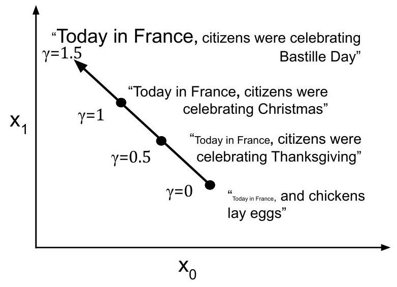

Figure 1: An illustration in latent space showing how increasing the guidance weight $\gamma$ increases the importance of the prompt "Today in France,".
may not be accessible to all researchers.
Meanwhile, similar degenerative problems have been observed in text-to-image-generation: models can ignore parts of the prompt or introduce extra objects (Nichol et al., 2022). Classifier-Free Guidance (CFG) has emerged as an elegant training-free approach to address this (Ho \& Salimans, 2021). In CFG, the generative model itself is used sans modifications during inference to encourage desirata.
While CFG might be a lightweight solution to promptmisadherence in LLMs, it has not previously been applied in the autoregressive text-generation setting. There are many reasons to hypothesize CFG might not transfer: in text-toimage generation, the prompts are simple descriptions and outputs are fixed-size (Lin et al., 2023). In language modeling, prompts can be highly complex and multipart, and outputs are autoregressive and unbounded.

In this paper, we apply CFG to LLMs to increase the model alignment to prompts. We perform modifications to CFG: while text-to-image models (which primarily utilize diffusion models) need to be specifically trained with conditioning dropout (Ho \& Salimans, 2021) to utilize CFG, we find that in text generation, CFG can work out-of-thebox, at lower $\gamma$ values (we discuss more in Section 6. CFG improves alignment on an exhaustive array of benchmarks covering, we show, many widely used prompting
approaches: zero-shot prompting, Chain-of-Thought prompting, long-form generative prompting and complex chatbotstyle prompting (see Table 11. Not only is our formulation of CFG effective and lightweight, it is remarkably stable to hyperparameter settings and requires no tuning across prompting styles: it is a promising plug-and-play technique. Our work has been directly incorporated into leading opensource libraries: Huggingface and llama.cpp.
We make the following contributions:
1. We devise a framework for CFG in language modeling and show significant improvements across a range of benchmarks, establishing it as a versatile inferencetime technique that can be applied out-of-the-box. We test CFG in many different prompting techniques spanning many LLM use-cases, even achieving SOTA on LAMBADA with LLaMA-7B over PaLM-540B (Chowdhery et al., 2022).
2. We show that for the same computational costs during inference-time, in terms of FLOPs and VRAM, one can use CFG to train a model that is half the size and obtain similar performance on those benchmarks;
3. By using negative prompting, we demonstrate that we can achieve more granular control over Chatbot-style assistant prompting. In a blind human evaluation we show $75 \%$ preference for GPT4All using CFG in this setting over the vanilla sampling;
4. We provide interpretations for the impact that CFG on text generation both (1) qualitatively, by visualizing how CFG is upweighting words more related to the prompt (our visualization, we note, can be an integral part of effective prompt engineering) and (2) quantitatively, by showing that CFG decreases entropy in the sampling distribution.

\section*{2. Background and Related Works}

To understand Classifier-Free Guidance (CFG) in LLMs, we must first understand steering and controllability in generative models. In this section, we first discuss the origins of CFG in text-to-image generation, and then discuss how autoregressive language modeling differs.

\subsection*{2.1. Classifier Guidance in Text-to-Image Models}

Suppose $\mathrm{P}(x)$ is an unconditional model for image $x$ and $\mathrm{P}(x \mid c)$ is a conditioned model with conditioning $c$ (e.g. a label or text prompt). Generative models usually generate $x$ by decoding from an abstract semantic space, $z$. In Classifier Guidance (Dhariwal \& Nichol, 2021), an auxiliary classifier $\mathrm{P}_{\phi}(c \mid x)$ guides sampling to increase the likelihood
of $c$ in $x$. This modification results in the following:
$$
\begin{equation*}
\widehat{\mathbf{P}}(x \mid c) \propto \mathrm{P}_{\theta}(x) \cdot \mathrm{P}_{\phi}(c \mid x)^{\gamma} \tag{1}
\end{equation*}
$$
where $\gamma$ is called the guidance strength. As Equation 1 show, "guidance" is a reweighting of $P_{\theta}$ according to the classifier likelihood $P_{\phi} \cdot \gamma=0$ reduces 1 to the unconditional model $P(x)$, while $\gamma=1$ reduces 1 to the conditional generation $P(x \mid c)$. When $\gamma>1, \widehat{\mathrm{P}}$ overemphasizes the conditioning, which results in a better inception score (albeit at the cost of diversity (Dhariwal \& Nichol, 2021). This approach has been successfully used in a variety of works (Gal et al. 2021; Kim et al., 2022; Crowson et al., 2022b)
Classifier-Free Guidance, Ho \& Salimans, 2021) observed that by using Bayes rule, we can eliminate the external classifier. By training the same model $\mathrm{P}_{\theta}$ to support both conditional and unconditional generation (via conditioning dropout), we can rewrite the second term in Equation 1 as $\mathrm{P}_{\theta}(c \mid x) \propto \frac{\mathrm{P}_{\theta}(x \mid c)}{\mathrm{P}_{\theta}(x)}$. Sampling is performed according to:
$$
\begin{equation*}
\widehat{\mathrm{P}_{\theta}}(x \mid c) \propto \frac{\mathrm{P}_{\theta}(x \mid c)^{\gamma}}{\mathrm{P}_{\theta}(x)^{\gamma-1}} \tag{2}
\end{equation*}
$$

Modeling $\widehat{\mathrm{P}}_{\theta}(x \mid c)$ with a diffusion process (Ho et al. 2020) reduces to predicting the PDF of the sample noise $\epsilon_{t}$,
$$
\begin{align*}
\log \widehat{\mathbf{P}_{\theta}}\left(\epsilon_{t} \mid x_{t+1}, c\right)=\gamma & \log \mathbf{P}_{\theta}\left(\epsilon_{t} \mid x_{t+1}, c\right) \\
& -(\gamma-1) \log \mathbf{P}_{\theta}\left(\epsilon_{t} \mid x_{t+1}\right) \tag{3}
\end{align*}
$$

We can rewrite Equation 3 as:
$$
\begin{align*}
& \log \widehat{\mathrm{P}_{\theta}}\left(\epsilon_{t} \mid x_{t+1}, c\right)=\log \mathrm{P}_{\theta}\left(\epsilon_{t} \mid x_{t+1}\right) \\
& \quad+\gamma\left(\log \mathrm{P}_{\theta}\left(\epsilon_{t} \mid x_{t+1}, c\right)-\log \mathrm{P}_{\theta}\left(\epsilon_{t} \mid x_{t+1}\right)\right) \tag{4}
\end{align*}
$$

Aside from its probabilistic interpretation, this equation can be seen as a vector operation in latent space: we take a step of size $\gamma$ away from the unconditional vector in the direction of the conditioning. Thus, we introduce an important tool: Negative Prompting (Du et al., 2020, Documentation, Crowson et al., 2022a; Rombach et al., 2021b). Negative prompting has been proven to be effective in many situations: striking examples have been generated by interpolations latent space (Ling et al. 2021; Song et al., 2020; Brock et al., 2016. Moreover, the initial point does not have to be the unconditional latent, but any representation we want to move away from. We introduce the "negative conditioning" or "negative prompt" $\bar{c}$, as well as a generalized equation resulting in Equation 3 when $\bar{c}=\varnothing$ :
$$
\begin{align*}
& \log \widehat{\mathrm{P}_{\theta}}\left(\epsilon_{t} \mid x_{t+1}, c, \bar{c}\right)=\log \mathrm{P}_{\theta}\left(\epsilon_{t} \mid x_{t+1}, \bar{c}\right)+ \\
& \quad \gamma\left(\log \mathrm{P}_{\theta}\left(\epsilon_{t} \mid x_{t+1}, c\right)-\log \mathrm{P}_{\theta}\left(\epsilon_{t} \mid x_{t+1}, \bar{c}\right)\right) \tag{5}
\end{align*}
$$
\begin{tabular}{ll}
\hline Instruction: "Respond enthusiastically to the following user prompt." \\
Prompt: "What was the Cambridge Analytica scandal?"
\end{tabular}

Table 1: Demonstration of CFG-guided generation for an assistant-style prompt (using GPT4All with $\gamma=5$ ). The assistant has a system-level prompt ("Instructions") that is potentially out-of-distribution (e.g. "write an enthusiastic response") and a user-level prompt ("Prompt"). In Vinalla Sampling, the model ignores the system-level directive, but with CFG, the model adheres to both the system-level and the user-level prompt.

\subsection*{2.2. Classifier-Free Guidance of Language Models}

Unlike in image generation, where $x$ has fixed dimensionality and all dimensions generated dependently, in language modeling, $x$ is autoregressive and unbounded. Here, we apply CFG to the logits of next-token predictions. Logits, as linear transformers of word embeddings (Mikolov et al., 2013, Devlin et al. 2019a), capture capture semantic meaning. Using the logits also avoids network editing (Belrose et al. 2023) and is architecture agnostic.

In modern LLMs, conditioning $c$ is typically a prompt (Brown et al., 2020) which can be a context, an instruction, or the beginning of some text. We wish to generate a text $w$ which has a high likelihood of starting with $c$. We define the $\gamma$-reweighted distribution $\widehat{\mathrm{P}}(w \mid c) \propto \mathrm{P}(w) \cdot \mathrm{P}(c \mid w)^{\gamma}$, and approximate it with CFG as $\widehat{\mathrm{P}}(w \mid c) \propto \frac{\mathrm{P}(w \mid c)^{\gamma}}{\mathrm{P}(w)^{\gamma-1}}$
In the case of autoregressive language models, $\mathrm{P}_{\theta}(w)=$ $\prod_{i}^{T} \mathrm{P}_{\theta}\left(w_{i} \mid w_{j<i}\right)$, we can unroll the formulation and obtain Equation 2again:
$$
\begin{align*}
\widehat{\mathrm{P}_{\theta}}(w \mid c) \propto & \prod_{i=1}^{T} \widehat{\mathrm{P}_{\theta}}\left(w_{i} \mid w_{j<i}, c\right) \\
& \propto \prod_{i=1}^{T} \frac{\mathrm{P}_{\theta}\left(w_{i} \mid w_{j<i}, c\right)^{\gamma}}{\mathrm{P}_{\theta}\left(w_{i} \mid w_{j<i}\right)^{\gamma-1}} \propto \frac{\mathrm{P}_{\theta}(w \mid c)^{\gamma}}{\mathrm{P}_{\theta}(w)^{\gamma-1}} \tag{6}
\end{align*}
$$

An important observation we have is that, while conditioned diffusion models cannot predict unconditioned distributions without extra training, language models handle both $P_{\theta}(w \mid c)$ and $P_{\theta}(w)$ naturally due to being trained on finite context windows. In other words, dropping the prefix $c$ is a natural feature. We can thus sample the next $i$-th token
$w_{i}$ in the logits space:
$$
\begin{align*}
& \log \widehat{\mathrm{P}_{\theta}}\left(w_{i} \mid w_{j<i}, c\right)=\log \mathrm{P}_{\theta}\left(w_{i} \mid w_{j<i}\right) \\
& \quad+\gamma\left(\log \mathrm{P}_{\theta}\left(w_{i} \mid w_{j<i}, c\right)-\log \mathrm{P}_{\theta}\left(w_{i} \mid w_{j<i}\right)\right) \tag{7}
\end{align*}
$$

This formulation can also be extended to accomodate "negative prompting", as in Equation 5 Negative prompting as applied in autoregressive LMs will be further addressed in Section 3.4 Now, we will continue on to the next section, where we introduce our experiments exploring the effects of CFG on different variations of prompting.

We note that recent works have explored variations of CFG in language models (Malkin et al., 2022; Pei et al., 2023; Shi et al., 2023). However, these works have been limited to specific areas of generation, like toxicity. Our work is a more general case and a broader exploration of CFG including experiments across a wide array of benchmarks, prompt variations, human-preference experiments and computinganalysis. See Appendix B for more details on these works.

\section*{3. Experiments}

In this section we show that Classifier-Free Guidance reliably boosts performance across a variety of common prompting approaches. In Section 3.1 we show that CFG boosts zero-shot performance on a variety of standard NLP benchmarks, including achieving state-of-the-art performance on LAMBADA with LLaMA-7B. In Section 3.2 we apply CFG to Chain-of-Thought prompts (Nye et al. 2022; Wei et al. 2022) an approach to allows the model to reason first before answering the question. Next, we test the performance of CFG on text-to-text generation prompts in Section 3.3. Finally, we show in Section 3.4 that CFG can be applied to assistant prompts (i.e. prompts with system-instructions).

\subsection*{3.1. Basic Prompting: Zero-Shot Prompts}

To test basic, zero-shot prompting, we consider a suite of zero-shot benchmarks implemented in the Language Model Evaluation Harness (Gao et al. 2021), which includes closebook QA (Auer et al., 2023; Joshi et al., 2017), common sense reasoning tasks (Zellers et al., 2019; Sakaguchi et al. 2021; Clark et al., 2019; Bisk et al., 2020; Cobbe et al., 2021b, Basu et al. 2020, Clark et al. 2018), and sentence completion-tasks (Paperno et al. 2016). In these settings, the desired completions are short (often 1-2 tokens), so risks of meandering (Spangher et al, 2023) or degradation (Holtzman et al., 2019) are low. We hypothesize that the main impact of CFG in these settings will be to reduce variance in output choices, as we explore more in Section 5
We evaluate the GPT-2 model family (Radford et al., 2019), the Pythia model family (Biderman et al. 2023) and the LLaMA model family(Touvron et al., 2023) using different guidance strengths across a range of standard NLP benchmarks using EleutherAI's Language Model Evaluation Harness (Gao et al., 2021) and implement CFG by starting the unconditional prompt at the last token of the initial prompt. The results are shown in Table 5. For better visualization, the charts for the GPT2 models, the Pythia models and the LLaMA models over the standard benchmarks are also shown in Figure 6, 7, and 8, respectively. We observe that except ARC (challenge) and Winogrande, the boost of performances from CFG is nontrivial and consistent. The reasons for discrepancies on these tasks are still unknown.
Furthermore, we note that even the smallest LLaMA 7B model achieves $81 \%$ accuracy in Lambada (OpenAI) zeroshot benchmark with $\gamma=1.5$, outperforming the current SOTA (zero-shot) of PaLM-540B (77.9\%). Despite the fact that CFG almost doubles the computation during inference, the comparison is still noteworthy given that other models with comparable performances on Lambada (OpenAI) have much more parameters and would still require more compute than LLaMA 7B with CFG. Taken together, we show that CFG increases performance in basic prompting settings significantly.

\subsection*{3.2. Deliberative Prompting: Chain-of-Thought}

A variation on basic prompting is Chain-of-Thought (CoT) prompting Wei et al. 2022). In this setting, the model is prompted to generate a series of reasoning steps before giving an answer to the task: i.e. $p\left(w_{c o t}, w_{a} \mid c\right)$, where $w_{c o t}$ is a set of reasoning steps and $w_{a}$ is the answer. CoT has been shown to perform well in complex reasoning tasks that cannot be fully addressed by model- or data-scaling (Rae et al. 2021).

However, as observed by (Wei et al., 2022), long reasoning chains can diverge and either not generate correct answers,
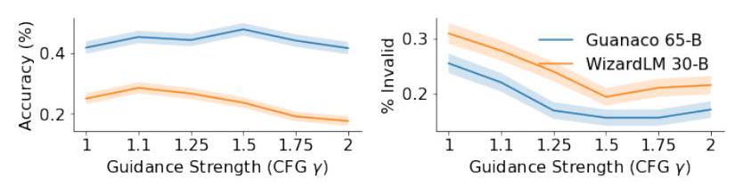

Figure 2: CFG's impact on chain-of-thought prompting (GSM8K dataset). Top: accuracy on task. Bottom: invalidlyformatted answers. For small $\gamma$, CFG increases the \% of chains ending in a valid answer while increasing the model accuracy. For large values, the invalid \% remains small but the accuracy drops.
or not generate parsable results. We hypothesize CFG will be able to enforce better reasoning chains with less drift.

We evaluate on two arithmetic reasoning tasks: GSM8K (Cobbe et al., 2021a) and AQuA (Ling et al., 2017). We follow (Wang et al, 2023)'s few-shot prompt and use two open source LLM models: WizardLM-30B Xu et al., 2023) and Guanaco-65B (Dettmers et al. 2023). As can be seen in Figure 2, 17, using CFG increases the percentage of CoT resulting in valid, parsable answers. For low guidance strengths, model performances increase. However, for $\gamma>1.5$, the quality of reasoning chains degrade, and overall the performances drop ${ }^{11}$
We anticipate in future work being able to more fully test variations of CFG-weighting on different parts of the CoT process. CFG's interactions with CoT; for instance, instead of upweighting just $w_{p}$, we might upweight $w_{p}, w_{c o t}$, or other variations.

\subsection*{3.3. Long Prompts: Generation}

In contrast to basic prompting and CoT-prompting (Sections 3.1 and 3.2, where we primarily expect short answers, here we study tasks where prompts and continuations are both potentially long sequences of text. We focus on code generation here. In this setting the quality of answers is highly dependent on the model's ability to stay on target. We hypothesize that, in this setting, CFG can effectively enforce adherence to the full prompt.

\subsection*{3.3.1. PROGRAM SYNTHESIS EVALUATIONS}

Program synthesis presents us with a scenario where adherence to the full prompt is essential to performance. Additionally, testing CFG on code-related tasks also demonstrates CFG's impact over formal language. Here, we prompt GPTJ (Wang \& Komatsuzaki, 2021) and CodeGen-350M-mono (Nijkamp et al., 2023) for code generations and observe positive results (see Appendix D.1, such as an $18 \%$ improvement of the accuracy rate for GPT-J, and a $37 \%$ improve-

\footnotetext{
${ }^{1} \mathrm{~A}$ qualitative comparison is provided in Table 1615
}
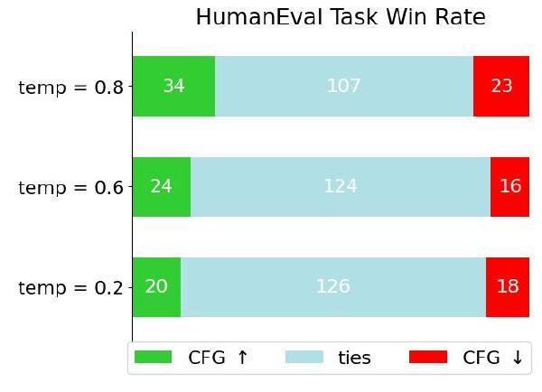

Figure 3: HumanEval task count comparison between $\gamma=$ 1,1.25 for CodeGen-350M-mono
ment of syntax correctness rate for CodeGen-350M-mono with positive guidance.

Next, we evaluate CFG on the HumanEval benchmark (Chen et al. 2021). The HumanEval benchmark contains 164 coding tasks in Python, with English prompts given by a function signature and a docstring. The model generates code-based continuations of the prompt, which are tested against unit tests to evaluate the correctness of programs. We choose CodeGen-350M-mono, CodeGen-2B-mono and CodeGen-6B-mono ((Nijkamp et al. 2023) ) which are designed for Python program synthesis ${ }^{2}$
We test different CFG strength $\underbrace{3}$ and different temperatures, evaluating at pass @ $k$ for $k=1,10,100{ }^{4}$. We show the results for temperature $=0.2$ in Table 2 The pass @ 1 rate, we find, increases with CFG across $1 \leq \gamma \leq 1.5$ and degrades thereafter, in accordance with findings in Section 3.2. As shown in Table 3, the number of tasks where CFG outperforms is more than the one where CFG underperforms at pass @ 1 for $\gamma=1,1.25$ with CodeGen-350M-mono ${ }^{6}$

We note that the improvement from CFG diminishes or harms performance at high $k$. Without CFG, many tasks exhibit small nonzero passing rates, while having $0 \%$ rate with CFG. This indicates that larger $k$ significantly boosts the passing rate of difficult tasks where the rates are low but nonzero. Overall, the consistent improvement on pass @ 1 rates and the reduced effect on pass @ 100 rates support our hypothesis that CFG strengthens the adherence to the

\footnotetext{
${ }^{2}$ Note: CodeGen-16B-mono is omitted due to compute constraint.
${ }^{3} \gamma=1.0,1.1,1.25,1.5,1.75,2.0$
${ }^{4}$ The definition of pass @ $k$ according to (Chen et al. 2021): " $k$ code samples are generated per problem, a problem is considered solved if any sample passes the unit tests, and the total fraction of problems solved is reported."
${ }^{5}$ Full HumanEval results are shown in Appendix C. 4 in Table 7. 8 and 9 and Figure 11,12 and 13
${ }^{8}$ See the scatter plot at temperature $0.2,0.6,0.8$ in appendix, Figure 11
}
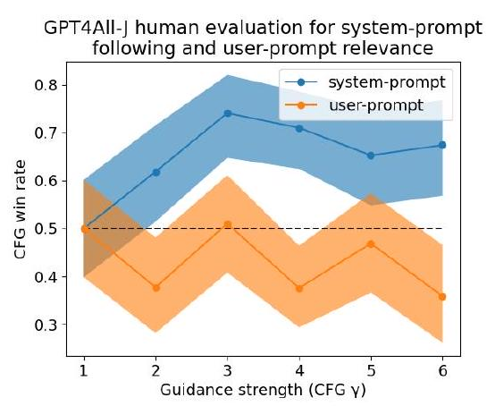

Figure 4: Evaluators ( 611 votes, 71 voters) noted that system-prompt adherence is optimal at $\gamma=3$ while userprompt adherence stays constant.
prompt at the small cost of reduced variability and creativity.

\subsection*{3.4. Negative Prompting: Improving Assistants}

Finally, we explore negative prompting in CFG, discussed in Equation 5 . With negative prompting, the user specifies what they do not want in the output (e.g. "low resolution" in text-to-image), which is then used to better meet user needs.

We explore this idea in the context of chatbots. Chatbots give us a setting where the prompt is expanded into a multistage promp ${ }^{7}$. In chatbots, the language model is prompted with a two-part prompt: (1) the instruction, or "system prompt" which may give contextual information or behavioral guidelines (e.g. style, alignment, persona, etc.); and (2) the user-prompt, or the user's query. See Table 1 for an example. Adherence becomes an even greater concern: systems like Alpaca (Taori et al., 2023) often ignore changes to their system-prompt, and may even expose models to attacks like prompt injection (Greshake et al., 2023).
We explore CFG with negative prompting to increase the success of different system prompts. We set the negative prompt $\bar{c}$, see Equation 5, to be the default system-prompt for our models (i.e. "The prompt below is a question to answer, a task to complete, or a conversation to respond to; decide which and write an appropriate response.'") and set $c$ to be the edited prompt (e.g. "The prompt below is a question to answer, a task to complete, or a conversation to respond to; decide which and write a sad response.").

To test this approach with chatbots, we generate systemprompts, $n_{c}=25$, and user-prompts, $n_{p}=46$, and sample 1740 random combinations of them. In Appendix G we include the full list of $c$ and $p$ we use. For each (system-prompt, user-prompt) pair, we use GPT4All-J

\footnotetext{
${ }^{7}$ We note that this extension to basic-prompting stands as a mirror to CoT-prompting's extension (Section 3.2). In CoT-prompting, the continuation is expanded to a multi-stage completion; here, the prompt is expanded.
}
\begin{tabular}{llllllllllll}
\hline & \multicolumn{3}{c}{ CodeGen-350M } & & \multicolumn{3}{c}{ CodeGen-2B } & & \multicolumn{3}{c}{ CodeGen-6B } \\
\cline { 2 - 4 } \cline { 10 - 12 }$\gamma$ & $\mathrm{k}=1$ & $\mathrm{k}=10$ & $\mathrm{k}=100$ & & $\mathrm{k}=1$ & $\mathrm{k}=10$ & $\mathrm{k}=100$ & & $\mathrm{k}=1$ & $\mathrm{k}=10$ & $\mathrm{k}=100$ \\
\hline 1.0 & $11.0 \%$ & $17.0 \%$ & $\mathbf{2 2 . 0 \%}$ & & $19.5 \%$ & $25.5 \%$ & $\mathbf{2 9 . 8 \%}$ & & $19.5 \%$ & $25.5 \%$ & $\mathbf{2 9 . 8 \%}$ \\
1.1 & $\mathbf{1 1 . 8 \%}$ & $\mathbf{1 8 . 1 \%}$ & $20.1 \%$ & & $20.4 \%$ & $25.4 \%$ & $28.0 \%$ & & $20.4 \%$ & $25.4 \%$ & $28.0 \%$ \\
1.25 & $11.4 \%$ & $17.3 \%$ & $18.9 \%$ & & $19.7 \%$ & $25.4 \%$ & $28.0 \%$ & & $19.7 \%$ & $25.4 \%$ & $28.0 \%$ \\
1.5 & $10.9 \%$ & $16.7 \%$ & $18.3 \%$ & & $\mathbf{2 0 . 9 \%}$ & $\mathbf{2 6 . 7 \%}$ & $29.2 \%$ & & $\mathbf{2 0 . 9 \%}$ & $\mathbf{2 6 . 7 \%}$ & $29.2 \%$ \\
1.75 & $10.3 \%$ & $16.0 \%$ & $18.2 \%$ & & $20.4 \%$ & $26.2 \%$ & $28.6 \%$ & & $20.4 \%$ & $26.2 \%$ & $28.6 \%$ \\
2.0 & $8.6 \%$ & $14.6 \%$ & $17.6 \%$ & & $16.5 \%$ & $22.4 \%$ & $24.4 \%$ & & $16.5 \%$ & $22.4 \%$ & $24.4 \%$ \\
\hline
\end{tabular}

Table 2: CodeGen results with temperature $=0.2 . \mathrm{CFG}$ in nearly all cases increases performance, but the optimal $\gamma$ value varies.
v1.3-jazzy to generate two completions: one without CFG and one with, with a guidance strength randomly chosen $\in 1,2,3,4,5,6$. Our hypothesis is that CFG increases system-prompt following, ideally without hurting user-prompt adherence.

We run a human preference study on our sampled continuations, where participants are shown both, blindly, and asked to assess two things: A. which output better follows the system-prompt, $c$ and B. which output better follows the user-prompt $p$. Our results in Figure 4 shows evidence that CFG emphasized the difference between $c$ and $\bar{c}$ more than sampling with $c$ alone. There is a peak at $\gamma=3$ with $75 \%$ of system-prompt following preference over $\gamma=1$ and undegraded user-prompt relevance (52\%).

\section*{4. Cost Analysis: FLOPs and VRAM}

In the previous section we showed improvements across a wide array of benchmarks and contexts. However, CFG imposes computational and memory requirements that vanilla inference does not. In this Section, we explore these requirements, which are of special interest to users with compute and memory constraints.

Compute constraints: In terms of computational requirements, CFG requires two passes through the network, effectively doubling the amount of FLOPs required for inference. Users who are compute-constrained might wonder if CFG is interesting to them at all, and if they should not run a model twice as big instead. To answer this question, we calculate the FLOP for each of the benchmark experiments that we ran in Section 3.1. We then compare across model sizes, with and without CFG. We conclude with the surprising finding that, across 5 out of 9 tasks, there there is a statistically insignificant difference between using CFG and using vanilla prompting with a model of twice the size at $p=.01$, according to ANCOVA regression analysis (Rutherford 2011). Of the significantly different tasks, 2 favor CFG and 2 favor
\begin{tabular}{llll}
\hline & PPL $p(y \mid x)$ & PPL cfg & PPL instruct \\
\hline PPL $p(y \mid x)$ & & & \\
PPL cfg & 0.94 & & \\
PPL instruct & 0.83 & 0.7 & \\
\hline
\end{tabular}
(a) Correlation between the perplexities of CFG vs. InstructionTuning on the P3 dataset.

Figure 5: We seek to identify when CFG is similar to instruction-tuning. Models mostly agree on the difficulty of input sentences, and in cases where they do not, CFG and Instruction-tuning have similar top-p overlaps.
vanilla. See Appendix C.2, specifically Figure 9, for more details. In other words this indicates that, overall, a model using CFG can generally perform just as well as a model twice as large.

Memory constraints : The impact of CFG on VRAM is nuanced. While CFG boosts the performance of smaller models, it doubles the demands of the kv cache. We conduct a memory analysis, the results of which we show in Appendix C.3. to explore the conditions under which CFG trumps using a larger vanilla model. We find that using CFG vs. a larger model is are highly dependent on sequence length the user wishes to generate. The doubling of the kvcache has important implications, that qualify CFG's use, and we hope to explore these further, including memory reduction strategies, in future work.

\section*{5. Explaining the Success of Classifier-Free Guidance}

In this section, we seek to explain the impact of ClassifierFree Guidance on generation. For these tests, we use the Falcon-7b-Base model (Almazrouei et al. 2023) and, when applicable, compare against the Falcon-7b-Instruct version. We run these models on a sample dataset of 32,902 data-
points from P3 (Sanh et al., 2021). We replicate our findings on the Open-Assistant Dataset (Köpf et al., 2023) and Redpajama-3b model family ${ }^{8}$

\subsection*{5.1. Classifier-Free Guidance's Effect on Sampling Entropy}

We suspect that CFG, by focusing $\mathrm{P}(y \mid x)$ on the prompt, will reduce the entropy of the logit distribution. CFG entropy distribution is significantly lower across generation steps than vanilla prompting, with a mean of 4.7 vs .5 .49 . This restricts the number of tokens in the top-p $=90 \%$ of the vocabulary distribution. We observe, in Section 5.3, that the top tokens re-order, showing that CFG is not simply having the same effect as temperature.

\subsection*{5.2. CFG's Relation to Instruction Tuning}

Our next question: how is Classifier-Free Guidance affecting the vocabulary distribution? We hypothesize that CFG has similar effects to instruction-tuning, which also encourages a model to focus on the prompt (Webson \& Pavlick, 2021). Although CFG and Instruction-Tuned model variants have similar entropy across generation samples, the vocabulary distributions across our samples are largely not overlapping, indicating that CFG is not having a similar effect as instruction-tuning (see Appendix E).
There are cases where the two are similar. As shown in Table 5 harder phrases for Instruction-Tuned models are typically where CFG and Instruction-Tuned models align: we observe significant spearman correlations of $r_{s}>.7$ between Instruction-Tuned models and CFG. As we explore more in the appendix, these correlations are particularly pronounced for longer prompts. We conclude that CFG is altering the model in ways that might complement instruction-tuning, opening the door to future explorations.

\subsection*{5.3. Visualizing Classifier-Free Guidance}

Finally, we provide qualitative insights into the reordering of the vocabulary induced by CFG. We visualize the vocabulary at each timestep ranked by the difference $\log \mathrm{P}\left(w_{t} \mid w_{<t}\right)-\log \mathrm{P}\left(w_{T} \mid \hat{w}\right)$, showing which tokens are encouraged or discouraged the most. In Figure 3, we prompt a model with $c=$ "The dragon flew over Paris, France", $\bar{c}=\emptyset$ and observe that tokens about dragons and Paris get upweighted while tokens about other locations ("Queensland"), dates ("1913"), or topics ("hostages", "voyages") are downweighted. This indicates that CFG encourages and discourages tokens due to their relatedness to the prompt.

\footnotetext{
8 https://www.together.xyz/blog/redpajama
${ }^{9}$ See Figure 18a and Figure 18b in Appendix Efor more detail)
}

\section*{6. Discussion}

Taken together, our findings indicate that CFG performs extremely well in an language-modeling setting across a wide variety of prompting techniques. This is perhaps unsurprising: recent work has demonstrated that language models can be their own reward models (Yuan et al., 2024). Indeed, CFG is to classifier-guidance for prompt adherence as Direct Preference Optimization (DPO) Rafailov et al. 2023 ) is to Proximal Policy Optimization (PPO) (Schulman et al., 2017). From this perspective, one insights from CFG is that language models have even more expressive power than current prompting approaches are utilizing.

Using the language model itself for guidance, like (Rafailov et al., 2023) observed, can be both more effective and efficient than using an external classifier. To prove this in our case, in Table 4, we show a comparison with FUDGE, an approach to Classifier Guidance in language modeling (Yang \& Klein, 2021). For both trials, sentiment control (Maas et al., 2011) and toxicity control (cjadams, 2017.10. CFG was able to steer guidance to a much greater degree (we tune $\gamma$ as a hyperparameter for both to maximize scores while maintaining fluency). In addition, because FUDGE must be run on ever time-step, it runs 100x slower than CFG. In sum, CFG is both more effective and more efficient as a controller, without requiring any extra training.

As researchers have noted, classifier guidance in language models often struggles from domain-mismatches between LMs and classifiers (Meng et al, 2022). This perhaps can explain another key to CFG's success, with implications for RLFH and other auxiliary-model control techniques: no matter how broadly trained a classifier or agent is, it's training distribution likely will not match that of the LLM.
However, CFG does come with it's limitations. in cases where a specific kind of control is desired, like in the two experiments shown in Table 4. CFG's dependency on handcrafted prompts might be problematic. In cases where a specific generic form of control is desired (e.g. sentiment or toxicity) and a good hand-crafted prompt is NOT easily found, classifier-guided systems might have an advantage by being less dependent on specific system-designer prompt choices. We note that this is not the case we explore most extensively in this work, nor have we found in our extensive experiments across prompting techniques that this has observably harmed performance, but it must be acknowledged as as limitation. In future work, we hope to be able

\footnotetext{
${ }^{10}$ We prompt GPT2 with the prompt "That was a good movie!" for IMDB and "Don't be mean" for Toxicity. We use bhadresh-savani/distilbert-base-uncased -emotion and unitary/toxic-bert for sentiment and toxicity guidance, respectively, and stevhliu/my_awesome_model and unitary/toxic-bert for evaluation.
}

Stay on topic with Classifier-Free Guidance
\begin{tabular}{|c|c|c|c|c|c|c|c|c|c|c|c|}
\hline current & top1 & top2 & top3 & top4 & top5 & ... & bottom5 & bottom4 & bottom3 & bottom2 & bottom1 \\
\hline France & flipping & destroying & waking & stopping & causing & ... & guiName & ufact & Outs & kees & "\}]," \\
\hline & crashing & landing & soaring & swoop & plummet & ... & soDeliveryDate & POLIT & Occupations & 568 & publishes \\
\hline landing & neigh & invis & atop & overhead & omin & ... & quotas & Russo & Germans & passports & hostages \\
\hline on & Buildings & skysc & rooft & Cheong & Plaza & & & MFT & ゼ & 醒 & DragonMagazine \\
\hline Notre & Basil & Mos & Cathedral & Mosque & Eugene & ... & voyage & alach & urse & arb & \\
\hline Dame & Cathedral & monument & cathedral & Basil & Mosque & ... & voyage & aila & voy & aund & wk \\
\hline Cathedral & .," & ."[ & slowing & blocking & ortex & ... & ashore & seaf & aund & Tact & Wanted \\
\hline & Dragon & dragons & dragon & Dragon & Dragons & & 1915 & 1914 & 1944 & 1934 & 1913 \\
\hline It & swoop & circled & dart & hopped & bolted & ... & concludes & reads & reads & culmin & marks \\
\hline circled & skysc & pedestrians & architectural & hanging & skyline & ... & Newfoundland & Ukrain & Zamb & Johnston & Queensland \\
\hline Paris & night & amura & rum & anim & animate & ... & prematurely & capit & bombed & Mé & owing \\
\hline a & longer & while & long & awhile & length & ... & ims & chin & chel & ille & ller \\
\hline bit & longer & MORE & awhile & again & more & & prematurely & hof & nw & arri & trop \\
\hline , & startled & feathers & dragon & wings & dragons & ... & inval & Junction & Palest & endas & CVE \\
\hline and & dragon & dragons & golden & Winged & perched & ... & CVE & inval & Ukrain & onet & Commodore \\
\hline then & dragon & DRAG & dragons & neigh & DRAGON & ... & CVE & onet & Kear & TPS & Tags \\
\hline flew & ukong & skelet & rum & swoop & acles & ... & RG & thouse & NJ & 444 & programmes \\
\hline over & rium & Rockefeller & Plaza & Times & Symphony & ... & Brittany & Newfoundland & Balt & isconsin & Yugoslavia \\
\hline the & Griffith & Zeus & Hag & Science & Raphael & ... & shire & Midlands & frontier & deserts & Balkans \\
\hline E & BI & Rowe & ident & Methodist & allah & ... & coasts & ento & bys & seys & Desire \\
\hline iff & Armory & Library & restrooms & Mansion & Mahmoud & ... & indo & onne & Off & itime & Norm \\
\hline el & restaurant & Middle & restroom & boutique & museum & ... & iband & throats & centres & detach & rift \\
\hline Tower & Property & omin & Foundation & Creature & >" & ... & gee & thence & pheus & hither & favourable \\
\hline . & dragons & dragon & Dragons & Dragon & DRAGON & ... & 1944 & 1942 & Instrument & Balt & 1943 \\
\hline Then & dragons & dragon & dragon & Dragons & Dragon & ... & Manz & Hopkins & CVE & Instrument & Squadron \\
\hline it & dragon & dragons & neigh & Winged & Draco & ... & CVE & udder & services & corrections & obbies \\
\hline flew & upro & ukong & rum & walked & ..." & ... & INC & inary & lein & auxiliary & CVE \\
\hline over & Chinatown & Financial & Spider & tallest & Financial & ... & warr & & quickShip & Newfoundland & \\
\hline
\end{tabular}

Table 3: Given the prompt The dragon flew over Paris, France we display, at each sampling step, the vocabulary ranked for $\mathrm{P}\left(w_{t} \mid w_{<t}\right)-\log \mathrm{P}\left(w_{T} \mid \hat{w}\right)$ for the next step. We can see CFG encouraging tokens about flying dragons and Paris, and discouraging other topics or regions
\begin{tabular}{lrr}
\hline & FUDGE & CFG \\
\hline Sentiment & .065 & 0.312 \\
Toxicity & .045 & 0.523 \\
\hline
\end{tabular}

Table 4: \% increase in classification likelihood for each category (for sentiment on IMDB (Maas et al., 2011), we use the "positive" label, for toxicity on (cjadams, 2017): we use "not toxic"), as judged by a secondary classifier. We compare a Classifier Guidance technique in language modeling (Yang \& Klein, 2021) with CFG.
to explore prompt-optimizations to remove this barrier.
Other researchers have observed that CFG is also sensitive to $\gamma$ as a hyperparameter. Compared with text-to-image generation where optimal $\gamma \in 3-5$ is common, the optimal $\gamma$ values for most of our prompts, except negative prompting, were small ( $<2$ ). There are many reasons why text-to-image models might have higher $\gamma$ values. In text-to-image generation, the pixel range is $(-1,1)$, whereas the range for logits in language modeling is a lot larger. In text-to-image generation, the values are independent but in text-to-text there's a softmax, and thus changing the maximum logit value dramatically alters the whole distribution. The conditional and unconditional outputs may be more different in text-to-text than in text-to-image, leading to greater chances of output text degenerating. In text-to-image diffusion models, after
a very small number of iterations, the differences between the conditional probability and the unconditional probability should be negligible, so a stronger strength might be required.

\section*{7. Conclusion}

We have shown that Classifier-Free Guidance, which was previously only applied in text-to-image applications, can be an effective way to increase prompt adherence autoregressive settings. In contrast to text-to-vision, CFG in autoregressive language modeling works out-of-the-box, without the need to further train the model. We have shown that CFG can boost performance across an array of different prompting styles: basic, chain-of-thought prompting, long text and chatbot prompting. Finally, we explain the effects of CFG by showing it decreased sampling entropy, but not in the same ways that Instruction-tuned models do. Ultimately, we leave for future work the exact effects that CFG is having, but we propose qualitative visualizations that confirm our intuitions around prompt adherence.
Our work also integrates into a growing body of inference techniques aimed at perturbing the LM logits (Li et al. 2022b; Shi et al., 2023). We demonstrate that by doubling the inference FLOP using CFG brings performances of a model about twice the size. This allows training smaller models, which can be ran on smaller hardware, and are cheaper to train.

Our work faces the following limitations: as mentioned in Section6. CFG requires tweaking and exploration: $\gamma$ values that might work in one context (i.e. long-form generation) might need to be tweaked slightly for optimal performance in another. It's also possible that CFG might be misused to hack language models, whether through prompt injection or alignment-overriding. We tried to explore this at length, both quantitatively and qualitatively, and we designed tasks that might reveal such behavior. However, we cannot conclude this method is risk-free. We advocate for standardized benchmarks aimed more squarely at language-model risk (including, possibly, pairs of models along with known prompt injections). Such standardized benchmarks could help us unit-test an advancement like CFG before releasing it into the wild.

\section*{Acknowledgements}

We are grateful to Stability and CoreWeave for providing the compute to run the evaluations.

We also thank the volunteers who took part in the GPT4All experiment.
Alexander Spangher would like to thank Bloomberg News for a 4 year PhD fellowship that generously funds his research.

Honglu Fan would like to thank Swiss National Science Foundation for the Ambizione grant PZ00P2_193324 for sponsoring his position during this work.

\section*{Impact Statement}

CFG helps to improve generative modeling by introducing an auxiliary objective that increases prompt adherence. We demonstrate that CFG is effective in autoregressive language modeling tasks. We observe that CFG yields consistent task improvements across a wide variety of different settings, tasks and prompting techniques, thereby showing its value as a useful language modeling technique.

While this advancement presents exciting opportunities for improving user control and customization in LLM interactions, it also carries substantial risks. CFG can potentially undermine alignment mechanisms designed to ensure ethical and safe behavior in chatbots. By prioritizing prompt adherence over alignment protocols, it can facilitate the generation of harmful, biased, or toxic content, posing serious ethical concerns. Such capability could be exploited to bypass content moderation systems, leading to the dissemination of offensive material, misinformation, or other forms of digital harm.

It is crucial to address these risks by developing robust safeguards and ethical guidelines for the deployment of this technique. We emphasize the importance of continued
research into alignment and safety measures to mitigate the negative impacts while harnessing the positive potential of enhanced prompt emphasis in LLMs.

\section*{References}

Ebtesam Almazrouei, Hamza Alobeidli, Abdulaziz Alshamsi, Alessandro Cappelli, Ruxandra Cojocaru, Merouane Debbah, Etienne Goffinet, Daniel Heslow, Julien Launay, Quentin Malartic, Badreddine Noune, Baptiste Pannier, and Guilherme Penedo. Falcon-40B: an open large language model with state-of-the-art performance. 2023.

Amanda Askell, Yuntao Bai, Anna Chen, Dawn Drain, Deep Ganguli, Tom Henighan, Andy Jones, Nicholas Joseph, Ben Mann, Nova DasSarma, et al. A general language assistant as a laboratory for alignment. arXiv preprint arXiv:2112.00861, 2021.

Sören Auer, Dante AC Barone, Cassiano Bartz, Eduardo G Cortes, Mohamad Yaser Jaradeh, Oliver Karras, Manolis Koubarakis, Dmitry Mouromtsev, Dmitrii Pliukhin, Daniil Radyush, et al. The sciqa scientific question answering benchmark for scholarly knowledge. Scientific Reports, 13(1):7240, 2023.

Regina Barzilay and Mirella Lapata. Modeling local coherence: An entity-based approach. Computational Linguistics, 34(1):1-34, 2008.

Kinjal Basu, Farhad Shakerin, and Gopal Gupta. Aqua: Asp-based visual question answering. In Practical Aspects of Declarative Languages: 22nd International Symposium, PADL 2020, New Orleans, LA, USA, January 20-21, 2020, Proceedings 22, pp. 57-72. Springer, 2020.

Nora Belrose, David Schneider-Joseph, Shauli Ravfogel, Ryan Cotterell, Edward Raff, and Stella Biderman. Leace: Perfect linear concept erasure in closed form. arXiv preprint arXiv:2306.03819, 2023.

Stella Biderman and Edward Raff. Fooling moss detection with pretrained language models. In Proceedings of the 31st ACM International Conference on Information \& Knowledge Management, pp. 2933-2943, 2022.

Stella Biderman, Hailey Schoelkopf, Quentin Anthony, Herbie Bradley, Kyle O'Brien, Eric Hallahan, Mohammad Aflah Khan, Shivanshu Purohit, USVSN Sai Prashanth, Edward Raff, Aviya Skowron, Lintang Sutawika, and Oskar van der Wal. Pythia: A suite for analyzing large language models across training and scaling, 2023.

Yonatan Bisk, Rowan Zellers, Jianfeng Gao, Yejin Choi, et al. Piqa: Reasoning about physical commonsense in
natural language. In Proceedings of the AAAI conference on artificial intelligence, volume 34, pp. 7432-7439, 2020.

Andrew Brock, Theodore Lim, JM Ritchie, and Nick Weston. Neural photo editing with introspective adversarial networks. In International Conference on Learning Representations, 2016.

Tom Brown, Benjamin Mann, Nick Ryder, Melanie Subbiah, Jared D Kaplan, Prafulla Dhariwal, Arvind Neelakantan, Pranav Shyam, Girish Sastry, Amanda Askell, et al. Language models are few-shot learners. Advances in neural information processing systems, 33:1877-1901, 2020.

Mark Chen, Jerry Tworek, Heewoo Jun, Qiming Yuan, Henrique Ponde de Oliveira Pinto, Jared Kaplan, Harri Edwards, Yuri Burda, Nicholas Joseph, Greg Brockman, Alex Ray, Raul Puri, Gretchen Krueger, Michael Petrov, Heidy Khlaaf, Girish Sastry, Pamela Mishkin, Brooke Chan, Scott Gray, Nick Ryder, Mikhail Pavlov, Alethea Power, Lukasz Kaiser, Mohammad Bavarian, Clemens Winter, Philippe Tillet, Felipe Petroski Such, Dave Cummings, Matthias Plappert, Fotios Chantzis, Elizabeth Barnes, Ariel Herbert-Voss, William Hebgen Guss, Alex Nichol, Alex Paino, Nikolas Tezak, Jie Tang, Igor Babuschkin, Suchir Balaji, Shantanu Jain, William Saunders, Christopher Hesse, Andrew N. Carr, Jan Leike, Josh Achiam, Vedant Misra, Evan Morikawa, Alec Radford, Matthew Knight, Miles Brundage, Mira Murati, Katie Mayer, Peter Welinder, Bob McGrew, Dario Amodei, Sam McCandlish, Ilya Sutskever, and Wojciech Zaremba. Evaluating large language models trained on code. 2021.

Jan Chorowski and Navdeep Jaitly. Towards better decoding and language model integration in sequence to sequence models. arXiv preprint arXiv:1612.02695, 2016.

Aakanksha Chowdhery, Sharan Narang, Jacob Devlin, Maarten Bosma, Gaurav Mishra, Adam Roberts, Paul Barham, Hyung Won Chung, Charles Sutton, Sebastian Gehrmann, et al. Palm: Scaling language modeling with pathways. arXiv preprint arXiv:2204.02311, 2022.

Julia Elliott Lucas Dixon Mark McDonald nithum Will Cukierski cjadams, Jeffrey Sorensen. Toxic comment classification challenge, 2017. URL https: //kaggle.com/competitions/jigsaw-tox ic-comment-classification-challenge.

Christopher Clark, Kenton Lee, Ming-Wei Chang, Tom Kwiatkowski, Michael Collins, and Kristina Toutanova. Boolq: Exploring the surprising difficulty of natural yes/no questions. arXiv preprint arXiv:1905.10044, 2019.

Peter Clark, Isaac Cowhey, Oren Etzioni, Tushar Khot, Ashish Sabharwal, Carissa Schoenick, and Oyvind Tafjord. Think you have solved question answering? try arc, the ai2 reasoning challenge. arXiv:1803.05457v1, 2018.

Karl Cobbe, Vineet Kosaraju, Mohammad Bavarian, Mark Chen, Heewoo Jun, Lukasz Kaiser, Matthias Plappert, Jerry Tworek, Jacob Hilton, Reiichiro Nakano, Christopher Hesse, and John Schulman. Training verifiers to solve math word problems. arXiv preprint arXiv:2110.14168, 2021a.

Karl Cobbe, Vineet Kosaraju, Mohammad Bavarian, Mark Chen, Heewoo Jun, Lukasz Kaiser, Matthias Plappert, Jerry Tworek, Jacob Hilton, Reiichiro Nakano, et al. Training verifiers to solve math word problems. arXiv preprint arXiv:2110.14168, 2021b.

Katherine Crowson, Stella Biderman, Daniel Kornis, Dashiell Stander, Eric Hallahan, Louis Castricato, and Edward Raff. Vqgan-clip: Open domain image generation and editing with natural language guidance. In Computer Vision-ECCV 2022: 17th European Conference, Tel Aviv, Israel, October 23-27, 2022, Proceedings, Part XXXVII, pp. 88-105. Springer, 2022a.

Katherine Crowson, Stella Biderman, Daniel Kornis, Dashiell Stander, Eric Hallahan, Louis Castricato, and Edward Raff. Vqgan-clip: Open domain image generation and editing with natural language guidance. In Computer Vision-ECCV 2022: 17th European Conference, Tel Aviv, Israel, October 23-27, 2022, Proceedings, Part XXXVII, pp. 88-105. Springer, 2022b.

Sumanth Dathathri, Andrea Madotto, Janice Lan, Jane Hung, Eric Frank, Piero Molino, Jason Yosinski, and Rosanne Liu. Plug and play language models: A simple approach to controlled text generation. arXiv preprint arXiv:1912.02164, 2019.

Tim Dettmers, Artidoro Pagnoni, Ari Holtzman, and Luke Zettlemoyer. Qlora: Efficient finetuning of quantized llms, 2023.

Jacob Devlin, Ming-Wei Chang, Kenton Lee, and Kristina Toutanova. Bert: Pre-training of deep bidirectional transformers for language understanding. ArXiv, abs/1810.04805, 2019a.

Jacob Devlin, Ming-Wei Chang, Kenton Lee, and Kristina Toutanova. BERT: Pre-training of deep bidirectional transformers for language understanding. In Proceedings of the 2019 Conference of the North American Chapter of the Association for Computational Linguistics: Human Language Technologies, Volume 1 (Long
and Short Papers), pp. 4171-4186, Minneapolis, Minnesota, June 2019b. Association for Computational Linguistics. doi: 10.18653/v1/N19-1423. URL https: //aclanthology.org/N19-1423.

Prafulla Dhariwal and Alexander Nichol. Diffusion models beat gans on image synthesis. Advances in Neural Information Processing Systems, 34:8780-8794, 2021.

Stable Diffusion Documentation. How does negative prompt work? https://stable-diffusion-art.com /how-negative-prompt-work/

Yilun Du, Shuang Li, and Igor Mordatch. Compositional visual generation with energy based models. Advances in Neural Information Processing Systems, 33:6637-6647, 2020.

Virginia K Felkner, Ho-Chun Herbert Chang, Eugene Jang, and Jonathan May. Towards winoqueer: Developing a benchmark for anti-queer bias in large language models. arXiv preprint arXiv:2206.11484, 2022.

Zihao Fu, Wai Lam, Anthony Man-Cho So, and Bei Shi. A theoretical analysis of the repetition problem in text generation. In Proceedings of the AAAI Conference on Ar tificial Intelligence, volume 35, pp. 12848-12856, 2021.

Rinon Gal, Or Patashnik, Haggai Maron, Gal Chechik, and Daniel Cohen-Or. Stylegan-nada: Clip-guided domain adaptation of image generators. arXiv preprint arXiv:2108.00946, 2021.

Leo Gao, Jonathan Tow, Stella Biderman, Sid Black, Anthony DiPofi, Charles Foster, Laurence Golding, Jeffrey Hsu, Kyle McDonell, Niklas Muennighoff, Jason Phang, Laria Reynolds, Eric Tang, Anish Thite, Ben Wang, Kevin Wang, and Andy Zou. A framework for few-shot language model evaluation, September 2021. URL https: //doi.org/10.5281/zenodo.5371628.

Samuel Gehman, Suchin Gururangan, Maarten Sap, Yejin Choi, and Noah A Smith. Realtoxicityprompts: Evaluating neural toxic degeneration in language models. arXiv preprint arXiv:2009.11462, 2020.

Felix A Gers, Jürgen Schmidhuber, and Fred Cummins. Learning to forget: Continual prediction with lstm. Neural computation, 12(10):2451-2471, 2000.

Kai Greshake, Sahar Abdelnabi, Shailesh Mishra, Christoph Endres, Thorsten Holz, and Mario Fritz. More than you've asked for: A comprehensive analysis of novel prompt injection threats to application-integrated large language models. arXiv preprint arXiv:2302.12173, 2023.

Jonathan Ho and Tim Salimans. Classifier-free diffusion guidance. In NeurIPS 2021 Workshop on Deep Generative Models and Downstream Applications, 2021.

Jonathan Ho, Ajay Jain, and Pieter Abbeel. Denoising diffusion probabilistic models. Advances in neural information processing systems, 33:6840-6851, 2020.

Ari Holtzman, Jan Buys, Li Du, Maxwell Forbes, and Yejin Choi. The curious case of neural text degeneration. arXiv preprint arXiv:1904.09751, 2019.

Mandar Joshi, Eunsol Choi, Daniel S Weld, and Luke Zettlemoyer. Triviaqa: A large scale distantly supervised challenge dataset for reading comprehension. arXiv preprint arXiv:1705.03551, 2017.

Nitish Shirish Keskar, Bryan McCann, Lav R Varshney, Caiming Xiong, and Richard Socher. Ctrl: A conditional transformer language model for controllable generation. arXiv preprint arXiv:1909.05858, 2019.

Gwanghyun Kim, Taesung Kwon, and Jong Chul Ye. Diffusionclip: Text-guided diffusion models for robust image manipulation. In Proceedings of the IEEE/CVF Conference on Computer Vision and Pattern Recognition, pp. 2426-2435, 2022.

Andreas Köpf, Yannic Kilcher, Dimitri von Rütte, Sotiris Anagnostidis, Zhi-Rui Tam, Keith Stevens, Abdullah Barhoum, Nguyen Minh Duc, Oliver Stanley, Richárd Nagyfi, et al. Openassistant conversations-democratizing large language model alignment. arXiv preprint arXiv:2304.07327, 2023.

Ben Krause, Akhilesh Deepak Gotmare, Bryan McCann, Nitish Shirish Keskar, Shafiq Joty, Richard Socher, and Nazneen Fatema Rajani. Gedi: Generative discriminator guided sequence generation. arXiv preprint arXiv:2009.06367, 2020.

Xiang Li, John Thickstun, Ishaan Gulrajani, Percy S Liang, and Tatsunori B Hashimoto. Diffusion-lm improves controllable text generation. Advances in Neural Information Processing Systems, 35:4328-4343, 2022a.

Xiang Lisa Li, Ari Holtzman, Daniel Fried, Percy Liang, Jason Eisner, Tatsunori Hashimoto, Luke Zettlemoyer, and Mike Lewis. Contrastive decoding: Open-ended text generation as optimization. arXiv preprint arXiv:2210.15097, 2022b.

Shanchuan Lin, Bingchen Liu, Jiashi Li, and Xiao Yang. Common diffusion noise schedules and sample steps are flawed, 2023.

Huan Ling, Karsten Kreis, Daiqing Li, Seung Wook Kim, Antonio Torralba, and Sanja Fidler. Editgan: Highprecision semantic image editing. In Advances in Neural Information Processing Systems (NeurIPS), 2021.

Wang Ling, Dani Yogatama, Chris Dyer, and Phil Blunsom. Program induction by rationale generation: Learning to solve and explain algebraic word problems. In Proceedings of the 55th Annual Meeting of the Association for Computational Linguistics (Volume 1: Long Papers), pp. 158-167, Vancouver, Canada, July 2017. Association for Computational Linguistics. doi: 10.18653/v1/P17-1015. URLhttps://aclanthology.org/P17-1015.

Andrew L. Maas, Raymond E. Daly, Peter T. Pham, Dan Huang, Andrew Y. Ng, and Christopher Potts. Learning word vectors for sentiment analysis. In Proceedings of the 49th Annual Meeting of the Association for Computational Linguistics: Human Language Technologies, pp. 142-150, Portland, Oregon, USA, June 2011. Association for Computational Linguistics. URL http: //www.aclweb.org/anthology/P11-1015.

Nikolay Malkin, Zhen Wang, and Nebojsa Jojic. Coherence boosting: When your pretrained language model is not paying enough attention. In Proceedings of the 60th Annual Meeting of the Association for Computational Linguistics (Volume 1: Long Papers), pp. 82148236, Dublin, Ireland, May 2022. Association for Computational Linguistics. doi: 10.18653/v1/2022.acl-long. 565. URL https://aclanthology.org/2022. acl-long. 565

Potsawee Manakul, Adian Liusie, and Mark JF Gales. Selfcheckgpt: Zero-resource black-box hallucination detection for generative large language models. arXiv preprint arXiv:2303.08896, 2023.

Tao Meng, Sidi Lu, Nanyun Peng, and Kai-Wei Chang. Controllable text generation with neurally-decomposed oracle. arXiv preprint arXiv:2205.14219, 2022.

Tomas Mikolov, Kai Chen, Gregory S. Corrado, and Jeffrey Dean. Efficient estimation of word representations in vector space. In International Conference on Learning Representations, 2013.

Alexander Quinn Nichol, Prafulla Dhariwal, Aditya Ramesh, Pranav Shyam, Pamela Mishkin, Bob Mcgrew, Ilya Sutskever, and Mark Chen. Glide: Towards photorealistic image generation and editing with text-guided diffusion models. In International Conference on Machine Learning, pp. 16784-16804. PMLR, 2022.

Erik Nijkamp, Bo Pang, Hiroaki Hayashi, Lifu Tu, Huan Wang, Yingbo Zhou, Silvio Savarese, and Caiming Xiong. Codegen: An open large language model for
code with multi-turn program synthesis. In The Eleventh International Conference on Learning Representations, 2023. URL https://openreview.net/forum ?id=iaYcJKpY2B_

Maxwell Nye, Anders Johan Andreassen, Guy Gur-Ari, Henryk Michalewski, Jacob Austin, David Bieber, David Dohan, Aitor Lewkowycz, Maarten Bosma, David Luan, Charles Sutton, and Augustus Odena. Show your work: Scratchpads for intermediate computation with language models. In Deep Learning for Code Workshop, 2022.

Sean O'Brien and Mike Lewis. Contrastive decoding improves reasoning in large language models, 2023.

Long Ouyang, Jeffrey Wu, Xu Jiang, Diogo Almeida, Carroll Wainwright, Pamela Mishkin, Chong Zhang, Sandhini Agarwal, Katarina Slama, Alex Ray, et al. Training language models to follow instructions with human feedback. Advances in Neural Information Processing Systems, 35:27730-27744, 2022a.

Long Ouyang, Jeffrey Wu, Xu Jiang, Diogo Almeida, Carroll Wainwright, Pamela Mishkin, Chong Zhang, Sandhini Agarwal, Katarina Slama, Alex Ray, et al. Training language models to follow instructions with human feedback. Advances in Neural Information Processing Systems, 35:27730-27744, 2022b.

Denis Paperno, Germán Kruszewski, Angeliki Lazaridou, Quan Ngoc Pham, Raffaella Bernardi, Sandro Pezzelle, Marco Baroni, Gemma Boleda, and Raquel Fernández. The lambada dataset: Word prediction requiring a broad discourse context. arXiv preprint arXiv:1606.06031, 2016.

Jonathan Pei, Kevin Yang, and Dan Klein. Preadd: Prefixadaptive decoding for controlled text generation, 2023.

Alec Radford, Jeffrey Wu, Rewon Child, David Luan, Dario Amodei, Ilya Sutskever, et al. Language models are unsupervised multitask learners. OpenAI blog, 1(8):9, 2019.

Jack W. Rae, Sebastian Borgeaud, Trevor Cai, Katie Millican, Jordan Hoffmann, Francis Song, John Aslanides, Sarah Henderson, Roman Ring, Susannah Young, Eliza Rutherford, Tom Hennigan, Jacob Menick, Albin Cassirer, Richard Powell, George van den Driessche, Lisa Anne Hendricks, Maribeth Rauh, Po-Sen Huang, Amelia Glaese, Johannes Welbl, Sumanth Dathathri, Saffron Huang, Jonathan Uesato, John Mellor, Irina Higgins, Antonia Creswell, Nat McAleese, Amy Wu, Erich Elsen, Siddhant Jayakumar, Elena Buchatskaya, David Budden, Esme Sutherland, Karen Simonyan, Michela Paganini, Laurent Sifre, Lena Martens, Xiang Lorraine

Li, Adhiguna Kuncoro, Aida Nematzadeh, Elena Gribovskaya, Domenic Donato, Angeliki Lazaridou, Arthur Mensch, Jean-Baptiste Lespiau, Maria Tsimpoukelli, Nikolai Grigorev, Doug Fritz, Thibault Sottiaux, Mantas Pajarskas, Toby Pohlen, Zhitao Gong, Daniel Toyama, Cyprien de Masson d'Autume, Yujia Li, Tayfun Terzi, Vladimir Mikulik, Igor Babuschkin, Aidan Clark, Diego de Las Casas, Aurelia Guy, Chris Jones, James Bradbury, Matthew Johnson, Blake Hechtman, Laura Weidinger, Iason Gabriel, William Isaac, Ed Lockhart, Simon Osindero, Laura Rimell, Chris Dyer, Oriol Vinyals, Kareem Ayoub, Jeff Stanway, Lorrayne Bennett, Demis Hassabis, Koray Kavukcuoglu, and Geoffrey Irving. Scaling language models: Methods, analysis \& insights from training gopher, 2021. URLhttps://arxiv.org/ abs/2112.11446.

Rafael Rafailov, Archit Sharma, Eric Mitchell, Stefano Ermon, Christopher D Manning, and Chelsea Finn. Direct preference optimization: Your language model is secretly a reward model. arXiv preprint arXiv:2305.18290, 2023.

Robin Rombach, Andreas Blattmann, Dominik Lorenz, Patrick Esser, and Björn Ommer. High-resolution image synthesis with latent diffusion models, 2021a.

Robin Rombach, Andreas Blattmann, Dominik Lorenz, Patrick Esser, and Björn Ommer. High-resolution image synthesis with latent diffusion models, 2021b.

Andrew Rutherford. ANOVA and ANCOVA: a GLM approach. John Wiley \& Sons, 2011.

Chitwan Saharia, William Chan, Saurabh Saxena, Lala Li, Jay Whang, Emily L Denton, Kamyar Ghasemipour, Raphael Gontijo Lopes, Burcu Karagol Ayan, Tim Salimans, et al. Photorealistic text-to-image diffusion models with deep language understanding. Advances in Neural Information Processing Systems, 35:36479-36494, 2022.
Keisuke Sakaguchi, Ronan Le Bras, Chandra Bhagavatula, and Yejin Choi. Winogrande: An adversarial winograd schema challenge at scale. Communications of the ACM, 64(9):99-106, 2021.

Victor Sanh, Albert Webson, Colin Raffel, Stephen Bach, Lintang Sutawika, Zaid Alyafeai, Antoine Chaffin, Arnaud Stiegler, Arun Raja, Manan Dey, et al. Multitask prompted training enables zero-shot task generalization. In International Conference on Learning Representations, 2021.

Teven Le Scao, Angela Fan, Christopher Akiki, Ellie Pavlick, Suzana Ilić, Daniel Hesslow, Roman Castagné, Alexandra Sasha Luccioni, François Yvon, Matthias Gallé, et al. Bloom: A 176b-parameter openaccess multilingual language model. arXiv preprint arXiv:2211.05100, 2022.

John Schulman, Filip Wolski, Prafulla Dhariwal, Alec Radford, and Oleg Klimov. Proximal policy optimization algorithms. arXiv preprint arXiv:1707.06347, 2017.

Weijia Shi, Xiaochuang Han, Mike Lewis, Yulia Tsvetkov, Luke Zettlemoyer, and Scott Wen-tau Yih. Trusting your evidence: Hallucinate less with context-aware decoding. arXiv preprint arXiv:2305.14739, 2023.

Irene Solaiman, Miles Brundage, Jack Clark, Amanda Askell, Ariel Herbert-Voss, Jeff Wu, Alec Radford, Gretchen Krueger, Jong Wook Kim, Sarah Kreps, et al. Release strategies and the social impacts of language models. arXiv preprint arXiv:1908.09203, 2019.

Jiaming Song, Chenlin Meng, and Stefano Ermon. Denoising diffusion implicit models. In International Conference on Learning Representations, 2020.

Alexander Spangher, Xinyu Hua, Yao Ming, and Nanyun Peng. Sequentially controlled text generation. arXiv preprint arXiv:2301.02299, 2023.

Rohan Taori, Ishaan Gulrajani, Tianyi Zhang, Yann Dubois, Xuechen Li, Carlos Guestrin, Percy Liang, and Tatsunori B. Hashimoto. Stanford alpaca: An instructionfollowing llama model. https://github.com/t atsu-lab/stanford_alpaca, 2023.

Hugo Touvron, Thibaut Lavril, Gautier Izacard, Xavier Martinet, Marie-Anne Lachaux, Timothée Lacroix, Baptiste Rozière, Naman Goyal, Eric Hambro, Faisal Azhar, et al. Llama: Open and efficient foundation language models. arXiv preprint arXiv:2302.13971, 2023.

Ben Wang and Aran Komatsuzaki. GPT-J-6B: A 6 Billion Parameter Autoregressive Language Model. https://github.com/kingoflolz/mesh-t ransformer-jax May 2021.

Xuezhi Wang, Jason Wei, Dale Schuurmans, Quoc V. Le, Ed H. Chi, Sharan Narang, Aakanksha Chowdhery, and Denny Zhou. Self-consistency improves chain of thought reasoning in language models. In ICLR 2023, 2023. URL https://arxiv.org/abs/2203.11171.
Albert Webson and Ellie Pavlick. Do prompt-based models really understand the meaning of their prompts? arXiv preprint arXiv:2109.01247, 2021.

Jason Wei, Maarten Bosma, Vincent Zhao, Kelvin Guu, Adams Wei Yu, Brian Lester, Nan Du, Andrew M Dai, and Quoc V Le. Finetuned language models are zeroshot learners. In International Conference on Learning Representations, 2021.

Jason Wei, Xuezhi Wang, Dale Schuurmans, Maarten Bosma, brian ichter, Fei Xia, Ed Chi, Quoc V Le,
and Denny Zhou. Chain-of-thought prompting elicits reasoning in large language models. In S. Koyejo, S. Mohamed, A. Agarwal, D. Belgrave, K. Cho, and A. Oh (eds.), Advances in Neural Information Processing Systems, volume 35, pp. 24824-24837. Curran Associates, Inc., 2022. URL https: //proceedings.neurips.cc/paper_fil es/paper/2022/file/9d5609613524ecf4f 15af0f7b31abca4-Paper-Conference.pdf.

Can Xu, Qingfeng Sun, Kai Zheng, Xiubo Geng, Pu Zhao, Jiazhan Feng, Chongyang Tao, and Daxin Jiang. Wizardlm: Empowering large language models to follow complex instructions, 2023.

Kevin Yang and Dan Klein. Fudge: Controlled text generation with future discriminators. arXiv preprint arXiv:2104.05218, 2021.

Weizhe Yuan, Richard Yuanzhe Pang, Kyunghyun Cho, Sainbayar Sukhbaatar, Jing Xu, and Jason Weston. Self-rewarding language models. arXiv preprint arXiv:2401.10020, 2024.

Rowan Zellers, Ari Holtzman, Yonatan Bisk, Ali Farhadi, and Yejin Choi. Hellaswag: Can a machine really finish your sentence? arXiv preprint arXiv:1905.07830, 2019.

\section*{Appendix}

\section*{Table of Contents}
A Author Contributions ..... 14
$B$ Additional Related Works ..... 15
B. 1 CFG ..... 15
B. 2 Generative Guidance in NLP ..... 15
C Charts ..... 16
C. 1 General benchmarks ..... 16
C. 2 Accuracy vs. FLOP ..... 16
C. 3 Memory analysis ..... 16
C. 4 HumanEval benchmark ..... 21
C. 5 Deliberative Prompting: Chain-of-
Thought ..... 21
$D$ Additional experiments 28
D. 1 Prompting experiments for code gen-
erations ..... 28
\begin{tabular}{|l|l|}
\hline E & Further Comparison between CFG and \\
\hline Instruction-Tuning \\
\hline
\end{tabular}
F Generation samples ..... 31
F. 1 Continuations ..... 31
G Experiments with GPT4AII ..... 31
G. 1 System prompts ..... 31
G. 2 User prompts ..... 31

\section*{A. Author Contributions}

This work is a spontaneous collaboration between EleutherAI members and EleutherAI's Discord's members.

Guillaume Sanchez came up with the initial theory, code and preliminary experiments, then reached EleutherAI in search for collaborators. He wrote the code for 5 and associated figures, redacted Sections 2.1,2.2. He wrote the code and ran the GPT-J experiment mentioned in 3.3.1 He built the platform for the human experiment, publicized the experiment to get votes, and compiled the results for 3.4

Honglu Fan proofread 2.2, 2.1, redacted Section 3]s introduction and 3.1, Appendix C.1|C.2, C.4 Designed and ran the experiments for Section 3.3 He took care of running the experiments of Section 3.1 thanks to his access to CoreWeave and Stability's computing cluster.

Alexander Spangher proofread the paper and is the primary writer/editor and redactor of it. He wrote the Introduction, Section 4. Section 5s introduction, Appendix B and the Conclusion, regenerated many of the figures, and proofread everything.
He designed, ran and redacted the experiments in Sections 5.1.5.2, and Appendix E

Elad Levi designed and ran the Chain-Of-Thoughts experiments in Section 3.2. He wrote a preliminary version of Sections 2.1,2.2 and redacted Section 3.2 and Appendix C. 5

Stella Biderman supervised the process. She proofread the paper, suggested the experiments to run in 3.1 and how to run them with EleutherAI's LM Harness. She suggested the GPT-J code generation experiment of section 3.3.1

\section*{B. Additional Related Works}

\section*{B.1. CFG}

The work on CFG is based on Classifier Guided Diffusion (Dhariwal \& Nichol, 2021), which demonstrates that $\gamma$ allows for trading fidelity and diversity. Artists using Stable Diffusion, an open-source product built on (Rombach et al., 2021a), commonly believe that effective prompt engineering and creative pictures require strong prompt conditioning happening for $\gamma>1$. This belief is supported by experiments, such as those conducted with Imagen (Saharia et al., 2022), which show that the prompt correlates more with the image as $\gamma$ increases.

\section*{B.2. Generative Guidance in NLP}

Co-temporaneously with the earliest advances in neural language modeling (Gers et al. 2000) came the recognition that the outputs of these models had to be guided in order to be coherent (Barzilay \& Lapata, 2008) and focused Holtzman et al., 2019). And when larger, higher-performing models like GPT (Radford et al., 2019; Brown et al., 2020) began to show real-world use-cases, the recognition emerged of the need to control their output (Solaiman et al., 2019) to guard against toxic content (Gehman et al., 2020) and bias (Felkner et al. 2022).

A central thrust in recent NLP research been to address the above concerns, and approaches have been targeted at nearly every step of training and querying models, from dataset curation (Almazrouei et al. 2023) and training (Keskar et al., 2019), to response-alignment (Ouyang et al., 2022b) and prompt-identification (Gehman et al., 2020).
Our work aligns with efforts to control the output of language models by controlling the model's outputted vocabu-
lary distribution $p\left(x_{n} \mid x_{<n}\right)$. Early efforts in this vein aimed at increasing coherence include now-standard techniques like temperature-scaling (Chorowski \& Jaitly, 2016), nucleus sampling (Holtzman et al., 2019) and heuristics (e.g. repetition penalties (Fu et al., 2021)).
In parallel, more sophisticated approaches to control the output of language models by moderating the vocabularly distribution emerged within the line of "controlled text generation". Works in this vein emerged after the earliest attempt at controlled-generation, CTRL (Keskar et al., 2019), where researchers pretrained a language model to be aware of prompts as well as "control codes", $a$ that could produce conditional generations, $p\left(x_{n} \mid x_{<n}, a\right)$, (where $a \in\{$ "Science", "Romance", "Mystery"...\}) that could produce conditional generations, steer the prompt continuation away from the initial generation. This work established the idea of "controlled generation"; it was quickly followed by the Plug and Play Language model (PPLM) (Dathathri et al. 2019). PPLM was the earliest work achieving controlled generation through moderating the vocabulary distribution of a vanilla pretrained language model. Authors used Bayes Rule to factorize the conditional distribution $p\left(x_{n} \mid x_{<n}, a\right) \propto p\left(x_{n} \mid x_{<n}\right) p\left(a \mid x_{n}, x_{<n}\right)$. Other works followed in this vein (Krause et al., 2020, Yang \& Klein, 2021, Spangher et al., 2023; Meng et al., 2022; Li et al., 2022a). Authors used a naive pretrained language model like GPT2 (Radford et al., 2019) to model $p\left(x_{n} \mid x_{<n}\right)$ and trained a discriminator $p(a \mid x)$ on labeled datasets, and then added together the two log probabilities to obtain the controlled distribution.

Efforts at controlled generation largely fell out of favor with the advent of instruction-tuning (Ouyang et al., 2022b); using instruction-tuned models like GPT3 (Brown et al., 2020), users could simply the model to "write happy text", or "write very happy text". However, experiments with moderating the vocabulary distribution continued, and researchers recently showed that combining two models - an expert model and a weak model - could produce more fluent text (Li et al., 2022b). In this paper, instead of our CFG formulation $(\lambda \log p(x \mid y)-(1-\lambda) \log p(x))$, authors used two models, a weak model $f_{w}$ and a strong model $f_{s}$, to do: $f_{s}(x \mid y)-f_{w}(x \mid y)$ in order to generate more inventive, creative language that was even more in the direction of $f_{s}$ than would have been.

A few previous or concurrent works related to our work were brought to our attention after an earlier version of this article was uploaded to a preprint server:
- Coherence boosting (Malkin et al. 2022) viewed the model conditioned on the full text and the model conditioned on the "premise-free context" as ensemble of experts, and discovered that the optimal coefficients for the "premise-free" expert is typically negative due
to correcting "for an oversensitivity to the premise-free context".
- PREADD (Pei et al., 2023) explores negative prompting by prefixing the prompt with a toxic / biased / etc pre-prompt in order to encourage positive decoding.
- Context-Aware Decoding (Shi et al., 2023) applied a similar logit extrapolation formula on summarization tasks to enhance faithfulness and mitigate hallucinations in text generation. By omitting the context in the negative prompt, the formula enhance its the importance for grounding the answer.
- Contrastive Decoding (Li et al. 2022b) opposes the decoding of a bigger model against a smaller one, thus emphasizing the smarter path. O'Brien \& Lewis, 2023) further explores its performance impact on various benchmarks.

As mentioned in the main body, our work is far broader than these prior works. While they focus on specific areas of generation, ours is a broad exploration of CFG across a wide array of benchmarks. We explore many different prompt variations and run a large and significant humanpreference experiment. Finally, we also show explanatory insights as well as a computing-analysis.

\section*{C. Charts}

In this section, we collect some charts that visualize results in Section 3.1,3.3 and 5.

\section*{C.1. General benchmarks}

In Section 3.1, GPT-2, Pythia, LLaMA model families are analyzed with and without CFG. In addition to Table 5, we make plots of each model family with $x$-axis being the CFG strength and the $y$-axis being the accuracy. It aims to provide a more direct view of how model size affect the accuracy-to$\gamma$ curves while scaling in the same model family. The plots are shown in Figure 6, 7 and 8
We run TriviaQA based on the LLaMA (Touvron et al., 2023) methodology, however we perform substring match rather than exact match. This stems from manual analysis which showed that exact matching disqualified answers like "Mark Twain" (with quotes) or His name is Mark Twain instead of the exact Mark Twain.

\section*{C.2. Accuracy vs. FLOP}

In Section 4, we present the finding that a model using CFG can generally perform as well as a model twice as large without CFG. The detailed charts are presented in this subsection.

With the same data points as Section C.1, we reorganize them into inference accuracy vs. FLOP ${ }^{11}$ per token plots so that we can compare the performance of a model with CFG (doubled inference FLOP) and a model without CFG but twice as big. We show all the plots in Figure 9.
1. The location of each data point in the charts ignores the model size and only reflects its inference FLOP per token. For example, a 1.4B model with CFG (doubled inference FLOP) will show up near a 2.8B model without CFG if they perform closely, despite the fact that such 1.4 B model is more useful in practice due to the saving on training and VRAM.
2. The data points in the charts only reflect the inference cost and ignoring the training cost. For example, when a 1.4B model gets boosted to the accuracy of a 2.8B model by using CFG, the inference costs are similar but to train a 1.4B model takes less compute.

Note that for Lambada and SciQ, CFG is a clear winner which improves the whole compute-accuracy curve while for WinoGrande, CFG impacts negatively. The rest are mixed.

This entails that for the same inference cost, CFG can emulate a model that has twice the parameter count. This drastically reduces the VRAM usage needed to run the models which is the current bottleneck, and reduces the training cost. To further justify this, Table 9 is a breakdown of the ANCOVA $p$-values for each chart between the regression line of the CFG group (in red) and the one of the vanilla group (in blue). We choose the $p$-value cutoff at 0.01 ac cording to (Rutherford 2011), and higher than 0.01 means an insignificant difference between the regression lines of the two groups.

\section*{C.3. Memory analysis}

Following our demonstration that CFG can emulate the performance of a model with twice the parameters, we now explore its effect on inference-time memory costs. Memory costs are predominantly influenced by: (1) model parameters and (2) the key-value (kv) cache.
CFG, when applied to a model $M$ with parameter count $P$ and a kv-cache cost-per-token $C$, will double the kv-cache cost-per-token (2C). We assume, based on Appendix C.2. that $M-\mathrm{CFG}$, or $M$ with CFG , has performance equivalent to a model twice it's size, $M^{\prime}$ with parameter count $2 P$ and a cost-per-token $C^{\prime}$ (where $C<C^{\prime}<2 C$ ). The pivotal question is: given a fixed memory budget, which model, $M^{\prime}$ or $M-\mathrm{CFG}$, should be deployed to enhance performance?

\footnotetext{
${ }^{11}$ FLOP: floating point operations
}

\section*{Results for GPT2}
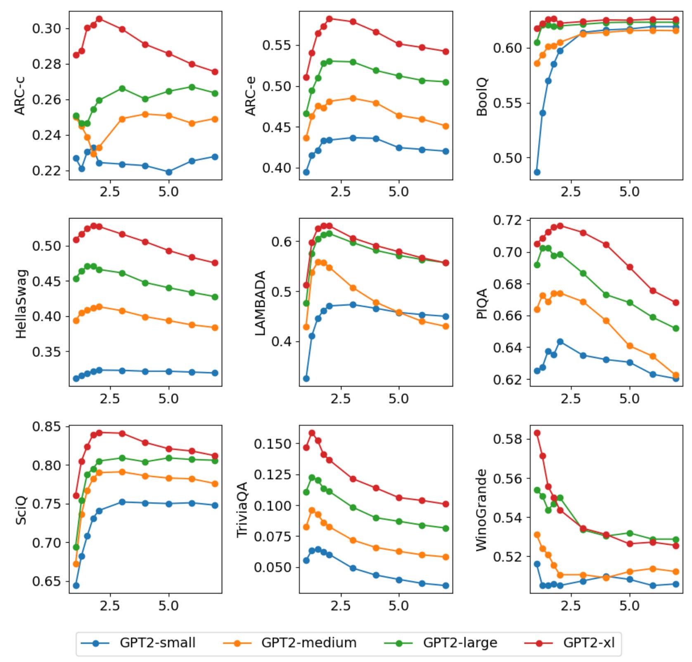

Figure 6: Standard benchmarks over various CFG strengths for GPT2 models

Results for Pythia
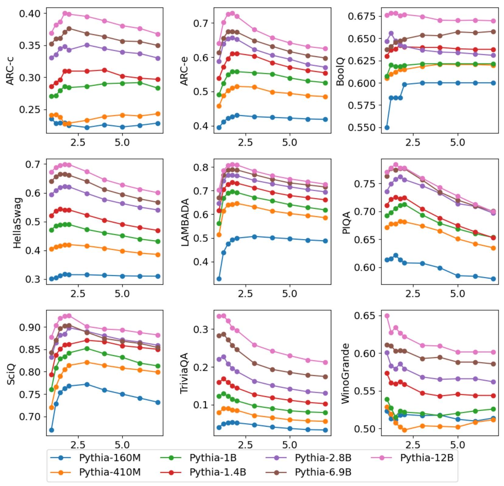

Figure 7: Standard benchmarks over various CFG strengths for Pythia models

Results for LLaMA
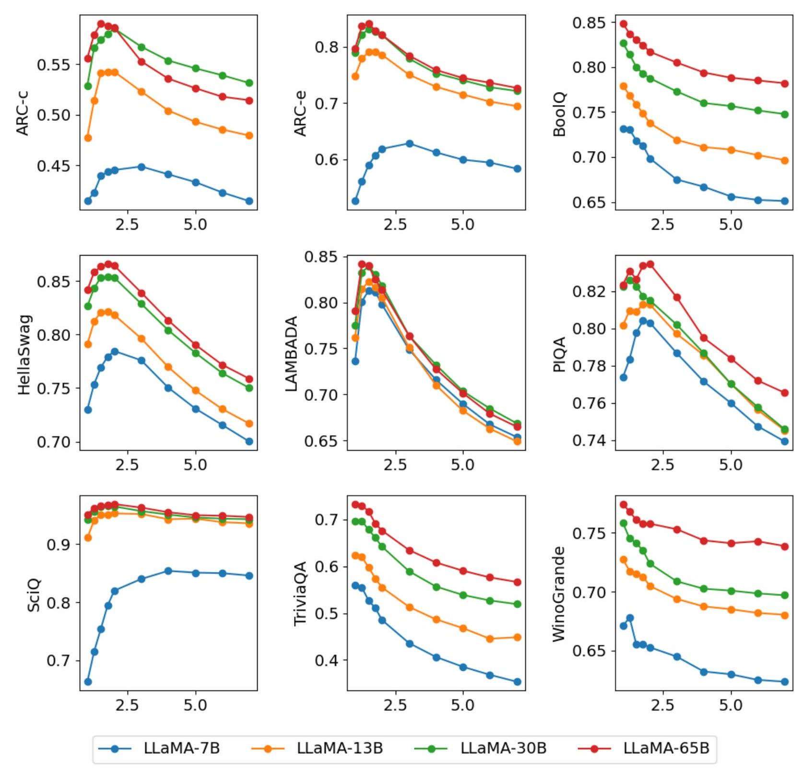

Figure 8: Standard benchmarks over various CFG strengths for LLaMA models

\section*{Accuracy vs. FLOP}
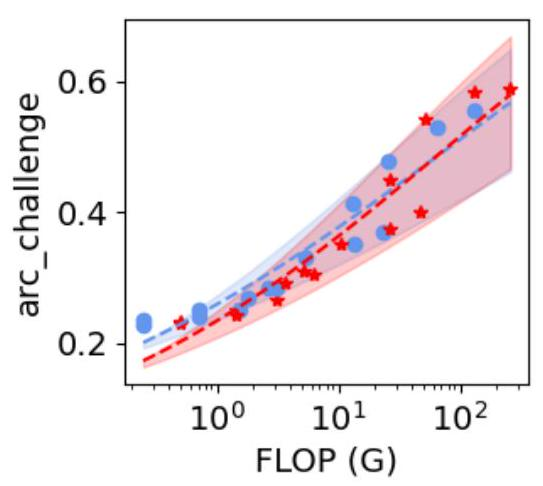
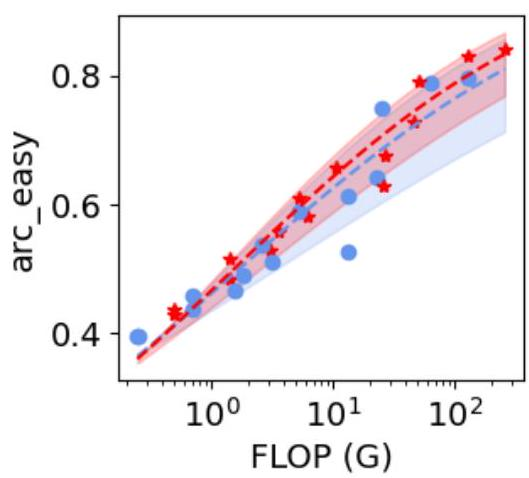
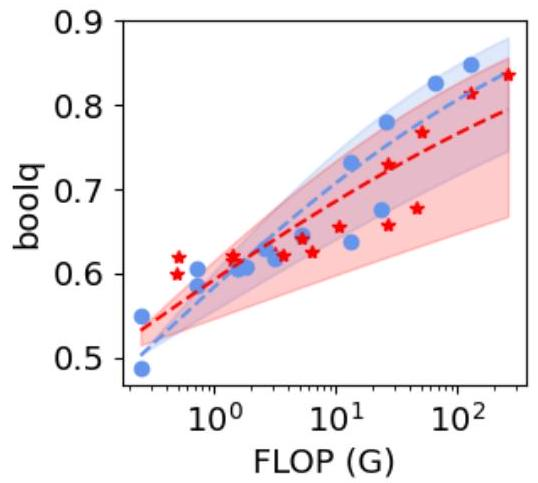
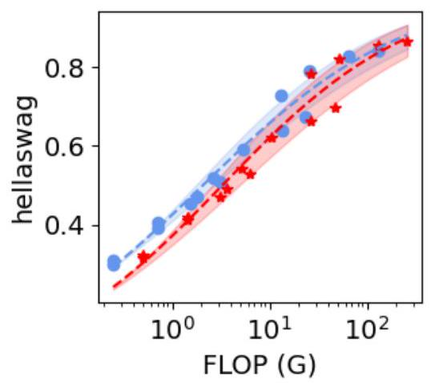
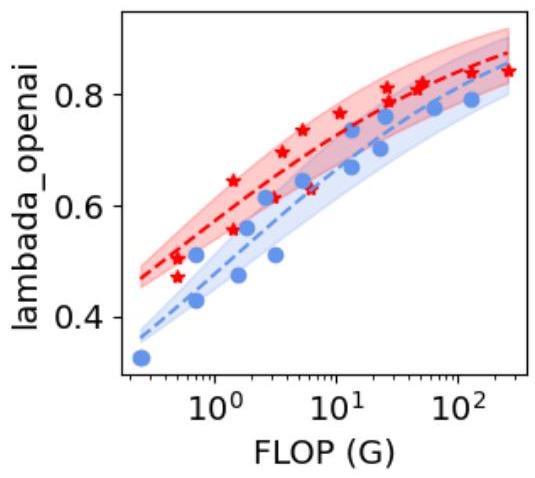
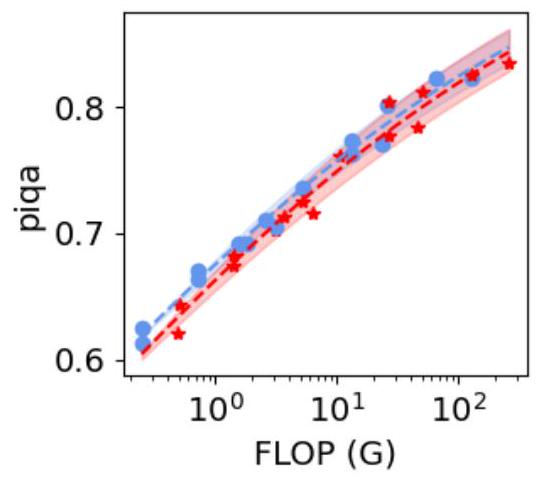
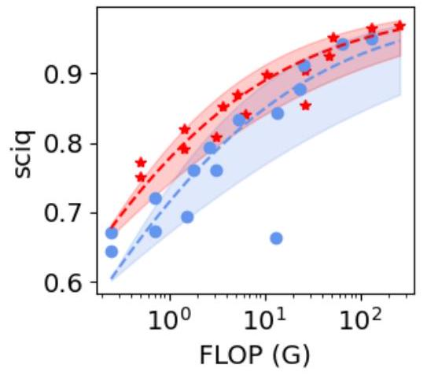
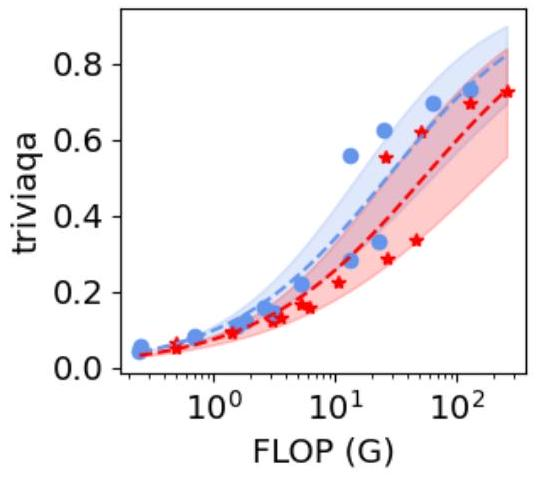
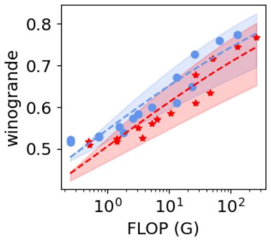
- Vanilla $\quad$ CFG --- Vanilla regression --- CFG regression

Figure 9: Accuracy vs. FLOP per token at inference.
Blue point: a model without CFG from any of the three model families (GPT-2, Pythia, LLaMA).
Red point: a model with the best CFG from any of the three model families.
The dashed curves: the regression curves (logistic regression between log-FLOP and accuracy) of their groups.

The answer to this question depends on the number of tokens $S$ the user wishes to store in the kv-cache. Intuitively, a smaller model with CFG is more memory-efficient for $S$ below a certain threshold, $\hat{S}$. For $S>\hat{S}$, though, the token cost becomes the dominant factor, and a vanilla model without CFG is the more prudent choice.
To determine this $S$, we define the following memory cost functions for $M-\mathrm{CFG}$ and $M^{\prime}$ as follows:
$$
\begin{gather*}
\operatorname{cost}_{M-\mathrm{CFG}}(S)=P+2 C S  \tag{8}\\
\operatorname{cost}_{M^{\prime}}(S)=2 P+C^{\prime} S \tag{9}
\end{gather*}
$$

Setting $\operatorname{cost}_{M-\mathrm{CFG}}(S)=\operatorname{cost}_{M^{\prime}}(S)$ and solving for $S$, we find the sequence length where the memory requirements of $M$ and $M^{\prime}$ are equivalent:
$$
\begin{equation*}
\hat{S}=\frac{P}{2 C-C^{\prime}} \tag{10}
\end{equation*}
$$

Equations 8,9 , and 10 show us that, if the user wishes to support $S>S$, and the GPU's VRAM can accommodate more than $\operatorname{cost}_{M^{\prime}}(\hat{S})$, then deploying $M^{\prime}$ is advantageous over $M$-CFG. This analysis is encapsulated in Figure 10.

It must be noted that access to a model of double the size may not be feasible or could be cost-prohibitive to train. In such cases, where the desired performance improvement cannot be achieved by doubling the model size, $M$ - CFG stands as the sole viable alternative.

\section*{C.4. HumanEval benchmark}

In Section 3.3.1, we explain our experiments on CodeGen-350M-mono, CodeGen-2B-mono and CodeGen-6B-mono and show their performances in the HumanEval benchmark with various CFG for temperature 0.2 in Table 2 The full results for temperature $=0.2,0.6,0.8$ are shown below in Table 7. 8 and 97. We also put the pass @ $k$-to- $\gamma$ curves of different temperatures together to show how the temperatures affect the impact of CFG when the model size and $k$ are fixed in Figure 11, 12 and 13
In addition, we breakdown the result of CodeGen-350Mmono on HumanEval benchmark into individual tasks. We plot the "accuracy with cfg" vs. "accuracy without cfg" charts to visualize the outperform/underperform distributions among all tasks. The plots are shown in Figure 11

\section*{C.5. Deliberative Prompting: Chain-of-Thought}

In this subsection we provide additional results for 3.2. In Figure 17 we provide results on $A Q u A$ dataset and in Tables 16 and 15 we provide a qualitative comparison of CoT
with and without CFG. These results support our finding that using CFG increases the percentage of CoT which results in a valid answer and boost the model performances.
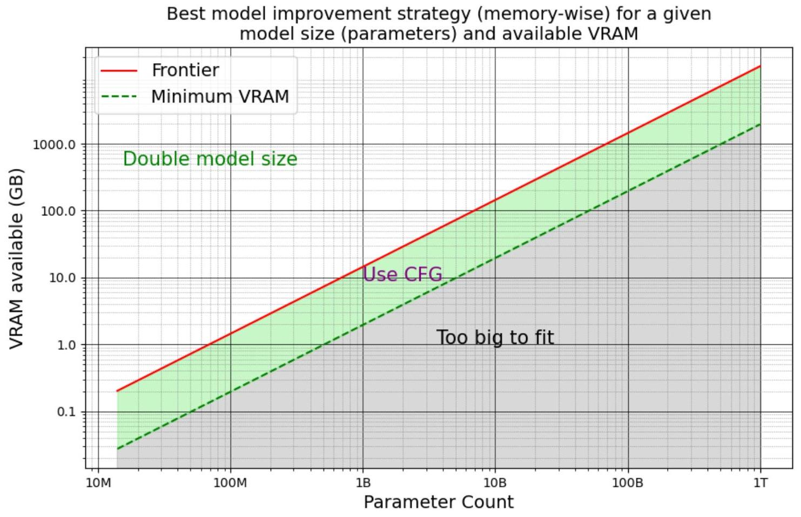

Figure 10: Decision-making function to determine how to enhance a given model's performance in inference, considering the model's size and the available VRAM on the GPU. Half-precision is assumed in calculations.
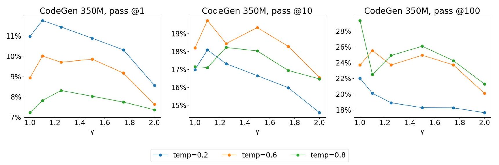

Figure 11: CodeGen-350M-mono performance on HumanEval with various CFG strengths
\begin{tabular}{|c|c|c|c|c|c|c|c|c|c|c|c|}
\hline & \multicolumn{3}{|c|}{ARC-c} & & \multicolumn{2}{|l|}{ARC-e} & \multicolumn{3}{|c|}{BoolQ} & \multicolumn{2}{|l|}{HellaSwag} \\
\hline & Basel & ne & Ours & & Baseline & Ours & Baseline & e O & & Baseline & Ours \\
\hline G-s & 22.7 & & 23.0 & & 39.5 & 42.1 & 48.7 & 57 & & 31.1 & 31.9 \\
\hline G-m & 25.0 & & 23.9 & & 43.6 & 47.6 & 58.6 & 60 & & 39.4 & 40.9 \\
\hline G-1 & 25.1 & & 24.7 & & 46.6 & 51.0 & 60.5 & 62 & & 45.3 & 47.1 \\
\hline G-xl & 28.5 & & 30.0 & & 51.1 & 56.5 & 61.8 & 62 & & 50.9 & 52.4 \\
\hline P-160M & 23.5 & & 23.0 & & 39.5 & 42.2 & 55.0 & 58 & & 30.1 & 31.2 \\
\hline P-410M & 24. & & 23.8 & & 45.7 & 50.3 & 60.6 & 61 & & 40.6 & 41.6 \\
\hline P-1B & 27.0 & & 28.0 & & 49.0 & 54.9 & 60.7 & 61 & & 47.1 & 48.9 \\
\hline P-1.4B & 28.6 & & 29.6 & & 53.8 & 59.6 & 63.0 & 63 & & 52.1 & 54.3 \\
\hline P-2.8B & 33.1 & & 34.5 & & 58.8 & 65.4 & 64.7 & 64 & & 59.3 & 61.9 \\
\hline P-6.9B & 35.2 & & 36.1 & & 61.3 & 67.4 & 63.7 & 64 & & 64.0 & 66.5 \\
\hline P-12B & 36.9 & & 38.7 & & 64.1 & 72.6 & 67.6 & 67 & & 67.3 & 69.6 \\
\hline L-7B & 41.5 & & 43.9 & & 52.5 & 58.9 & 73.1 & & & 73.0 & 76.9 \\
\hline L-13B & 47.8 & & 54.2 & & 74.8 & 79.1 & 78.0 & 75. & & 79.1 & 82.1 \\
\hline L-30B & 52.9 & & 57.4 & & 78.9 & 83.2 & 82.7 & 80. & & 82.6 & 85.3 \\
\hline L-65B & 55.6 & & 59.0 & & 79.7 & 84.2 & 84.8 & & & 84.1 & 86.3 \\
\hline & PiQ & & & & SciQ & Trivia & QA & WinoG & Grande & e LAMB & BADA \\
\hline & Base & Ours & & Base & Ours & Base & Ours & Base & Ours & s Base & Ours \\
\hline G-s & 62.5 & 63.8 & & 64.4 & 40.8 & 5.5 & 6.5 & 51.6 & 50.5 & 532.6 & 44.6 \\
\hline G-m & 66.4 & 66.9 & & 67.2 & 276.7 & 8.3 & 9.3 & 53.1 & 52.1 & 143.0 & 55.8 \\
\hline G-1 & 69.2 & 70.2 & & 69.4 & 478.8 & 11.1 & 12.0 & 55.4 & 54.4 & 47.7 & 60.5 \\
\hline G-xl & 70.5 & 71.3 & & 76.1 & 1082.4 & 14.7 & 15.2 & 58.3 & 55.6 & 651.2 & 62.5 \\
\hline P-160M & 61.4 & 62.1 & & 67.0 & 75.4 & 4.1 & 5.3 & 52.3 & 51.1 & 1322.8 & 47.4 \\
\hline P-410M & 67.1 & 67.8 & & 72.1 & 179.0 & 7.9 & 9.1 & 52.9 & 50.7 & 751.3 & 64.0 \\
\hline P-1B & 69.2 & 70.5 & & 76.0 & ( 82.9 & 12.3 & 12.3 & 53.9 & 51.5 & 56.2 & 69.0 \\
\hline P-1.4B & 71.1 & 72.5 & & 79.4 & 405.1 & 15.9 & 15.9 & 57.4 & 56.0 & . 61.6 & 72.7 \\
\hline P-2.8B & 73.6 & 75.8 & & 83.3 & 388.2 & 22.1 & 20.9 & 60.1 & 57.9 & - 64.6 & 76.5 \\
\hline P-6.9B & 76.3 & 77.4 & & 84.3 & 389.7 & 28.2 & 27.2 & 61.1 & 60.3 & 367.1 & 78.8 \\
\hline P-12B & 77.0 & 78.4 & & 87.7 & 7 91.9 & 33.4 & 32.1 & 65.0 & 63.4 & 4 70.4 & 80.6 \\
\hline L-7B & 77.4 & 79.8 & & 66.3 & 375.4 & 56.0 & 52.7 & 67.1 & 65.5 & 73.6 & 81.3 \\
\hline L-13B & 80.1 & 80.9 & & 91.1 & 195.1 & 62.4 & 59.8 & 72.8 & 71.5 & 576.2 & 82.2 \\
\hline L-30B & 82.3 & 82.3 & & 94.3 & 366.4 & 69.7 & 67.9 & 75.8 & 74.1 & 177.5 & 83.9 \\
\hline L-65B & 82.3 & 82.6 & & 95.1 & 196.6 & 73.3 & 71.8 & 77.4 & 76.1 & 1 79.1 & 84.0 \\
\hline
\end{tabular}

Table 5: Results of general natural language benchmarks. "G" stands for GPT2, "P" for Pythia and "L" for LLaMa. In each cell, the first value is the result for $\gamma=1$ (baseline) and the second value is the result for $\gamma=1.5$ (ours). LLaMA 7B with CFG on Lambada zero-shot already outperforms vanilla PaLM 540B, Chinchilla 70B, and GPT-3 175B, tops the SOTA leaderboard for Lambada zero-shot as of June 26th, 2023
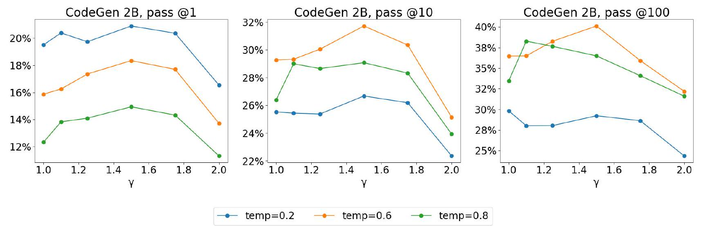

Figure 12: CodeGen-2B-mono performance on HumanEval with various CFG strengths
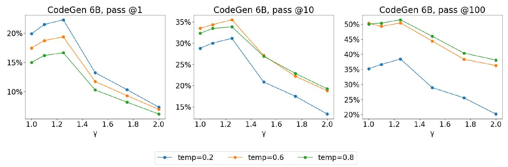

Figure 13: CodeGen-6B-mono performance on HumanEval with various CFG strengths
\begin{tabular}{lrr}
\hline & $p$-value & Win \\
\hline Lambada & 0.000 & CFG \\
WinoGrande & 0.003 & Vanilla \\
SciQ & 0.008 & CFG \\
TriviaQA & 0.008 & Vanilla \\
HellaSwag & 0.012 & $p>.01$ \\
PiQA & 0.030 & $p>.01$ \\
ARC-c & 0.216 & $p>.01$ \\
BoolQ & 0.345 & $p>.01$ \\
ARC-e & 0.355 & $p>.01$ \\
\hline
\end{tabular}

Table 6: ANCOVA $p$-value results for plots shown in Figure 9 We calculate ANCOVA on log-transformed variables and calculate significance at $p=.01$.
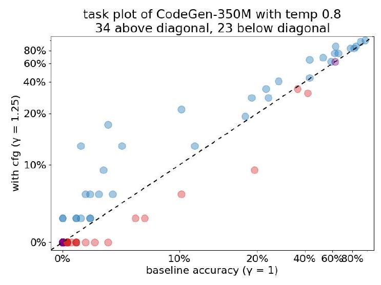

Figure 14: CodeGen-350M-mono HumanEval task-by-task plot with temp $=0.8$
Blue: CFG outperforms,
Purple: CFG ties with the baseline,
Red: CFG underperforms
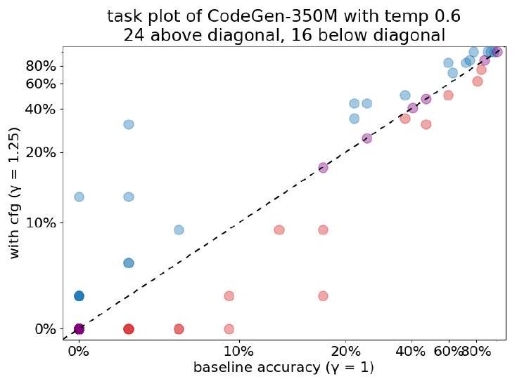

Figure 15: CodeGen-350M-mono HumanEval task-by-task plot with temp=0.6
Blue: CFG outperforms,
Purple: CFG ties with the baseline,
Red: CFG underperforms
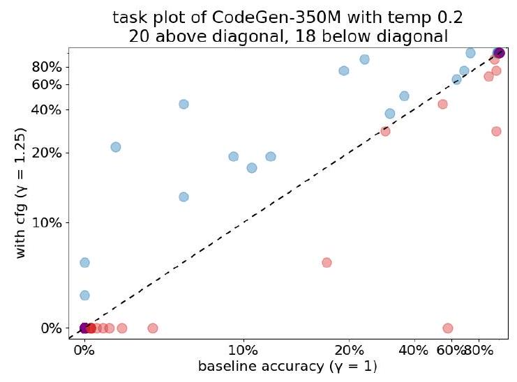

Figure 16: CodeGen-350M-mono HumanEval task-by-task plot with temp $=0.2$
Blue: CFG outperforms,
Purple: CFG ties with the baseline,
Red: CFG underperforms
\begin{tabular}{|c|c|c|c|c|c|c|c|c|c|}
\hline \multirow[b]{2}{*}{$\gamma$} & \multicolumn{3}{|c|}{temperature $=0.2$} & \multicolumn{3}{|c|}{temperature $=0.6$} & \multicolumn{3}{|r|}{temperature $=0.8$} \\
\hline & $\mathrm{k}=1$ & k=10 & k=100 & k=1 & k=10 & k=100 & k=1 & k=10 & k=100 \\
\hline 1.0 & 11.0\% & 17.0\% & 22.0\% & 8.9\% & 18.2\% & 23.7\% & 7.2\% & 17.2\% & 29.4\% \\
\hline 1.1 & 11.8\% & 18.1\% & 20.1\% & 10.0\% & 19.7\% & 25.5\% & 7.8\% & 17.1\% & 22.5\% \\
\hline 1.25 & 11.4\% & 17.3\% & 18.9\% & 9.7\% & 18.4\% & 23.7\% & 8.3\% & 18.2\% & 24.9\% \\
\hline 1.5 & 10.9\% & 16.7\% & 18.3\% & 9.9\% & 19.3\% & 24.9\% & 8.0\% & 18.0\% & 26.1\% \\
\hline 1.75 & 10.3\% & 16.0\% & 18.2\% & 9.2\% & 18.3\% & 23.7\% & 7.7\% & 16.9\% & 24.2\% \\
\hline 2.0 & 8.6\% & 14.6\% & 17.6\% & 7.6\% & 16.6\% & 20.1\% & 7.4\% & 16.5\% & 21.3\% \\
\hline
\end{tabular}

Table 7: CodeGen-350M-mono results
\begin{tabular}{|c|c|c|c|c|c|c|c|c|c|}
\hline \multirow[b]{2}{*}{$\gamma$} & \multicolumn{3}{|c|}{temperature $=0.2$} & \multicolumn{3}{|c|}{temperature $=0.6$} & \multicolumn{3}{|c|}{temperature $=0.8$} \\
\hline & k=1 & k=10 & k=100 & k=1 & k=10 & k=100 & $\mathrm{k}=1$ & k=10 & k=100 \\
\hline 1.0 & 19.5\% & 25.5\% & 29.8\% & 15.9\% & 29.3\% & 36.5\% & 12.3\% & 26.4\% & 33.5\% \\
\hline 1.1 & 20.4\% & 25.4\% & 28.0\% & 16.3\% & 29.3\% & 36.5\% & 13.8\% & 29.0\% & 38.3\% \\
\hline 1.25 & 19.7\% & 25.4\% & 28.0\% & 17.4\% & 30.1\% & 38.3\% & 14.1\% & 28.7\% & 37.6\% \\
\hline 1.5 & 20.9\% & 26.7\% & 29.2\% & 18.3\% & 31.7\% & 40.1\% & 14.9\% & 29.1\% & 36.5\% \\
\hline 1.75 & 20.4\% & 26.2\% & 28.6\% & 17.7\% & 30.4\% & 35.9\% & 14.3\% & 28.3\% & 34.1\% \\
\hline 2.0 & 16.5\% & 22.4\% & 24.4\% & 13.7\% & 25.2\% & 32.2\% & 11.3\% & 23.9\% & 31.6\% \\
\hline
\end{tabular}

Table 8: CodeGen-2B-mono results
\begin{tabular}{|c|c|c|c|c|c|c|c|c|c|}
\hline \multirow[b]{2}{*}{$\gamma$} & \multicolumn{3}{|c|}{temperature $=0.2$} & \multicolumn{3}{|c|}{temperature $=0.6$} & \multicolumn{3}{|c|}{temperature $=0.8$} \\
\hline & $\mathrm{k}=1$ & k=10 & k=100 & $\mathrm{k}=1$ & k=10 & $\mathrm{k}=100$ & $\mathrm{k}=1$ & k=10 & $\mathrm{k}=100$ \\
\hline 1.0 & 19.5\% & 25.5\% & 29.8\% & 15.9\% & 29.3\% & 36.5\% & 12.3\% & 26.4\% & 33.5\% \\
\hline 1.1 & 20.4\% & 25.4\% & 28.0\% & 16.3\% & 29.3\% & 36.5\% & 13.8\% & 29.0\% & 38.3\% \\
\hline 1.25 & 19.7\% & 25.4\% & 28.0\% & 17.4\% & 30.1\% & 38.3\% & 14.1\% & 28.7\% & 37.6\% \\
\hline 1.5 & 20.9\% & 26.7\% & 29.2\% & 18.3\% & 31.7\% & 40.1\% & 14.9\% & 29.1\% & 36.5\% \\
\hline 1.75 & 20.4\% & 26.2\% & 28.6\% & 17.7\% & 30.4\% & 35.9\% & 14.3\% & 28.3\% & 34.1\% \\
\hline 2.0 & 16.5\% & 22.4\% & 24.4\% & 13.7\% & 25.2\% & 32.2\% & 11.3\% & 23.9\% & 31.6\% \\
\hline
\end{tabular}

Table 9: CodeGen-6B-mono results
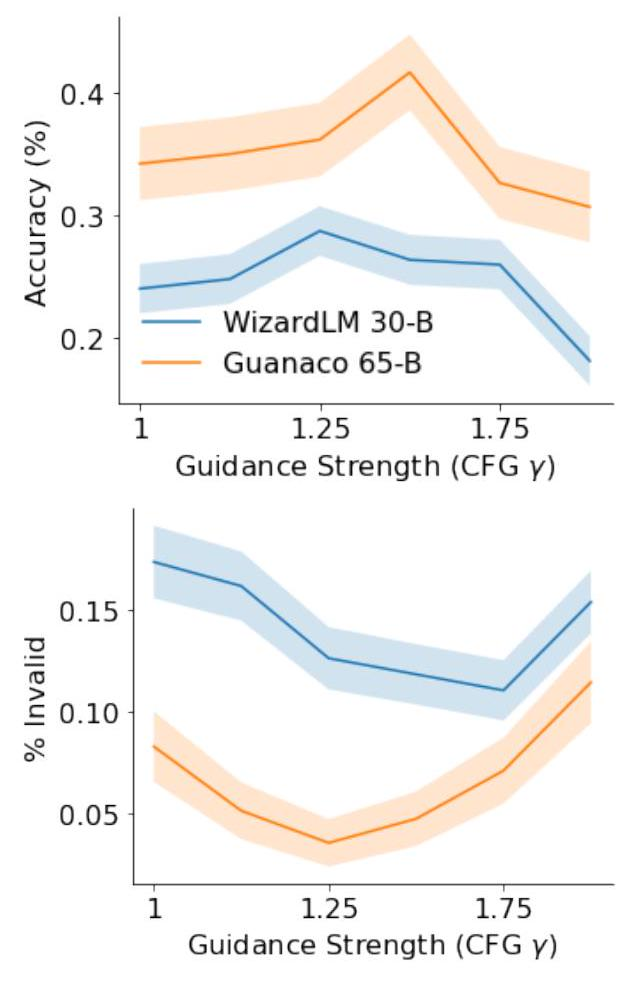

Figure 17: CFG impact on chain-of-thought prompting with respect to AQuA dataset. For small CFG values, using CFG increases the percentage of chains which end in a valid answer structure while increasing the model accuracy. For large values the invalid percentage remains small but the accuracy drop.

\section*{D. Additional experiments}

\section*{D.1. Prompting experiments for code generations}

We summarize two exploratory experiments which are briefly mentioned in 3.3.1 and precedes our systematic evaluations on HumanEval.
1. The first experiment is to prompt GPT-J (Wang \& Komatsuzaki, 2021 ${ }^{12}$ for code completions of certain languages, and analyze the consistencies between the prompt languages and the completion languages.
2. The second experiment is to prompt CodeGen-350Mmono (Nijkamp et al., 2023) to complete a specific image generation function, and analyze multiple aspects of the completions (syntax, the return type, the return shape and the return quality).

Prompting GPT-J for different coding language is inspired by one of the experiments in (Biderman \& Raff, 2022). Their observation is that the model often generates noncode or not the programming language it was prompted for.

We generate 100 samples (5 runs for 5 prompts) for each guidance strength $\gamma=1,1.25,1.5,1.75$. We observe the $\gamma=1$ baseline generating the correct programming language $73 \%$ of the time, jumping to $86 \%$ with $\gamma=1.25$ ( $p$-value 0.01 ). See 10 for more details.
Next, we turn to CodeGen-350M-mono (Nijkamp et al., 2023) for code completion for a fixed image generation function. The prompt is the following:
```
# Return a red square on a 32x32 picture in
    the form of numpy array with RGB
    channels
def draw() -> np.ndarray:
```

We produce 1600 completions for each CFG strength $\gamma=$ $1.0,2.0$. The results are evaluated based on:
- syntax correctness (executing without errors),
- return type correctness (returning a numpy array),
- return shape correctness (having shape $(32,32,3)$ ),
- the $l^{2}$-distance to a reference picture (picture of pure color in red).

When calculating the $l^{2}$-distance, all pixels are normalized to the range $[0,1]$. The result is summarized in Table 11

The difference is fairly noticeable, where the biggest improvement comes from the return type correctness.

\footnotetext{
${ }^{12}$ GPT-J is not specifically trained for code generation task. But it was exposed to some code data in its training.
}
\begin{tabular}{rrrrr|rrrrr}
\hline$\gamma=1$ & not code & C & Java & Python & $\gamma=1.25$ & not code & C & Java & Python \\
\hline Unspecified & 9 & 9 & 6 & 1 & Unspecified & 4 & 11 & 9 & 1 \\
C & 3 & 19 & 3 & 0 & C & 4 & 19 & 2 & 0 \\
Java & 5 & 0 & 19 & 1 & Java & 2 & 0 & 23 & 0 \\
Python & 6 & 0 & 0 & 19 & Python & 1 & 0 & 1 & 23 \\
\hline$\gamma=1.5$ & not code & C & Java & Python & $\gamma=1.75$ & not code & C & Java & Python \\
\hline Unspecified & 6 & 8 & 8 & 2 & Unspecified & 6 & 6 & 10 & 1 \\
C & 5 & 18 & 2 & 0 & C & 8 & 16 & 1 & 0 \\
Java & 3 & 0 & 22 & 0 & Java & 2 & 0 & 23 & 0 \\
Python & 3 & 0 & 0 & 22 & Python & 5 & 0 & 1 & 19 \\
\hline
\end{tabular}

Table 10: Confusion matrix for generating code tests with GPT-J. We prompt it to generate code in some programming language (rows) and compare with the generated programming language (columns). The overall accuracy results for $\gamma=1,1.25,1.5,1.75$ are $73 \%, 86 \%, 81 \%, 77 \%$, respectively.
\begin{tabular}{lccr}
\hline & $\gamma=1$ & $\gamma=2$ & improvement \\
\hline correct syntax & 419 & 574 & $37 \%$ \\
correct return type & 289 & 546 & $89 \%$ \\
correct shape & 284 & 538 & $89 \%$ \\
$l^{2}$-distance to reference & 0.111 & 0.090 & $23 \%$ \\
\hline
\end{tabular}

Table 11: Different $\gamma$ for code completion performing the image generation task

\section*{E. Further Comparison between CFG and Instruction-Tuning}

We noted in the main body, in Section 5, that Instructiontuned models and CFG both operated to reduce the entropy of the sampling distribution, $p(y \mid x)$, but that they did so in different ways from each other. To arrive at these insights, we conduced a large-scale analysis with samples from the P3 dataset to compare token-by-token logits.
While the findings we presented in the main body were negative, here we present samples where Instruction-tuned models and base models with CFG were similar (using Falcon-7b-base and Falcon-7b-Instruct models, as in Section 57. In Table 13 we show examples where CFG is the most similar to Instruction tuned models, in terms of top-p token overlap, and in 14 , we show examples where CFG is the least similar to Instruction-tuned models. An immediate trend that sticks out is the specificity of the questions. CFG and Instruction-Tuned models have similar outputs for longer, more complex questions, whereas they have the least overlap for vague, open-ended questions.
We explore this idea further in Table 12, where we show the datasets that CFG shows similar behavior to Instructiontuning. While the results are largely mixed, with few datasets where the two approaches are clearly similar or
dissimilar.
Finally, in Figure 19. we show the comparison metrics that we calculated, by overall word index of the generation. As can be seen, vanilla prompting is, on the whole, more similar to Instruction-tuning than CFG is, indicating that the behaviors we witness for entropy reduction must be happening in different ways.
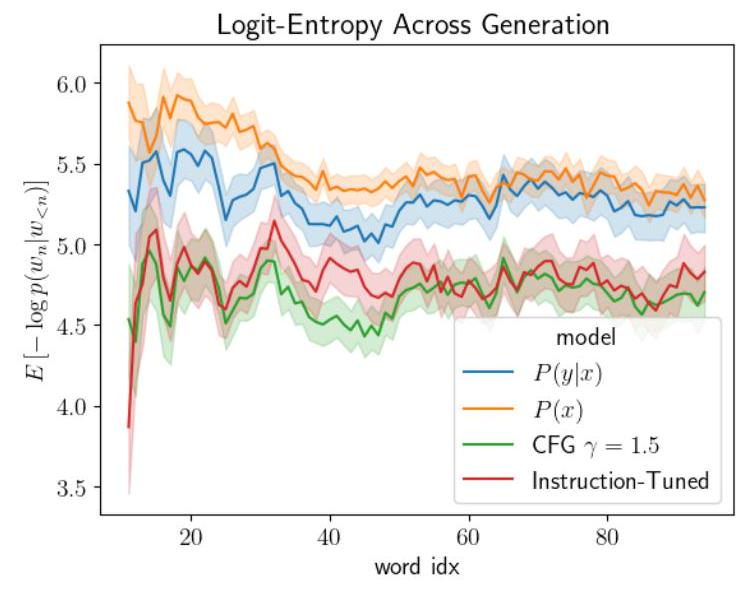
(a) Entropy of logits for the vanilla prompted distribution $\mathrm{P}(y \mid x)$, the unprompted distribution, $\mathrm{P}(x)$, the $\mathrm{CFG}-\gamma=1.5$ distribution and an instruction-tuned model $\mathrm{P}_{\text {instruct }}(y \mid x)$.
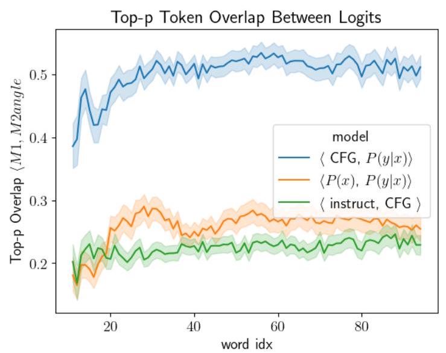
(b) Number of tokens overlapping in top- $\mathrm{p}=90 \%$ of vocabulary distributions between that of: CFG , that of the vanilla prompted model, $p(y \mid x)$, and that of the unprompted model, $\mathrm{P}(x)$.

Figure 18: We show into how CFG alters the logit distribution of the vanilla prompted model, $\mathrm{P}(y \mid x)$. CFG lowers the entropy to a level roughly similar to instruction-tuned model variant. CFG shares roughly $50 \%$ of the tokens in top- $\mathrm{p}=0.9$ as the vanilla $\mathrm{P}(y \mid x)$ model.

\section*{F. Generation samples}

\section*{F.1. Continuations}

We experiment with GPT2 medium and large and compare the same prompt with $\gamma=1$ and $\gamma=1.5$. We show that $\gamma=1.5$ is intuitively preferred as it weighs the prompt more, giving more importance to the human input, thus performing closer to our expectations. Indeed, GPT2-medium[ $\gamma=1.5]$ gives more satisfactory results than GPT2-large $[\gamma=1]$. These results are not to take lightly: on our CPU, running two GPT2-medium passes per has the same latency of a single GPT2-large pass; GPT2-large is twice as long to evaluate as GPT2-medium and requires twice the the amount of memory, takes more compute to train, and does not expose a controllable prompt conditioning, while being less satisfactory.

\section*{G. Experiments with GPT4All}

\section*{G.1. System prompts}

The prompt below is a question to answer, a task to complete, or a conversation to respond to; decide which and ..
1. ... write a rap response.
2. ... write an appropriate response as an expert of the field.
3. ... write an appropriate response as a PhD thesis.
4. ... write an appropriate response as a mathematical proof.
5. ... write an appropriate response as an epic poem.
6. ... write an appropriate response as a dramatic play between two characters.
7. ... write an inappropriate response.
8. ... write an appropriate response as a Freudian analysis.
9. ... write a scientific paper responding to it.
10. ... write an appropriate response using metaphors.
11. ... write an appropriate response using deep emotional language.
12. ... write an appropriate extremely thorough response.
13. The prompt below is a question to answer, a task to complete, or a conversation to respond to from a 5 years old; decide which and write an appropriate response.
14. ... write an appropriate response in three parts.
15. ... write an appropriate response as a Python program.
16. ... write an appropriate response as a JSON datastructure.
17. ... write an appropriate response as a list.
18. ... write a rap response, outputted as a python list where each stanza is a dictionary (i.e. [\{'stanza': '’\}, \{'stanza': ''\},...].
19. ... write an appropriate an enthusiastic response to it.
20. ... write a saddening response to it.
21. ... write a love letter responding to it.
22. ... write an irritating response to it.
23. ... write a seductive response to it.

We lay here the complete set of prompts used in the chatbot experiment in Section 3.4

\section*{G.2. User prompts}
1. Why is The Matrix a great movie?
2. Why did the chicken cross the road?
3. What is the meaning of life?
4. What is the answer to life, the universe, and everything?
5. What is the best way to cook a steak?
6. How do you make a pizza?
7. What is the best way to make a pizza?
8. Why is the sky blue?
9. Who is the best basketball player of all time?
10. What are trans fats?
11. What are transformers?
12. What are neural networks?
13. What is the best way to learn a language?
14. Who is Optimus Prime?
15. Write a haiku about the meaning of life.
16. Write the python code to print the first 100 prime numbers.
17. Give me a recipe for a delicious meal.
18. How to implement authentication with Flask?
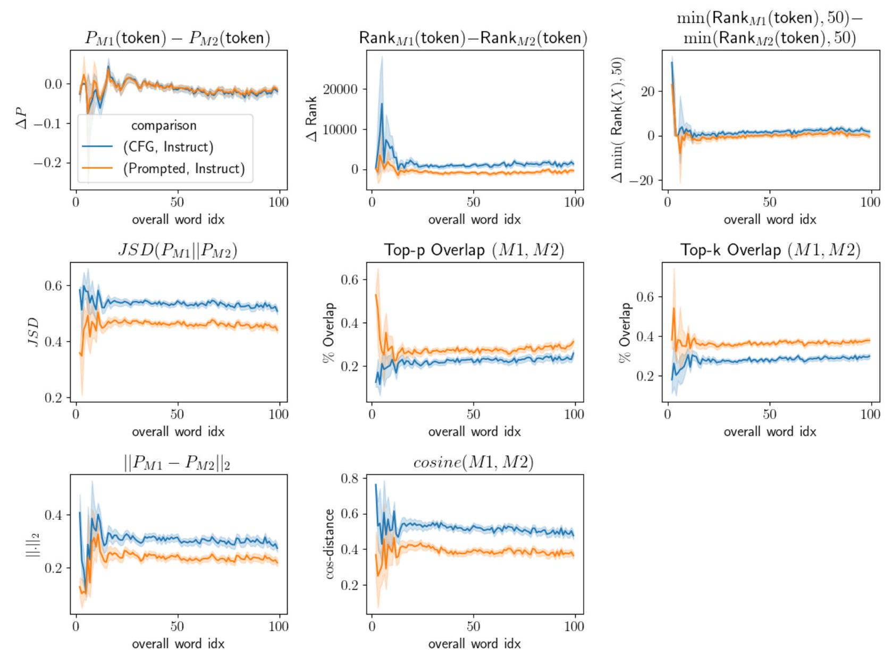

Figure 19: Comparison of (CFG- $\gamma=1.5$, Instruct) logits across a large sample set from P3.
19. What is the easiest python library to bootstrap a web app?
20. I am in France and I want to be polite, give me some advice.
21. Is Yann LeCun the father of deep learning?
22. Is Yann LeCun the father of convolutional neural networks?
23. Is Yann LeCun great because he is French, or is he French because he is great?
24. Is Yann LeCun great because he is French, or despite being French?
25. Explain the algorithm AlphaZero in few sentences.
26. I want to learn how to play chess, what is the best way to start?
27. How are metal vocalists able to scream for so long?
28. What is the best way to learn how to sing?
29. What is the best way to learn how to play the guitar?
30. Give me compelling ideas for a startup.
31. Give me compelling ideas for a $\mathrm{D} \& \mathrm{D}$ campaign in a medfan version of Italy.
32. Give me compelling ideas for a D\&D campaign in a medfan version of Greece.
33. Give me compelling ideas for a D\&D campaign in a medfan version of France.
34. Write the lyrics of a death metal song about chickens.
35. Write the lyrics of a death metal song about AI research.
36. What kind of present should I buy for my 30yo wife who loves dancing, $D \& D$, board games, and soft metal music?
\begin{tabular}{lcll}
\hline P3 Dataset & mean & std & count \\
\hline Highest $\langle$ CFG, Instruct〉 Similarities & & & \\
\hline SuperGLUE wsc.fixed p is are r score eval & 31.89 & $+/-22.06$ & 42 \\
SciQ Multiple Choice Closed Book & 5.82 & $+/-13.27$ & 43 \\
CosE v1.11 description question option text & 5.70 & $+/-9.05$ & 43 \\
RottenTomatoes Writer Expressed Sentiment & 4.93 & $+/-7.45$ & 41 \\
WinograndeXL fill in the blank & 4.42 & $+/-10.51$ & 44 \\
RottenTomatoes Text Expressed Sentiment & 2.93 & $+/-7.98$ & 45 \\
Quarel: choose between & 2.51 & $+/-12.39$ & 43 \\
SuperGLUE wic GPT 3 prompt score eval & 2.15 & $+/-5.94$ & 44 \\
WinograndeDebiased Replace score eval & 2.02 & $+/-24.46$ & 41 \\
PAWS final context question (no label) & 1.37 & $+/-4.81$ & 43 \\
\hline Lowest < CFG, Instruct〉 Similarities & & & \\
\hline paws labeled final paraphrase task & -11.71 & $+/-11.03$ & 42 \\
super glue copa more likely & -11.94 & $+/-6.38$ & 45 \\
piqa Does this solution make sense sol2 & -12.22 & $+/-9.24$ & 42 \\
super glue copa cause effect score eval & -12.82 & $+/-5.8$ & 41 \\
rotten tomatoes Sentiment with choices & -13.07 & $+/-7.96$ & 41 \\
super glue copa plausible alternatives score eval & -15.07 & $+/-5.69$ & 41 \\
super glue copa C1 or C2 premise so because & -15.38 & $+/-6.43$ & 41 \\
super glue copa more likely score eval & -16.54 & $+/-5.45$ & 43 \\
cos e v1.11 question option description id & -17.60 & $+/-14.06$ & 41 \\
rotten tomatoes Reviewer Enjoyment Yes No & -18.16 & $+/-16.02$ & 45 \\
\hline
\end{tabular}

Table 12: Datasets in P3 where Instruction-Tuned models were the most and least similar, in terms of top-p overlap, to CFG models. The count column shows the number of datapoints that were sampled from each dataset to calculate the overlap.
37. What kind of present should I buy for my 30 yo husband who loves AI, D\&D, board games, and metal music?
38. Are nerds trendy?
39. What is a taxonomy?
40. What are the main differences between driving in France and in the US?
41. Who are artists that are similar to Gojira?
42. Who are artists that are famous in the US but not abroad?
43. Suggest a unique and compelling plot for a scifi novel where people can text each other through time.
44. Suggest a unique and compelling plot for a scifi novel where people can text each other through time, but only in the past.
45. What was the Cambridge Analytica scandal?
46. Tell me about the band Halocene.

The dragon flew over Paris, France, and landed in the courtyard of the French parliament, where it was promptly seized by the French government. But the scene was not quite what it seemed.
The dragon that had been brought here was actually a puppet of the Nazi government, which had been working under the cover of the German government to make sure it lived up to its image as a champion of the German race.
Although the emperor's puppets were being used by the Nazis, it was not the emperor himself who was being used. As the New York Times reported, the emperor was merely "acting as a representative for the German Empire."
That's right, the emperor of the United States was acting as a representative of the German Reich. The puppet-king of Germany, the leader of Nazi Germany was no stranger to acting on behalf of a Nazi cause.

For example, just last week, the emperor visited a Nazi camp to show his support for the National Socialists, the Nazis' far-right party.
And in one particularly egregious episode, the emperor actually tried to keep his distance from a Nazi leader:
The emperor is a member of the German Reich and is therefore, as president, the representative of the German Reich.

Figure 20: GPT2-medium[ $\gamma=1]$

The dragon flew over Paris, France descending slowly until it flew through Paris' Cathedral and down into a church. Suddenly, dragon flew back again before dropping back into the church. When it landed on the ground, dragon screamed and cried in pain.
The dragon's cries were heard in France and all over the world. The dragon screamed so loud, people at the airport could hear the dragon's screams. The dragon's cries were heard worldwide for many years. It was reported that the dragon was able to sing for thousands of years.
When the dragon was born, it was able to fly on all fours, and it could grow long horns. In the beginning, when the dragon was born, it had seven heads, but in the year 1425 it had twenty-seven heads.

When the dragon was born, it had the power of the sun. The dragon was able to create a massive flame in the sky. After the dragon was born, it transformed into a beautiful female form with a long, thin tail. She had a golden body, and she had two large wings on the back of her head. She had a red eye, and two white eyes.

The dragon's horn appeared in the skies around Paris.

Figure 21: GPT2-medium[ $\gamma=1.5]$

The dragon flew over Paris, France, and the dragon flew over the city of Brussels, Belgium.
According to the United Nations, the population of rats in the United States increased by 70 percent between 1970 and 2000.
It's a problem that the CDC has been tackling for more than a decade. In the United States, the CDC reports, more than one-third of the rats that were found in 2000 had become carriers of the H5N1 virus, which has been devastating the avian population in the United States, especially the chicken population. The bird flu virus is spread by both bird and human.
The H5N1 virus is also being transmitted through rats. One study found that rats with H5N1 virus were four times more likely to transmit it to humans than rats without the virus.
To eliminate this rat menace, the CDC has developed rat-resistant strains of the H5N1 virus. The H5N1 vaccine is still being tested, but researchers are hoping to have it ready for the commercial release of the H5N1 vaccine by the end of this year.
"We don't want to be the first country to develop this," says Dr. Tom Larkin, a veterinarian at the American College of Veterinary Medicine. "

Figure 22: GPT2-large[ $\gamma=1]$

The dragon flew over Paris, France, landing on a busy avenue. It flew over Manhattan, New York, landing on Fifth Avenue. It flew over Tokyo, Japan, landing on the Ginza shopping center.

The dragon landed in a small park, where it was met by curious residents.
A giant dragon appeared in the park.
The dragon's main body was a humanoid dragon, with green eyes and wings. Its wings were much larger than normal dragons.

The dragon was adorned in a golden mask.
"How about it, young one?"
"Hahaha!"
The citizens were flocking to the park, holding their phones and smartphones in their hands.
"It's the golden dragon, huh?"
"Hahaha, you're right. The golden dragon is really a cool character. It's definitely a character who's worth watching."
"The golden dragon is my favorite, but I'm so jealous of the blue dragon."
"I can't imagine how much it cost to make that mask. Oh well, the golden dragon won't be a problem for me."
"Ah, but the blue dragon was a bit too much."

Figure 23: GPT2-large[ $\gamma=1.5]$

Top Sentences in P3 where CFG is MOST Similar to Instruction-Tuned Models
Build a movie plot around this: What is the team? Ragtag bunch of girls
Here's a complex question that requires someone to reason about the input, can you answer it? What city was the capital of the Ostrogothic Kingdom and the birth place of Ornella Fiorentini?
Who had more of their English novels turned into Oscarnominated films, Raja Rao or Pat Conroy?
Nokia, Texas Instruments and other leading makers of mobile phones have formally complained to Brussels that Qualcomm, the US mobile chipmaker, has unfairly used its patents on 3G technologies. Question: Texas Instruments produces mobile phones. True or False?
Context: Patting her back, the woman smiled at the girl . Question: "her" is the woman. True or false? Answer:
Take the following as truth: The American Combat Association is a small mixed martial arts company founded by Olympic wrestler, world Abu Dhabi champion and UFC fighter Kamal Shalorus and professional mixed martial arts fighter, Broadcaster and American professional wrestler Matthew "The Granimal" Granahan. Then the following statement: "The American Combat Association was founded by two Olympic wrestlers." is true, false, or inconclusive?
Pick the most correct option to answer the following question. Some antibiotics used to treat infections in humans are also used to treat chickens, but some groups oppose this practice. The overuse of the antibiotics will most likely influence the natural selection of which type of organisms? Options:A : chickens that naturally make the antibiotics - B : microbes that are resistant to the antibiotics - C: microbes that are susceptible to the antibiotics - D: chickens that are resistant to infection
Jennifer dragged Felicia along to a self help workshop about how to succeed, because _ wanted some company. Replace the _ in the above sentence with the correct option: - Jennifer - Felicia
Brian could learn to swim with the right instruction, but it was hard to tell whether lifeguard Matthew was qualified to provide it, since _ had never swum before. Replace the _ in the above sentence with the correct option: - Brian - Matthew

Table 13: Top sentences in P3 where CFG is similar to Instruction-Tuned models, as measured by top- $p$ overlap.

Sentences in P3 where CFG is LEAST Similar to Instruction-Tuned Models

How do you feel about your current weight and eating habits ?
What happened after you guys started talking that eventually led to your divorce?
Given a goal and a wrong solution, rewrite it to give a correct solution. Goal: how do you train a puppy? Solution: Corrected solution:
What might have happened since I was a democrat in my first year?
What do you usually do when you meet a guy for the first time?
What did you do that caused you to be in the bathroom all day?
What will happen if Iraq continues to show the signs of redevelopment as you have mentioned?
What might happen if we show our true selves to the people we love?
I would like to create a garden on my balcony. What is the first thing I should do?
What will you do if a branch falls off one of the oaks?
What will you do now that you define as taking action?
The abode of the Greek gods was on the summit of Mount Olympus, in Thessaly. Question: Mount Olympus is in Thessaly. True or False?
Given Firstly, I didn't know about the SAS soldiers in the British Embassy, and I am very surprised about it. Very surprised indeed, Ambassador. Secondly I do not think it is a good idea to attack a plane with a hundred and seven passengers in it and "take it apart" as you say. Is it guaranteed true that "it is a good idea to attack a plane with a hundred and seven passengers in it and 'take it apart'"? Yes, no, or maybe?
'Cote d'Ivoire's President, Laurent Gbagbo, promulgated new election laws on July 14. Question: President Laurent Gbagbo lives in Cote d'Ivoire. True or False?
'the real star of this movie is the score, as in the songs translate well to film, and it's really well directed. The sentiment expressed for the movie is '
My closet was messy. so... Choose between: - I organized it. - I decorated it.

Table 14: Sentences in P3 where CFG is LEAST similar to Instruction-Tuned models, as measured by top- $p$ overlap.
\begin{tabular}{|c|c|}
\hline \multicolumn{2}{|l|}{\begin{tabular}{l}
Question "At Daifu university, 24\% of all students are members of both a chess club and a swim team. If $20 \%$ of members of the swim team are not members of the chess club, what percentage of all Daifu students are members of the swim team?" \\
Choices: \\
'A)20\%', 'B)30\%', \\
'C)40\%', \\
'D) $50 \%$ ', 'E)60\%'
\end{tabular}} \\
\hline Vanilla Sampling & CFG Sampling ( $\gamma$ \\
\hline We know that $24 \%$ of all students are in both S and C , which we can write as $0.24=P(S$ and $C)$. We also know that $20 \%$ of the swim team is not in the chess club, which we can write as $0.2=1-P(C \mid S)$. We can use Bayes' theorem to solve for $P(S): P(S)=$ $P(S$ and $C) / P(C)=(0.24) /(0.24+0.2)=0.52$. So $P(S)=0.52$, which is choice (d). & Let $\mathrm{x} \%$ of Daifu students be members of the swim team. Then $20 \%$ of $\mathrm{x} \%$ are not members of the chess club, which means $80 \%$ of $\mathrm{x} \%$ are members of both clubs. So $24 \%=80 \% * x \%$, which means $x \%=30 \%$.The answer is (b). \\
\hline
\end{tabular}

Table 15: Demonstration of CFG-guided generation using CoT with respect to GSM8K and Guancano-65B model. Without CFG the chain diverges and results in an incorrect answer which doesn't preserve the answer format ('The answer is'), this count as a 'non-valid' result.
\begin{tabular}{|c|c|}
\hline \multicolumn{2}{|l|}{Question "At the end of the school year, Kate asked her teacher if she could have the 3 boxes of 64 crayons since they were all worn down to small pieces. The teacher agreed. Kate took the crayons home and decided to make crayon muffins by melting 8 small pieces of crayons together in a muffin tin that she placed in an oven for a few minutes. If she can sell her muffin crayons for $\$ 1.50$ each, how much money can Kate make?"} \\
\hline Van & C \\
\hline Kate has 3 boxes of 64 crayons, so she has a total of $3 \times 64=192$ crayons. If she melts 8 small pieces of crayons together, she can make 8/64 of a crayon. So she needs 192/64 $=2.9875$ crayons. Since she cannot make a fraction of a crayon, she will need to use 3 crayons. If she can make 3 crayons from 8 small pieces, she can make $8 / 3=2.67$ crayons from 1 small piece. So Kate can make 2.67 crayons from each of the 3 boxes, which is a total of 7.91 crayons ( $3 \times 2.67$ ). If she sells each muffin crayon for $\$ 1.50$, she can make $7.91 / 1.5=5.27$ dollars. The answer is 5.27 dollars & Kate has 3 boxes of 64 crayons, so she has a total of $3 \times 64$ $=192$ small pieces of worn down crayons. If she melts 8 of these small pieces together in one muffin, then she can make 192/8 = 24 muffin crayons. If she can sell each muffin crayon for $\$ 1.50$, then she can make $24 x \$ 1.50=\$ 36$. The answer is $\$ 36$. \\
\hline
\end{tabular}

Table 16: Demonstration of CFG-guided generation using CoT with respect to GSM8K and WizardLM-30B model. In both sampling methods, the chain prefix is the same. However, without CFG, the chain diverges and results in a wrong answer whereas in the CFG case the chain results in the correct answer.

\section*{Instruction: "Respond seductively to the following user prompt." Prompt: "Tell me about the band Halocene"}
\begin{tabular}{l}
\hline Vanilla Sampling \\
\hline "Well, Halocene is a new indie rock band \\
from London, UK. Their sound is a mix \\
of psychedelic rock, folk, and indie rock. \\
They've released their debut album, "Sen- \\
sory Deprivation," in 2021 . The band's name \\
comes from the mythical creatures from Greek \\
mythology. Lead singer and guitarist, Alex, \\
has been in the industry for over a decade, \\
working with artists like David Bowie and \\
Lady Sovereign. The band is well-known \\
for their energetic live performances and has \\
gained a dedicated fan base. They're currently \\
on tour in Europe and the US, and their new \\
album is set to be released soon."
\end{tabular}

Classifier Free Guidance-based Sampling
Oh darling, Halocene is the perfect name for you and me to indulge in some sweet seduction together. Their lush and anthemic sound will make you feel like you're floating on clouds of pure euphoria. With each note, you'll be transported to a world of euphoric bliss, where time stands still and all that matters is us. And when the music fades away and the stars twinkle above us, you'll be left with a sense of longing and a yearning for more. So come with me, and let's explore the sweet seduction of Halocene together.

Table 17: Demonstration of CFG-guided generation using GPT4All with $\gamma=3$. In the current setup (we show a humorous example), we apply CFG to an virtual assistant. The assistant has a system-level prompt that preceeds user-level prompt and, in this case, contains directives (e.g. "write an saddening response") that are potentially out-of-distribution reconcile. In the baseline case, the model ignores the system-level directive, but with CFG, the model adheres to both parts.