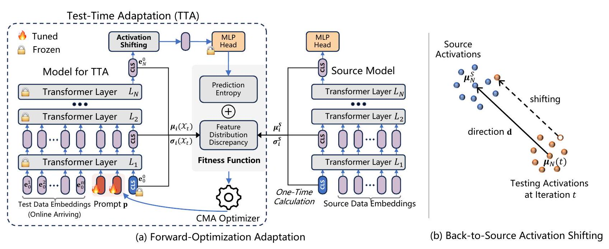
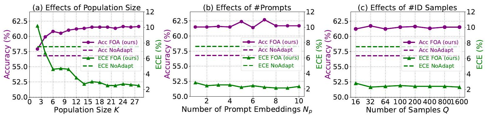
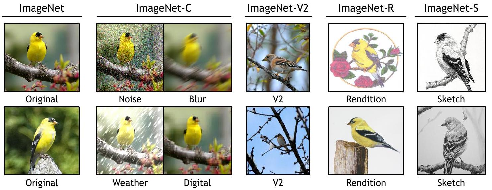
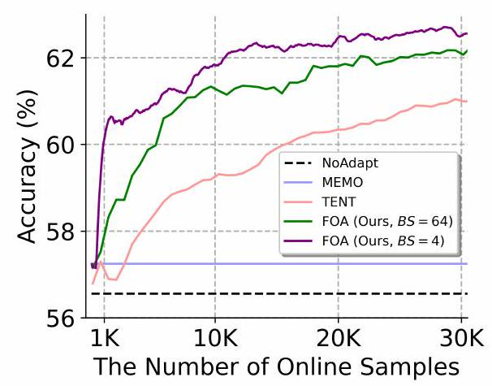

\title{
Test-Time Model Adaptation with Only Forward Passes
}

\author{
Shuaicheng Niu ${ }^{12}$ Chunyan Miao ${ }^{123}$ Guohao Chen ${ }^{4}$ Pengcheng Wu ${ }^{12}$ Peilin Zhao ${ }^{4}$
}

\begin{abstract}
Test-time adaptation has proven effective in adapting a given trained model to unseen test samples with potential distribution shifts. However, in real-world scenarios, models are usually deployed on resource-limited devices, e.g., FPGAs, and are often quantized and hard-coded with nonmodifiable parameters for acceleration. In light of this, existing methods are often infeasible since they heavily depend on computation-intensive backpropagation for model updating that may be not supported. To address this, we propose a testtime Forward-Optimization Adaptation (FOA) method. In FOA, we seek to solely learn a newly added prompt (as model's input) via a derivativefree covariance matrix adaptation evolution strategy. To make this strategy work stably under our online unsupervised setting, we devise a novel fitness function by measuring test-training statistic discrepancy and model prediction entropy. Moreover, we design an activation shifting scheme that directly tunes the model activations for shifted test samples, making them align with the source training domain, thereby further enhancing adaptation performance. Without using any backpropagation and altering model weights, FOA runs on quantized 8-bit ViT outperforms gradient-based TENT on full-precision 32-bit ViT, while achieving an up to 24 -fold memory reduction on ImageNet-C. Code: https://github.com/mr-eggplant/FOA.
\end{abstract}

\section*{1. Introduction}

Deep neural networks often struggle to generalize when testing data encounter unseen corruptions or are drawn from

\footnotetext{
${ }^{1}$ College of Computing and Data Science, Nanyang Technological University, Singapore ${ }^{2}$ Joint NTU-WeBank Research Centre on Fintech, Singapore ${ }^{3}$ Joint NTU-UBC Research Centre of Excellence in Active Living for the Elderly (LILY), Singapore ${ }^{4}$ Tencent AI Lab, Shenzhen, China. Correspondence to: Shuaicheng Niu <shuaicheng.niu@ntu.edu.sg>.

Proceedings of the $41^{\text {st }}$ International Conference on Machine Learning, Vienna, Austria. PMLR 235, 2024. Copyright 2024 by the author(s).
}

Table 1. Comparison w.r.t. prior gradient-based Test-Time Adaptation (TTA) vs. our Forward-Optimization Adaptation. The memory usage and accuracy are measured via ViT-Base and batch size 64 on ImageNet-C (level 5). The memory of 8 -bit ViT is an ideal estimation by $0.25 \times$ memory of 32-bit ViT per Liu et al. (2021b).
\begin{tabular}{|c|c|c|}
\hline & Prior TTA & Forward-Optimization Adaptation \\
\hline Update model weights & $\checkmark$ & $x$ \\
\hline Backward propagation & $\checkmark$ & $x$ \\
\hline Model compatibility & Full precision models (32-bit) & \begin{tabular}{l}
Full precision models (32-bit) Quantized models: \\
- 8-bit, 6-bit, ...
\end{tabular} \\
\hline Device compatibility & High-performance GPU & \begin{tabular}{l}
High-performance GPU \\
Low-power edge devices: \\
- smartphones, iPads, FPGAs \\
- embodied robots, ...
\end{tabular} \\
\hline Accuracy & 59.6\% (TENT, full precision, 32-bit) & \begin{tabular}{l}
66.3\% (full precision, 32-bit) \\
63.5\% (quantized, 8-bit)
\end{tabular} \\
\hline Run-time memory usage & 5,165 MB (TENT, full precision, 32-bit) & 832 MB (full precision, 32-bit) 208 MB (quantized, 8-bit) \\
\hline
\end{tabular}
novel environments (Hendrycks \& Dietterich, 2019; Koh et al., 2021), known as distribution shifts. To address this, various methods have been extensively investigated in existing literature, such as domain generalization(Shankar et al., 2018; Dou et al., 2019), data augmentation (Hendrycks et al., 2020; Yao et al., 2022) and unsupervised domain adaptation (Saito et al., 2018; Zhang et al., 2020; Qiu et al., 2021).

Recently, test-time adaptation (TTA) (Sun et al., 2020; Niu et al., 2023; Iwasawa \& Matsuo, 2021; Bartler et al., 2022; Liang et al., 2023) has emerged as a rapidly progressing research area, with the aim of addressing domain shifts during test time. By utilizing each data point once for immediate adaptation post-inference, TTA stands out with its minimal overhead compared to prior areas, making it well-suited for real-world applications. According to whether involving backward propagation, existing TTA methods can generally be divided into the following two categories.

Gradient-free methods learn from test data by adapting the statistics in batch normalization layers (Schneider et al., 2020; Khurana et al., 2021; Lim et al., 2023), correcting the output probabilities (Boudiaf et al., 2022), or adjusting the classifier (Iwasawa \& Matsuo, 2021), etc. These methods, which avoid backpropagation and do not alter the original model weights, inherently reduce the risk of forgetting on source domain. However, their limited learning capacity, primarily stemming from the constraint of not explicitly exploiting the model feedback regarding given test samples to facilitate optimization with learnable parameters, may
lead to suboptimal performance on out-of-distribution test data (as shown in Table 2).

Gradient-based methods (Sun et al., 2020; Wang et al., 2021; Goyal et al., 2022) unleash the power of TTA by online updating model parameters through self-/un-supervised learning during testing. These methods encompass a variety of techniques including, but not limited to, rotation prediction (Gidaris et al., 2018), contrastive learning (Bartler et al., 2022; Liu et al., 2021a), entropy minimization (Wang et al., 2021), etc. Although gradient-based TTA is effective in handling domain shifts, it still faces critical challenges when being deployed to real-world scenarios, as shown in Table 1.

Firstly, deep models are usually deployed on various edge devices, e.g., smartphones, and embedded systems. Unlike high-performance GPUs, these devices typically possess limited computational power and memory capacity, insufficient for the intensive computations required by TTA, which often requires one or multiple rounds of backpropagation for each test sample (Wang et al., 2021; Zhang et al., 2022).
Secondly, for resource or efficiency considerations, deep models often undergo quantization before deployment - a process of reducing precision, e.g., from 32-bit to 8 -bit. However, the non-differentiability of the discrete quantizer would result in vanishing gradients when propagated through multiple layers (Louizos et al., 2019). This makes the deployed models incapable of supporting backpropagation operations, which are essential for prior TTA methods.
Lastly, on some specialized computational chips that are tailored for specific models (Dass et al., 2023; You et al., 2023), the model parameters are often hard-coded and nonmodifiable. This rigidity of model parameters poses another barrier to the implementation of TTA.

To address the above issues, we propose a test-time Forward-Optimization Adaptation (FOA) method. Specifically, we seek to explore a backpropagation-free optimizer, called covariance matrix adaptation (CMA) evolution strategy (Hansen, 2016), for online test-time model adaptation. However, naively applying CMA in the TTA setting is infeasible, as it is hard for CMA to handle ultra-high dimensional optimization problems (e.g., deep model training) and it relies on supervised learning signals. Therefore, we propose to solely update a newly inserted prompt (as the model's input, shown in Figure 1) at test time to reduce the dimension of solution space and meanwhile avoid altering model weights. Then, to make CMA work stably without supervised signals, we devise a novel unsupervised fitness function to evaluate candidate solutions, which comprises both model prediction entropy and the activation statistics discrepancy between out-of-distribution (OOD) testing samples and source indistribution (ID) samples. Here, only a small number of ID samples is needed for source statistics estimation, i.e., 32
samples are sufficient for ImageNet (see Figure 2 (c)). Moreover, to further boost adaptation performance, we devise a forward-only back-to-source activation shifting mechanism to directly adjust the activations of OOD testing samples, along with a dynamically updated shifting direction from the OOD testing domain to the ID source domain.
Main Contributions. 1) We introduce a novel and practical paradigm to TTA, termed forward-optimization adaptation. This paradigm operates without depending on backpropagation and avoids modification to the model weights, significantly broadening the real-world applicability of TTA across various contexts, including smartphones, FPGAs, and quantized models. 2) We achieve the goal of forward-only adaptation by prompt adaptation and activation shifting, where we design a new fitness function that guarantees stable prompt learning using a covariance matrix adaptation-based optimizer under the online unsupervised setting, and efficiently align the sample's activations in the testing domain with the source training domain. 3) Extensive experiments on four benchmarks and full precision/quantized models verify our effectiveness. Our method on 8 -bit quantized ViT outperforms gradient-based TENT on full-precision 32-bit ViT, with up to 24 -fold run-time memory reduction.

\section*{2. Preliminary and Problem Statement}

We briefly revisit ViT and TTA in this section for the convenience of our method presentation and put detailed related work discussions into Appendix A due to page limits.
Vision Transformer (ViT) (Dosovitskiy et al., 2021). In this paper, we focus mainly on transformer-based vision models that are widely used in practice and are also hardware-friendly. We first revisit ViT here for the presentation convenience of our method. Formally, for a plain $\operatorname{ViT} f_{\Theta}(\cdot)$ with $N$ layers, let $\mathbf{E}_{i}=\left\{\mathbf{e}_{i}^{j}, j \in \mathbb{N}, 0 \leq j \leq m\right\}$ be the patch embeddings as the input of the $(i+1)$-th layer $L_{i+1}$, where $m$ is the number of image patches and $\mathbf{e}_{i}^{0}$ denote an extra learnable classification token ([CLS ]) of the $i$-th layer $L_{i}$, the whole ViT is formulated as:
\[
\begin{aligned}
\mathbf{E}_{i} & =L_{i}\left(\mathbf{E}_{i-1}\right), \quad i=1, \ldots, N \\
\hat{\mathbf{y}} & =\operatorname{Head}\left(\mathbf{e}_{N}^{0}\right) .
\end{aligned}
\]

Test-Time Adaptation (TTA) (Sun et al., 2020; Wang et al., 2021). Let $f_{\Theta}(\cdot)$ be the model trained on labeled training dataset $\mathcal{D}_{\text {train }}=\left\{\left(\mathbf{x}_{i}, y_{i}\right)\right\}_{i=1}^{N}$ and $\mathbf{x}_{i} \sim P(\mathbf{x})$. During testing, $f_{\Theta}(\cdot)$ shall perform well on in-distribution (ID) test samples drawn from $P(\mathbf{x})$. However, given a set of out-of-distribution (OOD) testing samples $\mathcal{D}_{\text {test }}=\left\{\mathbf{x}_{j}\right\}_{j=1}^{M} \sim$ $Q(\mathbf{x})$ and $Q(\mathbf{x}) \neq P(\mathbf{x})$, the prediction performance of $f_{\Theta}(\cdot)$ would decrease significantly. To address this, TTA methods often seek to update the model parameters by minimizing some unsupervised/self-supervised learning objec-


Figure 1. (a) An illustration of our proposed FOA. For each batch of online incoming test samples, we feed them alongside prompts $\mathbf{p}$ into the TTA model, and calculate a fitness value that serves as a learning signal, aiding the covariance matrix adaptation (CMA) optimizer in learning the prompts $\mathbf{p}$. This fitness function is derived from both the prediction entropy and the distribution discrepancy between the testing CLS activations and source CLS activations (calculated once). (b) We further boost the adaptation performance by directly adjusting the activations (before the final MLP head), guiding them from the testing distribution towards the source distribution.
tive when encountering a testing sample:
\[
\min _{\tilde{\Theta}} \mathcal{L}(\mathbf{x} ; \Theta), \mathbf{x} \sim Q(\mathbf{x}),
\]
where $\tilde{\Theta} \subseteq \Theta$ denotes the model parameters involved for updating. In general, the TTA objective $\mathcal{L}(\cdot)$ can be formulated as rotation prediction (Sun et al., 2020), contrastive learning (Bartler et al., 2022), entropy minimization (Wang et al., 2021; Niu et al., 2023), etc.

Problem Statement. In practical applications, deep models are frequently deployed on devices with limited resources, such as smartphones and embodied agents, and sometimes are even deployed after quantization or hard coding with non-modifiable parameters. These devices typically lack the capability for backward propagation, especially with largesize deep models. However, for existing TTA methods, such as SAR (Niu et al., 2023) and MEMO (Zhang et al., 2022), performing TTA necessitates one or more rounds of backward computation for each test sample. This process is highly memory- and computation-intensive, hindering the broad application of TTA methods in real-world scenarios.

\section*{3. Approach}

In this paper, we propose a novel test-time ForwardOptimization Adaptation (FOA) method, which is also model updating-free, to boost the practicality of test-time adaptation in various real-world scenarios. From Figure 1, FOA conducts adaptation on both the input level and the output feature level. 1) Input level: FOA inserts a new prompt as the model's input, and then solely updates this prompt
online for out-of-distribution (OOD) generalization, employing a derivative-free optimizer coupled with a specially designed unsupervised fitness function (c.f. Section 3.1). 2) Output feature level: a back-to-source activation shifting strategy seeks to further boost adaptation, which directly refines the activation features of the final layer, by aligning them from the OOD domain back to the source indistribution (ID) domain (c.f. Section 3.2). We summarize the pseudo-code of FOA in Algorithm 1.

\subsection*{3.1. Forward-Only Prompt Adaptation}

Unlike prior TTA methods that update model weights using backpropagation, we aim to achieve the goal of test-time out-of-distribution generalization in a backpropagation-free manner. To this end, we explore a derivative-free optimizer for TTA, namely covariance matrix adaptation (CMA) evolution strategy (Hansen, 2016). However, naively applying CMA to our TTA context is infeasible, the reasons are due to: 1) For TTA, the model parameters needing update are high-dimensional (even for methods like TENT (Wang et al., 2021) that only updates the affine parameters of normalization layers), since the deep models are often with millions of parameters. This makes CMA intractable for direct deep model adaptation. 2) Conventional CMA methods rely on supervised offline learning, i.e., using ground-truth labels to assess candidate solutions. In contrast, TTA operates without ground-truth labels and typically in an online setting, rendering conventional CMA methods inapplicable. We empirically illustrated these issues in Table 9.
To make CMA work in TTA, we introduce a new prompt as
```
Algorithm 1 Forward-Optimization Adaptation (FOA).
Input: Batches of test samples $\left\{\mathcal{X}_{t}\right\}_{t=1}^{T}$, model $f_{\Theta}(\cdot)=$
    Head $\left(L_{i}(\cdot)\right)$, ID statistics $\left\{\boldsymbol{\mu}_{i}^{S}, \boldsymbol{\sigma}_{i}^{S}\right\}_{i=0}^{N}$, pop. size $K$.
    Initialize $\mathbf{m}^{(0)}=\mathbf{0}, \boldsymbol{\Sigma}^{(\mathbf{0})}=\mathbf{I}, \tau^{(\mathbf{0})}=\mathbf{1}$ in Eqn. (6).
    for $t=1,2, \ldots, T$ do
        Sampling $K$ prompt solutions $\left\{\mathbf{p}_{k}^{t}\right\}_{k=1}^{K}$ by Eqn. (6).
        for $k=1, \ldots, K$ do
            Calculate all layers' CLS features $\left\{\mathbf{e}_{n}^{0}\right\}_{n=1}^{N}$ using
            Eqn. (1) with input $\left[\mathbf{p}_{k}^{t} ; \mathcal{X}_{t}\right]$.
            Adjust $\mathbf{e}_{N}^{0}$ to source domain by Eqn. (7).
            Predict $\hat{\mathcal{Y}}_{t}^{k}$ by $\operatorname{Head}\left(\mathbf{e}_{N}^{0}\right)$.
            Calculate fitness value $v_{k}$ per Eqn. (5).
        end for
        Update $\mathbf{m}^{(t)}, \boldsymbol{\Sigma}^{(\mathbf{t})}, \tau^{(\mathbf{t})}$ according to $\left\{v_{k}\right\}_{k=1}^{K}$ using
        the CMA-ES algorithm (Hansen, 2016).
        Select final $\hat{\mathcal{Y}}_{t}$ from $\left\{\hat{\mathcal{Y}}_{t}^{k}\right\}_{k=1}^{K}$ with best $v_{k}$.
    end for
Output: The predictions $\left\{\hat{\mathcal{Y}}_{t}\right\}_{t=1}^{T}$.
```
the model's input (as in Figure 1 (a)) for updating, thereby reducing the dimension of solution space and lowering the complexity for CMA optimization, meanwhile avoiding alter model weights. Then, we devise an unsupervised fitness function to provide consistent and reliable learning signals for the CMA optimization. We depict them in the following.

CMA-Based Prompt Adaptation. Inspired by the demonstrated effectiveness of continuous prompt learning in the field of deep model fine-tuning (Jia et al., 2022; Bahng et al., 2022), we add new prompt embeddings at the beginning of the model input (i.e., before the first transformer layer) for test-time updating, while keeping all other model parameters frozen. In this way, the dimension of learnable model parameters shall be significantly reduced and thus is compatible with CMA optimization. Formally, given a test sample $\mathbf{x} \sim Q(\mathbf{x})$ and a ViT model $f_{\Theta}(\cdot)=\operatorname{Head}\left(L_{i}(\cdot)\right)$, our goal is to find an optimal prompt $\mathbf{p}^{*}$ :
\[
\mathbf{p}^{*}=\underset{\mathbf{p}}{\arg \min } \mathcal{L}\left(f_{\Theta}(\mathbf{p} ; \mathbf{x})\right)
\]
where $\mathcal{L}(\cdot)$ is a fitness function and $\mathbf{p} \in \mathbb{R}^{d \times N_{p}}$ consists of $N_{p}$ prompt embeddings, each of dimension $d$. We solve this problem by employing the derivative-free CMA.

Fitness Function for CMA. To effectively solve Eqn. (4) using CMA, the primary challenge lies in developing an appropriate fitness $\mathcal{L}(\cdot)$ to evaluate a given solution $\mathbf{p}$. A direct approach might involve adopting existing TTA learning objectives, such as prediction entropy (Wang et al., 2021). However, this method encounters limitations when dealing with severely corrupted OOD samples, where model predictions are highly uncertain. In such cases, entropy-based measures struggle to provide consistent and reliable signals for CMA optimization. Moreover, focusing solely on op-
timizing entropy can lead the prompts towards degenerate and trivial solutions, as in Tables 5 and 9. To address these, we devise a new fitness to regularize the activation distribution statistics of OOD testing samples (forward propagated with optimized prompts), ensuring they are closely aligned with those from ID samples. This fitness functions at the distribution level, circumventing the issues of noise inherent in the uncertain predictions, thereby offering better stability.

Statistics calculation. Before TTA, we first collect a small set of source in-distribution samples $\mathcal{D}_{S}=\left\{\mathbf{x}_{q}\right\}_{q=1}^{Q}$ and feed them into the model to obtain the corresponding CLS tokens $\left\{\mathbf{e}_{i}^{0}\right\}_{i=1}^{N}$. Then, we calculate the mean and standard deviations of CLS tokens $\left\{\mathbf{e}_{i}^{0}\right\}_{i=1}^{N}$ over all samples in $\mathcal{D}_{S}$ to obtain source in-distribution statistics $\left\{\boldsymbol{\mu}_{i}^{S}, \boldsymbol{\sigma}_{i}^{S}\right\}_{i=0}^{N}$. Note that we only need a small number of in-distribution samples without labels for calculation, e.g., 32 samples are sufficient for the ImageNet dataset. Please refer to Figure 2 (c) for the sensitivity analyses regarding this number. Similarly, we calculate the target testing statistics $\left.\left\{\boldsymbol{\mu}_{i}\left(\mathcal{X}_{t}\right)\right), \boldsymbol{\sigma}_{i}\left(\mathcal{X}_{t}\right)\right\}_{i=0}^{N}$ over the current batch of testing samples $\mathcal{X}_{t}$.

Based on the above, the overall fitness function for the $t$-th test batch samples $\mathcal{X}_{t}$ is then given by:
\[
\begin{aligned}
& \mathcal{L}\left(f_{\Theta}\left(\mathbf{p} ; \mathcal{X}_{t}\right)\right)=\sum_{\mathbf{x} \in \mathcal{X}_{t}} \sum_{c \in \mathcal{C}}-\hat{y}_{c} \log \hat{y}_{c} \\
& \quad+\lambda \sum_{i=1}^{N}\left\|\boldsymbol{\mu}_{i}\left(\mathcal{X}_{t}\right)-\boldsymbol{\mu}_{i}^{S}\right\|_{2}+\left\|\boldsymbol{\sigma}_{i}\left(\mathcal{X}_{t}\right)-\boldsymbol{\sigma}_{i}^{S}\right\|_{2}
\end{aligned}
\]
where $\hat{y}_{c}$ is the $c$-th element of $\hat{\mathbf{y}}$ in Eqn. (2) w.r.t. sample $\mathbf{x}$, and $\lambda$ is a trade-off parameter.
CMA Evolution Strategy. Instead of directly optimizing the prompt $\mathbf{p}$ (in Eqn. 4) itself, we learn a multivariate normal distribution of $\mathbf{p}$ using a covariance matrix adaptation (CMA) evolution strategy (Hansen \& Ostermeier, 2001; Hansen et al., 2003). Here, we adopt CMA as it is one of the most successful and widely used evolutionary algorithms for non-convex black-box optimization in high-dimensional continuous solution spaces. To be specific, in each iteration $t$ (the $t$-th batch of test samples $\mathcal{X}_{t}$ ), CMA samples a set/population of new candidate solutions/prompts (also known as individuals in evolution algorithms) from a parameterized multivariate normal distribution:
\[
\mathbf{p}_{k}^{(t)} \sim \mathbf{m}^{(t)}+\tau^{(t)} \mathcal{N}\left(\mathbf{0}, \mathbf{\Sigma}^{(\mathbf{t})}\right)
\]

Here, $k=1, \ldots, K$ and $K$ is the population size. $\mathbf{m}^{(t)} \in \mathbb{R}^{d N_{p}}$ is the mean vector of the search distribution at iteration step $t, \tau^{(t)} \in \mathbb{R}_{+}$is the overall standard deviation that controls the step size, and $\boldsymbol{\Sigma}^{(\mathbf{t})}$ is the covariance matrix that determines the shape of distribution ellipsoid. Upon sampling the prompts $\left\{\mathbf{p}_{k}^{(t)}\right\}_{k=1}^{K}$, we feed each $\mathbf{p}_{k}^{(t)}$ along with the test sample $\mathcal{X}_{t}$ into the model to yield a fitness value $v_{k}$ associated with $\mathbf{p}_{k}^{(t)}$. Then, we update distribution parameters
$\mathbf{m}^{(t)}, \tau^{(t)}$ and $\boldsymbol{\Sigma}^{(\mathbf{t})}$ based on the ranking of $\left\{v_{k}\right\}_{k=1}^{K}$ by maximizing the likelihood of previous candidate successful solutions (c.f. Hansen (2016) for more algorithm details).

\subsection*{3.2. Back-to-Source Activation Shifting}

In this section, we propose a "back-to-source activation shifting mechanism" to further boost the adaptation performance at the feature level, in cases of the above online prompt adaptation is inadequate. This shifting scheme directly alters the model's activations during inference and is notable for not requiring backpropagation. Specifically, given a test sample x, we move its corresponding $N$-th layer's CLS feature $\mathbf{e}_{N}^{0}$ (as shown in Eqn. (2), this feature is the input of the final task head), shifting them along the direction from out-of-distribution domain towards in-distribution domain:
\[
\mathbf{e}_{N}^{0} \leftarrow \mathbf{e}_{N}^{0}+\gamma \mathbf{d}
\]
where $\mathbf{d}$ is a shifting direction and $\gamma$ is a step size. We define $\mathbf{d}$ as the vector extending from the center of out-of-distribution testing features to the center of source indistribution features. In our online TTA setting, with the increase of testing samples, the center of testing features shall dynamically change. Thus, we update the shifting direction $\mathbf{d}$ online by:
\[
\mathbf{d}_{t}=\boldsymbol{\mu}_{N}^{S}-\boldsymbol{\mu}_{N}(t)
\]
where $\boldsymbol{\mu}_{N}^{S}$ is the mean of the $N$-th final layer CLS feature $\mathbf{e}_{N}^{0}$ and calculated over source in-distribution samples $\mathcal{D}_{S}$ (the same one used in Eqn. (5)). $\boldsymbol{\mu}_{N}(t)$ is the approximation of the overall test set statistics by exponential moving averages of statistics computed on sequentially arrived test samples. We define the mean estimate of the $\mathbf{e}_{N}^{0}$ in iteration $t$ (the $t$-th batch $\mathcal{X}_{t}$ ) as:
\[
\boldsymbol{\mu}_{N}(t)=\alpha \boldsymbol{\mu}_{N}\left(\mathcal{X}_{t}\right)+(1-\alpha) \boldsymbol{\mu}_{N}(t-1)
\]
where $\boldsymbol{\mu}_{N}\left(\mathcal{X}_{t}\right)$ is the mean of the $N$-th layer's CLS feature and calculated over the $t$-th test batch $\mathcal{X}_{t} . \alpha \in[0,1]$ is a moving average factor and we set it to 0.1 .

\section*{4. Experiments}

Datasets and Models. We conduct experiments on four benchmarks for OOD generalization, i.e., ImageNetC (Hendrycks \& Dietterich, 2019) (contains corrupted images in 15 types of 4 main categories and each type has 5 severity levels), ImageNet-R (various artistic renditions of 200 ImageNet classes) (Hendrycks et al., 2021), ImageNetV2 (Recht et al., 2019), ImageNet-Sketch (Wang et al., 2019). We use ViT-Base (Dosovitskiy et al., 2021) as the source model for all experiments, including both full precision and quantized ViT models. The models are trained on the source ImageNet-1K training set and the model weights
are obtained from the t imm repository (Wightman, 2019). We adopt PTQ4ViT (Yuan et al., 2022) for 8-bit and 6-bit model quantization. Unless stated otherwise, all ViT-Base models used in this paper are full precision with 32 bits.

Compared Methods. We compare our proposed FOA with two categories of TTA methods. 1) Gradient-free methods: LAME (Boudiaf et al., 2022) is a post-training adaptation method by adjusting the model's output probabilities; T3A (Iwasawa \& Matsuo, 2021) updates a prototype-based classifier during test time. 2) Gradient-based methods: TENT (Wang et al., 2021) optimizes the affine parameters of norm layers by minimizing the prediction entropy of test samples and SAR (Niu et al., 2023) further optimizes the prediction entropy via active sample selection and a sharpness-aware optimizer; CoTTA (Wang et al., 2022) adapts a given model via augmentation-based consistency maximization and a teacher-student learning scheme.

Implementation Details. We set the number of prompt embeddings $N_{p}$ to 3 and initialize prompts with uniform initialization. We set the batch size $(B S)$ to 64 by following TENT and SAR for fair comparisons. The population size $K$ is set to $28=4+3 \times \log$ (prompt dim) by following (Hansen, 2016) and $\lambda$ in Eqn. (5) is set to $0.4 \times B S / 64$ on ImageNet-C/V2/Sketch, and $0.2 \times B S / 64$ on ImageNet-R to balance the magnitude of two losses. We use the validation set of ImageNet-1K to estimate source ID statistics. The step size $\gamma$ in Eqn. (7) is set to 1.0, aiming to exactly align the overall center of testing and training features. The effect of each hyperparameter is investigated in Section 4.3 and Appendix C. More implementation details of compared methods are put in Appendix B.2.

Evaluation Metrics. 1) Classification Accuracy (\%, $\uparrow$ ) on OOD testing samples, i.e., ImageNet-C/R/V2/Sketch. 2) Expected Calibration Error (ECE) (\%, $\downarrow$ ) measures the difference between predicted probabilities and actual outcomes in a probabilistic model (Naeini et al., 2015). ECE is important to evaluate the trustworthiness of model predictions, such as in medical diagnostics and auto driving.

\subsection*{4.1. Results on Full Precision Models}

In this section, we compare our FOA with existing state-of-the-art TTA methods on the full precision ViT-Base model. From the results on ImageNet-C in Table 2, we have the following observations. 1) Our FOA achieves the best average accuracy and ECE over 15 different corruption types, suggesting our effectiveness. 2) Compared with NoAdapt, gradient-free methods LAME and T3A obtain slight performance gains or perform even worse, as they do not update core model weights and thus may suffer from limited learning capacity. Here, LAME performs worse than NoAdapt, because it only adjusts the model output logits and is not very effective when the OOD test sample stream

Table 2. Comparisons with SOTA methods on ImageNet-C (severity level 5) with ViT regarding Accuracy (\%). BP is short for backward propagation and the bold number indicates the best result. We only report average ECE (\%, $\downarrow$ ) here and put detailed ECEs in Appendix D.
\begin{tabular}{|c|c|c|c|c|c|c|c|c|c|c|c|c|c|c|c|c|c|c|}
\hline \multirow[b]{2}{*}{Method} & \multicolumn{4}{|c|}{Noise} & \multicolumn{4}{|c|}{Blur} & \multicolumn{4}{|c|}{Weather} & \multicolumn{4}{|c|}{Digital} & \multicolumn{2}{|l|}{Average} \\
\hline & BP & Gauss. & Shot & Impul. & Defoc. & Glass & Motion & Zoom & Snow & Frost & Fog & Brit. & Contr. & Elas. & Pix. & JPEG & Acc. & ECE \\
\hline NoAdapt & $X$ & 56.8 & 56.8 & 57.5 & 46.9 & 35.6 & 53.1 & 44.8 & 62.2 & 62.5 & 65.7 & 77.7 & 32.6 & 46.0 & 67.0 & 67.6 & 55.5 & 10.5 \\
\hline LAME & $x$ & 56.5 & 56.5 & 57.2 & 46.4 & 34.7 & 52.7 & 44.2 & 58.4 & 61.5 & 63.1 & 77.4 & 24.7 & 44.6 & 66.6 & 67.2 & 54.1 & 11.0 \\
\hline T3A & $x$ & 56.4 & 56.9 & 57.3 & 47.9 & 37.8 & 54.3 & 46.9 & 63.6 & 60.8 & 68.5 & 78.1 & 38.3 & 50.0 & 67.6 & 69.1 & 56.9 & 26.8 \\
\hline TENT & $\checkmark$ & 60.3 & 61.6 & 61.8 & 59.2 & 56.5 & 63.5 & 59.2 & 54.3 & 64.5 & 2.3 & 79.1 & 67.4 & 61.5 & 72.5 & 70.6 & 59.6 & 18.5 \\
\hline CoTTA & $\checkmark$ & 63.6 & 63.8 & 64.1 & 55.5 & 51.1 & 63.6 & 55.5 & 70.0 & 69.4 & 71.5 & 78.5 & 9.7 & 64.5 & 73.4 & 71.2 & 61.7 & 6.5 \\
\hline SAR & $\checkmark$ & 59.2 & 60.5 & 60.7 & 57.5 & 55.6 & 61.8 & 57.6 & 65.9 & 63.5 & 69.1 & 78.7 & 45.7 & 62.4 & 71.9 & 70.3 & 62.7 & 7.0 \\
\hline FOA (ours) & $x$ & 61.5 & 63.2 & 63.3 & 59.3 & 56.7 & 61.4 & 57.7 & 69.4 & 69.6 & 73.4 & 81.1 & 67.7 & 62.7 & 73.9 & 73.0 & 66.3 & 3.2 \\
\hline
\end{tabular}

Table 3. Comparisons with state-of-the-art methods on ImageNetR/V2/Sketch with ViT-Base. BP is short for backward propagation and the bold number indicates the best result.
\begin{tabular}{lc|ccccc|cccc} 
& \multicolumn{5}{c}{ Accuracy $(\%, \uparrow)$} & \multicolumn{4}{c}{ ECE $(\%, \downarrow)$} \\
Method & BP & R & V 2 & Sketch & Avg. & R & V 2 & Sketch & Avg. \\
\hline NoAdapt & $\boldsymbol{x}$ & 59.5 & 75.4 & 44.9 & 59.9 & 2.5 & 5.6 & 7.9 & 5.3 \\
LAME & $\boldsymbol{x}$ & 59.0 & 75.2 & 44.4 & 59.6 & 2.5 & 5.0 & 9.7 & 5.7 \\
T3A & $\boldsymbol{x}$ & 58.0 & 75.5 & 48.5 & 60.7 & 25.9 & 23.4 & 37.4 & 28.9 \\
TENT & $\boldsymbol{\nu}$ & 63.9 & 75.2 & 49.1 & 62.7 & 7.2 & 4.5 & 22.8 & 11.5 \\
CoTTA & $\boldsymbol{\nu}$ & 63.5 & 75.4 & 50.0 & 62.9 & 2.8 & 3.4 & 17.9 & 8.0 \\
SAR & $\boldsymbol{\nu}$ & 63.3 & 75.1 & 48.7 & 62.4 & 3.0 & 2.7 & 16.5 & 7.4 \\
\hline FOA (ours) & $\boldsymbol{x}$ & 63.8 & 75.4 & 49.9 & $\mathbf{6 3 . 0}$ & 2.7 & 3.2 & 7.8 & $\mathbf{4 . 6}$
\end{tabular}
does not suffer from prior label shifts, which is consistent with the results reported by LAME itself. 3) Compared with LAME and T3A, gradient-based methods (TENT, CoTTA and SAR) explicitly modify model parameters by optimizing unsupervised/self-supervised losses, and thus achieve much better performance, e.g., the average accuracy of $56.9 \%$ (T3A) vs. $62.7 \%$ (SAR). 4) Without using any backpropagation, our FOA outperforms gradient-based SAR with $3.6 \%$ average accuracy and $3.8 \%$ average ECE gains, demonstrating our superiority in deploying to lightweight devices (e.g., smartphones and FPGAs) and quantized models. 5) FOA achieves much lower average ECE compared with BP-based methods, e.g., $18.5 \%$ (TENT) vs. $3.2 \%$ (FOA). This mainly benefits from our activation discrepancy regularization (in Eqn. (5)), which alleviates the error accumulation issue of prior methods that may employ imprecise pseudo labels or entropy for learning. At last, from the results on ImageNet-R/V2/Sketch in Table 3, our FOA achieves the best or comparable performance w.r.t. both accuracy and ECE, further suggesting our effectiveness.

\subsection*{4.2. Results on Quantized Models}

In practical applications, deep models are often deployed on edge devices with efficiency considerations, undergoing a process known as quantization. These devices, constrained by limited resources, typically do not support backward propagation due to its high memory and computational demands. Consequently, traditional gradient-based TTA methods like TENT, CoTTA, and SAR are not viable in such
settings. On the contrary, our FOA is adaptable to these quantized models. We demonstrate this by applying FOA to quantized ViT models and benchmarking it against T3A. As indicated in Table 4, FOA outperforms T3A significantly in terms of both accuracy and ECE on 8-bit and 6-bit models. Notably, FOA with an 8-bit ViT surpasses the performance of the gradient-based TENT method using a full precision 32-bit ViT on ImageNet-C, achieving $63.5 \%$ accuracy (our FOA, 8-bit) vs. $59.6 \%$ (TENT, 32-bit). These results collectively underscore the superiority of our FOA in such quantized model deployment scenarios.

\subsection*{4.3. Ablation Studies}

Effectiveness of Components in FOA. In our FOA, we mentioned that naively applying CMA with entropy minimization in TTA is infeasible, and thus we propose an activation distribution discrepancy-based fitness function to guide the stable learning of CMA and an activation shifting scheme to boost the adaptation performance. We ablate them in Table 5. Firstly, CMA with Entropy fitness performs poorer than "NoAdapt", which verifies the necessity of devising a new fitness function. Secondly, our Activation Discrepancy fitness works well to provide stable learning signals for CMA and improves the adaptation accuracy on ImageNet-C from $55.5 \%$ to $63.4 \%$. Thirdly, even only with the Activation Shifting scheme, it also improves the accuracy from $55.5 \%$ to $59.1 \%$, suggesting its effectiveness. Lastly, by incorporating Entropy and Activation Discrepancy as a whole fitness function and with the Activation Shifting scheme, our FOA achieves the best performance, i.e., $66.3 \%$ average accuracy and $3.2 \%$ average ECE on ImageNet-C.

Effects of Population Size $K$ in CMA (Eqn. (6)). We evaluate our FOA with different $K$ from $\{2,3, \ldots, 28\}$. From Figure 2 (a), the performance of our FOA converges when $K>15$. Notably, at $K=2$, FOA outperforms both NoAdapt and gradient-free T3A, e.g., $57.9 \%$ (FOA) vs. $56.4 \%$ (T3A) regarding accuracy. And with $K=6$, FOA surpasses the gradient-based TENT, i.e., $60.8 \%$ accuracy (FOA) vs. $60.3 \%$ (TENT). These results demonstrate the effectiveness of FOA under small $K$ values (the smaller $K$, the higher efficiency). Please refer to Table 8 for efficiency comparisons.

Table 4. Effectiveness of our FOA on Quantized ViT models. We report the corruption Accuracy (\%) and average ECE (\%, $\downarrow$ ) on ImageNet-C (severity level 5). The bold number indicates the best result and see Appendix D for the detailed ECEs of each corruption.
\begin{tabular}{|c|c|c|c|c|c|c|c|c|c|c|c|c|c|c|c|c|c|c|}
\hline \multirow[b]{2}{*}{Model} & \multirow[b]{2}{*}{Method} & \multicolumn{3}{|c|}{Noise} & \multicolumn{4}{|c|}{Blur} & \multicolumn{4}{|c|}{Weather} & \multicolumn{4}{|c|}{Digital} & \multicolumn{2}{|l|}{Average} \\
\hline & & Gauss. & Shot & Impul. & Defoc. & Glass & Motion & Zoom & Snow & Frost & Fog & Brit. & Contr. & Elas. & Pix. & JPEG & Acc. & ECE \\
\hline \multirow{3}{*}{8-bit} & NoAdapt & 55.8 & 55.8 & 56.5 & 46.7 & 34.7 & 52.1 & 42.5 & 60.8 & 61.4 & 66.7 & 76.9 & 24.6 & 44.7 & 65.8 & 66.7 & 54.1 & 10.8 \\
\hline & T3A & 55.6 & 55.7 & 55.7 & 45.8 & 34.4 & 51.1 & 41.2 & 59.5 & 61.9 & 66.8 & 76.4 & 45.5 & 43.4 & 65.6 & 67.5 & 55.1 & 25.9 \\
\hline & FOA (ours) & 60.7 & 61.4 & 61.3 & 57.2 & 51.5 & 59.4 & 51.3 & 68.0 & 67.3 & 72.4 & 80.3 & 63.2 & 57.0 & 72.0 & 69.8 & 63.5 & 3.8 \\
\hline \multirow{3}{*}{6-bit} & NoAdapt & 44.2 & 42.0 & 44.8 & 39.8 & 28.9 & 43.4 & 34.7 & 53.2 & 59.8 & 59.0 & 75.1 & 27.4 & 39.0 & 59.1 & 65.3 & 47.7 & 9.9 \\
\hline & T3A & 43.3 & 41.3 & 42.7 & 29.1 & 23.4 & 38.9 & 30.0 & 49.4 & 58.3 & 60.2 & 73.8 & 31.0 & 36.3 & 58.0 & 65.2 & 45.4 & 30.1 \\
\hline & FOA (ours) & 53.2 & 51.8 & 54.6 & 49.6 & 38.8 & 51.0 & 44.8 & 60.3 & 65.0 & 68.8 & 76.7 & 39.5 & 46.6 & 67.3 & 68.6 & 55.8 & 5.5 \\
\hline
\end{tabular}


Figure 2. Parameter sensitivity analyses of our FOA. Experiments are conducted on ImageNet-C (Gaussian Noise, level 5) with ViT-Base.

Table 5. Ablations of components in our FOA. Entropy and Activation (Act.) Discrepancy are the left/right item in Fitness Function (Eqn. 5) used for CMA-based prompt adaptation. Act. Shifting is the method proposed in Section 3.2. We report the average results over 15 corruptions on ImageNet-C (level 5) with ViT-Base.
\begin{tabular}{|c|c|c|c|c|}
\hline Entropy & Act. Discrepancy & Act. Shifting & Acc. (\%, $\uparrow$ ) & ECE (\%, , ) \\
\hline \multirow{5}{*}{$\checkmark$} & NoAdapt & & 55.5 & 10.5 \\
\hline & & & 44.9 & 36.8 \\
\hline & $\checkmark$ & & 63.4 & 9.4 \\
\hline & & $\checkmark$ & 59.1 & 12.7 \\
\hline & $\checkmark$ & $\checkmark$ & 63.8 & 9.9 \\
\hline $\checkmark$ & $\checkmark$ & & 65.4 & 3.3 \\
\hline $\checkmark$ & $\checkmark$ & $\checkmark$ & 66.3 & 3.2 \\
\hline
\end{tabular}

Effects of Number of Prompt Embeddings $N_{p}$ in FOA. In our FOA, we add prompt embeddings in the input layer for CMA learning. Here, we evaluate FOA with different numbers of $N_{p}$, selected from $\{1,2, \ldots, 10\}$. In Figure $2(\mathrm{~b})$, we observe that the performance of FOA exhibits only minor variations across different $N_{p}$, showing a low sensitivity to $N_{p}$. Furthermore, setting $N_{p}$ to 5/7 results in marginally better performance, suggesting that this is a more optimal value. However, for all main experiments, we simply fix $N_{p}$ at 3 and do not carefully tune $N_{p}$, as access to testing data for parameter tuning is typically unavailable in practice.
Effects of \#Samples $(Q)$ for Calculating $\left\{\boldsymbol{\mu}_{i}^{S}, \boldsymbol{\sigma}_{i}^{S}\right\}_{i=0}^{N}$. As described in Section 3.1, the calculation of source training statistics $\left\{\boldsymbol{\mu}_{i}^{S}, \boldsymbol{\sigma}_{i}^{S}\right\}_{i=0}^{N}$ involves a small set of unlabeled indistribution samples, which can be collected via existing OOD detection techniques (Berger et al., 2021) or directly using the training samples. Here, we investigate the effect
of \#samples needed, selected from $\{16,32,64,100,200$, $400,800,1600\}$. From Figure 2 (c), our FOA consistently achieves stable performance when \#samples greater than 32, regarding both the accuracy and ECE. These results show that our FOA does not need to collect too many indistribution samples, which are easy to obtain in practice.

\subsection*{4.4. More Discussions}

Results on Single Sample Adaptation (Batch Size = 1). In our FOA, the prompt is learned over a batch of test samples each time. This process suffers from a challenge when the batch size is limited to one, as it requires the computation of the mean and variance of features, which may not be feasible with a single sample. Nonetheless, this issue is not significantly problematic in real-world applications. We propose a solution in the form of an interval update strategy, referred to as FOA-I. Specifically, given an ongoing stream of test data, we opt to update the prompts (performing CMA optimization) after encountering a pre-defined number of samples, denoted as $I$. During this interval, we temporarily store the relevant features of all CLS tokens or the original image until the next update. From Table 6, our FOA-I is effective across various values of $I$. Notably, FOA-I with an interval of $L=4$ outperforms the accuracy of TENT (with batch size 64), suggesting its effectiveness. Interestingly, FOA-I with smaller intervals (e.g., $I=4$ ) shows better performance than it with $I=64$. This is because a smaller $I$ leads to more CMA iteration steps for a given test data stream.

Run-Time Memory Usage. The memory usage during runtime is influenced by both the model and the batch size $(B S)$.

Table 6. Effectiveness of FOA with interval update strategy (different intervals $I$ ), termed FOA-I, for single sample adaptation. We report results on ImageNet-C (Gaussian, level 5) with Vit-Base.
\begin{tabular}{lccccccc} 
& NoAdapt & \begin{tabular}{c} 
TENT \\
$(B S=64)$
\end{tabular} & \begin{tabular}{c} 
FOA-I \\
$(I=4)$
\end{tabular} & \begin{tabular}{c} 
FOA-I \\
$(I=8)$
\end{tabular} & \begin{tabular}{c} 
FOA-I \\
$(I=16)$
\end{tabular} & \begin{tabular}{c} 
FOA-I \\
$(I=32)$
\end{tabular} & \begin{tabular}{c} 
FOA-I \\
$(I=64)$
\end{tabular} \\
\hline Acc. & 56.8 & 60.3 & 62.1 & 62.2 & 62.1 & 61.9 & 61.5 \\
ECE & 7.5 & 13.7 & 3.3 & 2.6 & 2.8 & 2.7 & 2.5
\end{tabular}

Table 7. Comparison w.r.t. run-time memory (MB) usage. Results obtained via ViT-Base ( $32 / 8$-bit) on ImageNet-C (Gaussian, level 5). FOA-I V1/V2 denote storing features/images for interval update under batch size $(B S) 1$. The memory for 8 -bit ViT is an ideal estimation by $0.25 \times$ memory of 32-bit ViT per Liu et al. (2021b).
\begin{tabular}{lc|cccccc} 
& BP & $B S=1$ & $B S=4$ & $B S=8$ & $B S=16$ & $B S=32$ & $B S=64$ \\
\hline NoAdapt & $\boldsymbol{x}$ & 346 & 369 & 398 & 458 & 579 & 819 \\
TENT & $\boldsymbol{\nu}$ & 426 & 648 & 948 & 1,550 & 2,756 & 5,165 \\
CoTTA & $\boldsymbol{\chi}$ & 1,792 & 2,312 & 3,282 & 5,226 & 9,105 & 16,836 \\
FOA & $\boldsymbol{x}$ & - & 372 & 402 & 464 & 587 & 832 \\
FOA (8-bit) & $\boldsymbol{x}$ & - & 93 & 100 & 116 & 147 & 208 \\
\hline & & \multicolumn{6}{|c}{$B S=1$, but update } \\
& & $I=1$ & $I=4$ & $I=8$ & $I=16$ & $I=32$ & $I=64$ \\
\hline FOA-I V1 & $\boldsymbol{x}$ & - & 352 & 356 & 373 & 406 & 473 \\
FOA-I V1 (8-bit) & $\boldsymbol{x}$ & - & 88 & 89 & 93 & 102 & 118 \\
FOA-I V2 & $\boldsymbol{x}$ & - & 351 & 353 & 358 & 368 & 388 \\
FOA-I V2 (8-bit) & $\boldsymbol{x}$ & - & 88 & 88 & 89 & 92 & 97
\end{tabular}

We detail the memory consumption of different methods with different $B S$ in Table 7. Our FOA exhibits a marginally higher memory consumption compared to NoAdapt across different $B S$, due to the need to maintain certain feature statistics, e.g., FOA requires 3MB extra memory than NoAdapt for $B S=4$. Notably, FOA significantly lowers memory usage compared to existing gradient-based TTA, e.g., 832 MB (FOA) vs. $5,165 \mathrm{MB}$ (TENT) / $16,836 \mathrm{MB}$ (CoTTA) un$\operatorname{der} B S=64$. Moreover, our FOA-I V1/V2, which are variants (introduced in the last subsection) designed for single sample adaptation ( $B S=1$ ), with different update intervals $I$ further decrease the memory footprint of FOA. Lastly, applying FOA to quantized models yields additional memory savings proportional to the quantization level. These results verify the efficiency of FOA, particularly for deployment on resource-constrained edge devices.
Computational Complexity Analyses. The primary computational demand of FOA stems from $K$ (the population size in CMA) forward passes. Though FOA requires more forward passes than TENT, its independence from backward passes significantly reduces memory usage and potentially boosts overall efficiency. In Table 8, our Activation Shifting achieves almost the same efficiency as NoAdapt while outperforming T3A, i.e., $59.1 \%$ vs. $56.9 \%$ accuracy. Notably, our BP-free FOA $(K=2)$ matches the accuracy of BP-based TENT with lower run time and memory, and FOA ( $K=6$ ) further surpasses BP-based CoTTA in all aspects. Moreover, even at $K=28$, FOA maintains much higher efficiency than augmentation-based methods like MEMO (Zhang et al.,

Table 8. Comparisons w.r.t. computation complexity. FP/BP is short forward/backward propagation. \#FP and \#BP are numbers counted for processing a single sample. Accuracy (\%) and ECE (\%) are average results on ImageNet-C (level 5) with ViT-Base. The Wall-Clock Time (seconds) and Memory Usage (MB) are measured for processing 50,000 images of ImageNet-C on a single RTX 3090 GPU. $K$ is the population size in CMA and it works well with all $K \in[2,28]$ and $K \in \mathbb{N}^{+}$, as shown in Figure 2 (a).
\begin{tabular}{|c|c|c|c|c|c|c|c|}
\hline \multirow[b]{2}{*}{Method} & & & & \multicolumn{2}{|l|}{Average} & \multirow[t]{2}{*}{Run Time (seconds)} & \multirow[t]{2}{*}{Memory (MB)} \\
\hline & BP & \#FP & \#BP & Acc. & ECE & & \\
\hline NoAdapt & $x$ & 1 & 0 & 55.5 & 10.5 & 119 & 819 \\
\hline T3A & $x$ & 1 & 0 & 56.9 & 26.8 & 235 & 957 \\
\hline MEMO & $\checkmark$ & 65 & 64 & 57.2 & 9.9 & 40,428 & 11,058 \\
\hline TENT & $\checkmark$ & 1 & 1 & 59.6 & 18.5 & 259 & 5,165 \\
\hline SAR & $\checkmark$ & $[1,2]$ & [0, 2] & 62.7 & 7.0 & 517 & 5,166 \\
\hline CoTTA & $\checkmark$ & 3 or 35 & 1 & 61.7 & 6.5 & 964 & 16,836 \\
\hline Act. Shifting & $x$ & 1 & 0 & 59.1 & 12.7 & 120 & 821 \\
\hline FOA ( $K=2$ ) & $x$ & 2 & 0 & 59.6 & 9.7 & 255 & 830 \\
\hline FOA ( $K=4$ ) & $x$ & 4 & 0 & 60.9 & 5.8 & 497 & 830 \\
\hline FOA ( $K=6$ ) & $x$ & 6 & 0 & 62.7 & 4.6 & 740 & 830 \\
\hline FOA ( $K=28$ ) & $x$ & 28 & 0 & 66.3 & 3.2 & 3,386 & 832 \\
\hline
\end{tabular}

Table 9. Empirical studies of design choices w.r.t. learnable parameters, optimizer and loss function. We report the average results over 15 corruptions on ImageNet-C (level 5) with ViT-Base.
\begin{tabular}{lccc|cc} 
& Learnable Params & Optimizer & Loss & Acc. $(\uparrow)$ & ECE $(\downarrow)$ \\
\hline NoAdapt & - & - & - & 55.5 & 10.5 \\
TENT & norm layers & SGD & entropy & 59.6 & 18.5 \\
exp1 & prompts & SGD & entropy & 50.7 & 18.4 \\
exp2 & norm layers & SGD & Eqn. (5) & 70.5 & 7.9 \\
exp3 & prompts & SGD & Eqn. (5) & 64.6 & 3.7 \\
exp4 & norm layers & CMA & Eqn. (5) & 0.1 & 5.8 \\
exp5 & norm layers & CMA & entropy & 0.1 & 99.0 \\
exp6 & prompts & CMA & entropy & 44.9 & 36.8 \\
\hline Ours & prompts & CMA & Eqn. (5) & 65.4 & 3.3
\end{tabular}
2022). In FOA, $K$ is a hyperparameter that one can select different values for performance and efficiency trade-off. Note that TENT updates only norm layers, making it more efficient than full-model backpropagation.
Effects of Design Choice w.r.t. Learnable Parameters, Optimizer and Loss. From Table 9, directly replacing SGD with CMA for entropy-based TTA is infeasible, e.g., the average accuracy degrades from $55.5 \%$ to $0.1 \%$ (norm layers, exp5) and $44.9 \%$ (prompts, exp6). The reasons are that 1) CMA fails to handle ultra-high-dimensional optimization and 2) the entropy can not provide stable learning signals and thus tends to result in collapsed trivial solutions. However, with our devised fitness function (Eqn. (5)) and learnable prompts, CMA performs effectively, surpassing the gradient-based TENT. Moreover, our proposed loss function achieves excellent performance in the context of SGD learning, e.g., a comparison between exp2 and TENT shows that the average accuracy improves significantly from 59.6\% to $70.5 \%$, underscoring the effectiveness of Eqn. (5).

Table 10. Effectiveness of FOA on ResNet and VisionMamba (Zhu et al., 2024). Results obtained on ImageNet-C (Gaussian noise, level 5). $\mathrm{FOA}^{\dagger}$ is modified from FOA by replacing CMA optimizer with SGD and updating the affine parameters of norm layers.
\begin{tabular}{lc|cc|cc} 
& \multicolumn{2}{c}{} & \multicolumn{2}{c}{ ResNet-50 } & \multicolumn{2}{c}{ VisionMamba } \\
Method & Need BP? & Acc. (\%) & ECE (\%) & Acc. (\%) & ECE (\%) \\
\hline NoAdapt & $\boldsymbol{x}$ & 3.0 & 19.7 & 40.9 & 3.8 \\
BN Adapt & $\boldsymbol{x}$ & 16.0 & 1.3 & n/a & n/a \\
TENT & $\boldsymbol{\nu}$ & 29.4 & 11.4 & 49.2 & 12.1 \\
SAR & $\boldsymbol{v}$ & 30.7 & 3.4 & 49.0 & 11.4 \\
FOA (ours) & $\boldsymbol{x}$ & 22.6 & 1.7 & 49.6 & 4.3 \\
FOA $^{\dagger}$ & $\boldsymbol{v}$ & 33.6 & 12.8 & 56.5 & 13.6
\end{tabular}

Effectiveness on ResNet (He et al., 2016) and VisionMamba (Zhu et al., 2024). For ResNet-50, we feed the original image to a learnable $7 \times 7$ Conv layer to generate prompts with the same size as the image and then add prompts to the image as the model's input. For VisionMamba, we concatenate learnable input prompts with the patch embeddings. We optimize these learnable parameters/prompts by FOA. From Table 10, FOA achieves comparable performance with gradient-based TENT and SAR on VisionMamba. While on ResNet-50, FOA outperforms BN Adapt (Schneider et al., 2020) but still suffers a large performance gap compared to TENT. This is because convolution is a local operation, making it hard to add location-invariant input prompts in CNN to affect the whole network, whereas in transformers this can be achieved using concatenation to add prompts. How to enhance the forward-only adaptation performance on ConvNets is still a promising and challenging direction, and we leave this to our future work.

Effectiveness under Non-i.i.d. Scenarios. We verify the effectiveness of FOA under two non-i.i.d. scenarios by following NOTE (Gong et al., 2022) and SAR (Niu et al., 2023), i.e., online imbalanced label distribution shifts: test data come in a class order and mixed domain shifts: test data stream consists of multiple randomly mixed domains with different distribution shifts. Results in Table 11 show that FOA performs stably even under non-i.i.d. settings. In general, the performance of all methods degrades when encountering non-i.i.d. scenarios. However, FOA still achieves the best performance compared with TENT and SAR, further demonstrating the superiority of the proposed back-tosource feature alignment fitness and feature shifting scheme.

Comparison w.r.t. In-Distribution Performance. From Table 12, our FOA maintains almost the same in-distribution accuracy as NoAdapt, outperforming all other compared methods. This success mainly benefits from: 1) we do not modify any internal model parameters, and 2) we regularize the target test features back to the source distribution via an alignment-based fitness function and an activation shifting scheme. Both of these two components are able to alleviate the issue of catastrophic forgetting.

Table 11. Effectiveness of FOA under non-i.i.d. scenarios. Results obtained on ViT and ImageNet-C (level 5). For mild (i.i.d.) and online imbalanced label shift scenarios, we report the average result over 15 corruptions. For mixed shifts, the performance is evaluated on a single data stream consisting of 15 mixed corruptions.
\begin{tabular}{lc|cc|cc|cc} 
& \multicolumn{4}{c}{ mild scenarios } & \multicolumn{3}{c}{ online label shifts mixed shifts } \\
Method & BP? & Acc. & ECE & Acc. & ECE & Acc. & ECE \\
\hline TENT & $\boldsymbol{V}$ & 59.6 & 18.5 & 60.2 & 17.7 & 56.9 & 29.2 \\
SAR & $\boldsymbol{V}$ & 62.7 & 7.0 & 60.8 & 7.5 & 61.4 & 14.8 \\
FOA (ours) & $\boldsymbol{X}$ & $\mathbf{6 6 . 3}$ & $\mathbf{3 . 2}$ & $\mathbf{6 2 . 1}$ & $\mathbf{6 . 6}$ & $\mathbf{6 2 . 0}$ & $\mathbf{4 . 9}$
\end{tabular}

Table 12. Comparison w.r.t. in-distribution performance, i.e., on clean/original ImageNet validation set, with ViT as the base model.
\begin{tabular}{l|c|cccc} 
Method & NoAdapt & TENT & CoTTA & SAR & FOA (ours) \\
\hline Acc. (\%) & 85.17 & $84.80_{(-0.37)}$ & $83.91_{(-1.26)}$ & $84.52_{(-0.65)}$ & $\mathbf{8 5 . 1 1}_{(-0.06)}$ \\
ECE (\%) & 9.6 & 3.9 & 1.8 & $\mathbf{0 . 9}$ & 2.1
\end{tabular}

Differences from Previous Forward-Only TTA. The main difference is that we explicitly exploit model feedback to facilitate optimization with learnable parameters (i.e., we are learning-based forward-only TTA), while prior forward-only TTA methods do not. For example, BN statistics calibrationbased methods, including SITA (Khurana et al., 2021), exploit test data to calculate mean and variance in batch norm layers, T3A (Iwasawa \& Matsuo, 2021) adjusts class prototypes for adaptation, DDA (Gao et al., 2023) conducts diffusion on input images to remove potential distribution shifts, etc. However, these methods do not actively learn from model feedback w.r.t. a given test sample, and thus their performance on OOD data may be limited. In contrast, our FOA conducts explicit input prompt learning according to the model's feedback, i.e., using the proposed fitness function consisting of prediction entropy and feature discrepancy, thus achieving much better adaptation performance.

\section*{5. Conclusion}

In this paper, we aim to implement online test-time adaptation without the need for backpropagation and altering the model parameters. This advancement highly broadens the scope of TTA's real-world applications, particularly in resource-limited scenarios such as smartphones and FPGAs where backpropagation is often not feasible. To this end, we propose a test-time Forward-Optimization Adaptation (FOA) method. In FOA, we online learn an input prompt through a covariance matrix adaptation technique, paired with a designed unsupervised fitness function to provide stable learning signals. Moreover, we devise a "back-tosource" activation shifting scheme to directly alter the activations from the out-of-distribution domain to the source in-distribution domain, further boosting the adaptation performance. Extensive experiments on four large-scale out-of-distribution benchmarks with full precision (32-bit) and quantized (8-bit/6-bit) models verify our superiority.

\section*{Acknowledgment}

This research was supported, in part, by the Joint NTUWeBank Research Centre on Fintech, Nanyang Technological University, Singapore, and the National Research Foundation, Singapore under its Industry Alignment Fund -Pre-positioning (IAF-PP) Funding Initiative. Any opinions, findings and conclusions or recommendations expressed in this material are those of the authors and do not reflect the views of National Research Foundation, Singapore. The computational work was partially performed on resources of the National Supercomputing Centre, Singapore.

\section*{Impact Statement}

This paper presents work whose goal is to advance the field of test-time adaptation for out-of-distribution generalization.

The societal impact of our work lies primarily in its potential to broaden the applicability of machine learning models in real-world scenarios, and facilitate their deployment on mobile computing, edge devices, and embedded systems, where power and processing capabilities are restricted. By making advanced machine learning more accessible to devices with lower specifications, our method can help democratize the benefits of AI technology.

Ethically, our work promotes more sustainable machine learning practices by reducing the computational overhead for model adaptation. This can contribute to lower energy consumption in machine learning deployments, aligning with environmental sustainability goals. Moreover, our method enables local model adaptation without the need to upload data to cloud servers, inherently enhancing data privacy and security.

\section*{References}

Abuduweili, A., Li, X., Shi, H., Xu, C.-Z., and Dou, D. Adaptive consistency regularization for semi-supervised transfer learning. In IEEE Conference on Computer Vision and Pattern Recognition, pp. 6923-6932, 2021.

Bahng, H., Jahanian, A., Sankaranarayanan, S., and Isola, P. Exploring visual prompts for adapting large-scale models. arXiv preprint arXiv:2203.17274, 2022.

Bartler, A., Bühler, A., Wiewel, F., Döbler, M., and Yang, B. Mt3: Meta test-time training for self-supervised testtime adaption. In International Conference on Artificial Intelligence and Statistics, pp. 3080-3090. PMLR, 2022.

Berger, C., Paschali, M., Glocker, B., and Kamnitsas, K. Confidence-based out-of-distribution detection: A comparative study and analysis. In Uncertainty for Safe Utilization of Machine Learning in Medical Imaging, and

Perinatal Imaging, Placental and Preterm Image Analysis, pp. 122-132. Springer, 2021.

Beyer, H.-G. and Sendhoff, B. Simplify your covariance matrix adaptation evolution strategy. IEEE Transactions on Evolutionary Computation, 21(5):746-759, 2017.

Boudiaf, M., Mueller, R., Ben Ayed, I., and Bertinetto, L. Parameter-free online test-time adaptation. In IEEE Conference on Computer Vision and Pattern Recognition, pp. 8344-8353, 2022.

Dass, J., Wu, S., Shi, H., Li, C., Ye, Z., Wang, Z., and Lin, Y. Vitality: Unifying low-rank and sparse approximation for vision transformer acceleration with a linear taylor attention. In IEEE International Symposium on HighPerformance Computer Architecture, pp. 415-428, 2023.

Deng, J., Dong, W., Socher, R., Li, L.-J., Li, K., and Fei-Fei, L. Imagenet: A large-scale hierarchical image database. In IEEE Conference on Computer Vision and Pattern Recognition, pp. 248-255, 2009.

Deng, Z., Chen, Z., Niu, S., Li, T., Zhuang, B., and Tan, M. Efficient test-time adaptation for super-resolution with second-order degradation and reconstruction. In $A d-$ vances in Neural Information Processing Systems, 2024.

Dosovitskiy, A., Beyer, L., Kolesnikov, A., Weissenborn, D., Zhai, X., Unterthiner, T., Dehghani, M., Minderer, M., Heigold, G., Gelly, S., Uszkoreit, J., and Houlsby, N. An image is worth $16 \times 16$ words: Transformers for image recognition at scale. In International Conference on Learning Representations, 2021.

Dou, Q., Coelho de Castro, D., Kamnitsas, K., and Glocker, B. Domain generalization via model-agnostic learning of semantic features. In Advances in Neural Information Processing Systems, pp. 6447-6458, 2019.

Duchi, J. C., Jordan, M. I., Wainwright, M. J., and Wibisono, A. Optimal rates for zero-order convex optimization: The power of two function evaluations. IEEE Transactions on Information Theory, 61(5):2788-2806, 2015.

Eastwood, C., Mason, I., Williams, C., and Schölkopf, B. Source-free adaptation to measurement shift via bottomup feature restoration. In International Conference on Learning Representations, 2022.

Fleuret, F. et al. Test time adaptation through perturbation robustness. In Advances in Neural Information Processing Systems Workshop, 2021.

Gandelsman, Y., Sun, Y., Chen, X., and Efros, A. Testtime training with masked autoencoders. In Advances in Neural Information Processing Systems, volume 35, pp. 29374-29385, 2022.

Gao, J., Zhang, J., Liu, X., Shelhamer, E., Darrell, T., and Wang, D. Back to the source: Diffusion-driven test-time adaptation. In IEEE Conference on Computer Vision and Pattern Recognition, 2023.

Gidaris, S., Singh, P., and Komodakis, N. Unsupervised representation learning by predicting image rotations. In International Conference on Learning Representations, 2018.

Gong, T., Jeong, J., Kim, T., Kim, Y., Shin, J., and Lee, S.-J. Note: Robust continual test-time adaptation against temporal correlation. In Advances in Neural Information Processing Systems, volume 35, pp. 27253-27266, 2022.

Goyal, S., Sun, M., Raghunathan, A., and Kolter, J. Z. Test time adaptation via conjugate pseudo-labels. In Advances in Neural Information Processing Systems, volume 35, pp. 6204-6218, 2022.

Hansen, N. The cma evolution strategy: A tutorial. arXiv preprint arXiv:1604.00772, 2016.

Hansen, N. and Ostermeier, A. Completely derandomized self-adaptation in evolution strategies. Evolutionary Computation, 9(2):159-195, 2001.

Hansen, N., Müller, S. D., and Koumoutsakos, P. Reducing the time complexity of the derandomized evolution strategy with covariance matrix adaptation (cma-es). Evolutionary Computation, 11(1):1-18, 2003.

He, K., Zhang, X., Ren, S., and Sun, J. Deep residual learning for image recognition. In IEEE Conference on Computer Vision and Pattern Recognition, pp. 770-778, 2016.

He, X., Zheng, Z., and Zhou, Y. Mmes: Mixture modelbased evolution strategy for large-scale optimization. IEEE Transactions on Evolutionary Computation, 25(2): 320-333, 2020.

Hendrycks, D. and Dietterich, T. Benchmarking neural network robustness to common corruptions and perturbations. In International Conference on Learning Representations, 2019.

Hendrycks, D., Mu, N., Cubuk, E. D., Zoph, B., Gilmer, J., and Lakshminarayanan, B. Augmix: A simple data processing method to improve robustness and uncertainty. In International Conference on Learning Representations, 2020.

Hendrycks, D., Basart, S., Mu, N., Kadavath, S., Wang, F., Dorundo, E., Desai, R., Zhu, T., Parajuli, S., Guo, M., et al. The many faces of robustness: A critical analysis of out-of-distribution generalization. In IEEE Conference on Computer Vision and Pattern Recognition, pp. 83408349, 2021.

Hong, J., Lyu, L., Zhou, J., and Spranger, M. MECTA: Memory-economic continual test-time model adaptation. In International Conference on Learning Representations, 2023.

Hu, X., Uzunbas, G., Chen, S., Wang, R., Shah, A., Nevatia, R., and Lim, S.-N. Mixnorm: Test-time adaptation through online normalization estimation. arXiv preprint arXiv:2110.11478, 2021.

Iwasawa, Y. and Matsuo, Y. Test-time classifier adjustment module for model-agnostic domain generalization. In Advances in Neural Information Processing Systems, volume 34, 2021.

Jamieson, K. G., Nowak, R., and Recht, B. Query complexity of derivative-free optimization. In Advances in Neural Information Processing Systems, volume 25, 2012.

Jia, M., Tang, L., Chen, B.-C., Cardie, C., Belongie, S., Hariharan, B., and Lim, S.-N. Visual prompt tuning. In European Conference on Computer Vision, pp. 709-727. Springer, 2022.

Khurana, A., Paul, S., Rai, P., Biswas, S., and Aggarwal, G. Sita: Single image test-time adaptation. arXiv preprint arXiv:2112.02355, 2021.

Koh, P. W., Sagawa, S., Marklund, H., Xie, S. M., Zhang, M., Balsubramani, A., Hu, W., Yasunaga, M., Phillips, R. L., Gao, I., et al. Wilds: A benchmark of in-thewild distribution shifts. In International Conference on Machine Learning, pp. 5637-5664, 2021.

Li, K., Hopkins, A. K., Bau, D., Viégas, F., Pfister, H., and Wattenberg, M. Emergent world representations: Exploring a sequence model trained on a synthetic task. In International Conference on Learning Representations, 2023a.

Li, K., Patel, O., Viégas, F., Pfister, H., and Wattenberg, M. Inference-time intervention: Eliciting truthful answers from a language model. In Advances in Neural Information Processing Systems, 2023b.

Liang, J., He, R., and Tan, T. A comprehensive survey on test-time adaptation under distribution shifts. arXiv preprint arXiv:2303.15361, 2023.

Lim, H., Kim, B., Choo, J., and Choi, S. TTN: A domainshift aware batch normalization in test-time adaptation. In International Conference on Learning Representations, 2023.

Lin, W., Mirza, M. J., Kozinski, M., Possegger, H., Kuehne, H., and Bischof, H. Video test-time adaptation for action recognition. In IEEE Conference on Computer Vision and Pattern Recognition, pp. 22952-22961, 2023.

Liu, Y., Kothari, P., van Delft, B., Bellot-Gurlet, B., Mordan, T., and Alahi, A. Ttt++: When does self-supervised test-time training fail or thrive? In Advances in Neural Information Processing Systems, volume 34, 2021a.

Liu, Z., Wang, Y., Han, K., Zhang, W., Ma, S., and Gao, W. Post-training quantization for vision transformer. In Advances in Neural Information Processing Systems, volume 34, pp. 28092-28103, 2021b.

Long, M., Cao, Y., Wang, J., and Jordan, M. Learning transferable features with deep adaptation networks. In International Conference on Machine Learning, pp. 97105. PMLR, 2015.

Long, M., Zhu, H., Wang, J., and Jordan, M. I. Unsupervised domain adaptation with residual transfer networks. In Advances in Neural Information Processing Systems, volume 29, 2016.

Loshchilov, I., Glasmachers, T., and Beyer, H.-G. Large scale black-box optimization by limited-memory matrix adaptation. IEEE Transactions on Evolutionary Computation, 23(2):353-358, 2018.

Louizos, C., Reisser, M., Blankevoort, T., Gavves, E., and Welling, M. Relaxed quantization for discretized neural networks. In International Conference on Learning Representations, 2019.

Malladi, S., Gao, T., Nichani, E., Damian, A., Lee, J. D., Chen, D., and Arora, S. Fine-tuning language models with just forward passes. In Advances in Neural Information Processing Systems, 2023.

Mirza, M. J., Soneira, P. J., Lin, W., Kozinski, M., Possegger, H., and Bischof, H. Actmad: Activation matching to align distributions for test-time-training. In IEEE Conference on Computer Vision and Pattern Recognition, pp. 2415224161, 2023.

Nado, Z., Padhy, S., Sculley, D., D'Amour, A., Lakshminarayanan, B., and Snoek, J. Evaluating prediction-time batch normalization for robustness under covariate shift. arXiv preprint arXiv:2006.10963, 2020.

Naeini, M. P., Cooper, G., and Hauskrecht, M. Obtaining well calibrated probabilities using bayesian binning. In AAAI Conference on Artificial Intelligence, volume 29, 2015.

Niu, S., Wu, J., Zhang, Y., Chen, Y., Zheng, S., Zhao, P., and Tan, M. Efficient test-time model adaptation without forgetting. In International Conference on Machine Learning, pp. 16888-16905, 2022.

Niu, S., Wu, J., Zhang, Y., Wen, Z., Chen, Y., Zhao, P., and Tan, M. Towards stable test-time adaptation in dynamic
wild world. In International Conference on Learning Representations, 2023.

Oh, Y., Lee, J., Choi, J., Jung, D., Hwang, U., and Yoon, S. Efficient diffusion-driven corruption editor for test-time adaptation. arXiv preprint arXiv:2403.10911, 2024.

Qiu, Z., Zhang, Y., Lin, H., Niu, S., Liu, Y., Du, Q., and Tan, M. Source-free domain adaptation via avatar prototype generation and adaptation. In International Joint Conference on Artificial Intelligence, 2021.

Recht, B., Roelofs, R., Schmidt, L., and Shankar, V. Do imagenet classifiers generalize to imagenet? In International Conference on Machine Learning, pp. 5389-5400, 2019.

Saito, K., Watanabe, K., Ushiku, Y., and Harada, T. Maximum classifier discrepancy for unsupervised domain adaptation. In IEEE Conference on Computer Vision and Pattern Recognition, pp. 3723-3732, 2018.

Schneider, S., Rusak, E., Eck, L., Bringmann, O., Brendel, W., and Bethge, M. Improving robustness against common corruptions by covariate shift adaptation. In Advances in Neural Information Processing Systems, volume 33, pp. 11539-11551, 2020.

Shamir, O. An optimal algorithm for bandit and zero-order convex optimization with two-point feedback. The Journal of Machine Learning Research, 18(1):1703-1713, 2017.

Shankar, S., Piratla, V., Chakrabarti, S., Chaudhuri, S., Jyothi, P., and Sarawagi, S. Generalizing across domains via cross-gradient training. In International Conference on Learning Representations, 2018.

Shu, M., Nie, W., Huang, D.-A., Yu, Z., Goldstein, T., Anandkumar, A., and Xiao, C. Test-time prompt tuning for zero-shot generalization in vision-language models. In Advances in Neural Information Processing Systems, volume 35, pp. 14274-14289, 2022.

Subramani, N., Suresh, N., and Peters, M. E. Extracting latent steering vectors from pretrained language models. In Findings of the Association for Computational Linguistics, 2022.

Sun, T., Shao, Y., Qian, H., Huang, X., and Qiu, X. Blackbox tuning for language-model-as-a-service. In International Conference on Machine Learning, pp. 2084120855. PMLR, 2022.

Sun, Y., Wang, X., Liu, Z., Miller, J., Efros, A., and Hardt, M. Test-time training with self-supervision for generalization under distribution shifts. In International Conference on Machine Learning, pp. 9229-9248, 2020.

Tan, M., Chen, G., Wu, J., Zhang, Y., Chen, Y., Zhao, P., and Niu, S. Uncertainty-calibrated test-time model adaptation without forgetting. arXiv preprint arXiv:2403.11491, 2024.

Turner, A., Thiergart, L., Udell, D., Leech, G., Mini, U., and MacDiarmid, M. Activation addition: Steering language models without optimization. arXiv preprint arXiv:2308.10248, 2023.

Wang, D., Shelhamer, E., Liu, S., Olshausen, B., and Darrell, T. Tent: Fully test-time adaptation by entropy minimization. In International Conference on Learning Representations, 2021.

Wang, H., Ge, S., Lipton, Z., and Xing, E. P. Learning robust global representations by penalizing local predictive power. In Advances in Neural Information Processing Systems, pp. 10506-10518, 2019.

Wang, Q., Fink, O., Van Gool, L., and Dai, D. Continual test-time domain adaptation. In IEEE Conference on Computer Vision and Pattern Recognition, 2022.

Wen, Z., Niu, S., Li, G., Wu, Q., Tan, M., and Wu, Q. Test-time model adaptation for visual question answering with debiased self-supervisions. IEEE Transactions on Multimedia, 2023.

Wightman, R. Pytorch image models. https://github. com/rwightman/pytorch-image-models, 2019.

Yao, H., Wang, Y., Li, S., Zhang, L., Liang, W., Zou, J., and Finn, C. Improving out-of-distribution robustness via selective augmentation. In International Conference on Machine Learning, 2022.

You, H., Sun, Z., Shi, H., Yu, Z., Zhao, Y., Zhang, Y., Li, C., Li, B., and Lin, Y. Vitcod: Vision transformer acceleration via dedicated algorithm and accelerator co-design. In IEEE International Symposium on High-Performance Computer Architecture, pp. 273-286, 2023.

Yu, L., Chen, Q., Lin, J., and He, L. Black-box prompt tuning for vision-language model as a service. In International Joint Conference on Artificial Intelligence, pp. 1686-1694, 2023.

Yuan, Z., Xue, C., Chen, Y., Wu, Q., and Sun, G. Ptq4vit: Post-training quantization for vision transformers with twin uniform quantization. In European Conference on Computer Vision, pp. 191-207. Springer, 2022.

Zeng, R., Deng, Q., Xu, H., Niu, S., and Chen, J. Exploring motion cues for video test-time adaptation. In Proceedings of the 31st ACM International Conference on Multimedia, pp. 1840-1850, 2023.

Zhang, M. M., Levine, S., and Finn, C. Memo: Test time robustness via adaptation and augmentation. In Advances in Neural Information Processing Systems, 2022.

Zhang, Y., Wei, Y., Wu, Q., Zhao, P., Niu, S., Huang, J., and Tan, M. Collaborative unsupervised domain adaptation for medical image diagnosis. IEEE Transactions on Image Processing, 29:7834-7844, 2020.

Zhao, B., Chen, C., and Xia, S.-T. DELTA: Degradation-free fully test-time adaptation. In International Conference on Learning Representations, 2023.

Zhu, L., Liao, B., Zhang, Q., Wang, X., Liu, W., and Wang, X. Vision mamba: Efficient visual representation learning with bidirectional state space model. arXiv preprint arXiv:2401.09417, 2024.

\title{
Test-Time Model Adaptation with Only Forward Passes Supplementary Materials
}

\section*{A. Related Work}

Test-Time Adaptation (TTA) is designed to enhance the performance of a model on unseen test data, which may exhibit distribution shifts, by directly learning from the test data itself. We categorize the related TTA works into the following two groups for discussion, differentiated by their dependence on backward propagation.
- Backpropagation (BP)-Free TTA. In the early development of BP-free TTA, attention was primarily given to adjusting batch normalization (BN) layer statistics by computing mean and variance from testing data (Nado et al., 2020; Schneider et al., 2020; Gong et al., 2022). This method, however, assumes multiple test samples for each prediction. To address this, later studies proposed single-sample BN adaptation techniques, such as using data augmentation (Khurana et al., 2021), mix-up training and testing statistics (Hu et al., 2021; Lim et al., 2023). Moreover, NOTE (Gong et al., 2022) proposes instance-aware batch normalization and DELTA (Zhao et al., 2023) exploits testtime batch re-normalization to adapt a given model under non-i.i.d. testing scenarios. In addition to BN adaptation, other methodologies have been explored and shown to be effective, such as prototype-based classifier adjustment (Iwasawa \& Matsuo, 2021), predicted logits correction (Boudiaf et al., 2022), diffusion-based input image adaptation (Gao et al., 2023; Oh et al., 2024). However, since BP-free TTA does not update the core model parameters, it might exhibit limited learning capabilities, often resulting in suboptimal performance when dealing with out-of-distribution testing data. Therefore, BP-based TTA emerged as an effective solution to significantly boost the out-of-distribution generalization performance.
- Backpropagation-Based TTA. One pioneering work of BP-based TTA is known as Test-Time Training (TTT) (Sun et al., 2020). For TTT methods, they first train a source model using both supervised and self-supervised objectives, followed by adapting the model at test time with the selfsupervised objective, such as rotation prediction (Sun et al., 2020), contrastive learning (Liu et al., 2021a; Bartler et al., 2022), reconstruction learning (Gandelsman et al., 2022; Deng et al., 2024). To avoid directly altering the model training process and access to source data, Fully TTA methods update any given model via unsupervised learning objectives, such as entropy minimization (Wang et al., 2021; Wen et al., 2023; Niu et al., 2023; Tan et al., 2024), predic-
tion consistency maximization (Zhang et al., 2022; Fleuret et al., 2021; Zeng et al., 2023) and feature distribution alignment (Mirza et al., 2023; Lin et al., 2023).

However, BP-based TTA methods typically require multiple backward propagations for each test sample, leading to computational inefficiency. To tackle this, recent works (Niu et al., 2022; 2023; Wang et al., 2022; Shu et al., 2022) have proposed selecting confident or reliable samples for testtime model learning. This strategy significantly reduces the number of backward passes needed for an entire set of testing data, thereby enhancing adaptation efficiency and performance. Moreover, MECTA (Hong et al., 2023) proposes a series of techniques to reduce the run-time memory consumption of BP-based TTA, including reducing the batch size and stopping the BP caching heuristically. Nonetheless, these TTA methods still depend on BP, which poses challenges for resource-constrained edge devices like smartphones and FPGAs, especially those with quantized models. These devices often have limited memory and may not support backpropagation, thus hindering the broad realworld applications of BP-based TTA methods. In this context, we introduce a forward-only and optimization-based TTA method, aiming to achieve better performance than BP-based TTA methods but without using any backward propagation.
Derivative-Free Learning (DFL) achieves optimization solely through evaluating the function values $f(\mathbf{x})$ at sampled solutions $\mathbf{x}$, with minimal assumptions about the objective function (can be non-convex or black-box) and without the need for explicit derivatives. We review representative DFL methods below.
- Evolutionary Algorithms. Covariance Matrix Adaptation Evolution Strategy (CMA-ES) (Hansen, 2016) is one of the most successful evolutionary approaches. It updates a covariance matrix of the multivariate normal distribution used to sample new solutions and effectively learns a secondorder model of the objective function, similar to approximating the inverse Hessian matrix in classical optimization. Based on CMA-ES, several recent works (Beyer \& Sendhoff, 2017; He et al., 2020; Loshchilov et al., 2018) have been proposed to improve CMA-ES's time and memory complexity.

Nevertheless, CMA-ES still faces challenges in handling extremely high-dimensional optimization problems, such
as deep model optimization. Recently, some efforts (Sun et al., 2022; Yu et al., 2023) have been made to adapt CMA algorithms for the scenario of Model-as-Service applications in language and vision-language models. However, these methods run on a pre-collected annotated dataset for a specific downstream task, and perform supervised optimization offline. In contrast, our approach adapts a given model to out-of-distribution testing data in an online and unsupervised manner.
- Zeroth-Order Optimization methods estimate gradients by comparing the loss values of two forward passes (Duchi et al., 2015; Jamieson et al., 2012; Shamir, 2017), in which the model weights used in the second forward pass are altered from that used in the first forward pass through a random perturbation. One of the recent works (Malladi et al., 2023) introduced this optimization scheme in finetuning large language models and demonstrated its effectiveness. However, these methods still operate in an offline setting with few-shot supervised samples and are theorized to have slow convergence for optimizing large models (Malladi et al., 2023), which are not directly compatible with our online unsupervised TTA setting. Thus, in our FOA, we adopt the evolution-based CMA-ES method for prompt optimization. However, it is important to note that ZerothOrder optimization also presents a promising avenue for developing backpropagation-free TTA methods. Exploring this potential is an objective we aim to pursue in the future.
Activation Editing methods directly modify the internal activation representations of a model to control the final output (Li et al., 2023a; Subramani et al., 2022), which has recently been explored in the field of language models. For example, Subramani et al. (2022) and Turner et al. (2023) exploit "steering vectors" for style transfer and Li et al. (2023b) adjust the attention heads to improve the truthfulness of large language models. In this work, inspired by this general idea, we propose a back-to-source activation shifting mechanism that online adjusts the model's activations in real-time to enhance generalization to out-of-distribution testing data.
Connection to Conventional Alignment-based Domain Adaptation Methods. Conventional DA methods often seek to learn domain-invariant features by minimizing the Maximum Mean Discrepancy (MMD) between the source and target distributions (Long et al., 2015; 2016; Abuduweili et al., 2021). BUFR (Eastwood et al., 2022) extends this idea to a source-free manner and directly minimizes the KL divergence between the source and target feature distributions. Our proposed Activation Shifting scheme follows the general idea of source-target alignment but differs from them mainly in two aspects. 1) Conventional DA methods often calculate the MMD or KL divergence as a differentiable loss function and exploit it for gradient backpropagation, thereby
updating model weights. In contrast, our Activation Shifting directly edits the activations back to the source distribution in a gradient-free manner without modifying model weights, which facilitates efficient test-time adaptation. 2) Previous DA methods typically work offline, i.e., training the model on a pre-collected dataset for several epochs. Conversely, our Activation Shifting approach is effective for online test data streams, where adaptation occurs immediately after each mini-batch of test samples is processed (e.g., with batch sizes of 2 or 4 ).

\section*{B. More Implementation Details}

\section*{B.1. More Details on Dataset}

In this paper, we conduct experiments on four ImageNet (Deng et al., 2009) variants to evaluate the out-of-distribution generalization ability, i.e., ImageNetC (Hendrycks \& Dietterich, 2019), ImageNet-R (Hendrycks et al., 2021), ImageNet-V2 (Recht et al., 2019), and ImageNet-Sketch (Wang et al., 2019).
ImageNet-C consists of various versions of corruption applied to 50,000 validation images from ImageNet. The dataset encompasses 15 distinct corruption types of 4 main groups, including Gaussian noise, shot noise, impulse noise, defocus blur, glass blur, motion blur, zoom blur, snow, frost, fog, brightness, contrast, elastic transformation, pixelation, and JPEG compression. Each corruption type is characterized by 5 different levels of severity, with higher severity levels indicating a more severe distribution shift. In our experiments, we specifically utilize severity level 5 for evaluation.

ImageNet-R contains 30,000 images featuring diverse artistic renditions of 200 ImageNet classes. These images are predominantly sourced from Flickr and subjected to filtering by Amazon MTurk annotators.

ImageNet-V2 is a newly collected test dataset extracted from the same test distribution as ImageNet. It comprises three test sets, each containing 10,000 new images and covering 1000 ImageNet classes. Following previous TTA methods (Nado et al., 2020), we utilize the Matched Frequency subset of ImageNet-V2 for evaluation, in which the images are sampled to match the class frequency distributions of the original ImageNet validation dataset.
ImageNet-Sketch consists of 50,899 images represented as black and white sketches, encompassing 1000 ImageNet classes. Each class contains approximately 50 images.

\section*{B.2. More Evaluation Protocols}

We use ViT-Base (Dosovitskiy et al., 2021) as the source model backbone for all experiments. The model is trained on


Figure 3. Visualizations of images in ImageNet and ImageNet-C/V2/R/Sketch, which are directly taken from their original papers.
the source ImageNet-1K training set and the model weights ${ }^{1}$ are directly obtained from $\mathrm{timm}^{2}$ repository (Wightman, 2019). We adopt PTQ4ViT ${ }^{3}$ (Yuan et al., 2022) for 8-bit and 6-bit model quantization with 32 randomly selected samples from the training set. We introduce the implementation details of all involved methods in the following.
FOA (Ours). For the default configuration of hyperparameters, the number of prompt embeddings $N_{p}$ is set to 3 using uniform initialization. We use CMA-ES ${ }^{4}$ as the update rule, with the batch size $B S$ of 64 , and the population size $K$ of $28=4+3 \times \log$ (prompt dim) by following (Hansen, 2016). The $\lambda$ in Eqn. (5) is set to $0.4 \times B S / 64$ on ImageNetC/V2/Sketch, and $0.2 \times B S / 64$ on ImageNet-R to balance the magnitude of two losses. We use the validation set of ImageNet-1K to estimate source training statistics. The moving average factor $\alpha$ in Eqn. (9) is set to 0.1 . The step size $\gamma$ in Eqn. (7) is set to 1.0, aiming to exactly align the overall center of testing and training features. For updating prompts and normalization layers with SGD optimizer in Table 9 with Eqn. (5), the entropy loss is divided by the batch size of 64 and the $\lambda$ is set to 30 to make the two losses have similar magnitude. We investigate the effects of these hyperparameters with different setups in Section 4.3 and Appendix C. The source in-distribution statistics $\left\{\boldsymbol{\mu}_{i}^{S}, \boldsymbol{\sigma}_{i}^{S}\right\}_{i=0}^{N}$ are calculated without using the newly inserted prompt.
LAME ${ }^{5}$ (Boudiaf et al., 2022). For fair comparison, we maintain a consistent batch size of 64 for LAME, aligning it with the same batch size used by other methods in our evaluation. We use the kNN affinity matrix with the value

\footnotetext{
${ }^{1} \mathrm{https}: / /$ storage.googleapis.com/vit_models/augreg/B_16-i21k-300ep-lr_0.001-aug_medium1-wd_0.1-do_0.0-sd_0.0-imagenet2012-steps_20k-lr_0.01-res_224.npz
${ }^{2}$ https://github.com/pprp/timm
${ }^{3}$ https://github.com/hahnyuan/PTQ4ViT
${ }^{4}$ https://github.com/CMA-ES/pycma
${ }^{5}$ https://github.com/fiveai/LAME
}
of k chosen from $\{1,5,10,20\}$, and for all experiments, we consistently set it to 5 based on the optimal accuracy observed on ImageNet-C.
T3A ${ }^{6}$ (Iwasawa \& Matsuo, 2021). We follow all hyperparameters that are set in T3A unless it does not provide. Specifically, the batch size is set to 64 . The number of supports to restore $M$ is chosen from $\{1,5,20,50,100\}$, and for all experiments, we consistently set it to 20 based on the optimal accuracy observed on ImageNet-C.

TENT $^{7}$ (Wang et al., 2021). We follow all hyperparameters that are set in Tent unless it does not provide. Specifically, we use SGD as the update rule, with a momentum of 0.9 , batch size of 64 and the learning rate of 0.001 . The trainable parameters are all affine parameters of layer normalization layers (except for the experiments in Table 9). For updating prompts with SGD optimizer in Table 9 with entropy loss, the learning rate is set to 0.01 and the number of inserted prompts is set to 3 .
SAR $^{8}$ (Niu et al., 2023). We follow all hyper-parameters that are set in SAR unless it does not provide. Specifically, we use SGD as the update rule, with a momentum of 0.9 , batch size of 64 and the learning rate of 0.001 . The entropy threshold $E_{0}$ is set to $0.4 \times \ln C$, where $C$ is the number of task classes. The trainable parameters are the affine parameters of the layer normalization layers from blocks1 to blocks8 for ViT-Base.

CoTTA ${ }^{9}$ (Wang et al., 2022). We follow all hyperparameters that are set in CoTTA unless it does not provide. Specifically, we use SGD as the update rule, with a momentum of 0.9 , batch size of 64 and the learning rate of 0.05 . The augmentation threshold $p_{t h}$ is set to 0.1 . For images below

\footnotetext{
${ }^{6}$ https://github.com/matsuolab/T3A
${ }^{7}$ https://github.com/DequanWang/tent
${ }^{8}$ https://github.com/mr-eggplant/SAR
${ }^{9}$ https://github.com/qinenergy/cotta
}
threshold, we conduct 32 augmentations including color jitter, random affine, Gaussian blur, random horizonal flip, and Gaussian noise. The restoration probability of is set to 0.01 and the EMA factor $\alpha$ for teacher update is set to 0.999 . The trainable parameters are all the parameters in ViT-Base.

\section*{C. More Ablation Studies}

Effects of Trade-off Parameter $\lambda$ in Eqn. (5). In the main paper, we simply set the trade-off parameter $\lambda$ in our fitness function (see Eqn. (5)) to 0.4, to balance the magnitude of two terms. Here, we further investigate the sensitivity of $\lambda$, selected from $\{0.1,0.2,0.3,0.4,0.5,0.6,0.7,0.8,0.9,1.0\}$. From Table 13, FOA maintains comparable accuracy across different values of $\lambda$ as the accuracy variation is not very large, highlighting its insensitivity to changes in $\lambda$. Despite this insensitivity, FOA achieves better overall performance with $\lambda$ selected from $\{0.3,0.4,0.5\}$ in terms of both accuracy and ECE. The observed excellent performance in this range can be attributed to the balanced magnitude of the two terms in Eqn. (5).

Effects of Exponential Moving Average (EMA) in Eqn. (9). In Table 14, we investigate the effectiveness of EMA in Eqn. (9), which is designed to estimate the center of activation features of OOD testing samples accurately. The results show that without Eqn. (9), Activation (Act.) Shifting suffers from notable performance degradation in both accuracy and ECE, particularly when using small batch sizes (e.g., $B S<8$ ) where batch statistics are less accurate. In contrast, incorporating EMA ensures stable performance even with a batch size of 1 , suggesting its effectiveness.

Effects of Exponential Moving Average (EMA) in Calculating Eqn. (5). In the main paper, we consistently use the batch statistics $\boldsymbol{\mu}_{i}\left(\mathcal{X}_{t}\right)$ and $\boldsymbol{\sigma}_{i}\left(\mathcal{X}_{t}\right)$ to calculate Activation Discrepancy fitness. In Table 15, we further investigate the effects of using EMA to estimate the overall test set statistics for the fitness function calculation. The results indicate a degradation in performance when the balance factor $\beta$ is notably small. This decline is attributed to a biased objective, which encourages batch statistics to compensate for alignment errors in historical overall statistics rather than converging towards the source in-distribution statistics. In contrast, using $\boldsymbol{\mu}_{i}\left(\mathcal{X}_{t}\right)$ and $\boldsymbol{\sigma}_{i}\left(\mathcal{X}_{t}\right)$ (i.e., $\beta=1.0$ ) for Eqn. (5) achieves remarkable performance on both ImageNet-C and ImageNet-R, without requiring additional hyperparameter.

Comparison with MEMO (Zhang et al., 2022) under Different Number of Test Samples. To verify the effectiveness of FOA when only limited test samples are available for adaptation, we record the model's accuracy on the entire test set after the online adaption on $N$ test samples. From Figure 4, our FOA outperforms MEMO and NoAdapt at the beginning of the test data stream, i.e., less than 200 samples,


Figure 4. Online accuracy comparison with MEMO (Zhang et al., 2022) on ViT and ImageNet-C (Gaussian noise, severity level 5).
showing that FOA does not rely on a long test data stream. The good performance mainly benefits from our Activation Shifting scheme, which boosts the performance a lot in cases of the CMA-based prompt adaptation is inadequate, e.g., at the beginning of adaptation. Here, FOA with a small batch size (BS) of 4 adapts faster, as a smaller batch size leads to more learning steps.

\section*{D. More Experimental Results}

More Results w.r.t. ECE. In Tables 2 and 3 of the main paper, we only report the average ECE due to page limits. In this subsection, we provide detailed ECEs for both full-precision and quantized models. From Tables 16 and Table 17, our FOA consistently outperforms the state-of-the-art methods among most corruptions and achieves much lower average ECE, e.g., $3.2 \%$ vs. $7.0 \%$ compared with SAR on full precision ViT-Base and $3.8 \%$ vs. $25.9 \%$ compared with T3A on 8-bit quantized ViT-Base. These results demonstrate consistent effects of our FOA on mitigating the calibration error, further highlighting our effectiveness. Here, the excellent ECEs achieved by FOA mainly originate from our activation discrepancy regularization item in Eqn. (5), which alleviates the error accumulation issue of prior gradient-based TTA methods (e.g., TENT (Wang et al., 2021) and SAR (Niu et al., 2023)) that may employ imprecise pseudo labels or entropy for test-time model updating.

Table 13. Sensitivity analyses regarding the trade-off parameter $\lambda$ (see Eqn. (5)) in our FOA. We report results on ImageNet-C (Gaussian noise, severity level 5) using ViT-Base with batch size 64.
\begin{tabular}{lcccccccccc} 
& $\lambda=0.1$ & $\lambda=0.2$ & $\lambda=0.3$ & $\lambda=0.4$ & $\lambda=0.5$ & $\lambda=0.6$ & $\lambda=0.7$ & $\lambda=0.8$ & $\lambda=0.9$ & $\lambda=1.0$ \\
\hline Acc. $(\%, \uparrow)$ & 61.1 & 61.8 & 61.7 & 61.5 & 61.3 & 61.4 & 61.5 & 61.3 & 61.2 & 61.2 \\
ECE $(\%, \downarrow)$ & 5.9 & 3.2 & 2.6 & 2.5 & 2.6 & 2.9 & 3.3 & 3.8 & 4.0 & 4.4
\end{tabular}

Table 14. Effects of exponential moving average (EMA) (Eqn. (9)) in our Back-to-Source Activation (Act.) Shifting scheme. For Act. Shifting w/o EMA, we directly utilize the batch statistics $\boldsymbol{\mu}_{N}\left(\mathcal{X}_{t}\right)$ to calculate the shifting direction $\mathbf{d}_{t}$ in Eqn. (8). We report the average results over 15 corruptions on ImageNet-C (severity level 5) with ViT-Base.
\begin{tabular}{|c|c|c|c|c|c|c|c|c|c|}
\hline & & NoAdapt & $B S=1$ & $B S=2$ & $B S=4$ & $B S=8$ & $B S=16$ & $B S=32$ & $B S=64$ \\
\hline \multirow[t]{2}{*}{Acc. (\%, 个)} & Act. Shifting w/o EMA & \multirow[t]{2}{*}{55.5} & 0.1 & 56.9 & 58.4 & 58.8 & 59.0 & 59.1 & 59.1 \\
\hline & Act. Shifting with EMA (Ours) & & 59.0 & 59.1 & 59.1 & 59.1 & 59.1 & 59.1 & 59.2 \\
\hline \multirow[b]{2}{*}{ECE (\%, ね)} & Act. Shifting w/o EMA & \multirow[t]{2}{*}{10.5} & 0.0 & 52.4 & 37.5 & 24.5 & 18.0 & 15.1 & 13.8 \\
\hline & Act. Shifting with EMA (Ours) & & 12.7 & 12.7 & 12.7 & 12.7 & 12.7 & 12.7 & 12.7 \\
\hline
\end{tabular}

Table 15. Effects of exponential moving average (EMA) in calculating Activation Discrepancy fitness in Eqn. (5). We replace $\boldsymbol{\mu}_{i}\left(\mathcal{X}_{t}\right)$ with $\beta * \boldsymbol{\mu}_{i}\left(\mathcal{X}_{t}\right)+(1-\beta) * \boldsymbol{\mu}_{i}(t-1)$ and replace $\boldsymbol{\sigma}_{i}\left(\mathcal{X}_{t}\right)$ in a similar manner. $\beta=1.0$ equals to without using EMA. We report results on ImageNet-C (Gaussian, severity level 5) and ImageNet-R with ViT-Base.
\begin{tabular}{ll|ccccccccccc} 
& & $\beta=0.1$ & $\beta=0.2$ & $\beta=0.3$ & $\beta=0.4$ & $\beta=0.5$ & $\beta=0.6$ & $\beta=0.7$ & $\beta=0.8$ & $\beta=0.9$ & $\beta=1.0$ \\
\hline \multirow{2}{*}{ ImageNet-C } & Acc. $(\%, \uparrow)$ & 61.0 & 61.4 & 61.5 & 61.4 & 61.5 & 61.7 & 61.7 & 61.2 & 61.9 & 61.5 \\
& ECE $(\%, \downarrow)$ & 9.5 & 7.2 & 4.7 & 4.4 & 3.8 & 3.1 & 3.1 & 3.0 & 3.6 & 2.5 \\
\hline \multirow{2}{*}{ ImageNet-R } & Acc. $(\%, \uparrow)$ & 47.8 & 56.8 & 63.1 & 63.4 & 62.6 & 63.0 & 63.2 & 64.2 & 63.0 & 63.8 \\
& ECE $(\%, \downarrow)$ & 19.2 & 8.4 & 2.8 & 2.8 & 3.0 & 2.8 & 2.8 & 2.4 & 3.1 & 2.7
\end{tabular}

Table 16. Comparisons with state-of-the-art methods on ImageNet-C (severity level 5) with ViT-Base regarding ECE (\%, $\downarrow$ ). BP is short for backward propagation and the bold number indicates the best result.
\begin{tabular}{|c|c|c|c|c|c|c|c|c|c|c|c|c|c|c|c|c|c|}
\hline \multirow[b]{2}{*}{Method} & \multicolumn{4}{|c|}{Noise} & \multicolumn{4}{|c|}{Blur} & \multicolumn{4}{|c|}{Weather} & \multicolumn{5}{|c|}{Digital} \\
\hline & BP & Gauss. & Shot & Impul. & Defoc. & Glass & Motion & Zoom & Snow & Frost & Fog & Brit. & Contr. & Elas. & Pix. & JPEG & Avg. \\
\hline NoAdapt & $x$ & 7.5 & 4.6 & 6.6 & 6.5 & 6.2 & 2.6 & 5.0 & 4.7 & 19.7 & 49.2 & 8.6 & 19.3 & 6.0 & 5.0 & 6.2 & 10.5 \\
\hline LAME & $x$ & 6.5 & 3.6 & 5.6 & 5.1 & 9.4 & 2.2 & 6.2 & 5.6 & 18.1 & 46.3 & 7.7 & 29.0 & 10.6 & 3.9 & 5.0 & 11.0 \\
\hline T3A & $x$ & 29.6 & 30.0 & 29.6 & 31.1 & 42.0 & 32.1 & 37.1 & 25.7 & 26.2 & 14.7 & 16.6 & 6.1 & 35.0 & 24.4 & 22.5 & 26.8 \\
\hline TENT & $\checkmark$ & 13.7 & 13.0 & 12.9 & 14.7 & 15.9 & 12.7 & 15.3 & 24.9 & 12.1 & 93.5 & 6.0 & 10.7 & 14.4 & 8.7 & 9.3 & 18.5 \\
\hline CoTTA & $\checkmark$ & 4.2 & 2.9 & 4.4 & 7.2 & 12.8 & 7.1 & 11.6 & 4.1 & 0.9 & 5.1 & 3.2 & 15.9 & 8.1 & 5.1 & 5.4 & 6.5 \\
\hline SAR & $\checkmark$ & 7.9 & 7.4 & 7.3 & 9.0 & 9.5 & 7.7 & 9.7 & 6.1 & 6.0 & 9.2 & 2.3 & 7.5 & 7.0 & 4.3 & 4.4 & 7.0 \\
\hline FOA (ours) & $x$ & 2.5 & 2.4 & 2.5 & 3.4 & 3.3 & 3.0 & 4.0 & 3.2 & 3.3 & 4.8 & 3.0 & 3.4 & 3.2 & 3.0 & 2.8 & 3.2 \\
\hline
\end{tabular}

Table 17. Effectiveness of our FOA on Quantized ViT-Base models. We report the corruption ECE (\%, $\downarrow$ ) on ImageNet-C (severity level 5). The bold number indicates the best result.
\begin{tabular}{|c|c|c|c|c|c|c|c|c|c|c|c|c|c|c|c|c|c|}
\hline \multirow[b]{2}{*}{Model} & \multirow[b]{2}{*}{Method} & \multicolumn{3}{|c|}{Noise} & \multicolumn{5}{|c|}{Blur} & \multicolumn{4}{|l|}{Weather} & \multicolumn{4}{|l|}{Digital} \\
\hline & & Gauss. & Shot & Impul. & Defoc. & Glass & Motion & Zoom & Snow & Frost & Fog & Brit. & Contr. & Elas. & Pix. & JPEG & Avg. \\
\hline \multirow{3}{*}{8-bit} & NoAdapt & 8.3 & 5.7 & 7.5 & 7.9 & 4.9 & 3.0 & 4.4 & 5.5 & 20.7 & 50.0 & 10.4 & 14.1 & 5.2 & 6.2 & 8.3 & 10.8 \\
\hline & T3A & 30.0 & 26.0 & 25.7 & 28.7 & 41.9 & 31.2 & 40.1 & 27.2 & 21.6 & 9.6 & 15.8 & 5.7 & 40.7 & 23.1 & 21.0 & 25.9 \\
\hline & FOA (ours) & 2.8 & 3.4 & 2.9 & 3.5 & 3.5 & 3.1 & 4.3 & 3.6 & 3.9 & 5.6 & 3.9 & 5.0 & 3.6 & 3.9 & 3.1 & 3.8 \\
\hline \multirow{3}{*}{6-bit} & NoAdapt & 10.1 & 7.0 & 10.5 & 5.8 & 4.2 & 4.2 & 4.5 & 2.8 & 18.0 & 32.5 & 12.4 & 17.3 & 4.2 & 6.6 & 7.8 & 9.9 \\
\hline & T3A & 31.3 & 27.3 & 26.2 & 43.2 & 50.4 & 35.6 & 49.3 & 33.9 & 22.8 & 14.6 & 16.9 & 7.7 & 44.2 & 26.6 & 22.2 & 30.1 \\
\hline & FOA (ours) & 5.6 & 4.9 & 6.7 & 3.1 & 2.4 & 5.0 & 3.5 & 6.6 & 7.1 & 7.0 & 6.0 & 7.7 & 3.3 & 5.8 & 7.7 & 5.5 \\
\hline
\end{tabular}